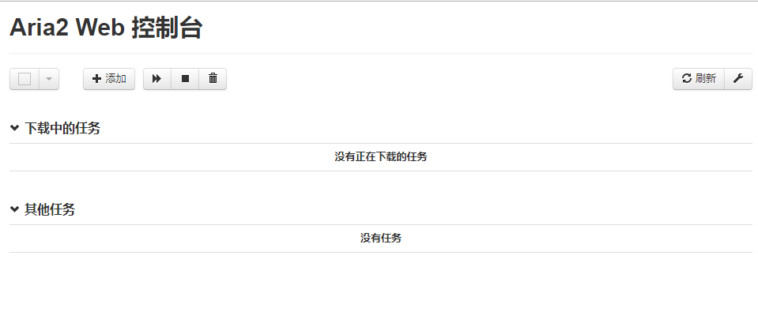
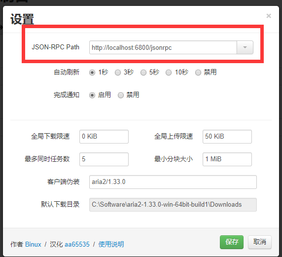

# aria2 基本使用

---
> ## Contact me:
> Blog -> <https://cugtyt.github.io/blog/index>  
> Email -> <cugtyt@qq.com>, <cugtyt@gmail.com>  
> GitHub -> [Cugtyt@GitHub](https://github.com/Cugtyt)

---

大部分内容来自知乎 [Windows 下如何配置 Aria 2](https://zhuanlan.zhihu.com/p/21831960)。


aria2 是一个下载工具，功能强大，具体介绍参看[官网](https://aria2.github.io/)以及搜索了解。

下面介绍具体使用：
1. 下载  
[官网](https://aria2.github.io/)上有链接  

2. 解压，假设文件夹为aria2  

3. 在aria2下面添加4个空文件，1个下载文件夹  
    1. Aria2.log （日志）
    2. aria2.session （下载历史）
    3. aria2.conf （配置文件）
    4. HideRun.vbs （隐藏cmd窗口运行用到的）
    5. Kill.vbs (想要退出aria2使用)
    6. Download 文件夹 (下载的文件存在这里，或自己指定)  

    
4. 修改 aria2.conf  
    ``` 
    dir=自己的路径\aria2\Download    # 修改为自己的路径
    log=自己的路径\aria2\Aria2.log   # 修改为自己的路径
    input-file=自己的路径\aria2\aria2.session    # 修改为自己的路径
    save-session=自己的路径\aria2\aria2.session  # 修改为自己的路径
    save-session-interval=60
    force-save=true
    log-level=error
    # see --split option
    max-concurrent-downloads=5
    continue=true
    max-overall-download-limit=0
    max-overall-upload-limit=50K
    max-upload-limit=20
    # Http/FTP options
    connect-timeout=120
    lowest-speed-limit=10K
    max-connection-per-server=10
    max-file-not-found=2
    min-split-size=1M
    split=5
    check-certificate=false
    http-no-cache=true
    # FTP Specific Options
    # BT/PT Setting
    bt-enable-lpd=true
    #bt-max-peers=55
    follow-torrent=true
    enable-dht6=false
    bt-seed-unverified
    rpc-save-upload-metadata=true
    bt-hash-check-seed
    bt-remove-unselected-file
    bt-request-peer-speed-limit=100K
    seed-ratio=0.0
    # Metalink Specific Options
    # RPC Options
    enable-rpc=true
    pause=false
    rpc-allow-origin-all=true
    rpc-listen-all=true
    rpc-save-upload-metadata=true
    rpc-secure=false
    # Advanced Options
    daemon=true
    disable-ipv6=true
    enable-mmap=true
    file-allocation=falloc 
    max-download-result=120
    #no-file-allocation-limit=32M
    force-sequential=true
    parameterized-uri=true
    ```
    
    详细的设置，请到官网查看。

5. 编辑 HideRun.vbs，启动的时候点击这个
    ``` vbs
    CreateObject("WScript.Shell").Run "自己的路径\aria2\aria2c.exe --conf-path=aria2.conf",0
    ```

6. 编辑 Kill.vbs，想要退出的时候点击这个
    ``` vbs
    CreateObject("WScript.Shell").Run "taskkill /f /im aria2c.exe", 0
    ```

7. 双击 HideRun.vbs 后，打开 [WebUI](http://aria2c.com/) 管理和操作

    

   点击右上角扳手设置，确认红框中一致

   

8. 可以在页面中的点击按钮操作下载任务。

9. 要退出时双击 Kill.vbs  


更好的体验可以配合网盘助手和迅雷助手使用，方便无限速下载百度网盘资源和迅雷资源。

