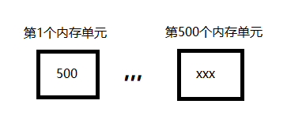
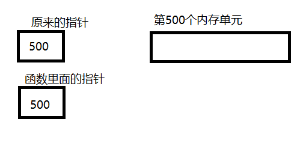

# 从C语言的函数传参谈指针

---
> ## Contact me:
> Blog -> <https://cugtyt.github.io/blog/index>  
> Email -> <cugtyt@qq.com>, <cugtyt@gmail.com>  
> GitHub -> [Cugtyt@GitHub](https://github.com/Cugtyt)

---

很多C语言的初学者在学习函数的时候会听到，函数参数传递有两种方式：传值和传地址。但是很容易给初学者造成误区：函数参数传递真的有两种方式。其实，函数参数传递只有一种方式！只有一种方式！只有一种方式！

传值和传地址的说法不能说错，但是考虑到真正理解，我们还是要细究一下。

``` c
void fun(int a);
void funptr(int *a);
```

两个函数的参数都是复制过去的，a是复制的，后面的指针a也是复制过去的，为什么？

``` c
int value = 5;
fun(value);
funptr(&value);
```

fun将value复制给参数`int a`，funptr将value的地址复制给参数`int *a`，C语言的参数传递非常纯粹和简单，就是复制复制复制！地址也是复制过去的。

谈到这里我来谈谈指针，指针也是个存粹的东西，不过他的内容是个内存的地址而已，仅此而已，我们使用内容需要加*来访问，仅此而已，地址和实际内容并没有物理上的联系，只是有逻辑联系而已。



如果你认为第一个内存单元的内容是个数，那它就是500，如果你认为第一个内存单元的内容是个地址，那么*访问就是xxx，因此我们可以写这样的东西：

``` c
int a = 0;
int b = (int)&a;
printf("%d", *(int *)b);
```

当然，要指针和int的长度一致才有效。

我们可以把a的地址存入一个`int`，而不是`int*`，取内容的时候只需要转换回`int*`，再*就可以取出a的内容了。

不仅仅是C，Java也是，所谓的引用就是指针了，因此，如果写Java的时候传入空指针，Java就会抛出空指针异常，是不是很熟悉的异常。值得注意的是，如果你在函数内部对指针参数直接复制，例如funptr函数里面直接写：`a = xxx`，那么不会对原来的内容做修改，因为你的a是复制的。



如图，修改函数里面的指针为其他比如400，并不会对第500内存单元的内容有影响。

C++的引用可能就是另一个故事了，引用没有复制，逻辑上相当于直接对原来的东西做处理，而不是复制一个新的指针，再通过指针处理。

为什么我们需要指针？考虑通过函数交换两个数字的经典问题，正因为参数是复制的，因此我们改变参数对原来的值没有影响，那怎么办，通过地址操作，记住两个数字的地址，我们就直接对原来的值做了修改。还有，考虑一个占很大空间的变量，复制它比较消耗时间，怎么办，通过地址，只要记住它的地址，我们只需要复制地址，就可以在需要的时候对它做处理，而不用每次复制这个变量。

说白了，指针就是一个存地址的东西，只不过我们把它写的比较特别，要加*，这样大家都知道这个变量是存地址的，而不是个普通的变量，指针就是这样。