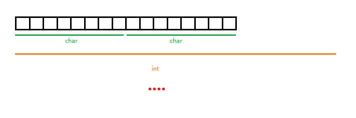
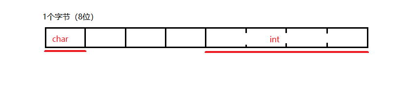

# 谈谈C的类型

---
> ## Contact me
> Blog -> <https://cugtyt.github.io/blog/index>
>
> Email -> <cugtyt@qq.com>, <cugtyt@gmail.com>
>
> GitHub -> [Cugtyt@GitHub](https://github.com/Cugtyt)

---

我们知道C语言有类型的概念，比如常用的char，void，int，float等。但是很多初学者仅仅停留在int或char有几个字节，多少。现在我们好好聊聊类型。

## 内存对齐

我们都知道在机器里面都是0，1，8位组成一个字节，32位的机器1个字节一般是一个char，4个字节一般就是一个int，最高位又设计到符号啥的。

但是机器是怎么把位和变量对应起来呢，比如我们现在有16个位，也就是2个字节，那么它是2个char呢，还是半个int呢，甚至是其他情况。



可以这样理解，机器对字节的分配是固定的，是预先定好的，类似于学生宿舍（8人间为例），前8个人肯定是一个宿舍，不存在把内部继续拆开的情况，这样就最小单位就是一个字节（8位），上面所说的16位就有确定的分配了。

但是还有一个问题，在结构体中变量是存在一起的，是不是说char和int不同长度的变量放在一起呢？这里还有一个有趣的点是，32位机器为了处理方面，是把4个字节放在一起处理的，也就是说，如果最开始只有个char和int，那么他是这样存的：



为啥呢？32机器每次处理32位四个字节，相比每次一个字节更能发挥优势。

你可以用这个代码试下：

``` c
#include <stdio.h>

int main() {
    struct {
        char a;
        int b;
        char c;
    }s;
    printf("%d %d %d %d %d %d", &s.a, &s.a + 1, &s.b, &s.b + 1, &s.c, &s.c + 1);
}
```

我的输出是：-829933060 -829933059 -829933056 -829933052 -829933052 -829933051

每次运行结果是不同的，但是可以看到a和b直接的内存空了3个字节，可见如果你要在这种情况下节省内存的话，把a和c放一起更好些。

详细的内存对齐原理可以参考其他博客文章。

## 格式化输出

了解了上面的内容，就能理解机器实际上是没有类型的概念的，就可以明白为啥C有这么多的输出格式了。

%d，%c，%f各种，就是为了指定你要怎么读这个内存，%c就是读一个字节，%d是4个字节。如果你用%c读int的内容，结果可能不是你想要的，同样如果用%f读char的内容，也会有奇怪的结果。

你可以尝试运行这个代码：

``` c
#include <stdio.h>

int main() {
    char a = 5;
    int b = 2;
    printf("%f %c", a, b);
}
```

## 类型的建议

值得注意的是不同环境下的类型可能是不同的，C标准没有硬性规定长度大小，比如32位long和64位long就是4和8，因此考虑到可移植性，建议使用`<stdint.h>`头文件，你就可以使用这样的类型：`int8_t, int16_t,uint8_t`，大小一目了然，更加方便和实用。