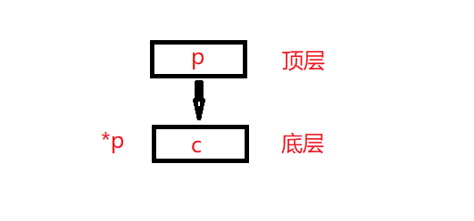

# 从const说起

---
> ## Contact me
> Blog -> <https://cugtyt.github.io/blog/index>
>
> Email -> <cugtyt@qq.com>, <cugtyt@gmail.com>
>
> GitHub -> [Cugtyt@GitHub](https://github.com/Cugtyt)

---

一般我们学习C/C++的时候，定义常量用宏`#define A 100`或用const关键字`const int8_t = 100`，区别在于宏在编译时候会替换，不占空间，而变量是一个真实的变量。

学习深入一些会看到这样的用法：

``` c
char c = 'a';

char *p = &c;
const char *pc = &c;
char* const cp = &c;
const char* const cpc = &c;
```

为什么要这么多const呢，这里就体现了C/C++的一个多方面的控制，对于一个变量，有一个指针指向它，那么指针的权限呢？是可以做任何事情吗，还是要有一定要求，比如不能修改变量的值，不能修改自己的值，或者都不能修改。

注意到上面四种写法就是四种权限：

第一个普通的指针，可以修改c的值，用`*p='c'`，可以修改p的值，`p=&d //d是其他变量`。

第二个指针，只能修改pc的值，不能修改c的值，不能对`*pc`赋值。因为`*pc`前有const。

第三个指针，只能修改`*cp`的值，不能修改cp的值，因为cp前面有const。

第四个可想而知都不能修改。

知道看权限的诀窍了吗，const在谁前面，谁就不能修改。

## 顶层const和底层const

为了更深入一下我们介绍这两个概念：顶层const和底层const。

顶层const是cp，底层是pc，很容易搞混，这里做个图示：



因为逻辑上\*p就是c，所以，如果不能修改c，或者说const加在\*p前面，就是底层，如果能修改c，或const加在p前面，就是顶层。

为啥搞这个呢，因为如果这个不清楚，遇到复杂的问题不好分析，例如，上面的四个指针可以相互赋值吗，谁可以赋值给谁，谁不行。

赋值的一个原则是权限不能扩大，底层权限小于顶层，也就是说：

> const \* const p < const \*p < \* const p < \*p

解释下为啥底层小于顶层，很容易理解，权限是从变量交出去的，保证变量不变肯定权限小于能改变变量的。

## Java的final

java的final也是让变量不变，但是由于java没有显式的指针，那么就只有一个final可用了，其实就是顶层const，所以这就除了一个问题，就是权限管理不严格，比如：

``` java
public class Test {
    private final int[] info = new int[5];

    public int[] getInfo() {
        return info;
    }
}
```

``` java
public class Main {
    public static void main(String[] args) {
        Test t = new Test();
        var info = t.getInfo();
        info[0] = 5;
        for (var i :
                info) {
            System.out.println(i);
        }
    }
}
```

很容易就把info改了，即使把Main里面的info改成final也一样，
不过一般情况下多加注意不用担心，如果需要可以使用使用clone方法，具体方法查阅相关资料。

与之相比C++：

``` c++
#include <iostream>

class Test {
private:
    const int info[5] = {0};
public:
    const int* getInfo() {return info;}
};
int main()
{
    Test t;
    const int* info = t.getInfo();
    // info[0] = 5;
    for(auto i = 0; i < 5; i++) {
        std::cout << info[i];
    }
}
```

getInfo的返回值不能是int\*，main中info的类型也不能是int\*，info[5]也不能修改，因此这一系列保证了权限的问题。