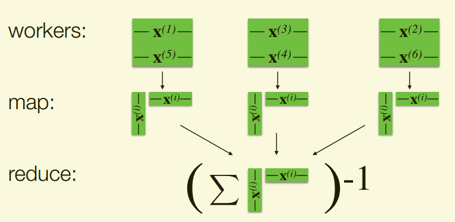
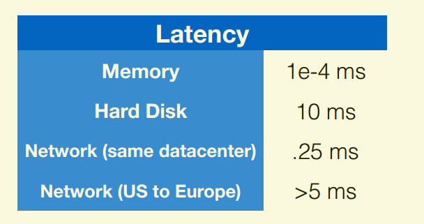

# Distributed ML

## Contact me

* Blog -> <https://cugtyt.github.io/blog/index>
* Email -> <cugtyt@qq.com>, <cugtyt@gmail.com>
* GitHub -> [Cugtyt@GitHub](https://github.com/Cugtyt)

---

<head>
    <script src="https://cdn.mathjax.org/mathjax/latest/MathJax.js?config=TeX-AMS-MML_HTMLorMML" type="text/javascript"></script>
    <script type="text/x-mathjax-config">
        MathJax.Hub.Config({
            tex2jax: {
            skipTags: ['script', 'noscript', 'style', 'textarea', 'pre'],
            inlineMath: [['$','$']]
            }
        });
    </script>
</head>

来自Berkeley CS120x课程第二周Distributed ML。

## Computation and Storage

Least Squares Regression: Learn mapping(W) from features to labels that minimizes residual sum of squares:

$$\min_W \Vert XW-y\Vert_2^2$$

Closed form solution, (if inverse exists):

$$W=(X^TX)^{-1}X^Ty$$

Consider number of arithmetic operations ( +, −, ×, / ), computational bottlenecks:

* Matrix multiply of $X^TX$: $O(nd^2)$ operations
* Matrix inverse: $O(d^3)$ operations

Consider storing values as floats (8 bytes), storage bottlenecks:

* $X^TX$ and its inverse: $O(d^2)$ floats
* $X$: $O(nd)$ floats

**Computation**: $O(nd^2 + d^3)$ operations

**Storage**: $O(nd + d^2)$ floats

### Big n and Small d

Assume $O(d^3)$ computation and $O(d^2)$ storage feasible on single machine, storing $X$ and computing $X^TX$ are the bottlenecks.

**Can distribute storage and computation!**
* Store data points (rows of $X$) across machines
* Compute $X^TX$ as a sum of outer products X


``` python
trainData.map(computeOuterProduct)         .reduce(sumAndInvert)
```

### Big n and Big d

As before, storing and computing are bottlenecks Now, storing and operating on is also a bottleneck. 

Can’t easily distribute!

> **1st Rules of thumb**
> 
> Computation and storage should be linear (in n, d)

We need methods that are linear in time and space.

#### One idea: Exploit sparsity

* Explicit sparsity can provide orders of magnitude storage and computational gains

    Sparse data is prevalent:
    * Text processing: bag-of-words, n-grams
    * Collaborative filtering: ratings matrix
    * Graphs: adjacency matrix
    * Categorical features: one-hot-encoding
    * Genomics: SNPs, variant calling

    

* Latent sparsity assumption can be used to reduce dimension, e.g., PCA, low-rank approximation (unsupervised learning).

    

#### Another idea: Use different algorithms

Gradient descent is an iterative algorithm that requires O(nd) computation and O(d) local storage per iteration.


``` python
for i in range(numIters):
    alpha_i = alpha / (n * np.sqrt(i + 1))
    gradient = train.map(lambda lp: gradientSummand(w, lp))
    w -= alpha_i * gradient
return w
```

**Gradient Descent Summary**:

* Pros:
    * Easily parallelized
    * Cheap at each iteration
    * Stochastic variants can make things even cheaper

* Cons:
    * Slow convergence (especially compared with closed-form)
    * **Requires communication across nodes!**

## Communication Principles


Access rates fall sharply with distance:
* Parallelism makes computation fast
* Network makes communication slow

> **2nd Rule of thumb**
>
> Perform parallel and in-memory computation

Persisting in memory reduces communication
* Especially for iterative computation (gradient descent)

Scale-up (powerful multicore machine)  
* No network communication
* Expensive hardware, eventually hit a wall

    

Scale-out (distributed, e.g., cloud-based)
* Need to deal with network communication
* Commodity hardware, scales to massive problems

    

> **3rd Rule of thumb**
>
> Minimize Network Communication

### Minimize Network Communication - Stay Local

Example: Linear regression, big n and small d
* Solve via closed form (not iterative!)
* Communicate O(d2) intermediate data



Example: Linear regression, big n and big d
* Gradient descent, communicate
* O(d) communication OK for fairly large d
* Compute locally on data (Data Parallel)


Example: Hyperparameter tuning for ridge regression with small n and small d
* Data is small, so can communicate it
* ‘Model’ is collection of regression models corresponding to different hyperparameters
* Train each model locally (Model Parallel)

Example: Linear regression, big n and huge d
* Gradient descent
* O(d) communication slow with hundreds of millions parameters
* Distribute data and model (Data and Model Parallel)
* Often rely on sparsity to reduce communication

### Minimize Network Communication - Reduce Iterations

Distributed iterative algorithms must compute and communicate
* In Bulk Synchronous Parallel (BSP) systems, e.g., Apache Spark, we
strictly alternate between the two

Distributed Computing Properties
* Parallelism makes computation fast
* Network makes communication slow

Idea: Design algorithms that compute more, communicate less
* Do more computation at each iteration
* Reduce total number of iterations

Extreme: Divide-and-conquer
* Fully process each partition locally, communicate final result
* Single iteration; minimal communication
* Approximate results

``` python
w = train.mapPartitions(localLinearRegression).reduce(combineLocalRegressionResults)

for i in range(numIters):
    alpha_i = alpha / (n * np.sqrt(i + 1))
    gradient = train.map(lambda lp: gradientSummand(w, lp)).sum()
    w -= alpha_i * gradient
```

Less extreme: Mini-batch
* Do more work locally than gradient descent before communicating
* Exact solution, but diminishing returns with larger batch sizes



We can amortize latency!
* Send larger messages
* Batch their communication
* E.g., Train multiple models together

---

> **1st Rules of thumb**
> 
> Computation and storage should be linear (in n, d)
> 
> **2nd Rule of thumb**
>
> Perform parallel and in-memory computation
>
> **3rd Rule of thumb**
>
> Minimize Network Communication

---