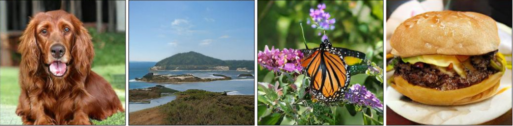
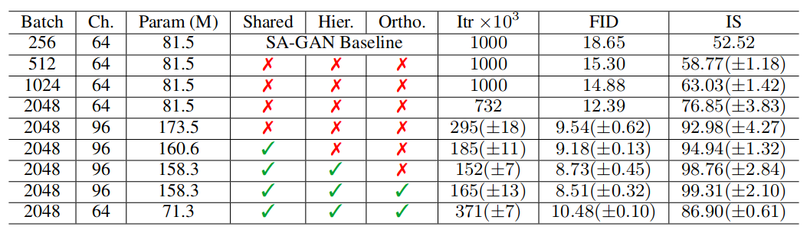

# 生成模型的应用

## Contact me

* Blog -> <https://cugtyt.github.io/blog/index>
* Email -> <cugtyt@qq.com>, <cugtyt@gmail.com>
* GitHub -> [Cugtyt@GitHub](https://github.com/Cugtyt)

---

<head>
    <script src="https://cdn.mathjax.org/mathjax/latest/MathJax.js?config=TeX-AMS-MML_HTMLorMML" type="text/javascript"></script>
    <script type="text/x-mathjax-config">
        MathJax.Hub.Config({
            tex2jax: {
            skipTags: ['script', 'noscript', 'style', 'textarea', 'pre'],
            inlineMath: [['$','$']]
            }
        });
    </script>
</head>

课程作业

## GAN的应用

GAN是Goodfellow在2014年提出的，而后取得了极大成功，在计算机图形图像方面取得了广泛应用。GAN主要有两个部分：生成模型(Generator, G)和判别模型(Discriminator, D)。生成模型G的作用是生成和真实数据尽可能相似的数据G(z)，而判别模型D尽可能判别出真实数据x和生成数据G(z)，二者各自优化博弈，他的目标是：

$$\min_G \max_D = \mathbb{E}_{x \thicksim p_{data}}[\log D(x)] + \mathbb{E}_{z \thicksim noise}[\log (1-D(G(z)))]$$

而后，通过诸多研究者的深入研究，在图像生成方面一枝独秀，生成的图像很多已经能骗过人眼。ICLR 2019中DeepMind的最新研究成果[BigGAN][1]生成的图像令人惊叹，其IS(Inception Score)分数超越先前工作约3倍，FID(Frechet Inception Distance)超越先前工作近2倍。图1是BigGAN生成的一些图像。其主要的贡献是通过大规模的训练，实现了生成上的巨大突破，使用先验分布的截断技巧，对样本的多样性和真实性进行精细控制，使用一些技巧来改善稳定性。



虽然GAN在静态图像生成方面被广泛使用，但是对于四维数据，比如视频动画等方面的生成还较少，SIGGRAPH 2018的文章[tempoGAN][2]提出用GAN生成流体数据的方法，成功生成了动态的烟雾，图2是生成的样例。


## BigGAN

BigGAN基于SAGAN，使用了Hinge Loss, BatchNorm和Spectral Norm等技巧使得BigGAN取得了令人惊讶的成绩。

### 增大批量

SAGAN原先使用的批量大小是256， 而BigGAN的实验发现增加批量可以提升性能。如下图所示。可以看到增加到2048的批量大小时，IS分数提升了90%以上，因此使用较大的批量是很重要的一个方面，但是这对稳定性提出了挑战，后续的方法有关于该问题的解决。

同时经过实验，提升批量大小后，实验发现增加通道也对性能提升有帮助，但是一味增加到一定程度后，继续增加造成性能下降。



### 截断

文章对先验分布做了实验，一般的先验分布选择标准正态分布，文章实验尝试了截断，做法是先从先验分布N(0,1)中采样，然后设定阈值截断，超出范围的值被重新采样以获得满足条件的值。对阈值的设定进行实验，发现随着阈值的下降生成的质量会越来越好。但是下降也会造成采样范围窄，生成图像的多样性不足，如下图所示， a的阈值为2，1.5,1,0.5,0.04。同时有一些情况不适合截断，如图b。


为了解决这个问题，使用了正交正则化，它强制执行正交性条件，使得性能得到一定程度的改善。

$$R_{\beta}(W) = \beta \left\| W^{T}W\odot (1-I) \right\|_{F}^{2}$$

### 稳定性控制

通过检测训练中的权重、梯度和损失，发现权重的前三个奇异值对稳定性有很大影响。所以采用的方法是调整G的奇异值$\sigma _ { 0 }$来抵消光谱爆炸的影响，而对于D需要更多的约束。

**对于G的控制**为了控制权重的的第一个奇异值$\sigma _ { 0 }$，使用两种方法：第一种是直接将权重的顶部奇异值$\sigma _ { 0 }$正则化，第二种是使用奇异值分解来替代$\sigma _ { 0 }$。虽然有很大的帮助，但是不能确保稳定性。

**对于D的控制**加入了梯度惩罚：$\mathcal { R } _ { 1 } : = \frac { \gamma } { 2 } \mathbb { E } _ { p _ { D ( x ) } } \left[ \| \nabla D ( x ) \| _ { F } ^ { 2 } \right]$，同时采用了Dropout和L2的正则化思想，可以让训练更加稳定，但是牺牲了较大的性能。

### 优势和限制

生成的图像效果特别好，在各个方面做了尝试和探索和解释分析，达到了GAN生成图像质量的飞跃，主要的方法是增大批量，对于先验分布使用截断的方法，并实验分析和增强了模型的稳定性。

但是模型的训练需要巨大的计算量，一般的情况下无法对实验进行对比和重现，对参数设置和模型控制等实验的实现有很大困难。

## tempoGAN

传统的数字模拟来生成流体数据需要消耗大量的计算资源，tempoGAN提出使用GAN来生成它，这对于人工设定参数控制数字模拟具有重要意义。使用GAN生成流体数据的一个主要的挑战是如何衡量生成数据的质量，用什么来作为目标函数。tempoGAN的主要贡献在于引入了时间上相关性的衡量和训练方法，可以对输出进行控制，以及物理感知的数据增强方法等。他的整体结构如下图所示。


### 特征空间的损失

为了更好的控制优化过程，对CNN的特征进行了约束，在生成器中加入了对神经网络中间生成特征的损失函数，这里使用了判别器的特征作为约束：

$$\mathcal { L } _ { f } = \mathbb { E } _ { n , j } \lambda _ { f } ^ { j } \left\| F ^ { j } ( G ( x ) ) - F ^ { j } ( y ) \right\| _ { 2 } ^ { 2 }$$

其中的j是判别器网络的一层，$F^j$是对应层的激活。有趣的是，权重导致了不同的结果。对于λf>0，损失项鼓励最小化真实和生成数据特征的距离，所以生成的特征类似于目标的特征。令人惊讶的是，在λf<0训练也有很好的结果，甚至比前面的更好。作者对这种情况的解释是负特征损失鼓励了生成不同于特征的优化结果，但是依旧很像目标特征。

### 短暂相关性的损失

由于生成的每一帧都是独立的，所以一个挑战是让相邻帧的具有相关性。对此作者加入了短暂相关性的损失，使得生成的每一帧能够联系更加紧密。方法不是手工编码短暂改变的情况，而是提出了使用另一个判别器$D_t$，从输入数据中学习哪些变化是可以接受的。这个情况下，原始的空间判别器，我们记作$D_s(x, G(x))$，保证了我们的生成器学习生成更真实的细节，新的短暂判别器$D_t$主要关注于驱动$G(x)$向着符合真实数据的短暂演化前进。

$$\mathcal { L } _ { D _ { t } ^ { \prime } } \left( D _ { t } ^ { \prime } , G \right) = \mathbb { E } _ { m } \left[ - \log D _ { t } ( \widetilde { Y } ) \right] + \mathbb { E } _ { n } \left[ - \log \left( 1 - D _ { t } ( \widetilde { G } ( \tilde { X } ) ) \right) \right]$$

其中真实数据记作：
$$\tilde { Y } _ { \mathcal { A } } = \left\{ \mathcal { A } \left( y ^ { t - 1 } , v _ { x } ^ { t - 1 } \right) , y ^ { t } , \mathcal { A } \left( y ^ { t + 1 } , - v _ { x } ^ { t + 1 } \right) \right\}$$

生成数据记作：
$$\widetilde { G } _ { \mathcal { H } } ( \widetilde { X } ) = \left\{ \mathcal { H } \left( G \left( x ^ { t - 1 } \right) , v _ { x } ^ { t - 1 } \right) , G \left( x ^ { t } \right) , \mathcal { H } \left( G \left( x ^ { t + 1 } \right) , - v _ { x } ^ { t + 1 } \right) \right\}$$

这里使用了3帧作为输入，用波浪线来标记。

### 完整的算法

有三个优化问题，对应于生成器G，关于空间的判别器$D_s$，关于时间的判别器$D_t$，三者的优化目标分别为：

$$\mathcal { L } _ { D _ { t } } \left( D _ { t } , G \right) = - \mathbb { E } _ { m } \left[ \log D _ { t } \left( \widetilde { Y } _ { \mathcal { A } } \right) \right] - \mathbb { E } _ { n } \left[ \log \left( 1 - D _ { t } \left( \widetilde { G } _ { \mathcal { A } } ( \widetilde { X } ) \right) \right) \right]$$

$$\mathcal { L } _ { D _ { s } } \left( D _ { s } , G \right) = - \mathbb { E } _ { m } \left[ \log D _ { s } ( x , y ) \right] - \mathbb { E } _ { n } \left[ \log \left( 1 - D _ { s } ( x , G ( x ) ) \right) \right]$$

$$\begin{aligned} \mathcal { L } _ { G } \left( D _ { s } , D _ { t } , G \right) = & - \mathbb { E } _ { n } \left[ \log D _ { s } ( x , G ( x ) ) \right] - \mathbb { E } _ { n } \left[ \log D _ { t } \left( \widetilde { G } _ { \mathcal { A } } ( \widetilde { X } ) \right) \right] \\ & + \mathbb { E } _ { n , j } \lambda _ { f } ^ { j } \left\| F ^ { j } ( G ( x ) ) - F ^ { j } ( y ) \right\| _ { 2 } ^ { 2 } + \lambda _ { L _ { 1 } } \mathbb { E } _ { n } \| G ( x ) - y \| _ { 1 } \end{aligned}$$

在所有生成器的损失项中，L1项在稳定训练中的重要性小。但是由于优化问题的复杂性，它对于训练的成功还是有帮助的。特征空间的损失，直接影响到了生成的特征。在对抗的设定中，判别器最可能学到不同的特征。因此在训练中，生成器获得梯度来产出更多来自目标F(y)的特征，而来自F(G(x)
的梯度会惩罚那些属于生成的特征。

### 网络结构和训练


---
```
for number of training steps do
    for kDs do
        Compute data-augmented mini batch x, y
        Update Ds with ∇Ds [LDs (Ds, G)]
    for kDt do
        Compute data-augmented mini batch X e, Y e
        Compute advected frames Y eA and G eA X e
        Update Dt with ∇Dt [LDt (Dt, G)]
    for kG do
        Compute data-augmented mini batch x, y, X e
        Compute advected frames G eA X e
        Update G with ∇G [LG (Ds, Dt, G)]
```
---

可以看到和经典的GAN训练过程基本一致，区别是由于多加了一个判别器，所以多了一个判别器的训练步骤。

### 生成的样例


### 优势和限制

这是首次通过神经网络做四维物理模拟的算法，而且引入了短暂相关性的损失，以及物理相关参数，使得生成的数据可以更加真实。

作者使用2个GPU跑2D模型用了14个小时，跑3D用了两天，所以训练时间是个很大的问题。同时分辨率是固定的，还不能用在任意的大小的数据生成上。

[1]: Brock A , Donahue J , Simonyan K . Large Scale GAN Training for High Fidelity Natural Image Synthesis[J]. 2018.

[2]: Xie Y , Franz E , Chu M , et al. tempoGAN: A Temporally Coherent, Volumetric GAN for Super-resolution Fluid Flow[J]. 2018.