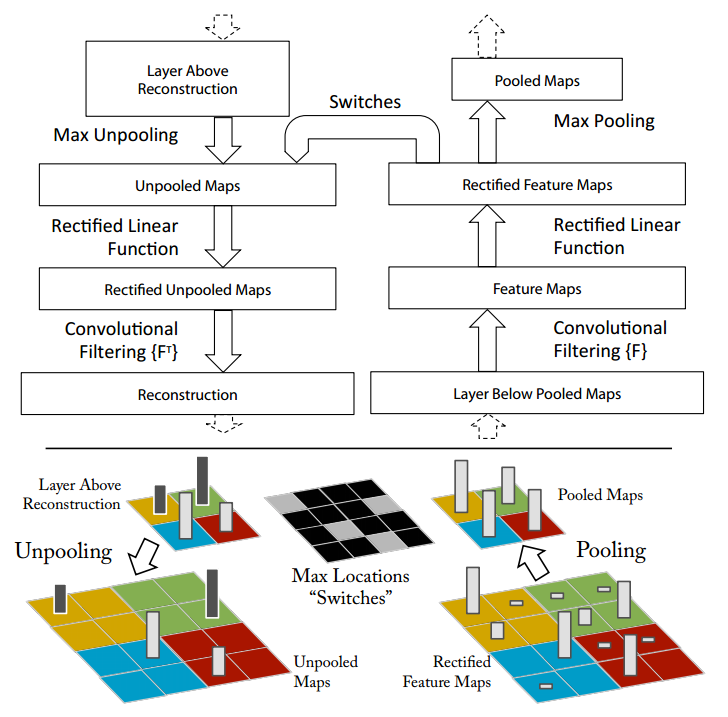
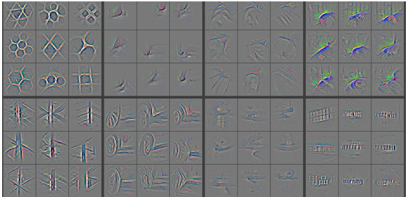
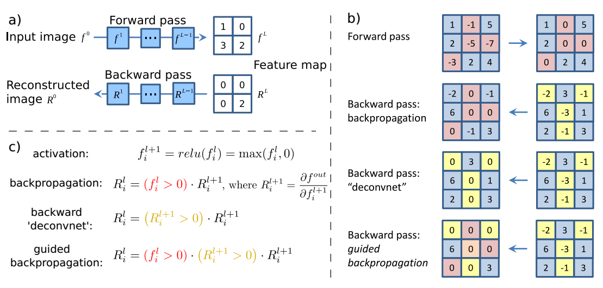
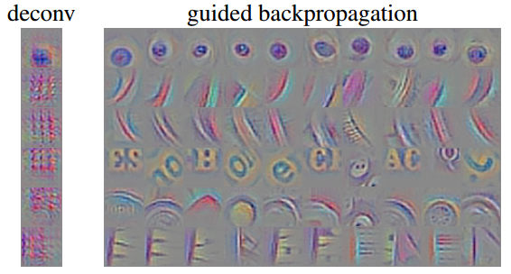
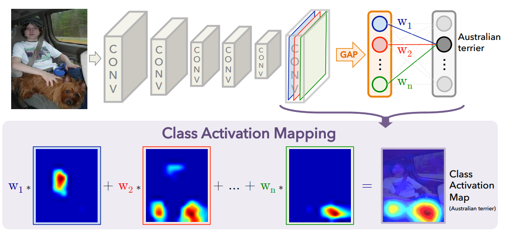
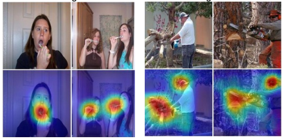
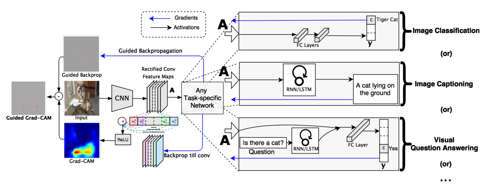
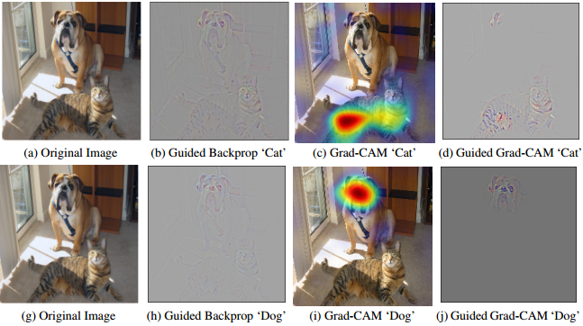
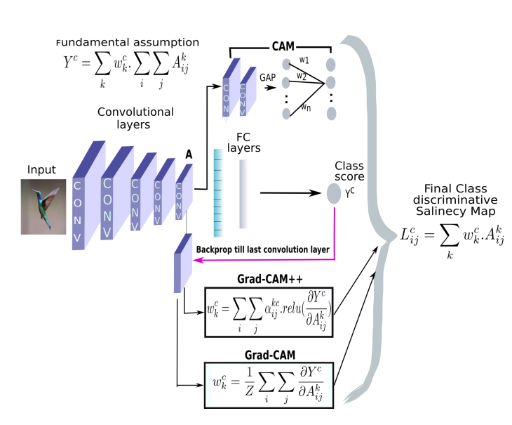
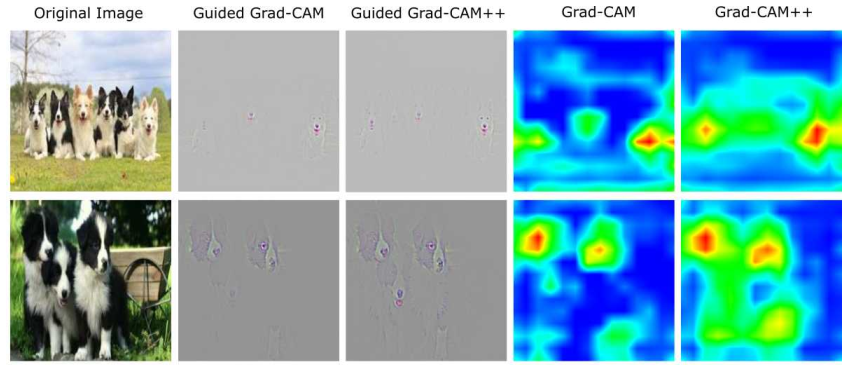

# 卷积网络的可视化

## Contact me

* Blog -> <https://cugtyt.github.io/blog/index>
* Email -> <cugtyt@qq.com>, <cugtyt@gmail.com>
* GitHub -> [Cugtyt@GitHub](https://github.com/Cugtyt)

---

<head>
    
    
</head>

课程作业

## 背景

卷积网络可视化是学界研究的热点问题，由于深度卷积网络参数很多，很多结果难以解释，有许多方法尝试对卷积网络进行可视化解释，以便分析网络性能和不足，分析网络分类错误的原因，以及网络特征的提取情况，帮助提高网络的鲁棒性，改善网络性能。

[ZFNet][1]借助[反卷积网络][2]（Deconvnet）的思想对[AlexNet][3]进行了可视化分析，发现了AlexNet 本身存在一些问题，例如第一个卷积层对中间频率覆盖不足，第二层出现混叠效应，对卷积层和池化层进行了修改，用 7×7 的卷积核替代 11×11 的卷积核，步长从4减小到2，这些改动提升了网络的性能，导向反向传播在池化反向方面提升了可视化的效果。

而后，很多人提出了不同的方法对卷积网络进行解释和分析，其中比较成功的是CAM[4]，Grad-CAM[5], Grad-CAM++[6]。他们的想法是从卷积入手，通过卷积特征图分析网络激活的区域，赋予对应的权重，映射到原始图像上，进而达到可视化的目的。

## 反卷积与导向反向传播

ZFNet使用的反卷积网络如下图。反卷积采用的方法是建立一个与原网络相反的卷积网络，通过反向池化、反向整流、反向卷积重建了网络的学习过程。最大池化通常是不可逆的，通过记录池化的位置信息进行近似反向池化， ReLU 用于激活层的反向整流，卷积层使用相同卷积核的转置，但是加入整流映射后，通过反卷积网络的分析可以清楚看到网络对特征的提取过程和敏感特征分布。

部分可视化效果如图：

但如果单纯用反卷积，我们将得到一个可解释性不是很好的图片，有人提出了guided backpropagation，通过更加细致的定位来得到一个更清晰的信息，它和反向传播，反卷积的区别如下图。

部分可视化效果如图：

## CAM

CAM以热力图的形式展示其对特征激活的程度。卷积网络通过多次卷积和池化之后，卷积层包含了丰富的空间和语义信息，后面的全连接层很难可视化直观分析。CAM采用了Network in Network[7]的思路，使用全局均值池化（Global Average Pooling， GAP）替换掉了全连接层，便可以通过卷积层提取特征图均值，下图是CAM的结构图。

对于给定的图像，令$A_k(x,y)$表示最后一个卷积层上单元$k$在空间$(x,y)$上的激活值。对于单元$k$做GAP后，激活$F^k$为$\sum _ { x , y } A _ { k } ( x , y )$。因此，对于给定的类别c，分数$Y^c$为$\sum _ { k } w _ { k } ^ { c } F _ { k } ( x , y )$，其中$w^c_k$是单元k对应与c的权重，也表示了它对于类别c的重要性。

因此对于修改后的网络，类别分数为：

$$\begin{aligned} Y ^ { c } & = \sum _ { k } w _ { k } ^ { c } \sum _ { x , y } A _ { k } ( x , y ) \\ & = \sum _ { x , y } \sum _ { k } w _ { k } ^ { c } A _ { k } ( x , y ) \end{aligned}$$

然后定义类别c的激活图$M_c$：

$$M _ { c } ( x , y ) = \sum _ { k } w _ { k } ^ { c } A _ { k } ( x , y )$$

因此$Y _ { c } = \sum _ { x , y } M _ { c } ( x , y )$，那么对于空间位置$(x, y)$上的激活重要性就可以用$M_c(x,y)$表示。CAM的最终结果是不同卷积层特征图叠加，最后叠加到原图上。

部分可视化效果如图：

## Grad-CAM

CAM可以得到不错的解释效果，但是它需要修改模型结构，需要重新训练，这就极大限制了应用场景，而后出现的Grad-CAM解决了这个问题。Grad-CAM 思路与 CAM 基本一致，主要区别在于求权重的过程，Grad-CAM使用梯度的全局平均来计算权重：

$$\alpha_k^c = 
\overbrace{\frac{1}{Z} \sum_i \sum_j}^\text{global average pooling}
\underbrace{\frac{\partial Y^c}{\partial A_{i,j}^k}}_\text{gradients via backprop}$$

式中 $Z$ 为特征图像素个数， $y^c$ 是类别分数， $A^k_{i,j}$ 表示第$k$个特征图中$(i,j)$位置处的像素值，求得所有特征图得权重后，对其加权求和可以得到最终的特征图:

$$L _ { \mathrm { Grad-CAM } } ^ { c } = ReLU \underbrace{\left( \sum _ { k } \alpha _ { k } ^ { c } A ^ { k } \right)}_\text{linear combination}$$

Grad-CAM使用了导向反向传播使得效果得到更好的提升，它的整体结构如图。

可以证明Grad-CAM是CAM的泛化形式。我们可以把$Y^c$的公式写为：

$$Y ^ { c } = \sum _ { k } \underbrace{w _ { k } ^ { c }}_\text{class feature weights} \overbrace { \frac { 1 } { Z } \sum _ { i } \sum _ { j } } ^ { \text { global average pooling } } \underbrace{A _ { i j } ^ { k }}_\text{feature map}$$

其中一部分便是CAM替换为GAP的内容，我们交换求和顺序：

$$Y ^ { c } = \frac { 1 } { Z } \sum _ { i } \sum _ { j } \underbrace{\sum _ { k } w _ { k } ^ { c } A _ { i j } ^ { k }}_{L^c_{CAM}}$$

可以明显看到Grad-CAM是CAM的泛化形式，CAM是Grad-CAM的特例。

部分效果如图：

## Grad-CAM++

虽然Grad-CAM等方法效果不错但是，这些方法有局限性，例如多个同类目标同时出现的定位，即使是单一物体，Grad-CAM也不能定位完全。

Grad-CAM++改良了先前的方法，引入了输出梯度对于特定位置的像素级别加权。这个方法提供了对每个像素在特征图的重要性衡量，更重要的是推导了闭式解，同时获得了高阶的精确表达，包括了softmax和指数激活输出。这个方法需要一次反向回传，因此计算量和先前的基于梯度的方法一致，但是效果更好。下图是三个方法的比较。

Grad-CAM++重写了加权公式，把权重提出来：

$$w _ { k } ^ { c } = \sum _ { i } \sum _ { j } \alpha _ { i j } ^ { k c } \cdot r e l u \left( \frac { \partial Y ^ { c } } { \partial A _ { i j } ^ { k } } \right)$$

背后的想法是$w^c_k$捕获特定激活图$A^k$的重要性。激活图在像素上正的梯度代表对分数正的影响。这样保证了权重$w^c_k$是加权平均而不是全局平均。

那么对于最终的分数就是：

$$Y ^ { c } = \sum _ { k } \left[ \sum _ { i } \sum _ { j } \left\{ \sum _ { a } \sum _ { b } \alpha _ { a b } ^ { k c } \cdot r e l u \left( \frac { \partial Y ^ { c } } { \partial A _ { a b } ^ { k } } \right) \right\} A _ { i j } ^ { k } \right]$$

与Grad-CAM的对比图如下：

## 总结

可以看到CAM系列基于梯度计算激活图的方式有很好的可视化效果，对类别预测贡献较大的区域被高亮出来，我们可以更好的看到网络真正提取特征的地方，这有助于我们分析网络训练的情况及其特性，对于解释网络各部分具体功能和贡献有很大意义。

同时我们可以看到的是，网络虽然对于重要区域有明显激活，但是对于不重要区域依然有一定的激活，说明网络存在一定的过拟合现象，其学到的特征鲁棒性还有待提升，如何通过分析网络的对图像区域的激活情况指导网络更高效，更鲁棒是一个值得探索的问题。

[1]: Zeiler, Matthew D., and Rob Fergus. "Visualizing and understanding convolutional networks." European conference on computer vision. Springer, Cham, 2014.

[2]: Zeiler, Matthew D., Graham W. Taylor, and Rob Fergus. "Adaptive deconvolutional networks for mid and high level feature learning." Computer Vision (ICCV), 2011 IEEE International Conference on. IEEE, 2011.

[3]: Krizhevsky, Alex, Ilya Sutskever, and Geoffrey E. Hinton. "Imagenet classification with deep convolutional neural networks." Advances in neural information processing systems. 2012.

[4]: Zhou, Bolei, et al. "Learning deep features for discriminative localization." Proceedings of the IEEE Conference on Computer Vision and Pattern Recognition. 2016.

[5]: Selvaraju, Ramprasaath R., et al. "Grad-CAM: Visual Explanations from Deep Networks via Gradient-Based Localization." ICCV. 2017.

[6]: Chattopadhay, Aditya, et al. "Grad-cam++: Generalized gradient-based visual explanations for deep convolutional networks." 2018 IEEE Winter Conference on Applications of Computer Vision (WACV). IEEE, 2018.

[7]: Lin, Min, Qiang Chen, and Shuicheng Yan. "Network in network." arXiv preprint arXiv:1312.4400 (2013).

[8]: Springenberg, Jost Tobias, et al. "Striving for simplicity: The all convolutional net." arXiv preprint arXiv:1412.6806 (2014).