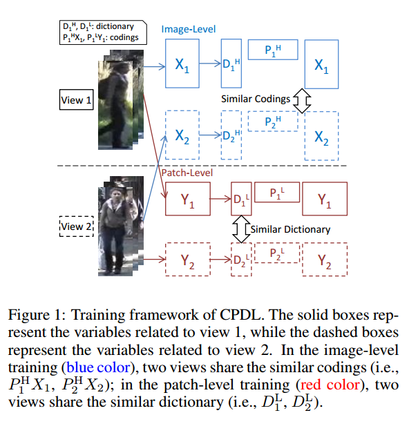
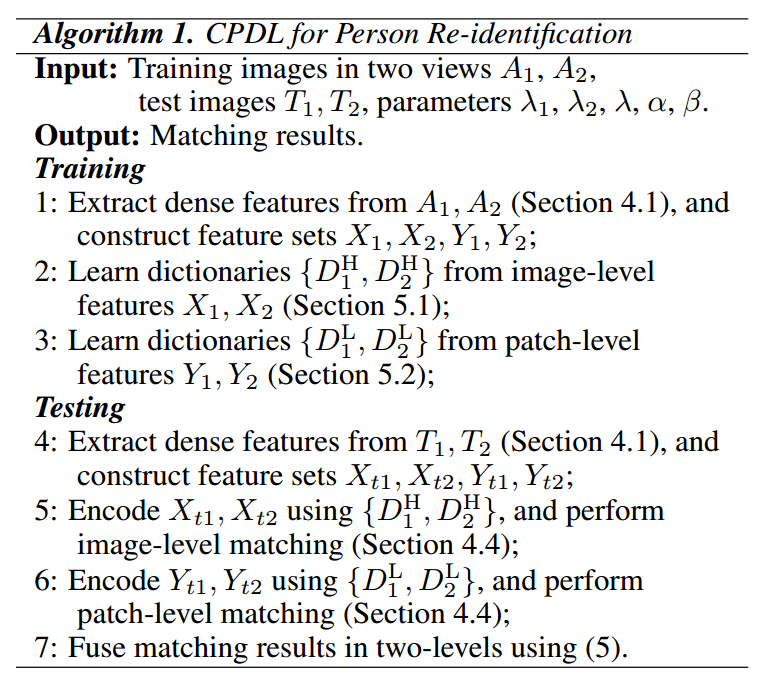

# Re-id文章杂项（1）

## Contact me

* Blog -> <https://cugtyt.github.io/blog/index>
* Email -> <cugtyt@qq.com>, <cugtyt@gmail.com>
* GitHub -> [Cugtyt@GitHub](https://github.com/Cugtyt)

---

<head>
    
    
</head>

## Cross-View Projective Dictionary Learning for Person Re-identification

为了提升特征表示的能力，我们通过字典学习去学习判别性和鲁棒的表示。首先提出了跨视图字典学习的方法，在多个视图中学到有效的特征。第二，设计了两个目标函数来学习每个行人在图像级别和块级别的低维表示，可以捕获不同表示的内在关系。
通常的字典学习假设A可以用稀疏相关Z和字典来表示，即$A=DZ$，但是相关系数Z通常需要很高的计算量，我们的解决方法是把字典学习变成一个先行编码和重构的过程，这个方法叫做cross-view projective dictionary learning
(CPDL) 。

令$P \in \mathbb{R}^{m \times d}$表示一个低维映射矩阵，可以把重构为$A=DPA$。
令$A_1 \in \mathbb{R}^{d_1 \times n},A2 \in \mathbb{R}^{d_2 \times n}$表示两个不同的视图，两个的重构过程为：
$A_1=D_1P_1A_1, A2=D_2P_2A_2$

CPDL的目标函数是：

$$\begin{aligned} \min _ { D _ { 1 } , D _ { 2 } , P _ { 1 } , P _ { 2 } } & \left\| A _ { 1 } - D _ { 1 } P _ { 1 } A _ { 1 } \right\| _ { \mathrm { F } } ^ { 2 } + \left\| A _ { 2 } - D _ { 2 } P _ { 2 } A _ { 2 } \right\| _ { \mathrm { F } } ^ { 2 } \\ & + \lambda _ { 1 } f \left( D _ { 1 } , D _ { 2 } , P _ { 1 } , P _ { 2 } \right) \\ \text { s.t. } & \left\| d _ { 1 ( : , i ) } \right\| \leq 1 , \left\| d _ { 2 ( : , i ) } \right\| \leq 1 \end{aligned}$$

### 特征提取

不同摄像头的行人照片通常是没有对准的，通常使用局部块的方法来提取特征。每一个块是10*10大小，网格步长是5，对于每个块我们提取32维的颜色柱状图特征，对于每个LAB通道提取128维的密SIFT特征。

### 图像表示

令$X_1$和$X_2$表示两个视图的高维密度特征，对于视图1中的第i个图像，所有块的密度特征拼接成高维向量。我们的目标是：

$$\begin{array} { c l } { \min _ { D _ { 1 } ^ { \mathrm { H } } , D _ { 2 } ^ { \mathrm { H } } } } & { \left\| X _ { 1 } - D _ { 1 } ^ { \mathrm { H } } P _ { 1 } ^ { \mathrm { H } } X _ { 1 } \right\| _ { \mathrm { F } } ^ { 2 } + \left\| X _ { 2 } - D _ { 2 } ^ { \mathrm { H } } P _ { 2 } ^ { \mathrm { H } } X _ { 2 } \right\| _ { \mathrm { F } } ^ { 2 } } \\ { P _ { 1 } ^ { \mathrm { H } } , P _ { 2 } ^ { \mathrm { H } } } & { + \lambda _ { 1 } \left\| P _ { 1 } ^ { \mathrm { H } } X _ { 1 } - P _ { 2 } ^ { \mathrm { H } } X _ { 2 } \right\| _ { \mathrm { F } } ^ { 2 } } \\ { \text {s.t.} } & { \left\| d _ { 1 ( : , i ) } ^ { \mathrm { H } } \right\| \leq 1 , \left\| d _ { 2 ( ; , i ) } ^ { \mathrm { H } } \right\| \leq 1 } \end{array}$$

### 块表示

除了上面的图像表示，我们也考虑了块表示。令$Y_1, Y_2$表示两个视图的低维块特征，这里我们不只简单的假设假设两个块的编码接近，实际上他们由于没有对准通常不匹配，所以我们的假设是不同的视图有相似的字典，因此目标函数是：

$$\begin{aligned} \min _ { D _ { 1 } ^ { \mathrm { L } } , D _ { 2 } ^ { \mathrm { L } } , P _ { 1 } ^ { \mathrm { L } } , P _ { 2 } ^ { \mathrm { L } } } & \left\| Y _ { 1 } - D _ { 1 } ^ { \mathrm { L } } P _ { 1 } ^ { \mathrm { L } } Y _ { 1 } \right\| _ { \mathrm { F } } ^ { 2 } + \left\| Y _ { 2 } - D _ { 2 } ^ { \mathrm { L } } P _ { 2 } ^ { \mathrm { L } } Y _ { 2 } \right\| _ { \mathrm { F } } ^ { 2 } \\ & + \lambda _ { 2 } \left\| D _ { 1 } ^ { \mathrm { L } } - D _ { 2 } ^ { \mathrm { L } } \right\| _ { \mathrm { F } } ^ { 2 } \\ s.t. & \quad \left\| d _ { 1 ( : , i ) } ^ { \mathrm { L } } \right\| \leq 1 , \left\| d _ { 2 ( : , i ) } ^ { \mathrm { L } } \right\| \leq 1 \end{aligned}$$

### Matching and Fusion

现在我们有两对字典，${D_1^L, D_2^L}$和${D_1^H, D_2^H}$，我们可以得到更加鲁棒的表示。

**块级别匹配** 对于每个在prob中的块，我们不是直接去让它匹配对应gallery中的块，而是去寻找gallery图像中的空间相邻的目标块，计算每个对的距离。最后我们估计每个probe图像和gallery图像的相似度。我们不去比较原始的块，而是匹配字典对上相关性的表示。

**图像级别匹配** 图像级别的匹配更加直接，因为我们已经获得了图像的紧凑表示。我们使用高斯核函数来计算相似分数。

**Fusion** 先把相似分数向量$Score_P$和$Score_I$标准化，然后执行简单的测量：

$$Score(i) = Score_ P( i ) + \lambda Score_ I(i)$$

### 优化图像目标函数

加入松弛变量可以写为：

$$\begin{aligned} \min _ { D _ { 1 } ^ { \mathrm { H } } , D_2^H , P_1^H, D _ { 1 } ^ { \mathrm { H } } , D _ { 2 } ^ { \mathrm { H } } , P _ { 1 } ^ { \mathrm { H } }  }  & \left\| X _ { 1 } - D _ { 1 } ^ { \mathrm { H } } A _ { 1 } ^ { \mathrm { H } } \right\| _ { \mathrm { F } } ^ { 2 } + \left\| X _ { 2 } - D _ { 2 } ^ { \mathrm { H } } A _ { 2 } ^ { \mathrm { H } } \right\| _ { \mathrm { F } } ^ { 2 } \\ P _ { 2 } ^ { \mathrm { H } } , A _ { 1 } ^ { \mathrm { H } } , A _ { 2 } ^ { \mathrm { H } } & + \alpha \left( \left\| P _ { 1 } ^ { \mathrm { H } } X _ { 1 } - A _ { 1 } ^ { \mathrm { H } } \right\| _ { \mathrm { F } } ^ { 2 } + \left\| P _ { 2 } ^ { \mathrm { H } } X _ { 2 } - A _ { 2 } ^ { \mathrm { H } } \right\| \right. \\ & + \lambda _ { 1 } \left\| A _ { 1 } ^ { \mathrm { H } } - A _ { 2 } ^ { \mathrm { H } } \right\| _ { \mathrm { F } } ^ { 2 } \end{aligned}$$

虽然有很多变量，但是我们可以交替优化这些变量：

#### 固定其他变量，更新$A_1^H$和$A_2^H$

忽略与$A_1^H$不相关的变量，目标函数可以变为：

$$\begin{aligned} { \min _ { A _ { 1 } ^ { \mathrm { H } } } } & { J \left( A _ { 1 } ^ { \mathrm { H } } \right) = \left\| X _ { 1 } - D _ { 1 } ^ { \mathrm { H } } A _ { 1 } ^ { \mathrm { H } } \right\| _ { \mathrm { F } } ^ { 2 } + \alpha \left\| P _ { 1 } ^ { \mathrm { H } } X _ { 1 } - A _ { 1 } ^ { \mathrm { H } } \right\| _ { \mathrm { F } } ^ { 2 } } \\ { } & { + \lambda _ { 1 } \left\| A _ { 1 } ^ { \mathrm { H } } - A _ { 2 } ^ { \mathrm { H } } \right\| _ { \mathrm { F } } ^ { 2 } } \end{aligned}$$

设$\frac { \partial J \left( A _ { 1 } ^ { \mathrm { H } } \right) } { \partial A _ { 1 } ^ { \mathrm { H } } } = 0$，可以得到解：

$$\begin{aligned} A _ { 1 } ^ { \mathrm { H } } = & \left( D _ { 1 } ^ { \mathrm { HT } } D _ { 1 } ^ { \mathrm { H } } + \left( \alpha + \lambda _ { 1 } \right) \mathrm { I } \right) ^ { - 1 } \\ & \left( D _ { 1 } ^ { \mathrm { HT } } X _ { 1 } + \lambda _ { 1 } A _ { 2 } ^ { \mathrm { H } } + \alpha P _ { 1 } ^ { \mathrm { H } } X _ { 1 } \right) \end{aligned}$$

#### 固定其他变量更新$P_1^H$和$P_2^H$

关于$P_1^H$的函数可以写作：

$$\min _ { P _ { 1 } ^ { \mathrm { H } } } \alpha \left\| P _ { 1 } ^ { \mathrm { H } } X _ { 1 } - A _ { 1 } ^ { \mathrm { H } } \right\| _ { \mathrm { F } } ^ { 2 }$$

让他对于$P_1^H$的倒数为0，有解：

$$P _ { 1 } ^ { \mathrm { H } } = A _ { 1 } ^ { \mathrm { H } } X _ { 1 } \left( X _ { 1 } \tilde { X } _ { 1 } ^ { \mathrm { T } } + \gamma \mathrm { I } \right) ^ { - 1 }$$

#### 固定其他变量更新$D_1^H$和$D_2^H$

关于$D_1^H$的目标函数为：

$\min _ { D _ { 1 } ^ { \mathrm { H } } } \left\| X _ { 1 } - D _ { 1 } ^ { \mathrm { H } } A _ { 1 } ^ { \mathrm { H } } \right\| _ { \mathrm { F } } ^ { 2 } \quad \text { s.t. } \left\| d _ { 1 ( : , i ) } ^ { \mathrm { H } } \right\| \leq 1$

解类似于$D_2^H$

### 优化块表示目标函数

$$\begin{aligned} \min _ { D _ { 1 } ^ { \mathrm { H } } , D_2^H , P_1^H, D _ { 1 } ^ { \mathrm { H } } , D _ { 2 } ^ { \mathrm { H } } , P _ { 1 } ^ { \mathrm { H } }  }  &  \left\| X _ { 1 } - D _ { 1 } ^ { \mathrm { H } } A _ { 1 } ^ { \mathrm { H } } \right\| _ { \mathrm { F } } ^ { 2 } + \left\| X _ { 2 } - D _ { 2 } ^ { \mathrm { H } } A _ { 2 } ^ { \mathrm { H } } \right\| _ { \mathrm { F } } ^ { 2 } \\ & {+ \beta \left( \left\| P _ { 1 } ^ { \mathrm { H } } X _ { 1 } - A _ { 1 } ^ { \mathrm { H } } \right\| _ { \mathrm { F } } ^ { 2 } + \left\| P _ { 2 } ^ { \mathrm { H } } X _ { 2 } - A _ { 2 } ^ { \mathrm { H } } \right\| _ { \mathrm { F } } ^ { 2 } \right) } \\ & { + \lambda _ { 1 } \left\| A _ { 1 } ^ { \mathrm { H } } - A _ { 2 } ^ { \mathrm { H } } \right\| _ { \mathrm { F } } ^ { 2 } } \\

s.t. & \quad \left\| d _ { 1 ( : , i ) } ^ { \mathrm { L } } \right\| \leq 1 , \left\| d _ { 2 ( : , i ) } ^ { \mathrm { L } } \right\| \leq 1 \end{aligned}$$

其中$\beta$是平衡参数，对其迭代更新可以得到子问题：

$$\min _ { A _ { 1 } ^ { \mathrm { L } } } \left\| Y _ { 1 } - D _ { 1 } ^ { \mathrm { L } } A _ { 1 } ^ { \mathrm { L } } \right\| _ { \mathrm { F } } ^ { 2 } + \beta \left\| P _ { 1 } ^ { \mathrm { L } } Y _ { 1 } - A _ { 1 } ^ { \mathrm { L } } \right\| _ { \mathrm { F } } ^ { 2 }$$

他的解是$A _ { 1 } ^ { \mathrm { L } } = \left( D _ { 1 } ^ { \mathrm { LT } } D _ { 1 } ^ { \mathrm { L } } + \beta \mathrm { I } \right) ^ { - 1 } \left( D _ { 1 } ^ { \mathrm { LT } } Y _ { 1 } +\right.\beta P _ { 1 } ^ { \mathrm { L } } Y _ { 1 } )$

$$\min _ { P _ { 1 } ^ { \mathrm { L } } } \beta \left\| P _ { 1 } ^ { \mathrm { L } } Y _ { 1 } - A _ { 1 } ^ { \mathrm { L } } \right\| _ { \mathrm { F } } ^ { 2 }$$

最优解是$P _ { 1 } ^ { \mathrm { L } } = A _ { 1 } ^ { \mathrm { L } } Y _ { 1 } \left( Y _ { 1 } Y _ { 1 } ^ { \mathrm { T } } + \gamma \mathrm { I } \right) ^ { - 1 }$

$$\min _ { D _ { 1 } ^ { \mathrm { L } } } \left\| Y _ { 1 } - D _ { 1 } ^ { \mathrm { L } } A _ { 1 } ^ { \mathrm { L } } \right\| _ { \mathrm { F } } ^ { 2 } + \lambda _ { 2 } \left\| D _ { 1 } ^ { \mathrm { L } } - D _ { 2 } ^ { \mathrm { L } } \right\| _ { \mathrm { F } } ^ { 2 } \\ s.t. \quad \left\| d _ { 1 ( : i ) } ^ { \mathrm { L } } \right\| \leq 1 $$

$A_2^L$,$P_2^L$,$D_2^L$有相似的解。

完整的算法如图。

