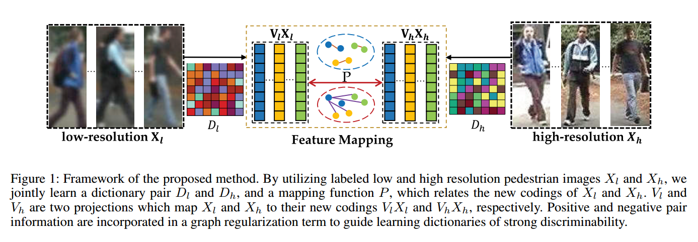
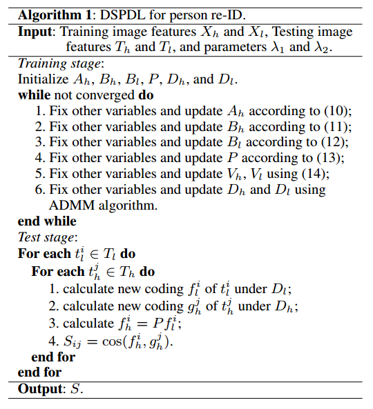

# Re-id文章杂项（2）

## Contact me

* Blog -> <https://cugtyt.github.io/blog/index>
* Email -> <cugtyt@qq.com>, <cugtyt@gmail.com>
* GitHub -> [Cugtyt@GitHub](https://github.com/Cugtyt)

---

<head>
    
    
</head>

## Discriminative Semi-Coupled Projective Dictionary Learning for Low-Resolution Person Re-Identification

真实世界捕捉的图像很多时候是低分辨率的，视角也不同，现有的方法复杂且耗时，我们提出了Discriminative Semi-Coupled Projective Dictionary Learning（DSPDL），联合训练一个字典和一个映射来让高分辨率和低分辨率的图像接近，同时提出了一个新的无参数化的图正则化方法来同时包含正负样本对的信息，借鉴了高效强大的映射字典学习的方法来提高效果。

行人重识别包括三类：基于行人描述，基于距离特征学习，基于深度学习。我们的方法属于基于图像描述的，但是利用字典学习方法生成鲁棒的特征。

记$H = \left[ X _ { h } , T _ { h } \right] \in \mathbb { R } ^ { d \times ( n + m ) }$和$L = \left[ X _ { l } , T _ { l } \right] \in \mathbb { R } ^ { d \times ( n + m ') }$分别为高分辨率和低分辨率的两个行人图像，X是训练数据，T是测试数据。

借助于映射字典学习的优良效果，我们把半监督映射字典学习写作：

$$\begin{aligned} \min _ { D _ { h } , D _ { l } , P , V _ { h } , V _ { l } } & \left\| X _ { h } - D _ { h } V _ { h } X _ { h } \right\| _ { \mathrm { F } } ^ { 2 } + \left\| X _ { l } - D _ { l } V _ { l } X _ { l } \right\| _ { \mathrm { F } } ^ { 2 } \\ & + \lambda _ { 1 } \Omega \left( V _ { h } , X _ { h } , V _ { l } , X _ { l } , P \right) + \lambda _ { 2 } \| P \| _ { \mathrm { F } } ^ { 2 } \\ \text { s.t. } & \left\| d _ { h } ^ { i } \right\| \leq 1 , \left\| d _ { l } ^ { i } \right\| \leq 1 , i = 1 , \cdots , k \end{aligned}$$

其中V是一个映射，因此我们不需要约束输入特征的编码是稀疏的，因此避免了求解l1标准化问题。后面的$\Omega$项保证了相同的人有相似的编码。直觉上我们可以使用二范数，但是对于分辨率差异较大的跨视图图像，图像是极度不匹配的，因此我们引入了P来消除不同视图中分辨率导致的差异。这个P很灵活，甚至可以对字典学到的特征进行惩罚，这样就可以把模型写作：

$$\begin{aligned} \min _ { D _ { h } , D _ { l } , V _ { h } , V _ { l } , P } & \left\| X _ { h } - D _ { h } V _ { h } X _ { h } \right\| _ { F } ^ { 2 } + \left\| X _ { l } - D _ { l } V _ { l } X _ { l } \right\| _ { F } ^ { 2 } \\ & + \lambda _ { 1 } \left\| V _ { h } X _ { h } - P V _ { l } X _ { l } \right\| _ { F } ^ { 2 } + \lambda _ { 2 } \| P \| _ { F } ^ { 2 }\\ s.t. & \quad \left\| d _ { h } ^ { i } \right\| \leq 1 , \left\| d _ { l } ^ { i } \right\| \leq 1 , i = 1 , \cdots , k \end{aligned}$$

我们发现一个限制是SPDL只约束相同个体正样本对的信息,而忽视了不同个体的负样本对信息,后者对字典的判别是有益的。我们使用了图嵌入的方法来联合正负样本的信息重写正则项。我们构建了两个图，行人内$G^s$和行人间$G^d$，他们可以通过映射$W^s$和$W^d$编码。我们只考虑两个跨视图节点（行人）间的边，因此我们定义：

$$W ^ { s } = \left[ \begin{array} { c c } { 0 } & { W _ { h } ^ { s } } \\ { W _ { l } ^ { s } } & { 0 } \end{array} \right] , W ^ { d } = \left[ \begin{array} { c c } { 0 } & { W _ { h } ^ { d } } \\ { W _ { l } ^ { d } } & { 0 } \end{array} \right]$$

其中：

$$W _ { h , i j } ^ { s } = \left\{ \begin{array} { l l } { 1 , } & { \text { if } y _ { h } ^ { i } = y _ { l } ^ { j } , } \\ { 0 , } & { \text { otherwise } ; } \end{array} \right. \quad W _ { h , i j } ^ { d } = \left\{ \begin{array} { l l } { \frac { 1 } { n } , } & { \text { if } y _ { h } ^ { i } \neq y _ { l } ^ { j } } \\ { 0 , } & { \text { otherwise } } \end{array} \right.$$

我们的目标是最大化类内相似度，最小化类间相似度，因此我们有：

$$\begin{array} { l } { \max \sum _ { i , j } z _ { i } W _ { i j } ^ { s } z _ { j } ^ { \top } = \operatorname { tr } \left( Z W ^ { s } Z ^ { \top } \right) } \\ { = \operatorname { tr } \left( \left[ V _ { h } X _ { h } , P V _ { l } X _ { l } \right] \left[ \begin{array} { c c } { 0 } & { W _ { h } ^ { s } } \\ { W _ { l } ^ { s } } & { 0 } \end{array} \right] \left[ V _ { h } X _ { h } , P V _ { l } X _ { l } \right] ^ { \top } \right) } \\  =  { \operatorname { tr } \left( \left( P V _ { l } X _ { l } \right) W _ { l } ^ { s } \left( V _ { h } X _ { h } \right) ^ { \top } + \left( V _ { h } X _ { h } \right) W _ { h } ^ { s } \left( P V _ { l } X _ { l } \right) ^ { \top } \right) } \end{array}$$

和

$$\begin{array} { l } { \min \sum _ { i , j } z _ { i } W _ { i j } ^ { d } z _ { j } ^ { \top } = \operatorname { tr } \left( Z W ^ { d } Z ^ { \top } \right) } \\ { = \operatorname { tr } \left( \left[ V _ { h } X _ { h } , P V _ { l } X _ { l } \right] \left[ \begin{array} { c c } { 0 } & { W _ { h } ^ { d } } \\ { W _ { l } ^ { d } }  & { 0 } \end{array} \right] \left[ V _ { h } X _ { h } , P V _ { l } X _ { l } \right] ^ { \top } \right) } \\ = { \operatorname { tr } \left( \left( P V _ { l } X _ { l } \right) W _ { l } ^ { d } \left( V _ { h } X _ { h } \right) ^ { \top } + \left( V _ { h } X _ { h } \right) W _ { h } ^ { d } \left( P V _ { l } X _ { l } \right) ^ { \top } \right) } \end{array}$$

结合起来我们得到：

$$\begin{array} { l } { \Omega \left( V _ { h } , X _ { h } , V _ { l } , X _ { l } , P \right) } \\ { = \operatorname { tr } \left( \left( P V _ { l } X _ { l } \right) W _ { l } ^ { d } \left( V _ { h } X _ { h } \right) ^ { \top } + \left( V _ { h } X _ { h } \right) W _ { h } ^ { d } \left( P V _ { l } X _ { l } \right) ^ { \top } \right) } \\ { - \operatorname { tr } \left( \left( P V _ { l } X _ { l } \right) W _ { l } ^ { s } \left( V _ { h } X _ { h } \right) ^ { \top } + \left( V _ { h } X _ { h } \right) W _ { h } ^ { s } \left( P V _ { l } X _ { l } \right) ^ { \top } \right) } \end{array}$$

这样我们的模型变成：

$$\begin{array} { l l } { \min _ { D _ { h } , D _ { l } , V _ { h } } } & { \left\| X _ { h } - D _ { h } V _ { h } X _ { h } \right\| _ { \mathrm { F } } ^ { 2 } + \left\| X _ { l } - D _ { l } V _ { l } X _ { l } \right\| _ { \mathrm { F } } ^ { 2 } } \\ & { + \lambda _ { 1 } \Omega \left( V _ { h } , X _ { h } , V _ { l } , X _ { l } , P \right) + \lambda _ { 2 } \| P \| _ { \mathrm { F } } ^ { 2 } } \\ s.t.  & \left\| d _ { h } ^ { i } \right\| \leq 1 , \left\| d _ { l } ^ { i } \right\| \leq 1 , i = 1 , \cdots , k \end{array}$$

为了加速优化，我们引入了松弛变量$A_h,B_l,B_h$，使用它们来替换$V_hX_h,V_lX_l,PV_lX_l$，这样重写模型为：

$$\begin{aligned} \min _ { D _ { h } , D _ { l } , V _ { h } , V _ { l } } & \Phi \left( D _ { h } , D _ { l } , V _ { h } , V _ { l } , A _ { h } , B _ { h } , B _ { l } , P \right) = \\ & \left\| X _ { h } - D _ { h } A _ { h } \right\| _ { \mathrm { F } } ^ { 2 } + \left\| X _ { l } - D _ { l } B _ { l } \right\| _ { \mathrm { F } } ^ { 2 } \\ & + \lambda _ { 1 } \Omega \left( A _ { h } - V _ { h } \right) + \lambda _ { 2 } \| P \| _ { \mathrm { F } } ^ { 2 } \\ & + \alpha \left\| A _ { h } - V _ { h } X _ { h } \right\| _ { \mathrm { F } } ^ { 2 } + \alpha \left\| B _ { l } - V _ { l } X _ { l } \right\| _ { \mathrm { F } } ^ { 2 } \\ & + \beta \left\| B _ { h } - P B _ { l } \right\| _ { \mathrm { F } } ^ { 2 } \\
s.t. & \quad \left\| d _ { h } ^ { i } \right\| \leq 1 , \left\| d _ { l } ^ { i } \right\| \leq 1 , i = 1 , \cdots , k
 \end{aligned}$$

其中$\Omega \left( A _ { h } , B _ { h } \right) = \operatorname { tr } \left( B _ { h } W _ { l } ^ { d } A _ { h } ^ { \top } + A _ { h } W _ { h } ^ { d } B _ { h } ^ { \top } \right) - \operatorname { tr } \left( B _ { h } W _ { l } ^ { s } A _ { h } ^ { \top } + A _ { h } W _ { h } ^ { s } B _ { h } ^ { \top } \right)$，$\alpha = \beta = 10^{-3}$是两个惩罚参数。

公式中的变量可以通过固定其他优化一个变量来交替优化，优化细节略。

