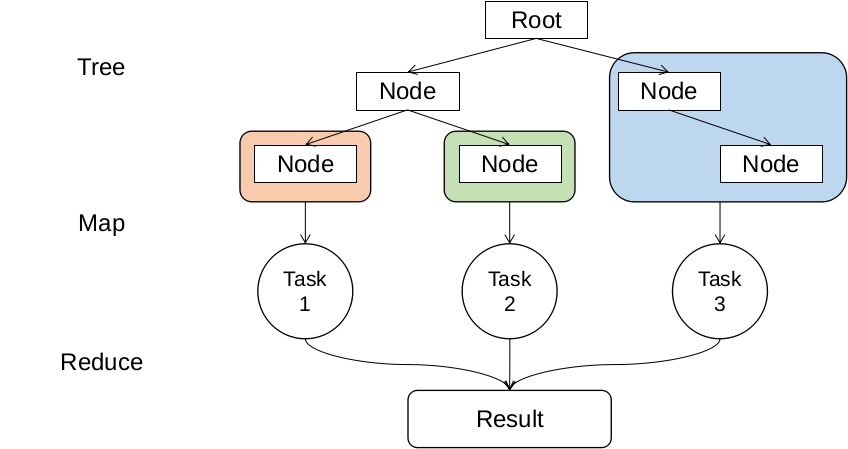

# 并行机器学习

## Contact me

* Blog -> <https://cugtyt.github.io/blog/index>
* Email -> <cugtyt@qq.com>, <cugtyt@gmail.com>
* GitHub -> [Cugtyt@GitHub](https://github.com/Cugtyt)

---

<head>
    
    
</head>

课程作业

## 摘要

机器学习算法得到了广泛的应用，但是资源和时间消耗很大，我们将分析机器学习算法中可以并行的步骤，从数据并行，模型并行和模型内并行三个角度，运用MapReduce方法来加速机器学习的训练，减少算法的运行时间，提高算法效率。通过一些实验对其有效性进行验证和分析，定量分析效率的提升和性能的改进。

## 引言

机器学习算法目前得到了广泛的应用，在数据分析处理，用户推荐，计算机视觉，自然语言处理，模型预测等方面发挥了很大的作用。机器学习在大量数据方面能发挥更大的作用，但是随着数据量的增大，机器学习算法需要的计算资源更多，很多时候个人计算机已经无法满足机器学习算法的资源要求。通常情况下需要购置更多的计算资源来帮助机器学习算法的训练，由于很多机器学习算法一些步骤可以并行处理，因此将机器学习结合并行算法可以帮助我们更好的完成机器学习算法资源分配和训练加速。

MapReduce[1]是Google提出了一个简单优雅的并行算法模型，主要面向大规模数据处理的并行。MapReduce主要分为两个阶段，第一个阶段是Map，在这个阶段中，将任务进行划分，分为互不干扰的子任务，然后将子任务分发到独立的计算资源上进行计算，并得到各自独立的计算结果；第二个阶段是Reduce，这个阶段收集在不同计算资源上得到的计算结果，对结果进行运算和处理，得到最终的计算结果。这个模型简洁高效，通过Map和Reduce两个阶段可以把任务并行分发和计算以得到最终的结果，极大的简化了并行算法的构建和设置。现在很多框架的并行模型是建立在MapReduce上的，我们也将主要借助于MapReduce的并行模型对机器学习算法进行分析。

MapReduce其中关键的步骤是Map，即对任务进行划分。机器学习算法模型中，有很多地方是没有相互关联的，因此我们可以通过对机器学习算法模型进行划分，将划分后的任务分发到各个计算资源上，达到并行的目的。本文将通过分析一些机器学习算法的特性，将并行算法应用其中，帮助减少机器学习算法的训练用时，提高算法训练的效率，降低训练用时。通过设置一些实验证明并行算法对于机器学习算法改进的实际效果。

交叉验证是机器学习算法中常见的方法，它通过重复利用已有的数据，把得到的样本数据进行切分，组合为不同的训练集和测试集，在每个组合上进行模型训练和验证，以检验模型的可靠性和有效性。常用的方法是把数据分为K个部分，每次取其中一个作为验证集，其他作为训练集，同时在相同的模型设置情况下，训练K个模型，检验K个模型的实际效果以判断模型最终的性能表现。可以发现，交叉验证有着很好的并行特性，每次对数据集的划分和训练之间是没有关系的，在数据划分好后，数据集便可以独立选取和训练，这样就可以容易的把每次的数据分发到不同的计算资源上进行计算，实现Map操作，在训练完之后，把每个计算资源上的训练结果进行收集和分析处理，进行Reduce操作，方便的实现了MapReduce模型下的交叉验证并行化，这种方法可以称之为数据并行。

机器学习模型中超参数的选择是很关键的，直接影响到模型的性能和表现，往往采用的方法是使用搜索策略。先人工设定好所需要参数的搜索空间和范围，对于参数进行组合，每个组合构建一个模型，在数据上进行学习和预测，最后对模型进行评估，留下满足需要的模型和参数。网格搜索是其中最常使用的方法，网格中的每个格子就是参数的一个组合，可以看作为一个模型，而网格中的每个格子之间是没有关联的，意味着我们可以将网格中每个格子的计算任务分发到不同的计算资源上，实现Map操作，在计算结束后，将最终的结果收集和分析，进行Reduce操作，实现参数搜索的并行化，这种方法可以称之为模型并行。

除了在数据角度和模型角度的并行化，还有模型内部的并行化。许多机器学习算法模型具有树的结构，而树内部相同层的节点之间是没有之间关联的，这就便于我们对模型内部实现并行化策略。将没有联系的节点计算任务分发到不同的计算资源上，完成Map节点，在构建完模型后，将最后的结构搜集组合，即Reduce阶段，便得到的最终的模型结构。

## 机器学习的并行算法

### 交叉验证的并行

交叉验证是机器学习算法中重要的一个步骤，它的基本思想是将数据进行切分，组合为不同的训练集和测试集，用训练集来训练模型，用测试集来评估模型预测的好坏，常用的方法是K折交叉验证。可以明显的看到，每次的组合之间是没有之间关联的，因此我们可以使用MapReduce的思想将任务分解，Map阶段将不同的组合分发到不同的计算资源上，对于每个组合进行训练和预测，Reduce阶段将训练和预测的结果进行收集分析处理，其示意图可以如下表示：

### 网格搜索的并行

机器学习算法的参数往往决定了模型的好坏，但是我们在训练之前是无法得知最优参数的，因此网格搜索是探索机器学习算法参数的重要手段。我们首先设置参数的搜索范围，确定搜索空间，然后对所有设置的参数进行组合，这样便得到了所有希望探索的模型参数，注意到这些参数确定的模型之间是没有关联的，这样我们也可以在Map阶段把这些任务分发到不同的计算资源上，对于每个模型进行训练和预测，Reduce阶段将结果进行收集分析处理，其示意图如下：

### 模型内部并行

除了模型间和数据间使用并行策略，注意到一些模型内部之间也是没有直接联系的，比如决策树，随机森林等。树结构和森林结构由于一个节点下的子树之间是没有之间关联的，它们可以并行执行互不干扰，因此我们可以对每个节点的计算任务分发到不同的计算资源上，加速模型的训练过程，其示意图如下：

## 实验

### 交叉验证和网格搜索实验设置

为了证明并行算法对于交叉验证和网格搜索的加速作用，我们通过设置一些实验，分析对于其时间的相关关系来证明并行对于算法模型性能的提升。我们选用了6个公开数据集，分别为：iris，diabetes，digits，wine，breast cancer，boston house-prices。

iris数据集有三种花，每个花有50个样本，每个样本的属性有4个，预测目标是花的种类。diabetes数据集有11个类，共有442个样本，每个样本有10个属性值。wine数据集有3个类，每个类有178个样本，每个样本有13的属性值。breast cancer数据集有两个类，共有569个样本，每个样本有30个属性值。boston house-prices数据集有13个属性值，共有506个样本，为回归任务。模型使用统一的SVM分类模型便于统一比较，使用线性核函数，参数C设为1，使用5折交叉验证。对于每个模型，我们运行模型7次，取运行时间的平均值作为衡量结果，以便于最后的比较。

### 交叉验证

根据以上的设置，我们分别对这6个数据集在SVM模型进行了实验，并行模型中使用5个线程进行并行运算，我们得到了如下结果：

| 数据集 | iris| diabetes | digits | wine | breast cancer| boston house-prices |
| :-: | -: |  -: | -: | -: | -: | -: |
| 串行运行时间(ms) | **7.68** | **20.5** | 195 | 392 | 5580 | 6780 |
| 并行运行时间(ms) | 20.3 | 28.4 | **79.8** | **141** | **2020** | **2130** |
| 时间提升比例(%) | -164.32 | -38.53 | 59.07 | 64.03 | 63.79 | 68.59 |

可以看到在digits，wine，breast cancer，boston house-prices四个数据集上得到了不同程度的性能提升，时间可以缩减到一半以上，对于串行运行时间越长的模型节省时间越多。但是我们注意到在iris，diabetes上并行算法并没有体现出优势，反而降低了运行时间。这是因为该数据集数据量小，模型运行时间很短，但是使用MapReduce的并行算法需要将不同的任务进行分发，启动资源，这个耗时比较大，在小的任务上这个时间反而成为主要的耗时，因此使用并行算法需要考虑任务的时间和资源调度的时间，当资源分发和调度不成为主要的运行时间时，并行算法才能体现出他的优越性。

### 网格搜索

根据以上的设置，我们对6个数据上进行了实验，每次使用的模型参数组合有12个，同时每个模型进行5折交叉验证，因此每个组合有60个并行任务，本次使用10个线程进行并行运算，我们得到如下结果：

| 数据集 | iris| diabetes | digits | wine | breast cancer| boston house-prices |
| :-: | -: |  -: | -: | -: | -: | -: |
| 串行运行时间(ms) | 131 | 597 | 8400 | 2840 | 123000 | 365000 |
| 并行运行时间(ms) | **126** | **267** | **1320** | **543** | **45800** | **70000** |
| 时间提升比例(%) | 3.82 | 55.28 | 84.29 | 80.88 | 62.76 | 80.82 |

可以看到这次并行算法整体好于串行算法，而且基本上时间提升比例都有提高，一个主要原因是相比于前面交叉验证，这里的任务计算量更大，而且任务之间的独立性没有破坏，因此性能提升更为明显。对于计算量比较小的任务，如iris，体检提上比例依旧较小，这里的资源调度和分发时间部分不能忽略。

### 随机森林

随机森林是一类基于树结构的机器学习算法模型，其中模型的每个节点之间的计算是可以并行执行的，我们对以上6个数据集进行进行了实验，本次使用10个线程进行并行运算，我们可以得到如下结果：

## 总结

机器学习算法在当前得到了广泛的使用，但是训练算法模型需要很长的时间。以MapReduce为代表的并行算法模型可以帮助我们分析机器学习算法中可以并行处理的部分，将任务分发到多个计算资源上，最大程度的减少算法模型的耗时，提高机器学习算法模型的效率。本文对三个角度的并行进行了分析和实验，首先是数据并行，它是从数据的角度进行并行处理，其中的代表是K折交叉验证，对数据集进行切分和任务分发，提高资源使用率，其次是模型并行，它从模型间的并行入手，其中的代表是网格搜索，对于模型参数搜索任务之间是没有之间关联的，因此我们可以对不同的模型进行任务分发，减少训练的时间，最后是模型内的并行，其中的代表是树结构的模型，树同一层节点之间是没有关联的，因此可以把它们的计算任务分发到不同的计算资源上，提高模型的训练效率。本文对三种机器学习模型并行算法进行了实验和分析，在计算量很小的情况下，MapReduce的耗时不能忽略，对模型效率提升不明显，随着计算量的增大，并行算法的优势得以显现，极大地提升了算法的训练效率。

## 参考文献

[1]: Dean J, Ghemawat S. MapReduce: simplified data processing on large clusters[M]. 2008.