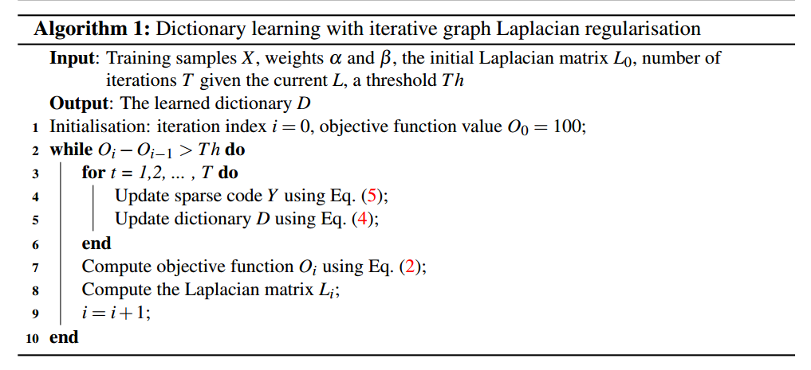

# Re-id文章杂项（3）

## Contact me

* Blog -> <https://cugtyt.github.io/blog/index>
* Email -> <cugtyt@qq.com>, <cugtyt@gmail.com>
* GitHub -> [Cugtyt@GitHub](https://github.com/Cugtyt)

---

<head>
    
    
</head>

## Dictionary Learning with Iterative Laplacian Regularisation for Unsupervised Person Re-identification

很多现有的方法需要大量的标签，这极大限制了在实际中的应用，我们的方法基于字典学习结合图拉普拉斯正则项做稀疏编码。

假设任务图像从摄像头A和摄像头B中收集得到，每个人的图像可以计算得到一个n维的特征向量。把训练数据记作$X = \left[ X ^ { a } , X ^ { b } \right] \in \mathbb { R } ^ { n \times m }$其中$X ^ { a } = \left[ x _ { 1 } ^ { a } , \ldots , x _ { m _ { 1 } } ^ { a } \right] \in \mathbb { R } ^ { n \times m _ { 1 } }$包含了视图A中$m_1$个图像的特征向量，$X ^ { b } = \left[ x _ { 1 } ^ { b } , \ldots , x _ { m _ { 1 } } ^ { b } \right] \in \mathbb { R } ^ { n \times m _ { 2 } }$是视图B中的向量。这样我们有$m=m_1 + m_2$。由于是无标签的，因此不知道视图A中人对应在B中的图像。目标是学到一个对于X的匹配函数，在给定两个行人图像$x^a x^b$时能用$f(x^a,x^b)$来匹配他们的身份。

我们的解法是学习一个共享字典$D \in \mathbb { R } ^ { k \times m }$，每个n维特征向量，无论是那个视图的，映射到一个k维子空间，让他们可以用余弦距离进行匹配。内在的想法是子空间中的维度是不随视图改变的，在跨视图中就很有用。严格来讲，我们目标是学习一个最优的字典D，使得X的稀疏编码记作$Y = \left[ Y ^ { a } , Y ^ { b } \right] \in \mathbb { R } ^ { k \times m }$，其中$Y ^ { a } = \left[ y _ { 1 } ^ { a } , \ldots , y _ { m _ { 1 } } ^ { a } \right] \in \mathbb { R } ^ { k \times m _ { 1 } }$， $Y ^ { b } = \left[ y _ { 1 } ^ { b } , \ldots , y _ { m _ { 2 } } ^ { b } \right] \in \mathbb { R } ^ { k \times m _ { 2 } }$，可以用于匹配训练数据,我们希望这个字典也可以泛化到测试图片上。

D和Y可以表示为：

$$\left( D ^ { * } , Y ^ { * } \right) = \underset { D , Y } { \operatorname { argmin } } \| X - D Y \| _ { F } ^ { 2 } + \alpha \| Y \| _ { 1 }$$

其中$\| X - D Y \| _ { F } ^ { 2 }$是重损失，$\| Y \| _ { 1 }$让模型选择更少的元素来重建，但是考虑到是无监督学习，没有标签，就不能使用这个公式。

为了解决这个问题，我们引入了图拉普拉斯正则项，公式重写为：

$$\left( D ^ { * } , Y ^ { * } \right) = \underset { D , Y } { \operatorname { argmin } } \| X - D Y \| _ { F } ^ { 2 } + \alpha \| Y \| _ { 1 } + \beta \sum _ { i , j } ^ { m } \left\| y _ { i } ^ { a } - y _ { j } ^ { b } \right\| _ { 2 } ^ { 2 } W _ { i j }$$

其中$W \in \mathbb { R } ^ { m \times m }$是跨视图相关矩阵，用于捕获身份相关性。

训练步骤为：

