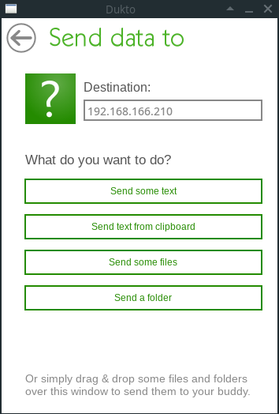

# Dukto 传输文件

## Contact me

* Blog -> <https://cugtyt.github.io/blog/index>
* Email -> <cugtyt@qq.com>, <cugtyt@gmail.com>
* GitHub -> [Cugtyt@GitHub](https://github.com/Cugtyt)

---

如果是Windows上传输文件,平时的聊天工具工作的很好,但是如果是Linux与Windows或Linux之间传输文件的,尤其个人在不同操作系统设备上传输的时候,这些工具有时候不是很方便,比如账号问题,软件兼容性问题,Teamviewer是个很好的传输文件工具,但是如果被检测到是商业用途啥的,设置起来还是有些麻烦.

这里推荐一个功能简单,能传输文件,文件夹,文本等内容的轻量级工具,Dukto,你做的只是需要填入目的IP地址,然后把文件拖进去即可,当然需要双方都安装这个软件.最多你需要设置下接收的路径,本机的IP地址它已经列出来了,所以不需要手动去查询,很方便.

