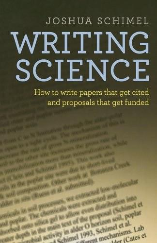
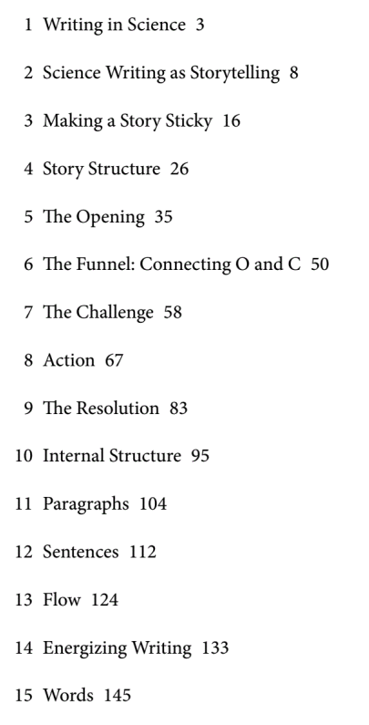
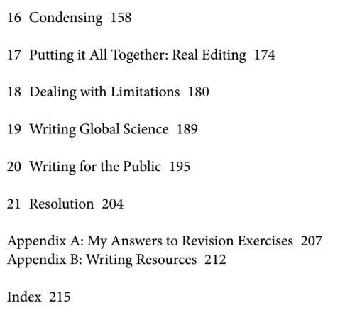

# Writing Science 写作书籍推荐

## Contact me

* Blog -> <https://cugtyt.github.io/blog/index>
* Email -> <cugtyt@qq.com>, <cugtyt@gmail.com>
* GitHub -> [Cugtyt@GitHub](https://github.com/Cugtyt)

---

推荐一本关于学术写作的书: Writing Science: How to Write Papers That Get Cited and Proposals That Get Funded. 豆瓣上的评分也不错9.7,虽然只有一百多人评价.它主要讲如何科学的写作,如何更好的讲故事,更注重与结构和内容,而不是具体的细节,能提高自己科研写作的认识和思想.下面是目录:

