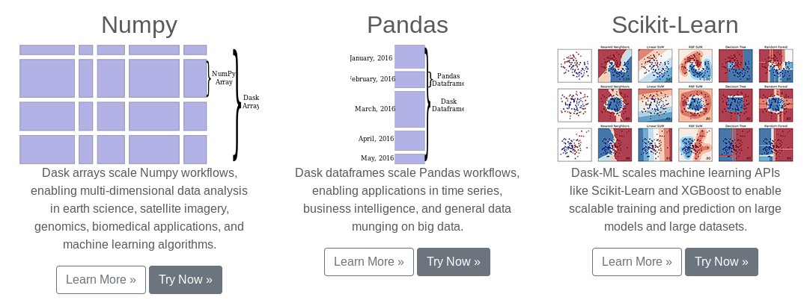
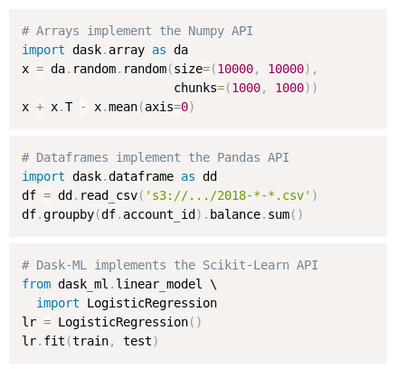
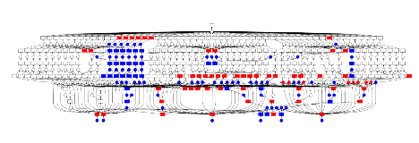
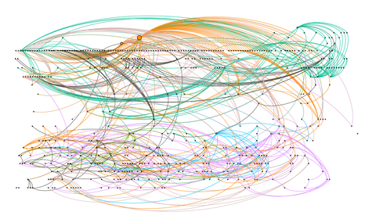
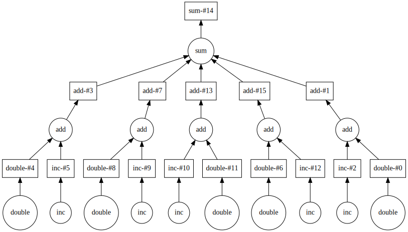

# Dask库推荐

## Contact me

* Blog -> <https://cugtyt.github.io/blog/index>
* Email -> <cugtyt@qq.com>, <cugtyt@gmail.com>
* GitHub -> [Cugtyt@GitHub](https://github.com/Cugtyt)

---

numpy, pandas, scikit-learn是机器学习领域最为常用的算法工具包.但是当我们的数据比较大,内存已经放不下,或者解决较复杂并行处理的时候,我发现了开源的[Dask](https://github.com/dask/dask).

Dask更像是一个在这些工具上进行了扩展,如官方介绍的那样:



甚至很多时候可以像原来的方式来使用Dask:



但是它更加强大,可以使用计算图来做到并行,设置扩展到分布式的节点中:



这有点像Tensorflow对神经网络模型的处理,但是它相对来说更加动态一些,你可以自由的定义计算流程,方便的达到并行和扩展的要求,而不需要手动调度:



它的调度本质上还是依赖于计算图:


官方文档上给了一个[例子](https://docs.dask.org/en/latest/custom-graphs.html):

``` python
def load(filename):
    ...

def clean(data):
    ...

def analyze(sequence_of_data):
    ...

def store(result):
    with open(..., 'w') as f:
        f.write(result)

dsk = {'load-1': (load, 'myfile.a.data'),
       'load-2': (load, 'myfile.b.data'),
       'load-3': (load, 'myfile.c.data'),
       'clean-1': (clean, 'load-1'),
       'clean-2': (clean, 'load-2'),
       'clean-3': (clean, 'load-3'),
       'analyze': (analyze, ['clean-%d' % i for i in [1, 2, 3]]),
       'store': (store, 'analyze')}

from dask.multiprocessing import get
get(dsk, 'store')  # executes in parallel
```

它对应的计算图为:


做过树结构存储计算表达式的同学很容易理解这种逻辑,它也类似于MapReduce.可以观察到下面部分三个分支是可以并行化处理的,可以使用多线程,多进程,分布式等任何方式来帮助加速计算,到了上面集合起来,做最后的运算.如果是自己手动处理的化,这个例子还比较简单,但是可以想到还是要写不少代码的,更不用说复杂的情况了.但是Dask这里就可以做到自动化的调度,这个封装给用户还是带来了很大的方便.这也是我最看重它的一点.

另一个好的点是处理大型数据,现在的数据对于单个机器来说越来越吃力了,Dask可以delay操作,这里是另一个[例子](https://docs.dask.org/en/latest/delayed.html):

``` python
import dask

output = []
for x in data:
    a = dask.delayed(inc)(x)
    b = dask.delayed(double)(x)
    c = dask.delayed(add)(a, b)
    output.append(c)

total = dask.delayed(sum)(output)
```



可以想到,对于大型可分的运算,执行当前资源可以处理的运算,按照这个图依次来做,可以把大任务转化为小任务处理,让任务可解.这些复杂的调度和处理依旧不需要手工处理,交给Dask,大部分情况我们得到满意的结果,一些复杂的设置可以看官方文档.