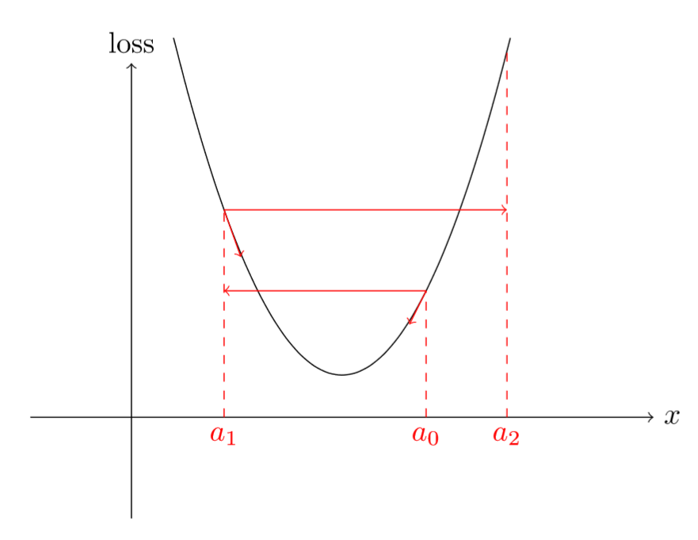
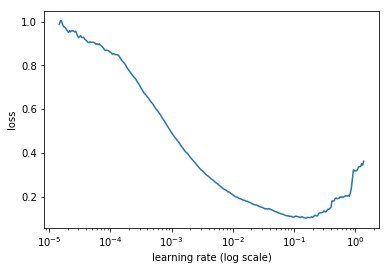
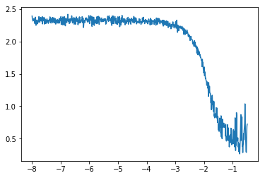

# How Do You Find A Good Learning Rate

## Contact me

* Blog -> <https://cugtyt.github.io/blog/index>
* Email -> <cugtyt@qq.com>, <cugtyt@gmail.com>
* GitHub -> [Cugtyt@GitHub](https://github.com/Cugtyt)

---

<head>
    <script src="https://cdn.mathjax.org/mathjax/latest/MathJax.js?config=TeX-AMS-MML_HTMLorMML" type="text/javascript"></script>
    <script type="text/x-mathjax-config">
        MathJax.Hub.Config({
            tex2jax: {
            skipTags: ['script', 'noscript', 'style', 'textarea', 'pre'],
            inlineMath: [['$','$']]
            }
        });
    </script>
</head>

来自[How Do You Find A Good Learning Rate](https://sgugger.github.io/how-do-you-find-a-good-learning-rate.html).

## 理论

你是怎么决定学习率的？如果学习率太低，你的网络要花一辈子来学习了。但是如果太高，每一步你都会跳过最低点，永远也得不到一个不错的loss。更严重的是会出现loss不断增加直到nan。

为什么呢？如果你的梯度很大，高学习率会让你远离最小点，loss甚至比之前还差。即使是在抛物线这样简单的例子上，也能看到高学习率如何让你快速远离最小点。



所以我们应该挑选正确的值，不要太高也不要太低。长期以来这都要不断尝试，但是[这篇论文](https://arxiv.org/abs/1506.01186)提出了另一个方法。在一个epoch上，让你的SGD从非常低的学习率开始（例如1e-8），然后在每一个mini-batch改变（例如乘以一个固定的量），直到一个很大的值（例如1或10）。每次迭代结束记录一下loss，把损失和学习率的图画出来。你会发现是这样：



开始时loss减少，然后停止开始增加，通常这个过程非常迅速。这是因为低学习率可以越来越好，尤其是学习率增加的时候，直到有一个点打破这个情况。再看这个图，最好的学习率是哪个？不是那个最低点。

为什么呢？因为对应于最低点的学习率已经有点太高了，我们已经在能提升的范围边界了。我们希望在它之前，不仅训练快，而且还处于远离失控的安全区域。在上图中，我们可以选1e-2而不是1e-1。

这个方法可以用到任何SGD变种以及任何种类的网络中。我们运行一个epoch（通常更少）并且记录每次的损失，最后把它画出来。

## 实践

怎么做呢？在fastai中很简单。只需要：

``` python
learner.lr_find()
learner.sched.plot()
```

我们就可以得到了。但是我们还是要亲手实现下。在[这篇文章](https://sgugger.github.io/a-neural-net-in-pytorch.html)的基础上做些修改即可。

第一点是我们不再绘制每个mini-batch的损失，而是它更加平滑的版本。如果我们画原始的损失，可能长这个样子：



虽然可以看到总体的趋势，但是看起来没有前面清楚。我了平滑损失，我们可以去他们的指数加权平均。听起来很复杂，但是如果你熟悉SGD的动量变种，本质上是一样的。每次得到一个损失，我们定义这个平均损失为：

$$\text{avg loss} = \beta * \text{old avg loss} + (1-\beta) * \text{loss}$$

其中$\beta$是0到1之间的参数。这里平均损失会减少噪声，得到更平滑的图，也能清楚的看到走势。这也解释了为什么第一个曲线到达最低点时已经太迟了：这个平均损失在开始失控时还是比较低的，在明显增加之前还需要一定的时间。

上式隐藏了平均背后的指数加权。如果损失是$l_{0},\dots,l_{n}$，那么指数加权损失是：

$$\text{avg loss}_{i} = \beta \text{avg loss}_{i-1} + (1-\beta) l_{i} = \beta^{2} \text{avg loss}_{i-2} + \beta(1-\beta) l_{i-1} +  \beta l_{i} 
\\= \beta^{3} \text{avg loss}_{i-3} + \beta^{2}(1-\beta) l_{i-2} + \beta(1-\beta) l_{i-1} +  \beta l_{i} 
\\\vdots 
\\= (1-\beta) \beta^{i} l_{0} + (1-\beta) \beta^{i-1} l_{1} + \cdots + (1-\beta) \beta l_{i-1} + (1-\beta) l_{i}$$

这里的损失全部是$\beta$的指数。权重求和为：

$$(1-\beta) \beta^{i} + (1-\beta) \beta^{i-1} + \cdots + (1-\beta) \beta + (1-\beta) = (1-\beta) * \frac{1-\beta^{i+1}}{1-\beta} = 1-\beta^{i+1}$$

所以如果要平均的话，可以把平均损失除以这个因子，我们画出来的损失是：

$$\text{smoothed loss}_{i} = \frac{\text{avg loss}_{i}}{1-\beta^{i+1}}.$$

即使i很大也没事，毕竟$\beta^{i+1}$会趋近于0。但是对于i的前几个值就不能保证得到不错的结果。这也称作均值的偏差修正版。

下一个改变的点是我们的不需要整个epoch：如果损失在最开始就失控了，我们就不需要继续了。这个在fastai中也实现了，看起来工作的也不错：

$$\text{current smoothed loss} > 4 \times \text{minimum smoothed loss}$$

最后我们需要一点数学来找出每一步的学习率要乘多少。如果开始学习率是$\text{lr}_{0}$，每一步乘q，在第i步后学习率变为：

$$\text{lr}_{i} = \text{lr}_{0} \times q^{i}$$

现在我们需要在知道$\text{lr}_{0}$和$\text{lr}_{N-1}$下如何得到q：

$$\text{lr}_{N-1} = \text{lr}_{0} \times q^{N-1} \quad \Longleftrightarrow \quad q^{N-1} = \frac{\text{lr}_{N-1}}{\text{lr}_{0}} \quad \Longleftrightarrow \quad q = \left ( \frac{\text{lr}_{N-1}}{\text{lr}_{0}}  \right )^{\frac{1}{N-1}}$$

为什么要这么麻烦，不直接在最大最小值直接等分呢？我们必须记住在最后是要对数尺度来画损失的。如果我们取对数学习率，有：

$$\log(\text{lr}_{i}) = \log(\text{lr}_{0}) + i \log(q) = \log(\text{lr}_{0}) + i\frac{\log(\text{lr}_{N-1}) - \log(\text{lr}_{0})}{N-1},$$

这里使用等分学习率：

$$\text{lr}_{i} = \text{lr}_{0} + i \frac{\text{lr}_{N-1} - \text{lr}_{0}}{N-1}$$

那么所有的点都接近最终点。

这时候，我们已经准备好修改训练迭代了。这里假设你已经准备好神经网络，数据，优化器，损失函数了：

``` python
def find_lr(init_value = 1e-8, final_value=10., beta = 0.98):
    num = len(trn_loader)-1
    mult = (final_value / init_value) ** (1/num)
    lr = init_value
    optimizer.param_groups[0]['lr'] = lr
    avg_loss = 0.
    best_loss = 0.
    batch_num = 0
    losses = []
    log_lrs = []
    for data in trn_loader:
        batch_num += 1
        #As before, get the loss for this mini-batch of inputs/outputs
        inputs,labels = data
        inputs, labels = Variable(inputs), Variable(labels)
        optimizer.zero_grad()
        outputs = net(inputs)
        loss = criterion(outputs, labels)
        #Compute the smoothed loss
        avg_loss = beta * avg_loss + (1-beta) *loss.data[0]
        smoothed_loss = avg_loss / (1 - beta**batch_num)
        #Stop if the loss is exploding
        if batch_num > 1 and smoothed_loss > 4 * best_loss:
            return log_lrs, losses
        #Record the best loss
        if smoothed_loss < best_loss or batch_num==1:
            best_loss = smoothed_loss
        #Store the values
        losses.append(smoothed_loss)
        log_lrs.append(math.log10(lr))
        #Do the SGD step
        loss.backward()
        optimizer.step()
        #Update the lr for the next step
        lr *= mult
        optimizer.param_groups[0]['lr'] = lr
    return log_lrs, losses
```

注意学习率存在optimizer.param_groups的字典中，如果要用MNIST数据，可以这样定义网络，优化器和损失函数：

``` python
net = SimpleNeuralNet(28*28,100,10)
optimizer = optim.SGD(net.parameters(),lr=1e-1)
criterion = F.nll_loss
```

最后我们可以调用这个函数，找到学习率并画出结果：

``` python
logs,losses = find_lr()
plt.plot(logs[10:-5],losses[10:-5])
```

为了跳过前10个值，还有最后5个（这是fastai的默认实现）。代码可以在[这里](https://github.com/sgugger/Deep-Learning/blob/master/Learning%20rate%20finder.ipynb)找到。