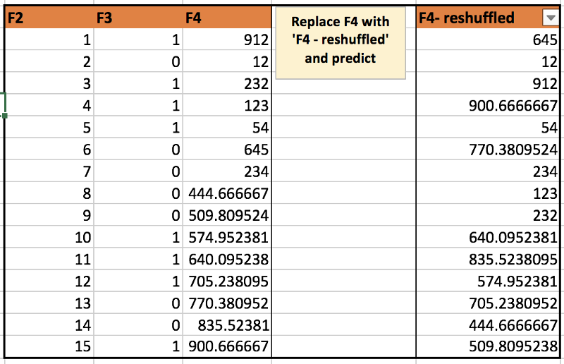
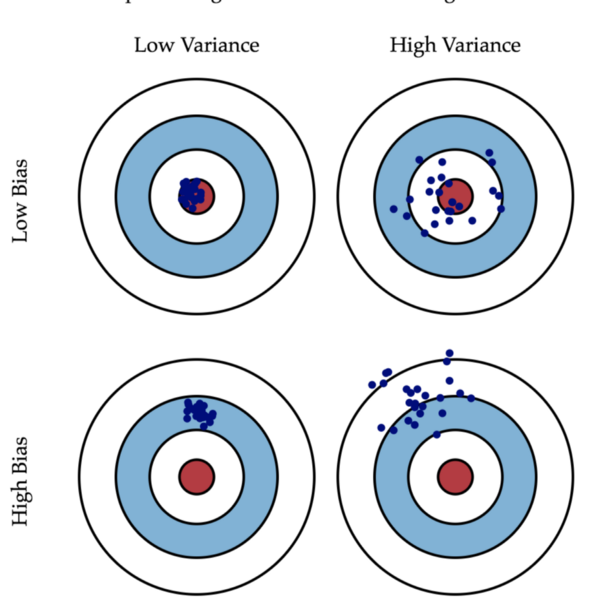
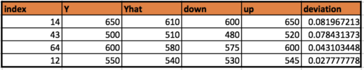
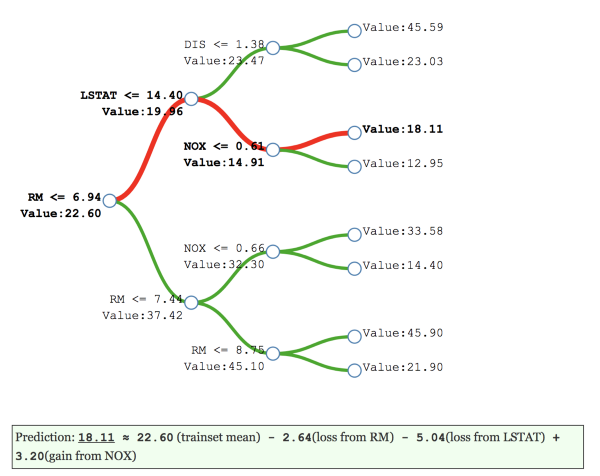
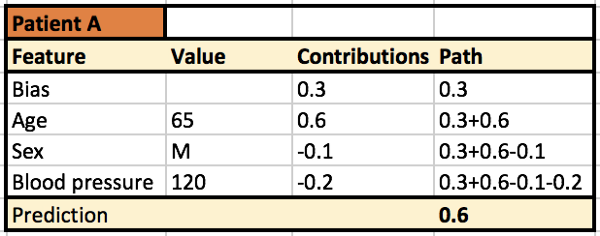
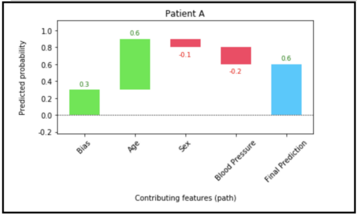
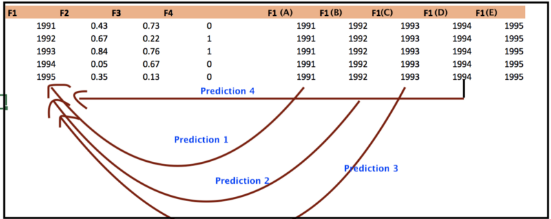
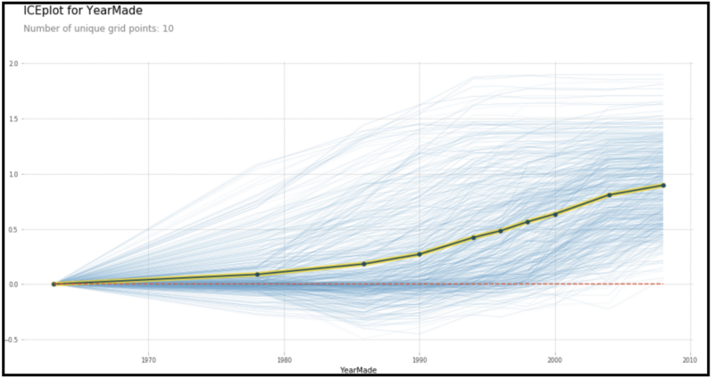
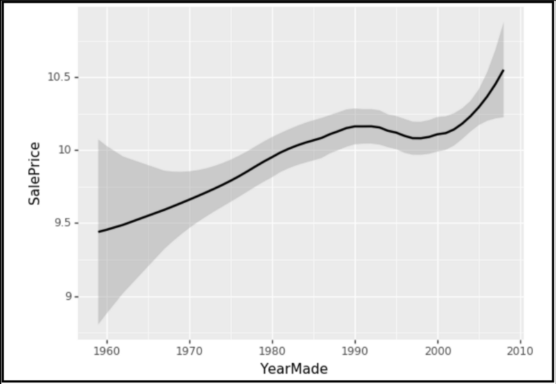

# Intuitive Interpretation of Random Forest

## Contact me

* Blog -> <https://cugtyt.github.io/blog/index>
* Email -> <cugtyt@qq.com>
* GitHub -> [Cugtyt@GitHub](https://github.com/Cugtyt)

---

<head>
    <script src="https://cdn.mathjax.org/mathjax/latest/MathJax.js?config=TeX-AMS-MML_HTMLorMML" type="text/javascript"></script>
    <script type="text/x-mathjax-config">
        MathJax.Hub.Config({
            tex2jax: {
            skipTags: ['script', 'noscript', 'style', 'textarea', 'pre'],
            inlineMath: [['$','$']]
            }
        });
    </script>
</head>

来自[Intuitive Interpretation of Random Forest](https://medium.com/usf-msds/intuitive-interpretation-of-random-forest-2238687cae45).

## 1. How important are our features ?

在sklearn随机森林中使用model.feature_importances来研究重要特征是很常见的。重要的特征意味着与因变量更密切相关的特征，并且对因变量的变化贡献更多。我们通常尽可能多地为随机森林模型提供特征，并让算法返回它发现对预测最有用的特征列表。但仔细选择正确的特征可以使我们的目标预测更准确。

计算feature_importances的想法很简单，也很有效。步骤：

1. 训练随机森林模型（假设有正确的超参数）
2. 确定模型的预测分数（称为基准分数）
3. 模型预测p次，其中p是特征数，每次随机打乱第i列特征
4. 将p次分数与基准分数进行比较。如果随机打乱某些列会损害分数，这意味着模型在没有该特征的情况下会很糟糕
5. 删除不影响基准分数的特征，并使用删除后的特征子集重新训练模型



用于计算特征重要性的代码，下面的代码将为所有特征提供{feature，importance}的字典：

``` python
# defining rmse as scoring criteria (any other criteria can be used in a similar manner)
def score(x1,x2):
    return metrics.mean_squared_error(x1,x2)

# defining feature importance function based on above logic
def feat_imp(m, x, y, small_good = True): 
"""
m: random forest model
x: matrix of independent variables
y: output variable
small__good: True if smaller prediction score is better
"""  
     score_list = {} 
      score_list[‘original’] = score(m.predict(x.values), y) 
      imp = {} 
      for i in range(len(x.columns)): 
            rand_idx = np.random.permutation(len(x)) # randomization
            new_coli = x.values[rand_idx, i] 
            new_x = x.copy()            
            new_x[x.columns[i]] = new_coli 
            score_list[x.columns[i]] = score(m.predict(new_x.values), y) 
            imp[x.columns[i]] = score_list[‘original’] — score_list[x.columns[i]] # comparison with benchmark
       if small_good: 
             return sorted(imp.items(), key=lambda x: x[1]) 
       else: return sorted(imp.items(), key=lambda x: x[1], reverse=True)
```

输出：

```
importance = feat_imp(ens, X_train[cols], y_train); importance

[('YearMade', -0.21947050888595573),
 ('Coupler_System', -0.21318328275792894),
 ('ProductSize', -0.18353291714217482),
 ('saleYear', -0.045706193607739254),
 ('Enclosure', -0.041566508577359523),
 ('MachineID', -0.01399141076436905),
 ('MachineHoursCurrentMeter', -1.9246700722952426e-05)]

In above output, YearMade increases prediction RMSE most if it gets shuffled (proxy to getting removed from model). So it must be most important feature. 

(above results correspond to data taken from a Kaggle competition. Here is the link - https://www.kaggle.com/c/bluebook-for-bulldozers)
```

## 2. How confident are we about our predictions ?

通常，当企业想要预测某些事物时，他们的最终目标是降低成本或提高利润。在做出重大商业决策之前，企业有兴趣估计做出决定的风险。但是，如果预测结果没有置信区间，那么不仅没有降低风险，还可能会无意中将业务暴露出更大的风险。

当我们使用线性模型（基于分布假设的模型）时，相对容易找到我们预测的置信水平。但是当谈到随机森林的置信区间时，相对而言就不那么直接了。

我想，任何参加线性回归课程的人都看过这张图片：



为了找到最佳线性模型，我们寻找能平衡偏差-方差的模型。该图很好地说明了预测中偏差和方差的定义。如果高偏差低方差（第3个），那么一直远离靶心击中飞镖。相反，如果低偏差高方差（第2个），击中就非常不一致。现在，把这个例子类比于在现实生活中捕捉信用欺诈。如果信用公司有类似于第二个的预测模型，那这个公司可能在大多数情况下不会捕获到欺诈，即使平均模型预测是正确的。

需要注意的是，我们不仅仅应该检查平均预测，还应该检查预测点的置信水平。

### How to do that in random forest ?

随机森林由多个决策树组成（由n_estimators给出）。每棵树单独预测新数据，随机森林吐出这些树的平均预测。置信水平的想法只是为了看到来自不同树的预测对于新观察而言的变化情况。为了进一步分析，可以针对具有最大变化的观测寻找一些模式（类似于2011年对应的预测具有较大的变化）。

基于树的变化情况来分析预测置信水平：

``` python
#Pseudo code: 
def pred_ci(model, x_val, percentile = 95, n_pnt):   
    
    """
    x_val = validation input
    percentile = required confidence level
    model = random forest model
    """

    allTree_preds = np.stack([t.predict(x_val) for t in model.estimators_], axis = 0)
    
    err_down = np.percentile(allTree_preds, (100 - percentile) / 2.0  ,axis=0)
    err_up = np.percentile(allTree_preds, 100- (100 - percentile) / 2.0  ,axis=0)
    
    ci = err_up - err_down
    yhat = model.predict(x_val)
    y = y_val
    
    df = pd.DataFrame()
    df['down'] = err_down 
    df['up'] = err_up
    df['y'] = y
    df['yhat'] = yhat
    df['deviation'] = (df['up'] - df['down'])/df['yhat']
    df.reset_index(inplace=True)
    df_sorted = df.iloc[np.argsort(df['deviation'])[::-1]]
    return df_sorted
```

输出：



从这个输出中可以看出，我们对index=14的观察预测最不自信。

## 3. What is the prediction path? (Tree Interpreter)

如果我们想要分析哪些特征对整个随机森林模型很重要，那么特征重要性（第1部分）是及其有用的。但是如果我们对一个特定的观察感兴趣，那么树解释器就会发挥作用。

例如，有一个随机森林模型用来预测：来医院的患者X是否具有很高的再入院概率？为简单起见，我们假设只有3个特征：**血压数据，年龄和性别**。现在，如果模型说**患者A**有80％的再入院概率，我们怎么知道**模型为什么会认为患者A会再次入院**？在这种情况下，树解释器给出了该特定患者遵循的**预测路径**。这有点像这种情况，因为**患者A**是65岁的男性，所以模型预测他将再次入院。模型预测再入院的**患者B**可能是因为B患有高血压（不是因为年龄或性别）。

基本上，树解释器给出了偏差（起始节点处的数据平均值）的排序列表，以及单个节点对预测的贡献。下图的决策树（深度为3）基于波士顿住房价格数据集的模型。它根据中间节点的**预测值**和导致值发生变化的**特征**显示决策路径的细分变化。节点的贡献是该节点处的值与前一节点处值的差异。



下图给出了对**患者A**使用树解释器的示例输出。它表示65岁是模型预测再入院概率高于平均值的最高贡献者。



也可以使用瀑布图来可视化它。



绘制它使用的是waterfallcharts包，代码是：

``` python
from waterfallcharts import quick_charts as qc
a = [‘Bias’, ‘Age’, ‘Sex’, ‘Blood Pressure’]
b = [0.3, 0.6, -0.1, -0.2]
plot = qc.waterfall(a,b, Title= ‘Patient A’, y_lab= ‘Predicted probability’, x_lab= ‘Contributing features (path)’,
 net_label = ‘Final Prediction’)
plot.show()
```

术语：

* **值**表示节点预测的目标值（观测样本落在该节点的的均值）。
* **贡献值**是当前节点值减去前一节点的值（这是特征为该路径提供的贡献）。
* **路径**是一些所有特征分割直到叶节点的组合。
 
来自treeinterpreter包的函数非常简单，可以从每个节点获取贡献值，包的地址在[这里](https://pypi.python.org/pypi/treeinterpreter)。

## 4. How is target variable related with important features? (Partial Dependence Plots)

找到最重要的特征之后，接下来我们可能感兴趣的是：研究目标变量和感兴趣特征之间的直接关系。这类似于线性回归的模型系数。对于线性回归而言，我们可以这样解释系数：“保持所有其他X（i）不变的情况下，X（j）变化1个单位那么Y会怎么变化。”

虽然可以从随机森林获取特征的重要性，但是它们仅相对于X（i）的变化给出Y的相对变化。不能直接将它们解释为：使其他特征保持不变的情况下，X（j）的单位变化导致多大的Y变化。

幸运的是，我们有部分依赖图（PDP），它可以看作线性模型系数的图形化表示，但也可以扩展到黑盒模型上。我们的想法是将预测的更改限制在某个特定的特征上。它与X和Y的散点图是不同的，因为散点图不能隔离X与Y的直接关系，并且可能受到与X和Y所依赖的其他变量的间接影响。

制作PDP图的步骤如下：
1. 训练随机森林模型（假设F1 ... F4是特征，Y是目标变量。假设F1是最重要的特征）。
2. 我们希望探索Y和F1的直接关系
3. 用F1（A）代替F1列，并获取所有观测值的新预测。获取预测的均值，称作基线值。
4. 对F1（B）... F1（E）重复步骤3，即所有不同于F1的特征。
5. PDP的X轴是F1的离散值，Y轴是预测均值与基线值的差值。
 

 
下图是部分依赖图的例子（在[bulldozer](https://www.kaggle.com/c/bluebook-for-bulldozers)上做的）。它显示了YearMade与SalesPrice的关系。



以下是SalePrice与YearMade的线图。可以看到散点/线图可能无法像PDP那样捕捉到YearMade对SalesPrice的直接影响。

