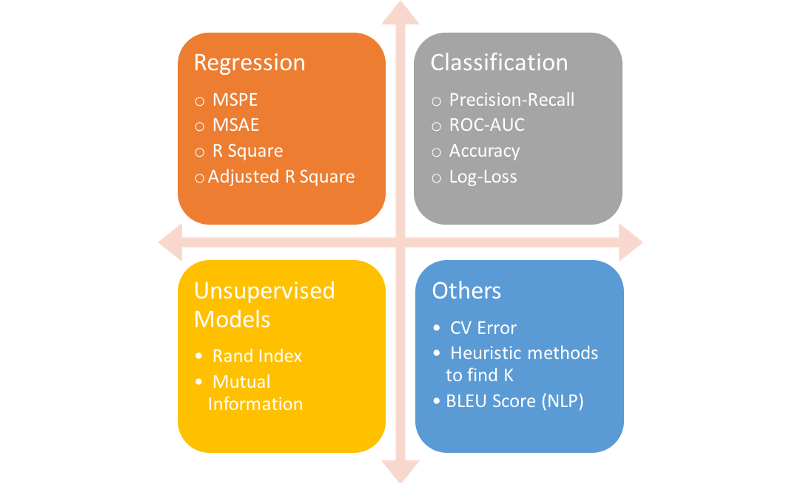
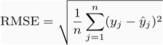
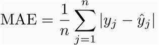
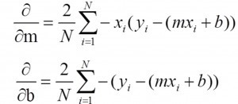
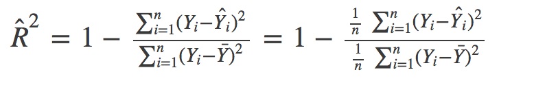
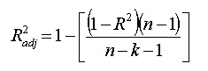
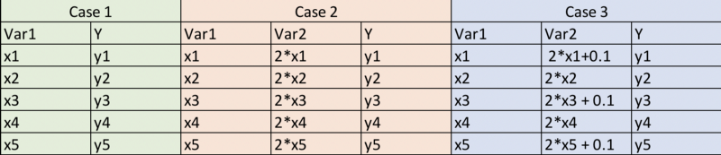
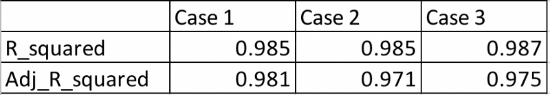

# Choosing the Right Metric for Evaluating Machine Learning Models — Part 1

## Contact me

* Blog -> <https://cugtyt.github.io/blog/index>
* Email -> <cugtyt@qq.com>
* GitHub -> [Cugtyt@GitHub](https://github.com/Cugtyt)

---

<head>
    <script src="https://cdn.mathjax.org/mathjax/latest/MathJax.js?config=TeX-AMS-MML_HTMLorMML" type="text/javascript"></script>
    <script type="text/x-mathjax-config">
        MathJax.Hub.Config({
            tex2jax: {
            skipTags: ['script', 'noscript', 'style', 'textarea', 'pre'],
            inlineMath: [['$','$']]
            }
        });
    </script>
</head>

来自[Choosing the Right Metric for Evaluating Machine Learning Models — Part 1](https://medium.com/usf-msds/choosing-the-right-metric-for-machine-learning-models-part-1-a99d7d7414e4).

这一部分主要是回归指标。

## Most Useful Metrics



## Regression Metrics
### RMSE (Root Mean Square Error)

它表示了预测值和真实值的方差（称作残差），数学公式：



### MAE

MAE是绝对差的均值，它是线性的，这意味着所有差值的权重都是相同的。例如10和0的差是5和0的差的2倍。但是对于RMSE却不是这样，后面我们会细致讨论。数学公式为：



### So which one should you choose and why?

MAE很容易理解和解释，因为它直接取平均偏移，而RMSE比MAE对更大的差异惩罚更大。两个例子：

```
Case 1: Actual Values = [2,4,6,8] , Predicted Values = [4,6,8,10]
Case 2: Actual Values = [2,4,6,8] , Predicted Values = [4,6,8,12]
MAE for case 1 = 2.0, RMSE for case 1 = 2.0
MAE for case 2 = 2.5, RMSE for case 2 = 2.65
```

可以看到，RMSE对第二个的惩罚更大。通常RMSE比MAE相等或更高。唯一相等的情况是所有的差值相等或为0。

然而，即使更复杂且容易偏向更高的方差，RMSE仍然是许多模型的默认度量，这是因为RMSE定义的损失函数是平滑可微的，更容易执行数学运算。这是它受欢迎的重要原因。

例如一个简单的一元线性模型：y=mx+b。这里我们希望找到m和b，数据是(x,y)的形式。如果定义RMSE损失函数J，那我们可以很容易得到它的偏导：



上述方程很容易求解，但不适用于MAE。

但是如果想要从解释的角度来比较两个模型之间的度量，我认为MAE是更好的选择。值得注意的是，RMSE和MAE的单位与y值相同，而R Square则不然。RMSE和MAE的范围从0到无穷大。

> MAE和RMSE之间的一个重要区别是，最小化平方误差会得到均值，而最小化绝对误差会得到中位数。这就是为什么MAE对异常值具有鲁棒性而RMSE不行的原因。这个[答案](https://www.quora.com/How-would-a-model-change-if-we-minimized-absolute-error-instead-of-squared-error-What-about-the-other-way-around)详细解释了这个概念。

### R Squared (R²) and Adjusted R Squared

R平方和校正R平方通常用于解释目的，解释所选择的自变量对因变量的影响。但是这两个指标都被误解了，因此我想先把它们分析清楚，然后再讨论它们的优缺点。

R平方的数学式是：



分子是MSE（残差平方的平均值），分母是Y值的方差。MSE越高，R_squared越小，模型越差。

### Adjusted R²

和R²很像，校正R²也表示了对曲线的拟合情况，但是针对模型的项数量做了校正：



其中n是观察值总数，k是预测器数量，校正R²应该总是小于或等于R²。

#### Why should you choose Adjusted R² over R²?

校正R²能解决一些R²不能解的问题。校正R²会考虑模型中因附加项导致的边界改进。因此如果添加有用的项它会增加，如果添加不怎么有用的预测器，它会减少。然而，即使模型实际上并没有改进，R²也随着项的增加而增加。下面的例子会帮助理解：



在这里，案例1是有5个（x，y）观测值的简单情况。案例2中，有一个变量是变量1的两倍（与变量1完全相关）。案例3中，我们在var2中产生了轻微干扰，使其不再与var1完全相关。

如果为每种情况拟合简单的普通最小二乘（OLS）模型，逻辑上讲，我们并没有针对案例1向案例2和案例3提供任何额外或有用的信息。因此我们的度量值不应该针对这些模型进行改进。然而对于R²来说并不是这样，它为模型2和3提供了更高的值。但是校正R²解决了这个问题，它实际上在2和3的情况下都有所减少。我们看下Python中获得的结果：

``` python
import numpy as np
import pandas as pd
from sklearn import datasets, linear_model

def metrics(m,X,y):
    yhat = m.predict(X)
    print(yhat)
    SS_Residual = sum((y-yhat)**2)
    SS_Total = sum((y-np.mean(y))**2)
    r_squared = 1 - (float(SS_Residual))/SS_Total
    adj_r_squared = 1 - (1-r_squared)*(len(y)-1)/(len(y)-X.shape[1]-1)
    return r_squared,adj_r_squared
    
data = pd.DataFrame({"x1": [1,2,3,4,5], "x2": [2.1,4,6.1,8,10.1]})
y = np.array([2.1, 4, 6.2, 8, 9])
model1 = linear_model.LinearRegression()
model1.fit( data.drop("x2", axis = 1),y)
metrics(model1,data.drop("x2", axis=1),y)

model2 = linear_model.LinearRegression()
model2.fit( data,y)
metrics(model2,data,y)

data = pd.DataFrame({"x1": [1,2,3,4,5], "x2": [2.1,4,6.1,8,10.1]} )
y = np.array([2.1, 4, 6.2, 8, 9])
model3 = linear_model.LinearRegression()
model3.fit( data,y)
metrics(model3,data,y)
```

注意：模型1和模型2的预测值都相同，因此r_squared也是相同的，因为它仅取决于预测值和实际值。



从上表中我们可以看到，即使我们没有从案例1到案例2添加任何附加信息，R²仍然增加但校正R²显示正确的趋势（对模型2的变量较多的数量进行惩罚）

#### Comparison of Adjusted R² over RMSE

对于前面的例子，我们看到RMSE和R²在案例1和案例2相同。在这种情况下，校正R²比RMSE做得更好，RMSE的范围仅限于将预测值与实际值进行比较。此外，RMSE的绝对值实际上并不能说明模型有多糟糕。它只能用于比较两个模型，而校正R²很容易做到这一点。例如，如果模型的校正R²等于0.05，那么它肯定很差。

但如果只关心预测准确率，那么RMSE是最好的。它计算简单，微分简单，还是大多数模型的默认度量。

**常见的误解**：我经常在网上看到R²的范围介于0和1之间，实际上并非如此。R²的最大值为1，但最小值可为负无穷大。考虑模型预测所有观察值为很小负值的情况，即使y_actual为正。在这种情况下，R²将小于0。这将是一种极不可能的情况，但可能性仍然存在。

