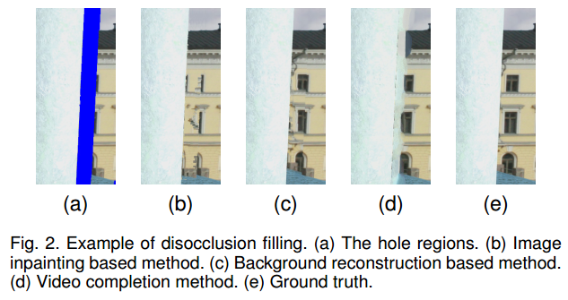
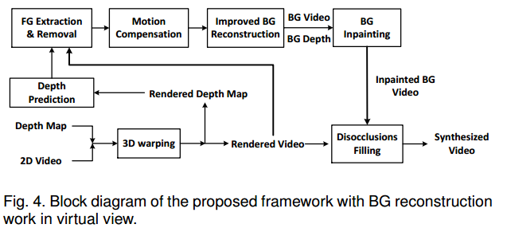

# A disocclusion inpainting framework for depth-based view synthesis

## Contact me

* Blog -> <https://cugtyt.github.io/blog/index>
* Email -> <cugtyt@qq.com>, <cugtyt@gmail.com>
* GitHub -> [Cugtyt@GitHub](https://github.com/Cugtyt)

---

<head>
    
    
</head>

课程作业

## 摘要

提出了去遮挡修复框架，可以用于基于深度的视图合成。包括四个模块：前景提取，动作补偿，改进的背景重构和修复。前景提取模块检测前景目标，并把他们从深度图和渲染视频中移除。动作补偿保证了背景重构模型适合移动相机的场景，改进的背景重构模块构建了稳定的背景视频，修复模块用于减少合成视图的空洞。现有的背景重构方法和修复方法可以作为我们框架的一部分。

## 1 INTRODUCTION

视图合成是一种常用的通过有限数量视图生成自由视角视频的方法。在视图合成方法中，基于渲染的深度图像（DIBR）广泛使用，他可以通过一些参考的2D视频和相关的深度图综合生成自由视角视频。但是当背景区域被前景区域遮挡，或者一些边界区域出现在虚拟视图中的时候，未知区域不可避免的会出现在DIBR过程中，导致合成的视频有一些空洞。

遮挡修复是DIBR的主要面对的问题。为了达到较高的质量，填充的空洞需要满足以下条件：1）能反应真实情况，2）看起来自然，3）保持时间上的一致性。

图像修复是恢复未知区域的有效方法，但是可能导致前景渗透。当前的方法把图像修复用于填充空洞，但是存在这多种其他问题。

本文提出了遮挡修复框架，包括四个模块：前景提取，动作补偿，改进的背景重构和修复。前景提取是核心。当前景对象移除后，大部分的图像修复方法可以成功的避免前景渗透。然后改进的背景重构模块可以构建出一个干净的背景视频。动作补偿模块保证了它适合于移动相机场景，而传统的方法只适合于静态场景。这个框架不依赖于某种特定的背景重构方法和图像修复算法，可以把其他的算法也可以应用进来。

## 2 RELATED WORK

【略】

## 3 PROPOSED FRAMEWORK

本工作的创新点在于提出了一个高效的遮挡修复框架。框架包括两种类型：原始视图的背景重构，和虚拟视图的背景重构（图4）。在图4中，2D视频和深度图由3D形变处理，生成渲染的背景视频和渲染的深度图。渲染深度图的未知值通过深度预测值获得。然后背景视频和背景深度由渲染视频和渲染深度图通过三个模块获得：前景提取，动作补偿，改进的背景重构。后面，渲染的背景视频空洞通过补偿模块填充。最后，修复的背景视频通过遮挡填充模块填充渲染视频的空洞。

通过增加前景提取模块，框架可以构建一个干净的背景视频。

## 4 FOREGROUND EXTRACTION

本部分是如何自动从视频中自动提取前景。图像分割可以很好的区分背景和前景，但是需要用户交互。另一个方法是先构建一个背景模型，然后使用减去背景得到前景，但是这只对于移动的对象。一些方法通过深度图上随机游走分割来划分前景和背景，但是只适用于虚拟试图，深度图必须包含空洞区域。

在我们的方法中，前景目标可以通过随机游走分割算法自动提取虚拟视图和原始视图。随机游走的重要一步是自动提取初始种子。为了精确的提取前景，虚拟深度图的未知深度值必须如下预测。

### 4.1 Depth Prediction

由于预测的深度图用于划分前景和背景，因此并不需要非常精确的深度值。这里我们采用一个简单但是有效的方法来预测深度值：

$$d(x)=\min \left\{d\left(x_{l}\right), d\left(x_{r}\right)\right\} \qquad (1)$$

其中深度值$d(x)$是在像素$x$处的反向真实深度，$x\_{l}$是空洞左边位置，$x\_{r}$是空洞右边位置。$x，x\_{l}，x\_{r}$在同一水平线上。虽然很简单，但是在提取前景和背景的初始种子上做的很好。预测结果在图5（b）中。

### 4.2 Initial Seeds

通过一些深度图的特征提取得到随机游走的初始种子：1）前景对象和背景有一些明显的边界，2）边界内的区域（深度值大）为前景对象，3）边界外的区域（深度值小）为背景。

首先，前景对象和背景的边界需要检测出来。由于相同对象上有不连续的非规则深度，那么这些边界不应该提取出来，应该平滑掉。可以使用低通滤波器平滑，但是真实的边界区域也会被平滑掉，因此使用双边滤波来预处理深度图：

$$h(x)=k^{-1}(x) \iint_{D} d(\xi) c(\xi, x) s(I(\xi), I(x)) d \xi \qquad (2)$$

其中$D$是大小为$W \times W$的滤波窗口，权重$c$和$s$是高斯函数，计算公式为：

$$c(\xi, x)=\exp \left(-\left(|\xi-x| / \sigma_{d}\right)^{2} / 2\right) \qquad (3)$$
$$s(I(\xi), I(x))=\exp \left(-\left((I(\xi)-I(x)) / \sigma_{r}\right)^{2} / 2\right) \qquad (4)$$

$I(x)$是像素x的彩色值，$\sigma\_{d}$是欧几里得距离方差，k是标准化因子：

$$k(x)=\iint_{D} c(\xi, x) s(I(\xi), I(x)) d \xi \qquad (5)$$

通过引入公式4的权重函数s，彩色空间的大距离有小权重，让真实边界不被平滑掉。小距离有大权重，可以移除掉相同对象上的不连续深度。

由于前景对象和背景可能位于背景或前景中，我们的想法是使用两个灰度形态运算来定位边界位置。

在预处理后，使用Canny边界检测方法来提取前景内部边界（IBFO）和前景外部边界（OBFO）。虚拟深度图的初始种子如图6（a）。

基于IBFO和OBFODE的结果，初始种子可以自动设置到随机游走算法中。IBFO设为前景标签，OBFO设置为背景标签。图6是提取结果。

## 5 IMPROVED BACKGROUND RECONSTRUCTION

在前景对象移除后，剩下的可以构建一个干净的背景。考虑到传统的背景重构不适于移动相机场景，改进的背景重构通过两个模块处理：动作补偿和背景修改模型。修改背景的模型主要是为了不让前景像素受构建模型的影响，也考虑时间上的连续性。对于移动相机场景，所有的输入帧先映射到当前的平面，或者所有的背景模型映射到当前的平面。

### 5.1 Motion compensation

在非静态的相机中，必须处理时间连续性，因为模型在时间t-1不能之间用于时间t。所有的模型参数需要使用行为补偿移动到新的位置。【略】

### 5.2 Temporal Median Filter Background Model

时间中值滤波模型只需要简单的中位数运算，而且效率很高。

$$b p\left(x_{t}\right)=\operatorname{med}\left(\left\{I_{x, i} | i \in[t, t-n+1], B\left(x_{i}\right)=1\right\}\right) \qquad (6)$$

图7是是否使用北京重构的比较。

### 5.3 LBP-based Background Model

背景预测问题可以看做是像素分类问题，可以通过能量最小化框架表示，用LBP解决。我们的方法使用输入帧来估计，并基于两个假设：背景应该比前景看起来更平滑，深度值浅的像素更可能是背景。

假设一组色彩和深度的输入帧为$\left\{\left(I_{f}, d_{f}\right), f \in \mathcal{F}\right\}$，所有的帧用于预测背景。

最后，背景重构用能量最小化问题建模。目标为给每个像素$x \in \mathcal{P}$赋值一个标签$f_{x} \in \mathcal{F}$，使得能量$E\left(f_{x}\right)$最小：

$$E\left(f_{x}\right)=\sum_{(x, y) \in \mathcal{N}} V\left(f_{x}, f_{y}\right)+\sum_{x \in \mathcal{P}} D\left(f_{x}\right) \qquad (7)$$

其中$\mathcal{N} \subset \mathcal{P} \times \mathcal{P}$是所有临近像素的集合，$V\left(f_{x}, f_{y}\right)$是损失。

【略】

图8展示了使用深度信息的重要性。

### 5.4 Modified GMM

高斯混合模型（GMM）通常用于检测移动对象，可以用于建模稳定的背景，GMM操作是像素级别的，每个像素由混合K个高斯分布独立建模。

我们的方法中，前景像素不参与建模。在更新过程，所有的背景模型映射到当前平面。修改的高斯混合分布可以写为：

$$p\left(I_{x, t}\right)=B\left(x_{t}\right) \cdot \sum_{i=1}^{K} w_{x, i, t} \cdot \eta\left(I_{x, t}, \mu_{x, i, t}, \sigma_{x, i, t}^{2}\right) \qquad (11)$$

【略】

图9展示了前景移除模块的重要性。

## 6 DISOCCLUSIONS FILLING

在背景重建后，用于填充虚拟视图的遮挡，如图10(a)。对于虚拟试图的背景重构，构建的背景视频可以直接用于填充遮挡。对于原始视图的背景重构，背景视频要映射到虚拟视图产生渲染的背景视频，如图10(b)。

在混合渲染视频和渲染背景视频后，还存在一些空洞，如图10(c)。这是因为一些区域被静态前景物体遮挡，不能通过背景重构模型重建，或者虚拟试图有一些边界区域不能映射到原始视图的对应位置。【略】我们的框架中，现有的修补方法可以直接用于填充渲染背景视频的空洞，然后背景视频用用填充渲染视频的空洞。由于前景物体移除，前景问题的表示问题可以规避掉。

【略】

## 8 CONCLUSION

本文提出了遮挡修补框架。在该框架中，前景提取和动作补偿展示了对于重构干净背景的重要性。由于前景移除了，框架可以直接利用现有的图像修补方法来填充空洞，也达到了很好的性能。
