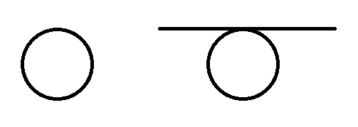
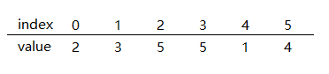
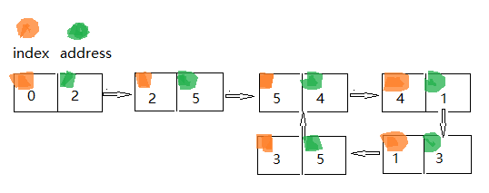

# 找到出现多次的数

---
> ## Contact me:
> Blog -> <https://cugtyt.github.io/blog/index>  
> Email -> <cugtyt@qq.com>, <cugtyt@gmail.com>  
> GitHub -> [Cugtyt@GitHub](https://github.com/Cugtyt)

---

> **Given an array nums containing n + 1 integers where each integer is between 1 and n (inclusive), prove that at least one duplicate number must exist. Assume that there is only one duplicate number, find the duplicate one.**
>
> Note:
> 1. You **must not** modify the array (assume the array is read only).
> 2. You must use only constant, O(1) extra space.
> 3. Your runtime complexity should be less than O(n2).
> 4. There is only one duplicate number in the array, but it could be repeated more than once.

---

第一条限制，不能修改数组。这导致我们不能借用排序等手法将复杂度限制在nlogn情况下。否则我们只要排序一遍，然后遍历一遍即可解出答案。

第二条限制，只能使用O(1)的空间。这导致我们不同借用任何存储的方法，也就是不能使用计数、有记忆的方法。否则我们可以使用计数器，找到出现多于一次的数字，为了节省空间，考虑到只是多于1次，那么可以用位存储。

第三条限制，时间复杂度低于O(n^2)。这导致我们不同使用两层循环求解。否则我们只需要两个循环，进行n^2遍历，即可找到答案。

第四条限制，只有一个重复数，但是可能出现多次。看似不是限制，但是这导致我们不能用数字规律简答求解，如果只出现2次，那么可以用等差数列和与实际求和结果求差即可解答。

因此，问题不能直接从数字规律本身，和记录统计等方法，这里会用到一个特殊的方法，求序列中的环的思想，详细解释看[**找到链表中的环**](https://cugtyt.github.io/blog/algo/2018/201802121954)，下面是简单解释。

先来看下这个思想是什么意思，考虑一个链表，但是可能出现环，最简单就是循环链表，首尾相接，但也可能是中间一部分出现环：



寻找的方法这里给出，就是两个指针，一快一慢，都从链表第一个和第二个开始，慢的指针一次向后走一步，快的一次向后走两步。那么可以证明的是如果有环，那么这两个指针会在某一时刻到达同样的位置。这里不详细说明。

那么这个问题和题目有什么关系？考虑给定数组中数的特殊性，n+1个范围在1-n的数字，那么每个数字作为索引的话可以到达任意位置并且不会越界。我们把它想象为链表中的地址，这里需要指针和地址概念清楚，那么可想而知，如果出现了重复数字，就相当于出现了环。

例如数组：



5出现了两次，我们把index当作链表单元自己的地址，value当作下一个单元的地址，从0单元开始，这样就如下图所示：



可以看到当多个数字出现时，肯定出现了环，那么就可以用上面我们所介绍的思想去解决。

具体程序（来自网络解答）：

``` c++
int findDuplicate3(vector<int>& nums) {
    if (nums.size() > 1) {
        int slow = nums[0];
        int fast = nums[nums[0]];
        while (slow != fast) {
            slow = nums[slow];
            fast = nums[nums[fast]];
        }
        fast = 0;
        while (fast != slow) {
            fast = nums[fast];
            slow = nums[slow];
        }
        return slow;
    }
    return -1;
}
```

程序和[**找到链表中的环**](https://cugtyt.github.io/blog/algo/2018/201802121954)基本一样，可以看链接详细理解。