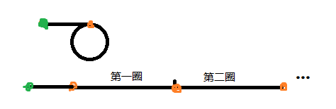
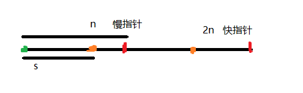

# 找到链表中的环

---
> ## Contact me:
> Blog -> <https://cugtyt.github.io/blog/index>  
> Email -> <cugtyt@qq.com>, <cugtyt@gmail.com>  
> GitHub -> [Cugtyt@GitHub](https://github.com/Cugtyt)

---

> **Given a linked list, return the node where the cycle begins. If there is no cycle, return null.**
>
> Note: Do not modify the linked list.
>
> Follow up:  
> Can you solve it without using extra space? 

---

首先如何确认链表有环？有环代表经过一段后移回到环的起点。

如果是循环链表，那么很简单，只要用一个指针向后移动，如果回到起点，那么就是环。但是问题是我们不知道环的起点在哪，一个粗暴的解法就是从头开始对每个节点都进行一次上述步骤，但是问题在于如果当前节点不是环的起点，那就无法结束。另外的想法就是借助外部空间，如果我们建立一个记录本，对每个节点记录所指向的节点，那么在一定时间内的确可以发现环的起点，当然这是一个解法。

但是如果不能借助空间呢？那就必须出现起点和终点的记录，试想如果我们使用两个指针，一个快，一个慢，快的一次走两步，慢的一次走一步，他们会相遇吗？考虑最简单的一个环的情况，如果我们将环展开，也就是说在环内走一圈就相当于在直线上展开那段距离：



那么环外距离设为s，慢指针走过的距离设为n，则快指针走过的距离就为2n：



指针间距离n就是走过的整数个环的距离，说明肯定是可以相遇的。

那么如果将环的起点返回呢？图中我们可以看到起点不是相遇的位置，但是我们已经有了起点的信息，为什么呢？

**n是整数个环的距离，那么慢指针此时与环起点的距离是n-s，如果再前进s步，就回到了环的起点！那怎么走s步呢，我们不知道s，我们只需要让另外的头指针与慢指针一起每次走一步，刚好s步的时候再次和慢指针相遇！！！此时就是环起点位置了！**

``` c++
/**
 * Definition for singly-linked list.
 * struct ListNode {
 *     int val;
 *     ListNode *next;
 *     ListNode(int x) : val(x), next(NULL) {}
 * };
 */
ListNode *detectCycle(ListNode *head) {
    if (!head || !head->next) {
        return NULL;
    }
    ListNode* slow = head;
    ListNode* fast = head;
    do  {
        if (!fast->next) {
            return NULL;
        }
        slow = slow->next;
        fast = fast->next->next;
    } while (fast && slow != fast);
    if (!fast) {
        return NULL;    
    }
    // 第二个循环
    fast = head;
    while (slow != fast) {
        slow = slow->next;
        fast = fast->next;
    }
    return slow;
}
```

好的我们已经很好的理解了算法，提醒下我在图中简化了情况：

**多个环怎么办？**

因为沿着头节点走只会有一条路径，因此我们肯定会找到确定的环，那些问题的结果也是退化为这里的模型，当然这里没法找多个环的起点。

**慢指针不一定是在第一个环停下的！**

图中我把慢指针停在了第一个环，为了便于画图，当然可能是在后面的环相遇的。