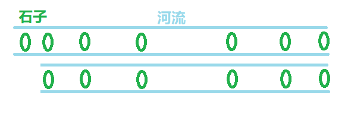

# 青蛙过河问题

---
> ## Contact me
> Blog -> <https://cugtyt.github.io/blog/index>
>
> Email -> <cugtyt@qq.com>, <cugtyt@gmail.com>
>
> GitHub -> [Cugtyt@GitHub](https://github.com/Cugtyt)

---

问题描述（[题目来源](https://leetcode-cn.com/problems/frog-jump/description/)）：

一只青蛙想要过河。 假定河流被等分为 x 个单元格，并且在每一个单元格内都有可能放有一石子（也有可能没有）。 青蛙可以跳上石头，但是不可以跳入水中。

给定石子的位置列表（用单元格序号升序表示）， 请判定青蛙能否成功过河（即能否在最后一步跳至最后一个石子上）。 开始时， 青蛙默认已站在第一个石子上，并可以假定它第一步只能跳跃一个单位（即只能从单元格1跳至单元格2）。

如果青蛙上一步跳跃了 k 个单位，那么它接下来的跳跃距离只能选择为 k - 1、k 或 k + 1个单位。 另请注意，青蛙只能向前方（终点的方向）跳跃。

请注意：

* 石子的数量 ≥ 2 且 < 1100；

* 每一个石子的位置序号都是一个非负整数，且其 < 231；
* 第一个石子的位置永远是0。

示例 1:
>[0,1,3,5,6,8,12,17]
>
>总共有8个石子。
>
>第一个石子处于序号为0的单元格的位置, 第二个石子处于序号为1的单元格的位置,
>第三个石子在序号为3的单元格的位置， 以此定义整个数组...
>最后一个石子处于序号为17的单元格的位置。
>
>返回 true。即青蛙可以成功过河，按照如下方案跳跃：
>跳1个单位到第2块石子, 然后跳2个单位到第3块石子, 接着
>跳2个单位到第4块石子, 然后跳3个单位到第6块石子,
>跳4个单位到第7块石子, 最后，跳5个单位到第8个石子（即最后一块石子）。

示例 2:
>[0,1,2,3,4,8,9,11]
>
>返回 false。青蛙没有办法过河。
>这是因为第5和第6个石子之间的间距太大，没有可选的方案供青蛙跳跃过去。

首先直观的解法是尝试！

按照青蛙的做法，每次在能跳的步数内跳到能跳的石头上，然后接着跳，发现跳不过去，就退回来，这就可以借助堆栈完成，退回来后尝试不同的步数跳，继续重复，如果发现退回起点还是无法跳过，就说明真的跳不过去了。

也就是说跳过去后的情况就是跳之前的子问题，二者的解决思路是一样的。如下图，跳过去后面临的问题只是规模x缩小了，问题性质还是一样的。



为了实现它，我的思路是首先定义一个辅助函数，用于完成跳跃部分，在canCross里面首先检查边界情况，如果只有两个石头，就只能是1，否则就跳不过去。

辅助函数jump接受两个参数，一个是石头，一个是上一次跳的步数。在jump里首先检查边界情况，如果步长为0，直接False，如果石头数为1，返回True，这是处理已经跳到岸的情况。在jump里面首先判断当前能跳的步数，也就是[step - 1, step, step + 1]，然后对面前的石头依次尝试，
如果在当前可跳的步数里，就跳过去，进行递归下一次跳，如果这次跳的结果成功，说明已经可以到岸上了，就直接返回True，如果失败了，就退回来继续下一次尝试，如果尝试都失败了，就是最后返回False即可。

``` python
class Solution:
    def canCross(self, stones):
        if len(stones) == 2:
            return False if stones[1] - stones[0] != 1 else True
        return jump(stones, 1)

def jump(stones, step):
    if not step:
        return False
    if len(stones) == 1:
        return True
    steps = [step - 1, step, step + 1]
    result = False
    for i in range(1, len(stones)):
        if stones[i] - stones[0] in steps:
            result = jump(stones[i:], stones[i] - stones[0])
            if result:
                return True
    return False
```

通过运行代码，发现会出现超时的情况，说明很多情况下，我们还可以简化逻辑，比如说对于当前石头到最后一个石头的距离大于到倒数第二个石头距离的2倍，这意味着我们即使一次跳最远到倒数第二个石头，后面也依旧过不去，因此对于这种情况，直接进行排除。此外，就是探索逻辑，我们这里就是简单的从短步到长步进行探索，有些情况下，长步直接走了多个短步的联合，因此，思路从先短步再长步，到先长步再短步，这样一方面如果长步能够到岸就减少了探索时间，另一方面也减少了探索次数。

修改后为：

``` python
class Solution:
    def canCross(self, stones):
        if len(stones) == 2:
            return False if stones[1] - stones[0] != 1 else True
        if stones[-1] - stones[0] > 2 * (stones[-2] - stones[0]):
            return False
        return jump(stones, 1, True)

def jump(stones, step, before):
    if not step:
        return False
    if not stones or len(stones) == 1:
        return True and before
    steps = [step - 1, step, step + 1]
    result = False
    for i in reversed(range(1, len(stones))):
        if stones[i] - stones[0] in steps:
            result = jump(stones[i:], stones[i] - stones[0], True)
            if result:
                return True
    return False
```

这次成功通过了所有测试用例，看下别人的思路，写博客时使用Python3的最快运行代码是：

``` python
def dfs(mapp, jump, current, maximum):
    if maximum == current:
        return True
    k3 = current + jump + 1
    k2 = current + jump
    k1 = current + jump - 1
    if k3 in mapp:
        if dfs(mapp, jump+1, k3, maximum):
            return True
    if jump > 0 and k2 in mapp:
        if dfs(mapp, jump, k2, maximum):
            return True
    if jump > 0 and k1 in mapp:
        if dfs(mapp, jump-1, k1, maximum):
            return True
    return False

class Solution:
    def canCross(self, stones):
        for i in range(1, len(stones)):
            if stones[i] > 2*stones[i-1]+1:
                return False
        return dfs(set(stones), 0, 0, stones[-1])
```

发现虽然分析思路是深度优先搜素，但是其实一样的。O(∩_∩)O