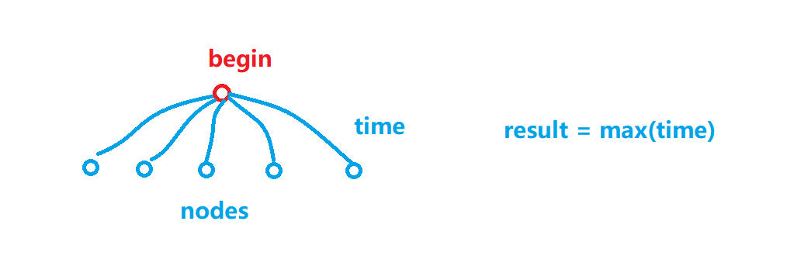
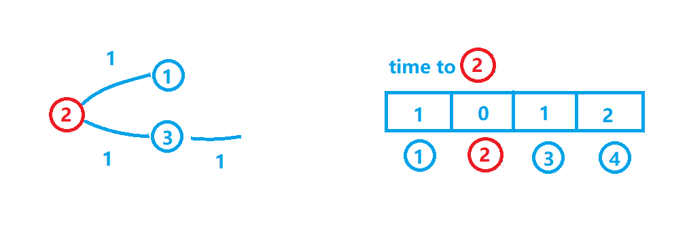

# Network Delay Time问题

## Contact me

* Blog -> <https://cugtyt.github.io/blog/index>
* Email -> <cugtyt@qq.com>, <cugtyt@gmail.com>
* GitHub -> [Cugtyt@GitHub](https://github.com/Cugtyt)

---

[题目来源](https://leetcode.com/problems/network-delay-time/description/)：

There are N network nodes, labelled 1 to N.

Given times, a list of travel times as directed edges times[i] = (u, v, w), where u is the source node, v is the target node, and w is the time it takes for a signal to travel from source to target.

Now, we send a signal from a certain node K. How long will it take for all nodes to receive the signal? If it is impossible, return -1.

Note:

* N will be in the range [1, 100].
* K will be in the range [1, N].
* The length of times will be in the range [1, 6000].
* All edges times[i] = (u, v, w) will have 1 <= u, v <= N and 1 <= w <= 100.

要找最短的时间，那么这个问题可以转换为，起始点到任意节点时间的最大值：



怎么计算这个时间呢，例如：

> [[2,1,1],[2,3,1],[3,4,1]]  
> 4  
> 2



2到4没有直达时间，所以2到4的时间 = 2到[和4有直达节点]的时间 + 3[和4有直达节点]到4的时间，依次推下去，这个类似于动态规划的思路。

所以空间我们需要N，时间我们需要对每个节点和路径进行遍历，因此时间是N \* 路径（时间）个数。

那我们的python代码就可以写了：

``` python
def networkDelayTime(times, N, K):
    dis = [1000 for i in range(N)]
    dis[K - 1] = 0

    for i in range(N):
        for t in times:
            now = t[1] - 1
            before = t[0] - 1
            if t[0] == K:
                dis[now] = min(t[2], dis[now])
            else:
                dis[now] = min(t[2] + dis[before], dis[now])
    return -1 if max(dis) == 1000 else max(dis)
```

前两行是创建我们需要的空间，两层循环是遍历，对于每次遍历到的路径，如果路径起点是我们的起始点，那么我们更新节点时间为当前时间和已知时间的最小值，如果不是起始点，那么我们更新节点时间为起始点到这条路径的已知最短时间和已知直达最短时间的最小值。通过遍历我们就可以算出来起始点到所有节点的时间，我们取最大的，考虑到题目节点最大值为100，所以我们取1000作为无穷大是可行的。

看下网上的讨论，[一个C++的写法](https://leetcode.com/problems/network-delay-time/discuss/109982/C++-Bellman-Ford)是：

``` c++
class Solution {
public:
    int networkDelayTime(vector<vector<int>>& times, int N, int K) {
        vector<int> dist(N + 1, INT_MAX);
        dist[K] = 0;
        for (int i = 0; i < N; i++) {
            for (vector<int> e : times) {
                int u = e[0], v = e[1], w = e[2];
                if (dist[u] != INT_MAX && dist[v] > dist[u] + w) {
                    dist[v] = dist[u] + w;
                }
            }
        }

        int maxwait = 0;
        for (int i = 1; i <= N; i++)
            maxwait = max(maxwait, dist[i]);
        return maxwait == INT_MAX ? -1 : maxwait;
    }
};
```

思路是一致的，不过由于python语言的简洁性，可读性更好。