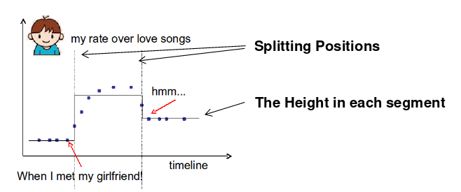
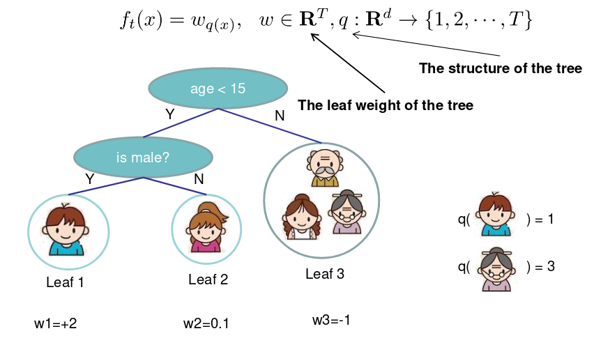
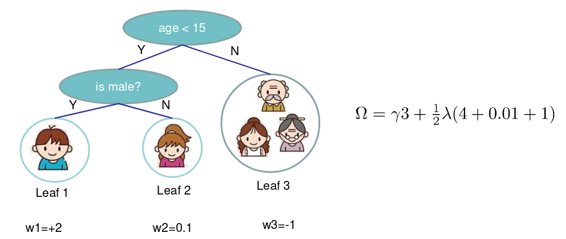
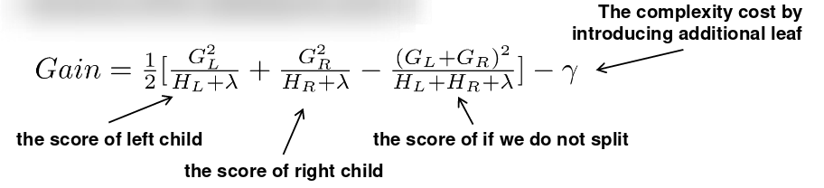

# Introduction to Boosted Trees（XGBoost PPT Tianqi Chen）

## Contact me

* Blog -> <https://cugtyt.github.io/blog/index>
* Email -> <cugtyt@qq.com>, <cugtyt@gmail.com>
* GitHub -> [Cugtyt@GitHub](https://github.com/Cugtyt)

> **本系列博客主页及相关见**[**此处**](https://cugtyt.github.io/blog/intv/index)

---

<head>
    
    
</head>

来自陈天奇[xgboost](https://homes.cs.washington.edu/~tqchen/pdf/BoostedTree.pdf)

## 监督学习

* 记号: $x_i \in \mathbf{R}^d$ 为第i个训练样本

* 模型: 输入 $x_i$ 输出 $\hat{y}_i$ 
  * 线性模型: $\hat{y}_i = \sum_i w_jx_{ij}$ 包括线性和logistic模型
  * 预测分数 $\hat{y}_i$ 根据不同的任务有不同的解释:
    * 线性回归: $\hat{y}_i$是预测分数
    * logistic回归: $1/(1 + exp(-\hat{y}_i))$为预测正类的概率
    * 其他...

* 参数: 需要从数据中学习的东西
  * 线性模型: $\Theta = \{ w_j | j = 1, \dots, d \}$

* 目标函数:
    

* 训练数据损失: $L = \sum_{i = 1} ^n l(y_i, \hat{y}_i)$
  * 平方损失: $l(y_i, \hat{y}_i) = (y_i - \hat{y}_i)^2$
  * logistic损失: $l(y_i, \hat{y}_i) = y_i ln(1 + e^{-\hat{y}_i}) + (1 - y_i) ln(1 + e^{\hat{y}_i})$

* 正则项: 模型的复杂性
  * L2正则: $\Omega(w) = \lambda \Vert w \Vert ^2$
  * L1正则 (lasso): $\Omega(w) = \lambda \Vert w \Vert _1$

* Ridge 回归: $\sum_{i = 1} ^ n (y_i - w^T x_i)^2 + \lambda \Vert w \Vert ^2$ , 线性模型,平方损失,L2正则

* Lasso: $\sum_{i = 1} ^ n (y_i - w^T x_i)^2 + \lambda \Vert w \Vert _1$ , 线性模型,平方损失,L1正则

* Logistic回归: 
    $$\sum_{i = 1} ^ n [y_i ln(1 + e^{-w^T x_i}) + (1 - y_i)ln(1 + e^{w^T x_i})] + \lambda \Vert w \Vert ^2$$
    线性模型, logistic损失, L2正则

> $\because p_i = \frac{1}{1 + e^{-w^T x_i}} \\
> \therefore - y_i ln(p_i) - (1 - y_i) ln(1 - p_i) \\
> = -y_i ln(\frac{1}{1 + e^{-w^T x_i}}) - (1 - y_i) ln(1 - \frac{1}{1 + e^{-w^T x_i}}) \\
> = y_iln(1 + e^{-w^T x_i}) - (1 - y_i) ln(\frac{e^{-w^T x_i}}{1 + e^{-w^T x_i}}) \\
> = y_iln(1 + e^{-w^T x_i}) - (1 - y_i) ln(\frac{1}{1 + e^{w^T x_i}}) \\
> = y_iln(1 + e^{-w^T x_i}) + (1 - y_i) ln(1 + e^{w^T x_i})$

* 为什么目标函数需要包含两部分?
* 优化训练损失鼓励**预测**模型在训练数据上拟合较好,这样才能有希望表示潜在的分布
* 优化正则项鼓励**简单**模型,让预测更稳定,方差更小

## 回归树和集成（学什么）

* 回归树(CART)
  * 决策规则和决策树一样
  * 每个叶子节点包含一个分数

### 树集成方法

* 使用广泛,GBM,随机森林
* 对输入尺度不敏感,不需要特征归一化
* 可以学到特征间高阶交互信息
* 可以扩展,工业界在使用

### 模型和参数

模型: 假设有K棵树

参数:
  * 每棵树的结构,叶子的分数
  * 或者简单使用函数作为参数 $\Theta = \{ f_1, f_2, \dots, f_K \}$
  * 我们不去学习$\mathbf{R}^{d}$,而是直接学习函数(树)

### 在一元变量上学习一棵树

如何学习函数? 定义目标函数(损失,正则项),优化它!

**例子**: 考虑单个输入t(时间)上的回归树，希望预测在时间t我是否喜欢浪漫的音乐。

需要学习的东西是：

一元变量树（step函数）目标：
  * 训练损失： 函数对点的拟合如何？
  * 正则项： 如何定义函数的复杂性？分割点的数量，每次分割的l2正则高度。

### 学习step函数

### 目标函数

模型： 假设我们有K棵树： $\hat{y}_{i}=\sum_{k=1}^{K} f_{k}\left(x_{i}\right), \quad f_{k} \in \mathcal{F}$

目标： $O b j=\sum_{i=1}^{n} l\left(y_{i}, \hat{y}_{i}\right)+\sum_{k=1}^{K} \Omega\left(f_{k}\right)$

定义$\Omega$的可能方法？
* 树的节点数，深度
* 叶子权重的l2正则
* 其他

### 目标函数vs启发式

讨论树的时候，通常树是启发式的：
* 根据信息增益划分
* 对树剪枝
* 最大深度
* 平滑叶子的值

大部分的启发式方法可以对应到目标上：
* 信息增益 -> 训练损失
* 剪枝 -> 对叶子节点数量正则约束
* 最大深度 -> 函数空间约束
* 平滑叶子值 -> l2正则叶子权重

### 回归树不仅仅可以用于回归

回归树的集成定义了如何做预测值，它可以用于分类，回归，等级评定...，取决于如何定义目标函数！

使用平方损失 $l\left(y_{i}, \hat{y}_{i}\right)=\left(y_{i}-\hat{y}_{i}\right)^{2}$ 为通常的梯度提升机。

使用logistic损失$l\left(y_{i}, \hat{y}_{i}\right)=y_{i} \ln \left(1+e^{-\hat{y}_{i}}\right)+\left(1-y_{i}\right) \ln \left(1+e^{\hat{y}_{i}}\right)$ 为LogitBoost

## 梯度提升（怎么学）

* 偏置-方差平衡无处不在
* 损失+正则化目标的模式用于回归树的学习（学习函数）
* 我们希望函数**有预测性**同时**简单**
* 因此我们希望学习的是目标函数和模型

### 怎么学习

* 目标： $\sum_{i=1}^{n} l\left(y_{i}, \hat{y}_{i}\right)+\sum_{k} \Omega\left(f_{k}\right), f_{k} \in \mathcal{F}$, 我们不能使用SGD这样的方法，因为这是树，不是数值向量。

* 解法：递增学习（Boosting），从常量预测开始，每次添加新的函数：

### 递增学习

* 如何决定添加什么函数f？ 根据优化的目标！

* 在t轮，预测为 $\hat{y}_{i}^{(t)}=\hat{y}_{i}^{(t-1)}+f_{t}\left(x_{i}\right)$， $f_{t}\left(x_{i}\right)$ 就是我们在t轮要添加的函数。

* 使用平方损失的话就是：

### 损失的泰勒展开

目标为 

$$O b j^{(t)}=\sum_{i=1}^{n} l\left(y_{i}, \hat{y}_{i}^{(t-1)}+f_{t}\left(x_{i}\right)\right)\\+\Omega\left(f_{t}\right)+ constant$$

由于：

$$f(x+\Delta x) \simeq f(x)+f^{\prime}(x) \Delta x+\frac{1}{2} f^{\prime \prime}(x) \Delta x^{2}$$

我们定义：

$$g_{i}=\partial_{\hat{y}^{(t-1)}} l\left(y_{i}, \hat{y}^{(t-1)}\right), \quad h_{i}=\partial_{\hat{y}^{(t-1)}}^{2} l\left(y_{i}, \hat{y}^{(t-1)}\right)$$

那么目标函数的泰勒展开就是：

$$O b j^{(t)} \simeq \sum_{i=1}^{n}\left[l\left(y_{i}, \hat{y}_{i}^{(t-1)}\right)+g_{i} f_{t}\left(x_{i}\right)+\frac{1}{2} h_{i} f_{t}^{2}\left(x_{i}\right)\right]\\+\Omega\left(f_{t}\right)+constant$$

使用平方损失的话就是：

$$g_{i}=\partial_{\hat{y}^{(t-1)}}\left(\hat{y}^{(t-1)}-y_{i}\right)^{2}=2\left(\hat{y}^{(t-1)}-y_{i}\right) \\ h_{i}=\partial_{\hat{y}^{(t-1)}}^{2}\left(y_{i}-\hat{y}^{(t-1)}\right)^{2}=2$$

### 新的目标函数

不考虑常数项的话：

$$\sum_{i=1}^{n}\left[g_{i} f_{t}\left(x_{i}\right)+\frac{1}{2} h_{i} f_{t}^{2}\left(x_{i}\right)\right]+\Omega\left(f_{t}\right)$$

其中 $g_{i}=\partial_{\hat{y}^{(t-1)}} l\left(y_{i}, \hat{y}^{(t-1)}\right), \quad h_{i}=\partial_{\hat{y}^{(t-1)}}^{2} l\left(y_{i}, \hat{y}^{(t-1)}\right)$

> 这里由于t-1轮的结果已经确定，看做常数项移除，所以只有一阶和二阶

为什么花功夫求导，不直接增长树？
* 理论优点： 了解学习的内容，和收敛性
* 工程优点： 
  * $g_i$ 和 $h_i$ 来自于损失函数的定义
  * 学习的函数只取决于目标里的 $g_i$ 和 $h_i$
  * 如何划分梯度提升树的平方损失和logistic损失的代码模块

### 优化树的定义

我们通过叶子节点分数的向量来定义树，叶子的索引映射函数把实例映射到叶子上：

定义树的复杂度：

$$\Omega\left(f_{t}\right)=\gamma T+\frac{1}{2} \lambda \sum_{j=1}^{T} w_{j}^{2}$$

两部分为叶子的数量，和叶子分数的L2正则

### 新的目标函数

原来的目标函数为（移除常数项）：

$$\sum_{i=1}^{n}\left[g_{i} f_{t}\left(x_{i}\right)+\frac{1}{2} h_{i} f_{t}^{2}\left(x_{i}\right)\right]+\Omega\left(f_{t}\right) \\ 
g_{i}=\partial_{\hat{y}^{(t-1)}} l\left(y_{i}, \hat{y}^{(t-1)}\right), \quad h_{i}=\partial_{\hat{y}^{(t-1)}}^{2} l\left(y_{i}, \hat{y}^{(t-1)}\right)$$

定义叶子j内的实例集合为： $I_{j}=\left\{i | q\left(x_{i}\right)=j\right\}$， 那么目标函数可以写为：

$$\begin{aligned} O b j^{(t)} & \simeq \sum_{i=1}^{n}\left[g_{i} f_{t}\left(x_{i}\right)+\frac{1}{2} h_{i} f_{t}^{2}\left(x_{i}\right)\right]+\Omega\left(f_{t}\right) \\ &=\sum_{i=1}^{n}\left[g_{i} w_{q\left(x_{i}\right)}+\frac{1}{2} h_{i} w_{q\left(x_{i}\right)}^{2}\right]+\gamma T+\lambda \frac{1}{2} \sum_{j=1}^{T} w_{j}^{2} \\ &=\sum_{j=1}^{T}\left[\left(\sum_{i \in I_{j}} g_{i}\right) w_{j}+\frac{1}{2}\left(\sum_{i \in I_{j}} h_{i}+\lambda\right) w_{j}^{2}\right]+\gamma T \end{aligned}$$

### 结构分数

$$\operatorname{argmin}_{x} G x+\frac{1}{2} H x^{2}=-\frac{G}{H}, H>0 \\ \min _{x} \quad G x+\frac{1}{2} H x^{2}=-\frac{1}{2} \frac{G^{2}}{H}$$

> 就是一元二次方程的极值点

定义 $G_{j}=\sum_{i \in I_{j}} g_{i}, H_{j}=\sum_{i \in I_{j}} h_{i}$ ，那么目标函数：

$$\begin{aligned} O b j^{(t)} &=\sum_{j=1}^{T}\left[\left(\sum_{i \in I_{j}} g_{i}\right) w_{j}+\frac{1}{2}\left(\sum_{i \in I_{j}} h_{i}+\lambda\right) w_{j}^{2}\right]+\gamma T \\ &=\sum_{j=1}^{T}\left[G_{j} w_{j}+\frac{1}{2}\left(H_{j}+\lambda\right) w_{j}^{2}\right]+\gamma T \end{aligned}$$

假设树结构 $q(x)$ 固定，那么每个叶子最优的权重和最后的目标函数值为：

### 单棵树的搜索算法

* 迭代可能的树结构q
* 计算q的结构分数： $O b j=-\frac{1}{2} \sum_{j=1}^{T} \frac{G_{j}^{2}}{H_{j}+\lambda}+\gamma T$
* 找到最好的树结构，使用最优的叶子权重： $w_{j}^{*}=-\frac{G_{j}}{H_{j}+\lambda}$
* 但是可能有无穷多种可能的树结构

### 树的贪心学习

* 从深度为0的树开始
* 对于树的每个节点，尝试添加分割。在分割后目标函数的变化为：

* 那么如何找到最好的分割呢？

### 高效查找最优分割

假设 $x_j$ 是年龄，那么添加分割 $x_{j}<a$ 的增益有多大？

我们需要做的是对每一侧求和g和h，计算：

$$G a i n=\frac{G_{L}^{2}}{H_{L}+\lambda}+\frac{G_{R}^{2}}{H_{R}+\lambda}-\frac{\left(G_{L}+G_{R}\right)^{2}}{H_{L}+H_{R}+\lambda}-\gamma$$

对于排序后的实例，线性扫描足够决定特征的最优分割。

### 分割算法

* 对于每个节点，迭代所有的特征
  * 对于每个特征，根据特征值对实例进行排序
  * 使用线性扫描决定特征的最优划分
  * 采取最优的划分方案

* 形成深度为K的树的时间复杂度
  * $O(n d K \log n)$， 对于每一层，需要 $O(n \log n)$ 时间排序， 有d个特征，需要K层
  * 可以进一步优化，例如使用近似或者缓存排序后的特征
  * 可以扩展到很大的数据集

### 类别变量的处理

可以通过推导的分数公式对类别变量进行处理，但是没有必要单独处理类别变量。可以把类别变量进行one-hot编码：

$$z_{j}=\left\{\begin{array}{ll}{1} & {\text { if } x \text { is in category } j} \\ {0} & {\text { otherwise }}\end{array}\right.$$

类别变量很多的时候向量会很稀疏，但是学习算法很喜欢处理稀疏数据。

### 剪枝和正则化

考虑划分增益，它可能是负的！

* 如果最优划分增益为负，停止划分。但有可能会在未来有增益。
* 在树达到最大深度的时候，递归剪去负增益的节点

### 提升树算法

* 每次迭代添加一棵树
* 每次迭代前，计算 

$$g_{i}=\partial_{\hat{y}^{(t-1)}} l\left(y_{i}, \hat{y}^{(t-1)}\right), \quad h_{i}=\partial_{\hat{y}^{(t-1)}}^{2} l\left(y_{i}, \hat{y}^{(t-1)}\right)$$

* 使用统计量贪心增长树 $f_t(x)$

$$O b j=-\frac{1}{2} \sum_{j=1}^{T} \frac{G_{j}^{2}}{H_{j}+\lambda}+\gamma T$$

* 添加 $f_t(x)$ 到模型中： $\hat{y}_{i}^{(t)}=\hat{y}_{i}^{(t-1)}+f_{t}\left(x_{i}\right)$
  * 通常我们做的是： $y^{(t)}=y^{(t-1)}+\epsilon f_{t}\left(x_{i}\right)$
  * $\epsilon$ 称作步长，通常设置在0.1左右
  * 这说明我们不在每一步做完全的优化，而是在保留未来优化的能力，帮助预防过拟合

## 总结

如何构建提升树分类器做加权回归问题，例如每个实例有重要性的权重？
* 定义目标函数，计算 $g_i, h_i$ ，喂入原始没有权重的树学习算法时：

$$l\left(y_{i}, \hat{y}_{i}\right)=\frac{1}{2} a_{i}\left(\hat{y}_{i}-y_{i}\right)^{2} \quad g_{i}=a_{i}\left(\hat{y}_{i}-y_{i}\right) \quad h_{i}=a_{i}$$

* 再次考虑模型和目标函数的划分，理论如何帮助更好的构建工具包

【略】