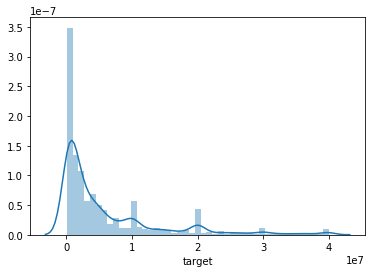
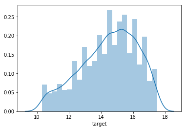

# **Santander Value Prediction Challenge - 1**

> ## Contact me
> Email -> <cugtyt@qq.com>, <cugtyt@gmail.com>  
> GitHub -> [Cugtyt@GitHub](https://github.com/Cugtyt)

---

[比赛主页](https://www.kaggle.com/c/santander-value-prediction-challenge)

---

读取train和test，维度分别为：

``` txt
> train (4459, 4993)
> test (49342, 4992)
```

可见test比train大很多，最主要的是属性维度比数据量大。看下**target的分布**：

``` python
sns.distplot(train_df.target)
```



偏的较多，用**log**看下：

``` python
>>> sns.distplot(np.log(train_df.target))
```



看起来好一点了。看下**缺失值**：

``` python
train_df.isnull().sum().sum()

> 0
```

没有缺失值。看下有没有全0的列：

``` python
all_0_cols = []

for c in train_df.columns:
    if train_df[c].any() == False:
        all_0_cols.append(c)

all_0_cols

> ['d5308d8bc', 'c330f1a67', 'eeac16933', '7df8788e8', '5b91580ee', '6f29fbbc7', '46dafc868', 'ae41a98b6', 'f416800e9', '6d07828ca', '7ac332a1d', '70ee7950a', '833b35a7c', '2f9969eab', '8b1372217', '68322788b', '2288ac1a6', 'dc7f76962', '467044c26', '39ebfbfd9', '9a5ff8c23', 'f6fac27c8', '664e2800e', 'ae28689a2', 'd87dcac58', '4065efbb6', 'f944d9d43', 'c2c4491d5', 'a4346e2e2', '1af366d4f', 'cfff5b7c8', 'da215e99e', '5acd26139', '9be9c6cef', '1210d0271', '21b0a54cb', 'da35e792b', '754c502dd', '0b346adbd', '0f196b049', 'b603ed95d', '2a50e001c', '1e81432e7', '10350ea43', '3c7c7e24c', '7585fce2a', '64d036163', 'f25d9935c', 'd98484125', '95c85e227', '9a5273600', '746cdb817', '6377a6293', '7d944fb0c', '87eb21c50', '5ea313a8c', '0987a65a1', '2fb7c2443', 'f5dde409b', '1ae50d4c3', '2b21cd7d8', '0db8a9272', '804d8b55b', '76f135fa6', '7d7182143', 'f88e61ae6', '378ed28e0', 'ca4ba131e', '1352ddae5', '2b601ad67', '6e42ff7c7', '22196a84c', '0e410eb3d', '992e6d1d3', '90a742107', '08b9ec4ae', 'd95203ded', '58ad51def', '9f69ae59f', '863de8a31', 'be10df47c', 'f006d9618', 'a7e39d23d', '5ed0abe85', '6c578fe94', '7fa4fcee9', '5e0571f07', 'fd5659511', 'e06b9f40f', 'c506599c8', '99de8c2dc', 'b05f4b229', '5e0834175', 'eb1cc0d9c', 'b281a62b9', '00fcf67e4', 'e37b65992', '2308e2b29', 'c342e8709', '708471ebf', 'f614aac15', '15ecf7b68', '3bfe540f1', '7a0d98f3c', 'e642315a5', 'c16d456a7', '0c9b5bcfa', 'b778ab129', '2ace87cdd', '697a566f0', '97b1f84fc', '34eff114b', '5281333d7', 'c89f3ba7e', 'cd6d3c7e6', 'fc7c8f2e8', 'abbbf9f82', '24a233e8f', '8e26b560e', 'a28ac1049', '504502ce1', 'd9a8615f3', '4efd6d283', '34cc56e83', '93e98252a', '2b6cef19e', 'c7f70a49b', '0d29ab7eb', 'e4a0d39b7', 'a4d1a8409', 'bc694fc8f', '3a36fc3a2', '4ffba44d3', '9bfdec4bc', '66a866d2f', 'f941e9df7', 'e7af4dbf3', 'dc9a54a3e', '748168a04', 'bba8ce4bb', 'ff6f62aa4', 'b06fe66ba', 'ae87ebc42', 'f26589e57', '963bb53b1', 'a531a4bf0', '9fc79985d', '9350d55c1', 'de06e884c', 'fc10bdf18', 'e0907e883', 'c586d79a1', 'e15e1513d', 'a06067897', '643e42fcb', '217cd3838', '047ebc242', '9b6ce40cf', '3b2c972b3', '17a7bf25a', 'c9028d46b', '9e0473c91', '6b041d374', '783c50218', '19122191d', 'ce573744f', '1c4ea481e', 'fbd6e0a0b', '69831c049', 'b87e3036b', '54ba515ee', 'a09ba0b15', '90f77ec55', 'fb02ef0ea', '3b0cccd29', 'fe9ed417c', '589e8bd6f', '17b5a03fd', '80e16b49a', 'a3d5c2c2a', '1bd3a4e92', '611d81daa', '3d7780b1c', '113fd0206', '5e5894826', 'cb36204f9', 'bc4e3d600', 'c66e2deb0', 'c25851298', 'a7f6de992', '3f93a3272', 'c1b95c2ec', '6bda21fee', '4a64e56e7', '943743753', '20854f8bf', 'ac2e428a9', '5ee7de0be', '316423a21', '2e52b0c6a', '8bdf6bc7e', '8f523faf2', '4758340d5', '8411096ec', '9678b95b7', 'a185e35cc', 'fa980a778', 'c8d90f7d7', '080540c81', '32591c8b4', '5779da33c', 'bb425b41e', '01599af81', '1654ab770', 'd334a588e', 'b4353599c', '51b53eaec', '2cc0fbc52', '45ffef194', 'c15ac04ee', '5b055c8ea', 'd0466eb58', 'a80633823', 'a117a5409', '7ddac276f', '8c32df8b3', 'e5649663e', '6c16efbb8', '9118fd5ca', 'ca8d565f1', '16a5bb8d2', 'fd6347461', 'f5179fb9c', '97428b646', 'f684b0a96', 'e4b2caa9f', '2c2d9f267', '96eb14eaf', 'cb2cb460c', '86f843927', 'ecd16fc60', '801c6dc8e', 'f859a25b8', 'ae846f332', '2252c7403', 'fb9e07326', 'd196ca1fd', 'a8e562e8e', 'eb6bb7ce1', '5beff147e', '52b347cdc', '4600aadcf', '6fa0b9dab', '43d70cc4d', '408021ef8', 'e29d22b59']
```

看起来很多列全为0，那就可以把他们去掉了：

``` python
target = train_df.target
train_df.drop(columns=['target', 'ID'] + all_0_cols, inplace=True)
```

现在的train的shape：

``` txt
> (4459, 4735)
```

属性还是太多，通过PCA降维试一下：

``` python
from sklearn.decomposition import PCA

pca = PCA(n_components = 0.95)
train_reduced = pca.fit_transform(train_df)

train_reduced.shape

> (4459, 602)
```

先尝试下SVM：

``` python
from sklearn.model_selection import cross_val_score
from sklearn.pipeline import Pipeline
from sklearn.preprocessing import StandardScaler
from sklearn.svm import LinearSVR, SVR
from sklearn.metrics import mean_squared_log_error, make_scorer
```

线性svr：

``` python
svm_reg = Pipeline((
    ("scaler", StandardScaler()),
    ("linear_svr", LinearSVR()),
))
scores = cross_val_score(svm_reg, train_reduced, target, scoring=make_scorer(mean_squared_log_error), cv=10)
rmsle = np.sqrt(scores)
rmsle

> array([6.58966901, 6.47101027, 6.3749409 , 6.41774659, 6.39803573,
       6.50664084, 6.356576  , 6.46035773, 6.5336917 , 6.23777155])
```

svr：

``` python
svm_reg2 = Pipeline((
    ("scaler", StandardScaler()),
    ("svr", SVR()),
))
scores2 = cross_val_score(svm_reg2, train_reduced, target, scoring=make_scorer(mean_squared_log_error), cv=10)
rmsle2 = np.sqrt(scores2)
rmsle2

> array([1.67985457, 1.72809434, 1.77034988, 1.8015216 , 1.73754201,
       1.71594148, 1.75286963, 1.71252816, 1.85409835, 1.81486843])
```

看起来好了不少。由于目前前50名已经在有0.62以内的分数，还需要继续做。

然后我们试一取log后的target：

``` python
svm_reg4 = Pipeline((
    ("scaler", StandardScaler()),
    ("svr", SVR()),
))
scores4 = cross_val_score(svm_reg4, train_reduced, np.log(target), scoring=make_scorer(mean_squared_log_error), cv=10)
rmsle4 = np.sqrt(scores4)
rmsle4

> array([0.10512902, 0.11028229, 0.1165196 , 0.11288458, 0.10872635,
       0.10497934, 0.11209608, 0.10805128, 0.11798833, 0.11809618])
```

发现好了不少，说明用target还是很有效的，提交结构后发现分数是1.7，后面我们再继续尝试其他方法。