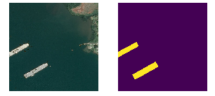
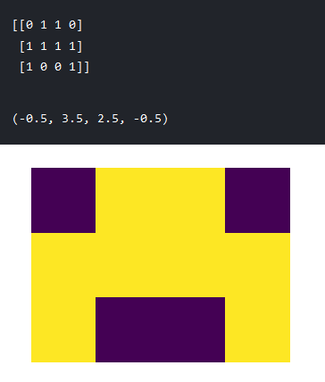
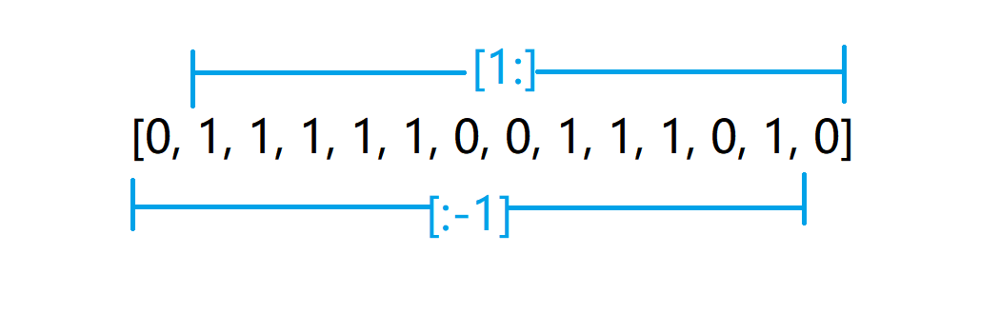
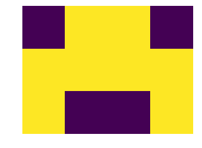

# run-length 编码和解码

## Contact me

* Blog -> <https://cugtyt.github.io/blog/index>
* Email -> <cugtyt@qq.com>, <cugtyt@gmail.com>
* GitHub -> [Cugtyt@GitHub](https://github.com/Cugtyt)

---

本文的代码来自于[Run-Length Encode and Decode paulorzp](https://www.kaggle.com/paulorzp/run-length-encode-and-decode)。

这个run-length是一个数值只取0和1的二维矩阵，一般的用途是描述图像的mask，比如：



看一下简单的内容和图像的对应：



这里先贴出编码和解码的代码，[代码来源](https://www.kaggle.com/paulorzp/run-length-encode-and-decode)：

``` python
def rle_encode(img):
    '''
    img: numpy array, 1 - mask, 0 - background
    Returns run length as string formated
    '''
    pixels = img.flatten()
    pixels = np.concatenate([[0], pixels, [0]])
    runs = np.where(pixels[1:] != pixels[:-1])[0] + 1
    runs[1::2] -= runs[::2]
    return ' '.join(str(x) for x in runs)
 
def rle_decode(mask_rle, shape):
    '''
    mask_rle: run-length as string formated (start length)
    shape: (height,width) of array to return 
    Returns numpy array, 1 - mask, 0 - background

    '''
    s = mask_rle.split()
    starts, lengths = [np.asarray(x, dtype=int) for x in (s[0:][::2], s[1:][::2])]
    starts -= 1
    ends = starts + lengths
    img = np.zeros(shape[0]*shape[1], dtype=np.uint8)
    for lo, hi in zip(starts, ends):
        img[lo:hi] = 1
    return img.reshape(shape)
```

我们用上面的简单例子来一步步分析编码和解码的过程：

## 编码

* 定义mask：

``` python
mask = np.array([
    [0, 1, 1, 0], 
    [1, 1, 1, 1],
    [1, 0, 0, 1]
])
```

mask的图像就是上方那个简单的图像。

* 扁平化
``` python
mask.flatten()

> array([0, 1, 1, 0, 1, 1, 1, 1, 1, 0, 0, 1])
```

* 首尾加0

``` python
np.concatenate([[0], mask, [0]])

> array([0, 0, 1, 1, 0, 1, 1, 1, 1, 1, 0, 0, 1, 0])
```

* 每个元素与前一个元素比较，找到不同的位置

``` python
runs = np.where(mask[1:] != mask[:-1])[0] + 1

> array([ 2,  4,  5, 10, 12, 13])
```



* 作差，找到所有连续1的起始位置和个数

``` python
runs[1::2] -= runs[::2]

> array([ 2,  2,  5,  5, 12,  1])
```

至此，编码就完成了。

``` python
code = ' '.join(str(x) for x in runs)
```

注意到它这里的起始位置是从1开始算的

## 解码

* 从字符串中分割code成list

``` python
code = code.split()

> ['2', '2', '5', '5', '12', '1']
```

* 解出起始位置和个数

``` python
starts, lengths = [np.asarray(x, dtype=int) for x in (code[0:][::2], code[1:][::2])]

> (array([ 2,  5, 12]), array([2, 5, 1]))
```

* 因为python本身是从0开始计算的，所以减1取真实的起始位置和终点位置

``` python
starts -= 1
ends = starts + lengths
starts, ends

> (array([ 1,  4, 11]), array([ 3,  9, 12]))
```

* 最后一步，恢复元数据

``` python
decode_mask = np.zeros(3*4, dtype=np.uint8)
for lo, hi in zip(starts, ends):
    decode_mask[lo:hi] = 1

> array([0, 1, 1, 0, 1, 1, 1, 1, 1, 0, 0, 1], dtype=uint8)
```

结果图：



总结起来就是记录所有连续1的起始位置和长度作为编码，解码依据这个记录恢复就好。