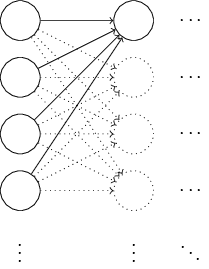
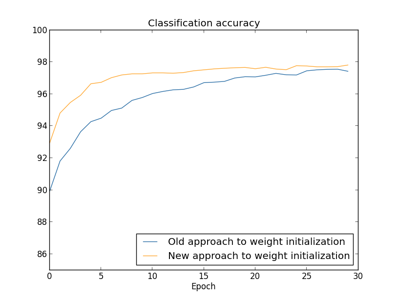

# **Michael Nielsen对weight初始化的解释**

> ### Contact me:  
> Email -> <cugtyt@qq.com>, <cugtyt@gmail.com>  
> GitHub -> [Cugtyt@GitHub](https://github.com/Cugtyt)

---

当我们创建一个神经网络时，我们必须选择weights和biases的初始化方式。我们目前的方式是让weights和biases都使用独立的高斯随机初始化，标准化为均值0，标准差1。这种方式工作得挺好，也挺特别，如果我们回头审视下它，也许能找到设置weights和biase更好的方式，帮助我们的神经网络学得更快。

的确我们可以做的比标准化高斯初始化更好。为了说明原因，假设我们有1000个输入神经元的神经网络。并且我们已经用标准化高斯初始化了连接第一隐层的weights。现在我们只关注输入神经元层和第一隐层间的weights，忽略掉其他部分：

为了简化，我们假设训练的输入x，x的一半输入神经元设为1，另一部分为0。下面的论证是普遍适用的，但是你可从这个特殊示例中明白大意。让我们假设输入到第一隐层的weights和。和中的500项消失了，因为对应的输入是0。因此z相当于是对总共的501项标准化的高斯随机数求和，包括500项weights和1项bias。z本身的分布也是均值为1，标准差为的高斯分布。也就是说z是非常宽的高斯分布，没有一点峰：

我们可以从图中看出来，`|z|`会非常大，无论z>>1还是z<<-1。如果是这样的话，输出隐层神经元输出σ(z)会非常接近于1或0。这意味着隐层神经元会饱和。这种情况发生时，weights变化会非常小，在隐层的激活部分更是十分小。反过来，隐层这种非常小的改变基本上不会改变网络的其他部分了，并且损失函数的改变也十分微小。结果就是，当我们使用梯度下降算法时这些weights会学习非常慢。不幸的是，对于饱和的隐层神经元，我们改变损失函数并没有帮助。

我已经讨论了第一隐层的输入weights。当然，后面的隐层也会是类似的：如果后面的隐层使用标准化高斯初始化，那么激活部分通常会非常接近0或1，学习依旧十分慢。

有没有什么方法选择更好的初始化方法，让我们消除这种饱和，也避免学习缓慢的问题？假设我们有个输入weights，然后我们使用均值为0，标准差为的高斯随机变量初始化weights，也就是我们把高斯分布向下挤压，让它不太容易使神经元饱和。我们继续让bias使用均值为0标准差为1的高斯分布，原因我一会再说。这种选择下，weights的和再一次是均值为0的高斯随机变量的和，但是相比之前出现更加尖锐的峰。假设，就像我们刚才做的，500个输入为0,500个输入为1，很容易看出z是均值为0，标准差为的高斯分布。比之前有一个更加尖锐的峰，即使相比之前我已经重新设置了纵轴，下图也低估了这种情形：

这种神经元就很难饱和了，也不容易出现学习缓慢的问题。

上面我说继续像原来那样初始化biases，使用均值为0，标准差为1的高斯分布。这没有太大问题，因为这不太会让神经元饱和。事实上，我们如何初始化biases对避免饱和问题没有太大关系。一些人初始化biases为0，依靠梯度下降学习合适的biases。但是这并没有太大区别，我们依旧使用原先的方法。

对比前后（30个隐层神经元）（略去一部分不影响理解的内容，使用MNIST数据集）：

两种情况下，我们都超过了96%的准确率。两种情况的准确率基本一样。但是新的初始化方法更快。在旧方法第一轮结束时，分类准确率只有87%，而新方法已经达到93%。新的方法让我们有更好的机制，更快地达到好的结果。100个隐层神经元也是相同的情形：

这种情况下，两个曲线不是特别相近。但是，实验表明多训练几个周期（没有展示出来）准确率基本就一样了。在这些实验的基础上，看来除了加快速度没有其他方面的改善。但是后续我们会看到的初始化方式会在长时间训练的神经网络上表现得更好。因此不仅是速度的提升，在最终性能上也会提升。

的初始化方式帮助神经网络学习得更好。提出的方法有很多，一些事建立在这个基本构想上面的。我不会展开，因为对于我们的目的来说已经够了。

---

其实这种初始化方式就是Xavier初始化，虽然没有明确提出，如果乘以sqrt(2)就是He初始化了。
