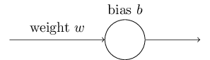
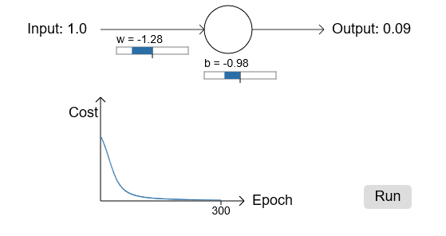
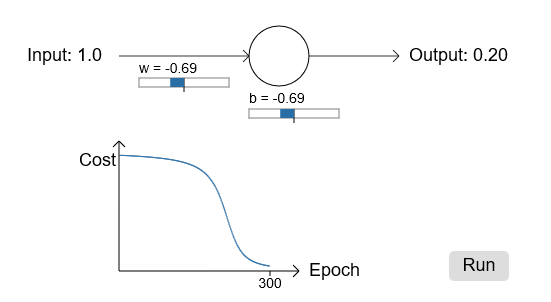
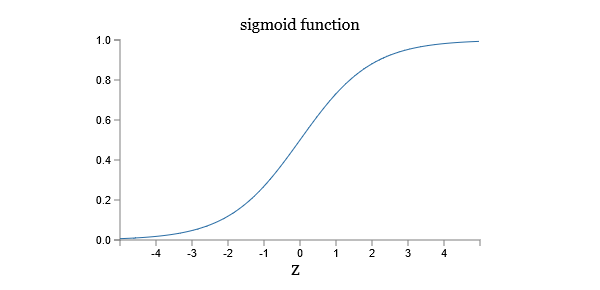

# **Michael Nielsen对交叉熵的解释（一）**

> ### Contact me:  
> Email -> <cugtyt@qq.com>, <cugtyt@gmail.com>  
> GitHub -> [Cugtyt@GitHub](https://github.com/Cugtyt)

---

- **Michael Nielsen对交叉熵的解释（一）**
- [**Michael Nielsen对交叉熵的解释（二）**](https://cugtyt.github.io/blog/ml-data/2018/201802092106)
- [**Michael Nielsen对交叉熵的解释（三）**](https://cugtyt.github.io/blog/ml-data/2018/201802092159)

---

我们被发现出错时会非常不舒服。刚开始学钢琴，我第一次在观众面前表演。我十分紧张，八个节拍弹得太慢。我不知道自己哪里弹错了，直到有人指出我的错误我才得以继续。十分尴尬，在我们错误很明显时我们学的也快。你可以确信后面一次表演我弹到了正确的调子上！但是错误不清楚时，我们学的很慢。

理想情况下，我们希望神经网络从错误中学得很快。实际中会发生吗？为了回答这个问题，让我们看一个小例子。这个例子是只有一个输入的神经元：

我们训练这个神经元做一件极其简单的事情：输入1输出0。当然，这种小事我们可以轻松地手动找出合适的weight和bias，不用借助任何算法。但是，这对梯度下降尝试学习weight和bias是个启发。让我们看下这个神经元如何学习。

为了更明确，我挑了初始weight为0.6，初始bias为0.9。这是平常的值，我也没有特殊的含义。初始输出是0.82，所以和我们期望的输出0.0还有较大差距。下图显示了这个学习结果，学习速率为0.15：

正如你看到的，损失函数下降，神经元很快学习了weight和bias，并给出了输出0.09。虽然不是期望的0.0，但是很不错了。假设，我们选择初始weight和bias为2.0。这种情况下初始输出为0.98，错的很严重，我们看下结果：

虽然学习速率一样为0.15，但我们看到开始时非常慢。事实上在开始的150左右的周期内，weights和biases没什么变化，接着学习就如同原先一样迅速接近0.0了。

这和人类学习相比很奇怪。正如我在开始时候说的，我们错的越严重，学习的越快。但是神经元在错误很多时学习有很多困难——错误小的时候困难更大。另外，这种情况并不是只在这个简单的模型中出现，通常的网络都有这个问题。为什么学习如此之慢，我们能找到方法来避免吗？

为了理解前面的问题，考虑我们的神经元通过损失函数的偏导和所决定的速率改变weight和bias，所以学习慢意味着偏导数小。让我们下计算偏导，回想我们使用二次损失函数，也就是：

此处a表示x=1时神经元的输出，y=0表示相关的期望输出。为了表示weight和bias更明显些，代入，，使用链式法则我们得到：

注意等式右边，函数形状为:

可以看到输出接近1时，曲线变得非常平滑，所以会非常小。上面的等式告诉我们偏导数和也因此变得很小。这就是学习变慢的缘由。另外，这也是通常神经网络学习变慢的原因，不是仅仅这个小模型的问题。