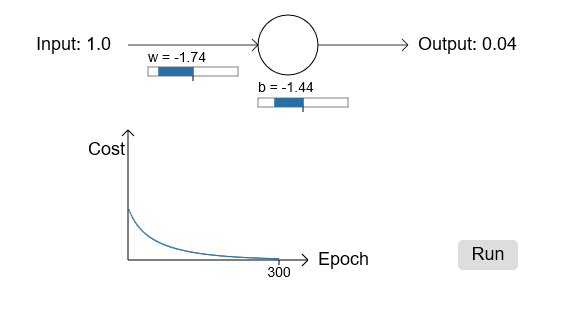
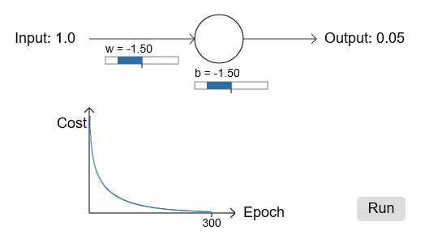

# **Michael Nielsen对交叉熵的解释（三）**

> ### Contact me:  
> Email -> <cugtyt@qq.com>, <cugtyt@gmail.com>  
> GitHub -> [Cugtyt@GitHub](https://github.com/Cugtyt)

---

- [**Michael Nielsen对交叉熵的解释（一）**](https://cugtyt.github.io/blog/ml-data/2018/201802092000)
- [**Michael Nielsen对交叉熵的解释（二）**](https://cugtyt.github.io/blog/ml-data/2018/201802092106)
- **Michael Nielsen对交叉熵的解释（三）**

---

让我们回到最开始那个小模型上，探索下使用交叉熵损失函数替代掉二次损失函数后发生了什么。我们还是以二次损失函数做的不错的地方开始，weight设置为0.6，bias设置为0.9，损失函数变为交叉熵：

不出所料，神经元学习得很不错，和原来一样。让我们看下原来神经元卡住的地方，weight和bias从2.0开始：

成功了！这次神经元学习如我们期望学习得很快。如果你更近距离观察，你会发现损失曲线比二次损失的曲线更陡峭一些。这是交叉熵带给我们的，避开了我们本希望神经元学习更快却卡住的地方。

我还没说学习率的事，前面二次损失函数，我们使用0.15，我们应该在此处使用同样的学习率吗？事实上，不可能说“同样”的学习率了，这就像苹果和橘子一样不同。两个损失函数我通过实验寻找了可以看清发生了什么的学习率，如果你还是好奇，我还是告诉你这里我使用了0.005的学习率。

你也许会说学习率不同导致上面的实验没有意义了。当我们开始的学习率不固定时，谁还关心神经元学习多快呢？但是这样的说法遗漏了一点，就是这个图不是关于学习的绝对速度，而是关于速度如何变化的。更具体的讲，在实际输出和正确输出接近时，使用二次损失函数毫无疑问慢于后面的情况。当错的严重时，交叉熵也更快，这并不取决于学习速度。

我们已经学习了在一个神经元上使用交叉熵的情况，很容易扩展到多层多神经元的网络中。具体来说：假设期望的输出值，在最后一层的输出，然后我们定义交叉熵：

这和我们原来的表达式差不多，除了使用对所有输出神经元求和。不深究细节，这个表达式的确避免了学习变慢的问题。

也许我使用交叉熵让很多读者迷惑，尤其是和其他背景知识相冲突的人。很常见的做法是对两个概率分布定义交叉熵，和,那么交叉熵就是，这和我们最开始对单个神经元定义的一样。

但是，当在最后一层有很多sigmoid神经元时，激活向量通常不是一个概率分布。因此就不是很合适了，因为我们处理的不再是概率分布。但是，你可以把上面公式看作是每个神经元交叉熵的合集，每个神经元和它的激活看作是两元素的概率分布。在这种情况下，就是一个交叉熵对概率分布的泛化了。

什么时候使用交叉熵而不是用二次损失函数呢？事实上，在输出是sigmoid神经元情况下，交叉熵几乎总是更好的选择。考虑当我们设定神经网络时，我们通常使用随机化的方式初始化weights和biases。可能出现的情况是初始的结果对于训练输入来说错的离谱，比如输出应该是0却饱和在1的附近，或者反过来。如果我们使用二次损失去降低学习速度，它可能永远不会停下来，即使也在从其他输入中学习，但是总离期望太远。

**一些问题的解释：**

- 多层多神经元网络

在前面我们展示了对于二次损失函数，对weights的偏导为：

项导致无论何时输出神经元在错误值处饱和而学习缓慢。而交叉熵单个训练样本x输出的错误是：

这个表达式说明输出层对weights的偏导是：

消失了，因此交叉熵避免了学习变慢的问题，这不仅仅是在单个神经元上，对多层多神经元网络也是适用的。对bias同样成立。

- 当输出层使用线性神经元时，使用二次损失函数

假设我们有多层多神经元网络，最后一层所有神经元是线性神经元，也就是输出为，如果我们使用二次损失函数的话，单个神经元的输出错误是：

那么和前面的问题一样，对weights和biases的偏导为：

因此，对于线性输出神经元来说二次损失并没有什么问题。在这种情况下，二次损失函数是个合适的选择。
