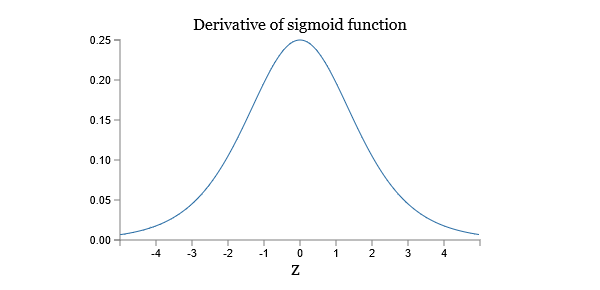
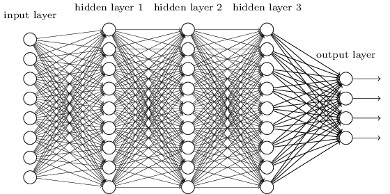

# **Michael Nielsen对梯度消失的解释（二）**

> ### Contact me:  
> Email -> <cugtyt@qq.com>, <cugtyt@gmail.com>  
> GitHub -> [Cugtyt@GitHub](https://github.com/Cugtyt)

---

为了理解为什么梯度消失问题会出现，我们先考虑最简单的深度神经网络：每层只有一个神经元。这是一个三隐层网络：

表示weights，表示biases，C是损失函数。第j个神经元的输出是,是加权输入。损失函数C是网络的输出的函数：如果实际输出接近期望输出，损失函数很小，如果相差很远，损失函数很大。

继续说第一隐层的梯度，通过这个表达式我们会理解为什么梯度消失的问题会出现。

先看的表达式，看起来有点可怕，但这的确是个简单的结构：

想象我们在上一个小的变化，这回导致一系列的变化。首先第一隐层神经元的输出变化，然后第二隐层的加权输入变化，第二隐层的输出变化，一直到损失函数变化，我们有：

因此我们可以小心的跟踪每一步观察的变化。

首先思考是如何导致第一隐层输出变化的，我们有，因此：

这一项和产生了激活输出变化，这个变化反过来导致第二隐层的加权输入变化：

结合和，我们看的变化影响到：

我们可以继续做下去，跟踪剩下的改变。最后的表达式是：

除以得到：

**为什么梯度消失问题出现**？让我们写出完整的表达式：

除了最后一项，表达式是多个形如的积，我们看下的图像：

导数最大值为。现在如果我们使用均值为0，方差为1的高斯分布初始化weights，weights通常满足，放在一起，项通常满足，把这些项乘起来，结果就会指数级的减小：项越多，积越小。这就是梯度消失的一个可能解释了。

为了更明显些，让我们比较和：

这两个表达式有很多共同的部分，但是上面的表达式多两个项，因此通常是的1/16，也就是梯度消失的源头。

当然这是一个非正式的论点，并非严格证明梯度消失问题将会发生。有几个可能的例外，我们可能会怀疑weights可以在训练期间增长。发生时不再满足，如果这些项足够大（大于1）那么就会出现梯度爆炸的问题。

**梯度爆炸问题**：让我们看一个梯度爆炸出现的例子，这个例子是人为的：我将会调整参数让梯度爆炸出现。即便是人为的，它也可以说明梯度爆炸的确会出现，而不是只有理论可能。

两步出现梯度爆炸，第一，选择很大的weights，比如，第二选择biases让项不要太小。很简单就做到了：我们只需要选择biases保证加权输入（因此），比如我们希望，可以设置，同样设定其他的biases，做完后，可以看到等于，我们这样就得到了梯度爆炸。

**梯度不稳定问题**：这里的根本问题不是梯度消失和梯度爆炸。因为前面层是后面层各项的乘积，当层数很多时，就会有内在的不稳定情况。所有层次都能以接近相同的速度学习的唯一方法是乘积项接近平衡。因为没有这种平衡发生的机制或内在原因，发生这种情况的可能性就是随机的。简而言之，这里真正的问题是神经网络存在一个不稳定的梯度问题。如果我们使用标准的基于梯度的学习方法，网络中的不同层次将倾向于以非常不同的速度学习。

**梯度消失的普遍性**：我们已经接触了梯度消失和梯度爆炸，事实上，使用sigmoid通常是梯度消失。考虑表达式，为了避免梯度消失，我们需要。你也许会认为当w很大时很容易发生，但是要困难得多。原因是依赖于w：。所以当我们让w很大，我们需要很小心的注意没有同时让变小。限制很多，因为w很大很容易wa+b很大，就会很小。避免的唯一方法是激活输入落入非常小的范围内，有时候会发生，但是通常不会，因此通常我们遇到的是梯度消失。

我们已经看到了简单网络，那多层多神经元的深度网络呢？

事实上基本一致，第l层网络的梯度为：

是一个对角矩阵，他的项是加权输入的值。是不同层的weights矩阵。是C对输出激活的偏导向量。

这比原来的简单神经元复杂多了。但是基本形式还是相似的，很多项，对角上的值也不会大于1*4,。只要不是太大，会让梯度变小，导致梯度消失。更一般的，乘积项多会出现梯度不稳定，结果就是导致了学习缓慢。这个缓慢不是意外：这是学习中的一个基本情况。