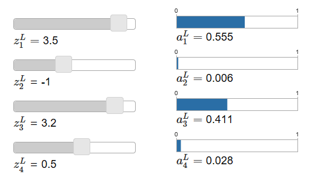
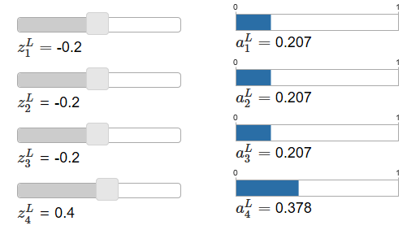

# **Michael Nielsen对softmax的解释**

> ### Contact me:  
> Email -> <cugtyt@qq.com>, <cugtyt@gmail.com>  
> GitHub -> [Cugtyt@GitHub](https://github.com/Cugtyt)

---

前面（请看本系列前面的文章）我们基本上时用交叉熵解决了学习缓慢的问题，但是我想明确的描述另一个解决该问题的方法，也就是所谓的softmax。

softmax的思路是为输出层定义一个新类型。开始时就像sigmoid层一样，把加权后的输入加起来，但是后面我们不使用sigmoid函数获得输出，而是使用softmax函数，在这个函数中第j个输出的神经元的激活是：

在分母上我们把所有的输出求和。

这个函数让人困惑，不容易想到为什么我们要用这个函数。一下子也不好看出来它为什么会帮我们解决学习缓慢的问题。为了更好的理解它，假设我们的网络有四个输出神经元，记作，下面是两个个示例图（**译者**:主要是说明z和a的变化关系，softmax可以放大差异）：

当你增大，也会跟着增大，而其他会减小。相似的，减小会减小，增大其他。事实上，如果你看仔细点，四个相互之间是补偿关系，因为他们的和为1：

因此，如果增加，其他输出的激活因为总和为1的原因而减小。当然，其他的也是。

softmax的式子也说明了所有输出的激活是正的，因为指数函数是正的。结合上图观察，我们发现softmax输出层是一组和为1的正数。也就是说，softmax的输出层可以被看作概率分布。

这是很好的一点，很多问题中，把激活输出看作对正确输出是j的概率是非常方便的。例如，在MNIST分类问题中，我们可以把看作是网络预测分类结果是j的概率。

作为对比，如果输出层是sigmoid层，我们当然不能假设激活输出是概率分布，这里我就不证明了。同样在sigmoid中我们也不能对输出激活做这样的类比。

我们开始建立起一些感性认识，再来回顾下，公式的指数部分保证了激活输出是正的，并且和为1。自然我们可以认为激活输出是概率分布，你可以把softmax认为是的缩放，把他们放在一起组成了概率分布。

**反转softmax层**

假设我们的神经网络输出层是softmax，激活是已知的。那对后面应的加权输入形式应该是，C是独立于j的。

**学习缓慢问题**

 我们已经熟悉了softmax层，但是我们还没有说学习缓慢的问题。为了理解，让我们定义对数似然损失函数，我们用x表示训练输入，y表示对应的期望输出，那么这个对数似然损失函数为：

例如，如果我们训练MNIST，输入7的图像，然后对数似然损失为。来看为什么这说得通，考虑网络预测很好的情况，也就是输出为7，那么它预测7的概率就非常接近1，损失函数就很小，反过来，如果网络预测不好，就很小，损失函数就很大，因此对数似然损失函数属于我们期望的损失函数。

那学习缓慢问题呢？为了分析它，回想学习缓慢的主要原因是偏导数和的情况，略去推导过程，我们得到：

这和我们前面交叉熵的分析得到的结果一样。同样，这保证我们没有了学习缓慢的问题，事实上，softmax层+对数似然损失与sigmoid+交叉熵损失十分相似。

由于这种相似性，我们该选哪个呢？其实这两个工作的都挺好。（略去不重要内容）