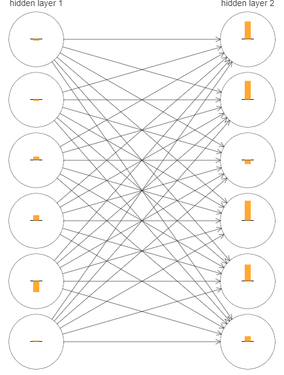
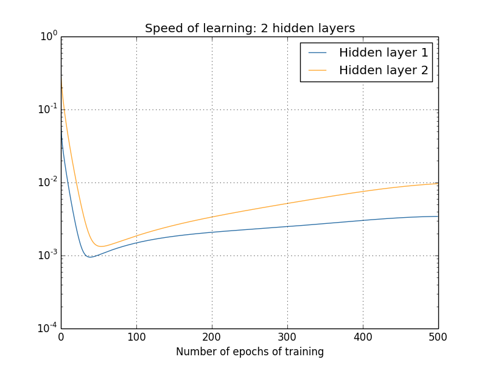
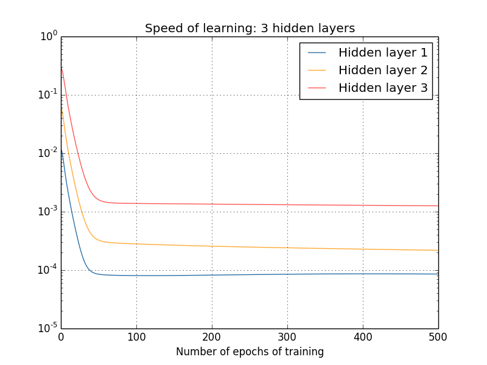
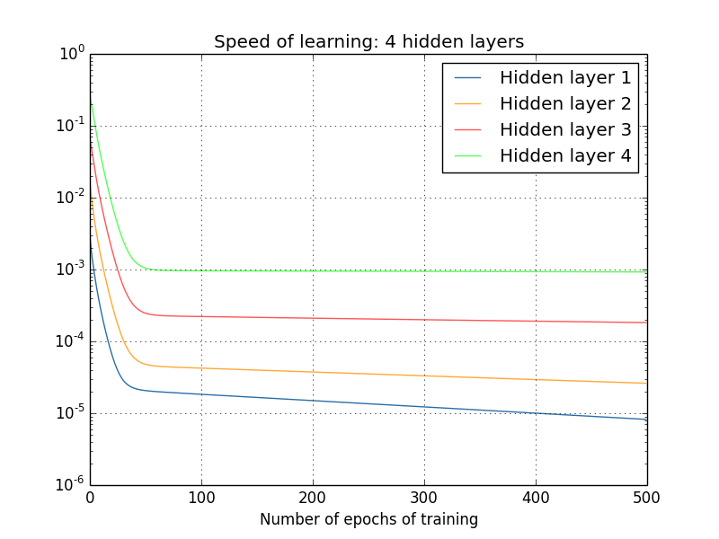

# **Michael Nielsen对梯度消失的解释（一）**

> ### Contact me:  
> Email -> <cugtyt@qq.com>, <cugtyt@gmail.com>  
> GitHub -> [Cugtyt@GitHub](https://github.com/Cugtyt)

---

当我们训练深度网络时出了什么问题？

为了回答这个问题，我们先重新看下只有一个隐层的神经网络，还是使用MNIST。

（网络有三层：784，30，10）

网络的输入层有784个神经元，对应于输入图像像素28*28=784。我们使用30个隐层神经元，10个输出神经元，对应于10个数字类别。

让我们训练30个完整周期，使用mini-batches一次训练10个样本，学习率0.1，正规化参数5.0，我们得到96.48的准确率，现在我们增加一个隐层，还是30个神经元，同样的参数训练（四层网络：784，30，30，10），达到96.57准确率，和原来的差不多，假如我们再加入一层（五层网络：784，30，30，30，10），准确率掉到96.53，这不是个明显的掉落，但是也足够让人灰心了。

有点奇怪，直觉上说，加入隐层应该让网络更加复杂，也应该分类的更好，至少新的隐层什么也不做也不应该更差，但其实不是这样。

所以发生了什么？让我们假设新的隐层在原理上的确有所帮助，问题是我们的学习算法没有找到合适的weights和biases。我们想找出其中出了什么问题，怎么变好。

我们看下网络时怎么学的，下面我画出了网络（四层：784，30，30，10）的一部分，图中每个神经元有一个小长条，表示学习有多快。越长表示学习的越快，越短表示越慢。准确来说，长条表示每个神经元的梯度，就是损失函数对biases的改变率。我们知道梯度控制了学习过程中biases和weights改变的快慢。

为了让图简单，我只是用了两个隐层中的上面6个神经元，略去了输入神经元，因为他们没什么weights和biases要学，输出也略去了，因为我们我们要在层之间比较，相同数量的神经元更方便。

我们使用了随机初始化，但是很明显看到第二个隐层的神经元基本都比第一层的变化快，因此第二隐层的神经元要更快些，这是巧合，还是通常情况？

有个比较两个隐层的整体方法对验证它很有帮助，让我们把第l层第j个神经元的梯度表示为，可以认为表示第一隐层学习多快，表示第二隐层学习多块。然后用长度表示每层学习的速度，例如的长度表示第一隐层的速度，表示第二隐层的速度。

这些定义下，我们发现,，所以这验证了：第二隐层比第一隐层学习快得多。

如果我们再加隐层呢？如果有三个隐层（5层：784，30，30，30，10），学习速度为0.012，0.060，0.283，再一次，前面隐层的学习慢于后面的隐层，如果再加一层，那就是0.003，0.017，0.070，0.285，所以说前面隐层学习慢于后面隐层的模式是站得住脚的。

我们已经看了训练开始时学习速度，那训练网络时变化的速度呢？让我们再看两个隐层的网络，学习变化的速度是这样的：

我是用1000个训练图片，批量梯度下降500周期得到这个结果。（略去不重要内容）

你可以看到两层开始于不同的速度，在反弹前下降非常快。但是整体来看，第一隐层比第二隐层慢得多。

更复杂点的网络呢？下面是个相似的情况，使用了三个隐层（784，30，30，30，10）：

结论是一样的，四层隐层呢？

这一次，第一隐层比最后的隐层慢了100倍。不用怀疑我们前面遇到的问题了！

观察到重要的一点：至少一些深度神经网络，梯度在反向上变小。这意味着前面的层比后面的层学习慢的多，我们已经在一个简单的网络上看出来了，这也是很多神经网络遇到的根本问题，这个现象称为**梯度消失问题**。

为什么梯度消失问题会出现？我们可以避免它吗？在训练深度神经网络时我们怎么解决它？事实上，我们等会儿会说到这是无法避免的，可用的方法也并不吸引人：有时候前面层的梯度会非常大！这称作**梯度爆炸问题**，并不比梯度消失问题好到哪去。一般来说，深度神经网络的梯度时不稳定的，在前面的层总是倾向于很大或很小。这也是深度神经网络基于梯度算法的根本性问题。

一个对梯度损失的反应是，这对我们来说的确是个问题吗？从神经网络跳出来，想象我们试着用数值方法最小化单变量函数，梯度很小不是个好消息吗？不是意味着我们已经接近了极值点吗？相似的，深度网络前面层梯度小意味着我们不需要对weights和biases做太多调整了吗？

当然并不是这样，回想我们使用随机方法初始化weights和biases，极不可能神经网络已经到达了我们希望的情况。具体而言，考虑网络（五层：784，30，30，30，10）第一层的权重，随机初始化意味着第一层丢弃了大部分输入图像的信息，后面层再怎么训练，他们也很难判别输入图像，因为他们没有足够的信息。故第一层不可能学到太多东西，如果你要训练深度网络，你应该试着去解决它。