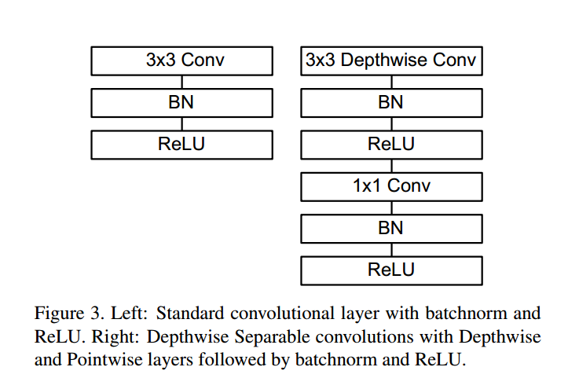

# MobileNets: Efficient Convolutional Neural Networks for Mobile Vision Applications

---
> ## Contact me
> Blog -> <https://cugtyt.github.io/blog/index>  
> Email -> <cugtyt@qq.com>, <cugtyt@gmail.com>  
> GitHub -> [Cugtyt@GitHub](https://github.com/Cugtyt)

---

> **本系列博客主页及相关见**[**此处**](https://cugtyt.github.io/blog/papers/index)  

---

<head>
    
    
</head>

## Abstract

提出MobileNets的高效网络，可用于移动端和嵌入式视觉设备。是基于流线型结构，使用深度可分（depthwise separable ）卷积来搭建的深度网络。介绍两个简单全局参数在准确和复杂（latency）两方面取得平衡。这些超参数可以使构建者为所应用的问题选择合适大小的模型。我们用大量资源和准确性权衡的实验展示了其强大的性能。我们也在大量应用和用例（目标检测、分类定位等）证明了有效性。

## Introduction

现在CNN很火，趋势是用更深和更复杂的网络来达到高准确率，但是这些优势对于网络在大小和速度方面是不怎么必要的。例如机器人，自动驾驶和增强现实等更需要在实时性和计算受限的平台运行。

## Prior Work

现在许多小的高效网络大致可以分为两类：压缩预训练网络和直接训练一个小网络。本文提出的架构可以让模型构建者为他们的应用选择满足资源要求的小网络。MobileNets主要考虑优化复杂度但是同样也是一个小网络。很多关于小网络的论文只关心大小不关心速度。

MobileNets首先从深度可分卷积到Inception模型来减少前几层的计算。扁平网络完全用全分解网络搭建并证明了极限分解网络的潜力。分解网络引入了相似的小分解卷积和拓扑连接。Xception网络证明了如何扩展深度可分滤波器从而超越InceptionV3。Squeezenet使用瓶颈（bottleneck approach）方式设计了一个很小的网络。另外还有结构传输网络和深度fried convnets。

一个获取小网络的不同的方法是衰减、重构或压缩与训练网络。基于乘积数字化（product quantization）、哈希、修剪、向量数字化和霍夫曼编码的压缩已经被发表。另外多种重构方式也被提出用于加速预训练网络。另一个训练小网络的方法是蒸馏，使用大网络教小网络。这是我们方法的补充，也被包括在一些用例里面。另一个新型方法是低比特网络。

## MobileNet Architecture

先描述基于深度可分（depthwise separable）滤波器的核心层，然后描述结构和两个模型衰减超参数：宽度乘子和分辨率乘子。

### Depthwise Separable Convolution

MobileNet基于深度可分卷积，深度可分卷积是一种分解卷积，把标准卷积分解为深度卷积和1\*1卷积（称为点卷积）。MobileNes的深度卷积是把单个滤波器用于每个输入通道上。点卷积然后用1\*1滤波器把深度卷积的结果结合起来。深度可分卷积分为两层，一个卷积一个结合。这个分解极大的减少了计算负荷和模型大小。图2展示了一个标准卷积分解为深度卷积和1\*1点卷积。

一个标准卷积层输入$D_F×D_F×M$特征图F，产出$D_G×D_G×N$特征图G，$D_F$是输入特征图的宽和高，M是输入通道数，$D_G$是输出特征图的宽和高，N是输出通道数。

标准卷积层被卷积核K参数化为$D_K×D_K×M×N$，$D_K$是核的维度，M和N如上。

标准卷积的输出特征图假设步长为1，填充计算如下：

$$G_{k,l,n} = \sum_{i,j,k} K_{i,j,m,n} \cdot F_{k+i-1,l+j-1,m}$$

标准卷积运算代价为：

$$D_K \cdot D_K \cdot M \cdot N \cdot D_F \cdot D_F$$

运算代价与输入通道数、输出通道数、核大小核特征图大小为乘性关系。MobileNet模型解决了这些项和他们间的相互作用。首先使用深度可分解卷积打破输出通道数和核大小的相互关系。

标准卷积操作用卷积核滤波把特征结合提取后输出新的表示。滤波和结合步骤可以通过使用分解卷积分为两步，极大减少运算代价。

深度可分卷积有两层：深度卷积和点卷积。我们使用深度卷积来做每个输入通道的单一滤波器。点卷积，就是简单的1\*1卷积，把深度卷积输出线性结合。MobileNets每层使用了batchnorm和ReLU。

每个输入通道一个滤波器的深度卷积可以写作：

$$\hat{G}_{k,l,m} = \sum_{i,j,m} \cdot F_{k+i-1, l+j-1,m}$$

K是$D_K × D_K × M$的深度卷积核，第$m_{th}$个滤波器作用到F第$m_{th}$个通道上，产出输出特征图G的第$m_{th}$个通道。

深度卷积运算代价是：

$$D_K \cdot D_K \cdot M \cdot D_F \cdot D_F$$

深度卷积与标准卷积相比非常高效。但是它只是滤波输入通道，并不把他们结合起来产生新通道，因此增加新的层用1\*1卷积计算线性结合来产生新的特征。

深度卷积的结合和1\*1的卷积称作可分卷积，深度可分卷积代价是：

$$D_K \cdot D_K \cdot M \cdot D_F \cdot D_F + M \cdot N \cdot D_F \cdot D_F$$

也就是深度卷积和点卷积的和。

把这两步放在一起我们得到节省的运算为：

$$\frac{D_K \cdot D_K \cdot M \cdot D_F \cdot D_F + M \cdot N \cdot D_F \cdot D_F}{D_K \cdot D_K \cdot M \cdot D_F \cdot D_F} = \frac{1}{N} + \frac{1}{D_K^2}$$

MobileNet使用3\*3深度可分卷积，可以比标准卷积省8-9倍，准确率只有一点影响。

### Network Structure and Training

MobileNet结构基于深度可分卷积，除了第一层是完全卷积。通过这样简单定义网络我们可以容易的探索拓扑结构而找到一个好的网络。MobileNet见表1。所有的层后是batchnorm和ReLU，这不包括最后的全连接层。图3对比普通卷积，batchnorm，ReLU和深度卷积，1\*1点卷积，batchnorm和ReLU。下采样在深度卷积中是用步长做的，第一层也一样。最后全连接层前的均值池化将分辨率降低到1。将深度卷积和点卷积分开来算，一共有28层。

乘加数量不足以简单的定义一个网络。还需要确保这些操作能高效实现。例如除非在高维空间，非结构化的稀疏矩阵运算并没有密矩阵快。我们的模型结构把基本所有运算转为1\*1卷积。这样可以使用优化的通用矩阵乘法general matrix multiply
(GEMM) 函数实现。通常GEMM实现卷积要求初始重排内存，称作im2col。1\*1卷积不要求这个重排，可以被最优线性代数算法GEMM直接实现。MobileNet加速了95%的1\*1卷积运算时间和75%的参数，见表2。基本上所有的其他参数在全连接层。

MobileNet在TensorFlow中使用与InceptionV3相似的带有异步梯度下降RMSprop训练。但是，我们不像训练大模型那样使用少量的正则化和数据增强，因为小模型不怎么过拟合。也没有使用side heads或label smoothing或通过限制大小减少图像的扭曲。另外，我们发现在深度滤波器加入微量或不加权重衰减（L2）非常重要，因为他们的参数非常少。

### Width Multiplier: Thinner Models

模型虽然已经很小了，但是一些应用要求更小更快。我们因此提出了一个简单的参数$\alpha$，叫做宽度乘子。作用是轻量化每个层。输入通道数M变成$\alpha M$，输出通道数变成$\alpha N$。

运算代价变成：

$$D_K \cdot D_K \cdot \alpha M \cdot D_F \cdot D_F + \alpha M \cdot \alpha N \cdot D_F \cdot D_F$$

$\alpha \in (0,1]$通常设为1，0.75，0.5，0.25等。1是标准，小于1减小模型。宽度乘子可以用在任何一个模型结构中，在准确率和复杂度直接权衡。

### Resolution Multiplier: Reduced Representation

第二个超参数是分辨率乘子$\rho$。我们把它用在输入图像和内部表示上。我们在实践中通过设置输入分辨率来隐式地设定它。

现在运算代价为：

$$D_K \cdot D_K \cdot \alpha M \cdot \rho D_F \cdot \rho D_F + \alpha M \cdot \alpha N \cdot \rho D_F \cdot \rho D_F$$

$\rho \in (0,1]$通常隐式地设置输入分辨率为224， 192， 160， 128。1是标准，小于1减小模型。分辨率乘子可以减少运算代价$\rho^2$。

表3显示了运算和参数数量的变化随着衰减方法的加入。

## Experiments

首先探索深度卷积和衰减网络宽度而不是层数的作用。然后显示两个超参数的作用。最后是在不同应用上的使用。

### Model Choices

先是深度可分卷积与完全卷积的结果。见表4，使用深度可分卷积比全卷积只减少了1%的准确率，计算负荷和参数数量得到了减少。

然后比较使用宽度乘子和使用较少层的结果。为了让MobileNet更弱，5层特征大小14\*14\*512可分滤波器去掉了。表5显示了相似的运算量和参数，MobileNets好3%。

### Model Shrinking Hyperparameters

表6显示了准确率，计算负荷和大小关于宽度乘子的权衡。

表7显示了准确率，计算负荷和大小关于分辨率乘子的权衡。

图4显示了$\alpha$为1，0.75，0.5，0.25和分辨率为224，192，160，128的16个模型在ImageNet的准确率和计算负荷的权衡。

图5显示了16个模型准确率和参数数量的权衡。

表8比较了MobileNet和GoogleNet、VGG16。MobileNet与VGG16准确率相似，小32倍，计算少27倍。比GoogleNet准确率更高，但是更小，计算少2.5倍。

表9比较了$\alpha=0.5$，分辨率160\*160分辨率的MobielNet，减小的MobileNet比AlexNet好4%，小45倍，计算少9.4倍。比Squeezenet好4%，大小相似，计算少22倍。

### Fine Grained Recognition

在斯坦福狗数据集上进行了训练，可以达到最好的结果，计算负荷和大小都极大的减小。

### Large Scale Geolocalizaton

### Face Attributes

### Object Detection

### Face Embeddings

## Conclusion

基于深度可分卷积提出了新的模型。探索了一些重要的设计从而引导了一个高效的模型。我们论证了如何用宽度乘子和分辨率乘子建立一个小而快的模型，在准确率和大小复杂度。和流行的模型比较证明了优秀的大小速度和准确率特性。在大量的任务中证明了其有效性。后面打算开放相应的TensorFlow模型。