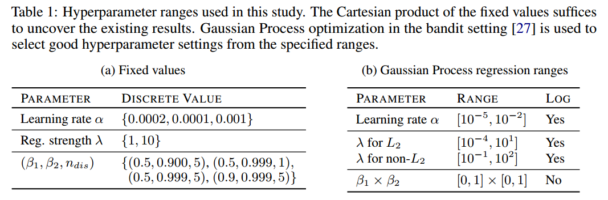

# The GAN Landscape: Losses, Architectures, Regularization, and Normalization

---
> ## Contact me
> Blog -> <https://cugtyt.github.io/blog/index>  
> Email -> <cugtyt@qq.com>, <cugtyt@gmail.com>  
> GitHub -> [Cugtyt@GitHub](https://github.com/Cugtyt)

---

> **本系列博客主页及相关见**[**此处**](https://cugtyt.github.io/blog/papers/index)  

---

<head>
    
    
</head>

## Abstract

GAN已经倍成功用于很多问题，但是训练很是个问题，还要求大量的超参数调整，网络结构调整，一些复杂的技巧。它的成功也伴随着质量难以衡量的问题，因此催生了大量损失方法、正则化、标准化和网络结构。我们将从实际的观点，讨论一些常见的问题。

## Introduction

GAN可以看作是双人博弈，生成器学习把简单的输入分布转换到图像空间，使得判别器无法判断是哪个分布。

GAN需要解最小化最大问题（minimax）问题，由于通常用卷积网络，所以这个问题很难解。因此很多损失函数、正则化、标准化、网络结构被提出，一些是基于理论，一些事受实践启发。

我们定义了GAN地形（landscape）：损失函数、正则化、标准化、常用的网络结构的集合。分析损失函数，我们发现不饱和函数在不同的数据集、结构和参数上非常稳定。梯度惩罚和谱标准化在高容量结构中有用。标准化和正则化的结合更好。最好我们讨论了常见的陷阱，可再现的问题和实践中的建议。

## The GAN Landscape

### Loss Functions

令P表示真实分布，Q表示模型分布。原始的GAN建议两种损失函数：最小化最大GAN和不饱和（NS）GAN。前面是判别器最小化二分类问题的对数似然，等价于P和Q的JS散度。后者是生成器最大化生成样例为真的概率。两个分别为：

我们已知后者比前者好，因此使用后者。

在Wasserstein GAN (WGAN)中，提出了最小化P和Q的Wasserstein距离，缺点是为了KR二象性（Kantorovich-Rubenstein duality）必须保证判别器的1-Lipschitz。为了达到这个目的，判别器的权重修剪到一个小的绝对值，对应的损失函数是：

最好我们考虑最小平方损失（LS）来最小化P和Q的Pearson$\chi ^2$散度，它的直觉是损失函数是光滑的，比JS形式的交叉熵饱和慢一些。对应的式子是：

### Regularization and Normalization of the Discriminator

#### 梯度标准化惩罚

在Wasserstein GANs中这个损失可以解释为违反1-Lipschitzness (WGAN GP)的软损失。因此梯度是在训练点和生成样本间线性插值上求值。梯度标准化不仅仅是判别器的正则化项，还可以提升其他损失的性能，不只是WGAN。这个损失也可以扩展到判别器在f散度上的“信心”。梯度惩罚正则化的一个缺陷是它取决于训练时变化的模型分布Q。FRAGAN的是不好定义流形。计算梯度标准化需要很多时间，基本上是两倍运行时间。我们也研究了正则化在监督学习的普遍性-L2惩罚。

### 判别器标准化

从优化观点来看，一些方法如Batch normalization [13] and Layer normalization (LN)已经引入GAN。BN把每层的节点标准化到均值$\beta$和方差$\gamma$上。标准化分别作用在batch和节点级别上。而LN所有层的单元使用相同的$\beta$和$\gamma$，但是不同的样本标准化的不同的。

从表示观点来看，我们必须把神经网络看作是映射的集合，从分析它的谱属性。判别器一个有界的线性算子足以控制最大奇异值。

### Generator and Discriminator Architecture

我们探索了两种结构：深度卷积GAN（DCGAN）和残差网络（ResNet）。**DCGAN**把GAN的想法扩展到图像生成的深度卷积网络。生成器和判别器都是5层网络。**ResNet19**是5个残差块的生成器和6个残差块的判别器。

### Evaluation Metrics

#### Inception Score (IS)

提供了一个量化生成样本质量的方法。有意义的样本条件标签分布应该有低的熵，可变性应该高，可表示为：

不足是对先验分布不敏感，并且不是一个合适的距离。

#### Frechet Inception Distance (FID)

P和Q的样本先嵌入一个特征空间 (a specific layer of InceptionNet)，然后假设它服从多元高斯分布，均值和方差可估，最后计算这两个高斯分布的Fréchet距离：

作者说FID和人类的判断是一致的，比IS更抗噪。另外，这个分数对生成样本的视觉质量敏感--在生成样本中加入噪声和人工数据会削弱它。与IS相比，FID可以检测类间模式丢失，也就是，一个模型一个类只生成一张图片可以有好的IS，但是坏的FID。

#### Multi-scale Structural Similarity for Image Quality (MS-SSIM) and Diversity

GAN的致命问题是模式坍塌和模式丢失--不能捕捉模式或者给定模式生成样本的多样性差。MS-SSIM是用来衡量两张图片的相似性，分数越高越相似。缺陷是我们不知道生成样本对应的类别，因此他可以用在单类中。

### Data Sets

CIFAR10, CELEBA-HQ-128, and LSUN-BEDROOM。

### Exploring the GAN Landscape

GAN的探索空间非常高：把所有的损失、标准化、正则化和结构探索完不可行。我们选取了一些部分。在3.1只改变损失，3.2只改变正则化和标准化，3.3只改变结构。

表1包含了“好”的参数，和高斯过程的老虎机设置。我们运行了12轮，每轮在前面轮中基于FID选10个超参数集。使用Adam优化器。

## Results and Discussion

每个实验我们关注3个方面：（1）top 5%的FID分布，（2）相关样本的多样性分数，（3）FID衡量的计算负荷和模型质量的取舍。

### 3.1 Impact of the Loss Function

损失函数是NS，LS和 Wasserstein loss (WGAN)。使用ResNet19的生成器和判别器（表3），使用了梯度惩罚，谱标准化。在 CELEBA-HQ-128 and LSUN-BEDROOM 用表1的超参数设置。

结果如图2，我们发现非饱和损失稳定，谱标准化提升了模型的质量，梯度惩罚也提升了质量，但是好的正则化不容易，需要高计算负荷。使用GP惩罚可以让判别器和生成器分别好5：1。

### 3.2 Impact of Regularization and Normalization

损失固定为不饱和损失，使用ResNet19，考虑了Batch normalization (BN), Layer normalization
(LN), Spectral normalization (SN), Gradient penalty (GP), Dragan penalty (DR) or L2
regularization.

结果如图2所示，我们观察到BN降低了性能，其次，梯度惩罚有帮助，但是训练不稳定，实际上损失和正则化不容易操作。谱标准化提升了模型质量，比梯度惩罚计算效率更高。与损失实验相似，使用GP惩罚使判别器和生成器有5：1的提升。在另外的分离实验中，我们发现附加的100K步优化过程可能增加了带GP惩罚模型的性能。

**Impact of Simultaneous Regularization and Normalization**。正则化和标准化是否如期望的那样提升模型质量，我们固定损失为非饱和损失，使用ResNet结构，加入了一些标准化和正则化方法。如图3，我们发现我们可以从正则化和标准化中受益，但是FID的提升需要大量的计算投入，如果有足够的计算资源，我们更愿意把正则化、标准化、谱标准化、LN都放进去。

### 3.3 Impact of Generator and Discriminator Architectures

我们的发现是否在不同的模型容量也适用。我们选择了DCGAN类型的结构，在非饱和GAN损失、梯度惩罚和谱标准化上进行了实验。对于小的结构，梯度惩罚不必要，但是，正则化和标准化的影响随着更深的结构和优化稳定性更重要。

如图4，我们发现结构都因正则化和标准化收益，谱标准化表现十分突出。

## 常见的陷阱

- Metrics. We argue that FID should be computed with respect to the test data set [18] and use 10000 test samples and 10000 generated samples on CIFAR10 and LSUN-BEDROOM, and 3000 vs 3000 on CELEBA-HQ-128.

- Details of neural architectures. we suggest to use the architectures presented within this work as a solid baseline.

- Data sets. The authors usually don’t bother to mention how precisely was the data set scaled down or up, which introduces inconsistencies between results on the “same” data set.

- Implementation details and non-determinism.  The authors usually don’t bother to mention how precisely was the data set scaled down or up, which introduces inconsistencies between results on the “same” data set

## Conclusion

我们研究了：损失函数、正则化、标准化、网络结构和他们对生成样本质量的影响，质量用一些量化方式来衡量。我们的研究建议在应用新数据集时应该考虑非饱和损失，谱标准化作为默认选项，有多余的计算资源，建议加入梯度惩罚并训练模型直到收敛。另外，结合正则化和标准化可以获得一些提升。相关类型的结构表现差不多好。一些ResNet上机器的附件实验不应该在高计算负荷时使用。我们也叙述了阻挡准确率、公平比较的陷阱。