# Are GANs Created Equal? A Large-Scale Study

---
> ## Contact me
> Blog -> <https://cugtyt.github.io/blog/index>  
> Email -> <cugtyt@qq.com>, <cugtyt@gmail.com>  
> GitHub -> [Cugtyt@GitHub](https://github.com/Cugtyt)

---

> **本系列博客主页及相关见**[**此处**](https://cugtyt.github.io/blog/papers/index)  

---

<head>
    
    
</head>

## Abstract

GAN的相关研究如火如荼，我们对于目前先进的模型和衡量方法做了一个中立的、多角度的、大范围的实验。我们发现大部分模型在足够的调参优化和随机重启后可以达到相似的性能。这启发我们可以从更高的计算负荷和调整更多基础性算法中进行改进。为了克服当前衡量标准的局限性，我们提出了几个数据集可以较好的计算准确率和召回率。实验结果建议未来的GAN研究应该更多的建立在系统的和客观的基础上。最后，我们没有发现任何算法稳定地比原始的算法好。

## Introduction

GAN中模型学习简单分布$p_z$的一个确定转换，目的是与数据分布$p_d$吻合。这个问题可以看作是双人博弈，一个生成，一个判别。二者做的都是最小化损失，这个问题的解是纳什均衡，二者都不能单方面的降低自己的损失。

现在提出的GAN变种在特定的领域可以达到很好的结果，但是目前还没有一致的结论表明哪个更好。这一部分是因为缺乏鲁棒性和一致性的衡量，并且缺乏把算法放在同意起点的比较，这设计到探索所有超参数的计算负荷。这个问题的重要性体现在：第一，帮助实践者在大的数据集上选择更好的算法，第二，向着更好的算法和解释性发展，这对评估哪个修改是关键的很有帮助，那些在论文中好的做法不一定在实践中有帮助。

一个评估的阻碍是我们不能显式的计算概率$p_g(x)$。因此，经典的衡量方式如对数似然不能使用。很低研究者提出了定性比较，但是这非常主观也有误导性。

有两个定量分析GAN性能的方法。 **Inception Score (IS)**基于一个事实，就是好的模型生成样本，这些样本的类别分布具有较低的熵，并且可以对所有类别产生多样的样本。**Frechet Inception Distance（FID）**通过真实和虚假数据的嵌入距离计算，假设编码层服从多元高斯分布，那么分布的距离就简化为相应的高斯Frechet距离。

我们主要的贡献是：

- 提供了一个公平和综合的比较，实践证明了在足够的计算负荷下GAN基本都达到相似的FID值。

- 我们有充足的证据证明GAN的结果分布对于GAN的比较是很重要的，不能用达到的最好效果来比较，因为优化过程的随机性和模型的不稳定。

- 我们使用了不同的的编码网络来评估FID对模式丢失的鲁棒性，提供了在经典数据集上达到最好FID值的估计。

- 我们引入了一系列增加确定困难度的任务，使得准确度和召回率可以近似计算。

- 我们开源了实验步骤和模型实现[goo.gl/G8kf5J](goo.gl/G8kf5J)。

## Background and Related Work

很多对GAN的研究最大的问题是定性分析。

最经典的衡量生成模型的方法是模型似然，但是这经常是做不到的。对数似然可以近似为低维向量的分布近似，在复杂高维数据情况下，这个任务十分困难。提出的一些方法均不是很理想（略）。

**Inception Score (IS)**提供了一个定量衡量的方法。该方法受以下启发：（1）样本条件标签分布包含有意义的部分，应该有较低的熵，（2）样本的多样性应该相等或更高，边缘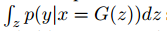应该有高的熵。最后结合在一起：

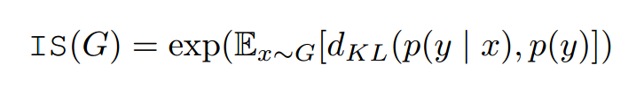

分类器是在ImageNet训练的InceptionNet，作者发现这个分数与人类标注的方法非常相关，不足是对标签的先验分布不敏感，不是一个合适的距离选择。

**Frechet Inception Distance (FID)**，为了量化生成样本,先把他们嵌入InceptionNet的特征空间，然后把嵌入层作为连续多元高斯，为生成数据和真实数据估计均值和方差。两个高斯的Frechet距离可以计算如下：

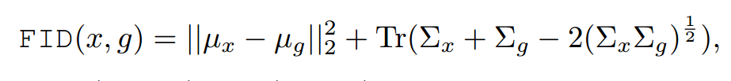

$(\mu, \Sigma)$是均值和方差。作者展示了这个分数和人类判别一致，与IS相比对噪声更鲁棒。另外，作者展示了FID和生成样本视觉质量的负相关。不像IS，FID可以检测类间模式丢失（模型对每个类只生成一张图片），IS值好，但是FID较差。

这两个最大的问题是不能检测过拟合。有记忆的GAN把样例都记住就能获得不错的分数。

## Flavors of Generative Adversarial Networks

我们专注于无条件的生成网络，也就是训练数据无标签。当前方法存在优化问题是判别器输出、对应损失以及梯度标准化惩罚的限制。

初始GAN有两个损失函数，在最小化最大中，判别器输出分布，损失是二分类问题的负对数似然。生成器学习产生假概率低的样本。为了提高梯度信号，作者提出了非饱和损失，生成器最大化生成样本为真的概率。

Wasserstein GAN中，判别器允许输出一个真值，目标函数等价于不带sigmoid的MM GAN。判别器的权重被修剪为一个小的真值，用于强制平滑。为了提升训练稳定，Gulrajani给标准化的梯度加入了软约束，鼓励判别器称为1-Lipschitz。梯度标准化是数据点和生成样本计算来的，最优判别器应该有单元梯度标准。

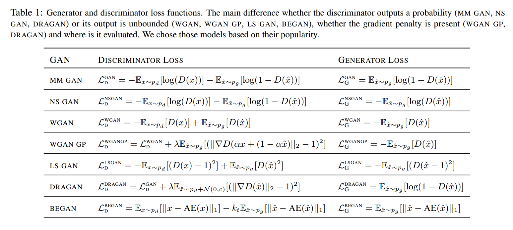

梯度标准惩罚可以加在MM GAN和NS GAM上，对数据流形评估。（略）

最小平方损失隐式最小化Pearson$\chi ^2$散度，提供了平滑的损失可以比sigmoid交叉熵损失饱和更慢。

Berthelot提出了用自编码器作为判别器，在真实和虚假的自编码器损失分布中优化Wasserstein的下界。

## Challenges of a Fair Comparison

**Which metric to use?**使用FID和F1，FID可以在任何数据集上计算，还有准确度、召回率和F1。

**How to compare models?**当结构、超参数、随机初始化或数据集不同时一个算法可能有不同的分数。

从以下方面：

- **Architecture**：对所有的模型使用一样的结构。

- **Hyperparameters**：两种方法：（1）对每个数据集选择超参数，（2）在一个数据集上选择超参数，让后推断超参数的范围用在其他数据集上。这两个我们都实验了。

- **Random seed**：我们研究了这个影响并报告了相应的置信区间。

- **Data set**：选了四个流行的数据集。

- **Computational budget**：我们探索了结果和计算负荷的关系。

我们对每个模型和数据集用随机搜索跳了超参数。我们认为少的参数好于多的参数，但是这个和实践者的经验相关。

## Metrics

我们先研究了FID，发现特性符合期望，可以实际中使用。但是和IS都无法检测过拟合，因此我们提出了一个对于准确率和召回率的近似，以及如何衡量过拟合。我们强调这是IS和FID的补充，而不是替代。

### Frechet Inception Distance

FID对噪声鲁棒，我们量化了FID的偏置和方差，它对编码网络和模式丢失的敏感性。我们把数据集分为两部分：

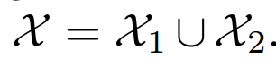

然后我们定义数据分布$p_d$作为在X1上的随机下采样分布，模型分布$p_g$作为在X2上的随机下采样分布。任何一个部分，模型分布应该跟随数据分布。

**Bias and variance**我们在四个经典数据集上评估了FID的偏置和方差的值。我们先使用默认的训练集测试集划分，计算测试集（对于CelebA是N=10000）和相同数量N样本的训练集上的FID值。从训练集中采样了M=50次。FID的最优估计在表2中。我们观察到FID有高偏差，低方差，因此估计全部的相关矩阵就不必要，也背道而驰，一个约束的版本足够。

为了测试这个测试集和训练集的敏感度，我们考虑了50个随机部分（固定的随机大小：对MNIST是6：1），用M=1的采样计算FID值。发现结果和表2相似。

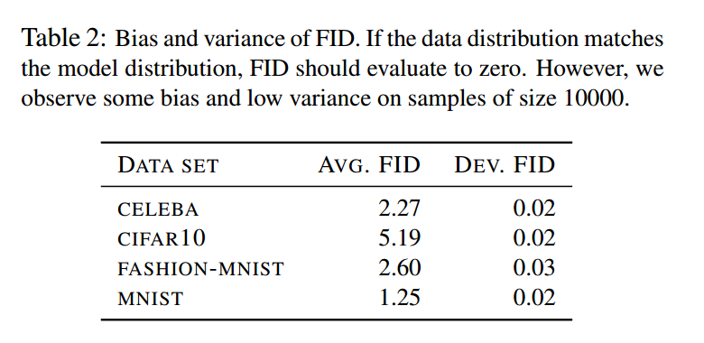

**Detecting mode dropping with FID**为了模拟缺失模式，我们固定了数据集的划分，

我们下采样X2，只保留前k个类的样本，k从1到0。对于每个k，我们考虑X2的50个随机下采样，图1显示了FID和缺失模式的相关程度。

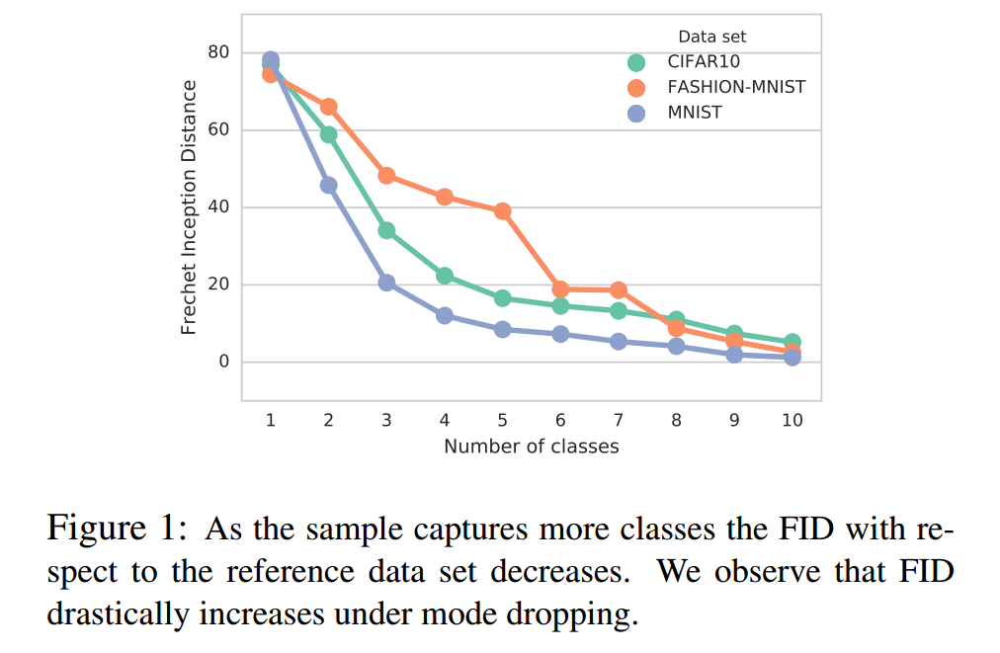

**Sensitivity to encoding network**假设我们用不同的网络和编码层计算FID，模型的等级会改变吗？为了测试，我们使用了在ImageNet预训练的VGG，使用维度4096的FC7层。图2显示了结果分布。我们发现高的Spearman等级相关系数$\rho = 0.9$。当然公平的比较应该应用到其他数据集上，这是未来的工作。

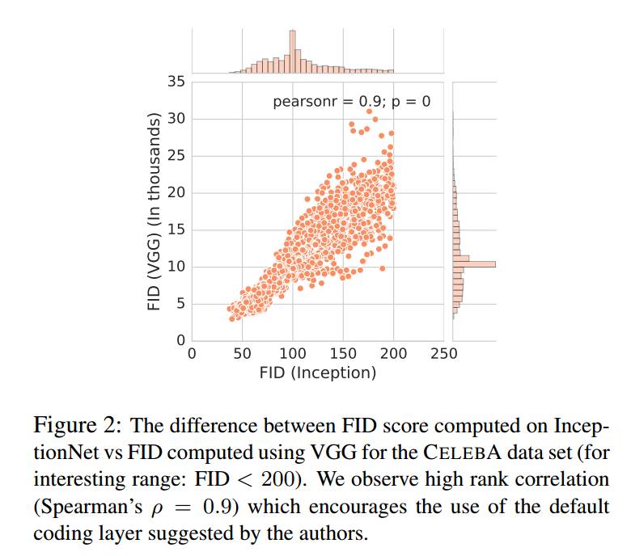

### Precision, Recall and F1 Score

注意IS只抓取准确度：它不因为没有输出数据分布的所有模式而惩罚，只惩罚没有输出所有的**类别**。FID抓取准确率和召回率。

我们为衡量生成模型提出了一个简单高效的数据集。主要的启发是现在的数据集或者太简单或者太复杂，这个任务集使得我们可以近似准确率和召回率。

**Manifold of convex polygons** 主要的想法是构建一个流形使样本间的距离可以高效计算，把对生成模型质量的衡量转为计算流行距离的问题。因此如果来自模型分布的样本接近流形，准确率高，生成器可以恢复流形的任何样本，召回率高。

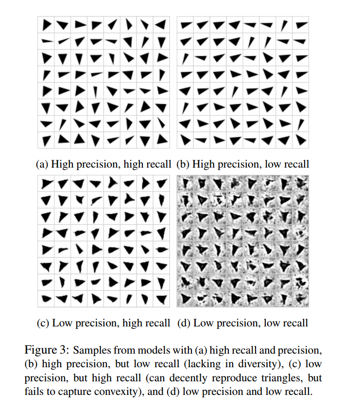

我们用凸多边形作为数据集。我们看图3的灰度三角。这些三角属于低维流形C3嵌入d*d维。直觉上，这些流形的位置系统表示了变形的轴（旋转，平移，最小角等）。一个好的生成模型可以捕获这些因素，并把他们恢复。

**Computing the distance to the manifold**最简单的情形是：灰度图可以表示为向量$x \in \mathbb{R}^{d^2}$。最小的样本到流形的距离是：

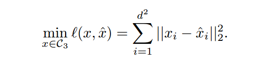

这不是凸优化问题，我们可以通过梯度下降获得近似解。为了降低假阴率，我们多次不同随机初始化运行。

为了计算样本的隐含表示，我们翻转生成器，在G固定的情况下通过梯度下降求解：

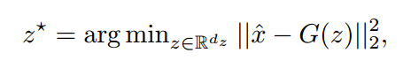

## Large-scale Experimental Evaluation

我们考虑了两个负荷约束的实验：（1）wide one-shot setup，每个模型选择100个超参数样本，每个超参数样本范围很广，（2）narrow two-shots setup，在大的超参数范围中手动选择一个窄的范围，从中选50个样本。

### Experimental Setup

为了公平：（1）我们使用INFO GAN的生成器和判别器结构作为结果函数空间是足够的，所有考虑的GAN都不是原先为这个结构设计的。

我们把潜在码长度大小固定为64，潜在空间的先验概率是$[-1,1]^64$的平均分布，除了VAE是高斯分布N(0,1)。我们使用Adam作为优化算法。对生成器和判别器使用相同的学习率，我们把批大小设为64，在MNIST和FASHION MNIST上优化20轮，CELEBA优化40轮，CIFAR优化100轮。

我们使用了判别器的BN，生成器和判别器不同的更新频率。与学习率、Adam的参数$\beta1$，每个模型的超参数结合起来进行了探索。

### A Large Hyperparameter Search

我们对超参数进行了优化，每次运行寻找最好的FID值。为了寻找最好的模型，每5个周期我们在10K个生成数据和10K个测试集样本中计算一次FID。对每个数据集都进行了大量的计算。图5显示了模型超参数的敏感性，表3显示了每个模型最好的FID。

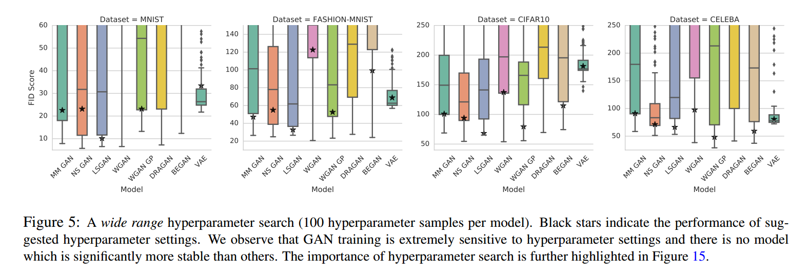

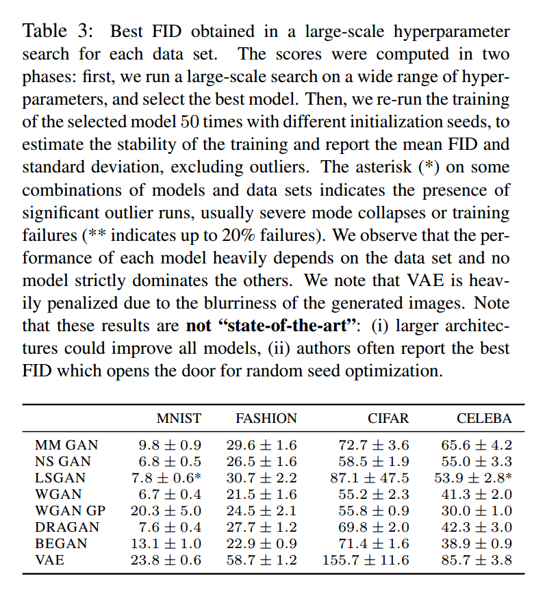

图4显示了计算负荷增加时FID均值。有3点，首先，没有一个算法明显好于其他，第二，FID的一个范围，一个“坏”的模型在大的计算负荷下会好于“好”的模型，最后，计算负荷受限，对模型进行比较是做不到的。

### Impact of Limited Computational Budget

实践中有充足的计算负荷时不现实的，我们可以在一个数据集上调整超参数范围，然后在其他数据集上插入超参数范围。我们考虑了这个设置，我们仅允许一个窄的范围有50个样本，这是在FASHION MNIST上基于大范围超参数搜索选出的。

图15显示了每个模型不同的FID，超参数是从窄范围选出来的。从实践的观点看，模型间有个显著的区别：一些情况下，超参数的范围从一个数据集转到另一个数据集上时，一些模型更加敏感。我们注意到通过更大的参数搜索可以得到更好的分数。这说明一个结论，在一个数据集上讨论模型的最好分数时没啥意义的，我们应该讨论获得分数的分布。

### Robustness to Random Initialization

基本上所有模型对随机初始化鲁棒，除了LSGAN，即使这样他们的方差很大，比较模型时应该考虑这点。

### Precision, recall, and F1

我们对大范围的超参数进行了搜索，对n=1024个样本计算了准确率和召回率。尤其是，我们通过计算生成样本距离低于阈值$\delta=0.75$的部分计算准确率。然后我们考虑了测试集的n个样本，并把每个样本x转化为计算$Z^* = G^{-}(x)$，计算x和$G(Z^*)$的平方欧几里得距离。图6显示了固定模型和超参数，改变计算负荷所选择的最好的F1分数。我们观察到即使这样一个看起来简单的任务，很多模型不能达到很高的F1分数。这些情况我们对于不同的阈值最大化了准确率或召回率。

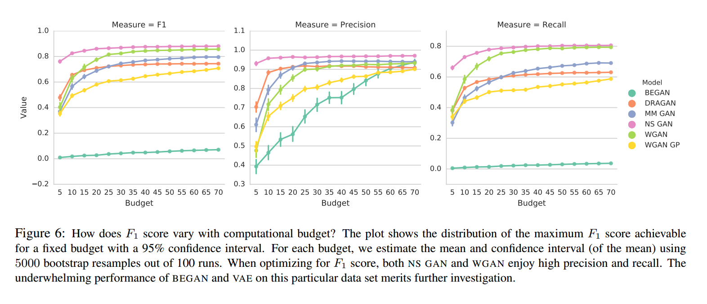

## Conclusion & Open Problems

我们关注两个衡量标准：（1）Frechet Inception Distance，（2）准确率、召回率、F1。我们用实验证明了FID是个合适的方法，因为它对模式丢失和编码网络选择具有鲁棒性。

**Comparison based on FID**我们认为模型达到的最小FID值对比较没有意义。应该比较固定的计算负荷下的FID分布。实验表明在计算负荷增加时，GAN的算法区别在实验中没有太大关系。在计算负荷受限下，“好”的算法应该由于“坏”的算法。

**Comparison based on precision, recall and F1 score**我们发现在这个简单的三角形数据集上，很多模型不能达到高F1分数。优化F1分数时，NS GAN和WGAN可以达到很高的准确率和召回率，另外的模型如DRAGAN和WGAN GP不能达到高的召回率值。

**Comparison with respect to original GAN**我们不同数据集的实验中，没有发现某些GAN达到自己所说的优越性。

**Open problems**FID是否在更大的编码变化中也很稳定还需实验，FID也不能检测过拟合，FID可能被人工因素影响。

我们建议未来GAN的研究更注重实验体系，模型在更中立的角度比较。