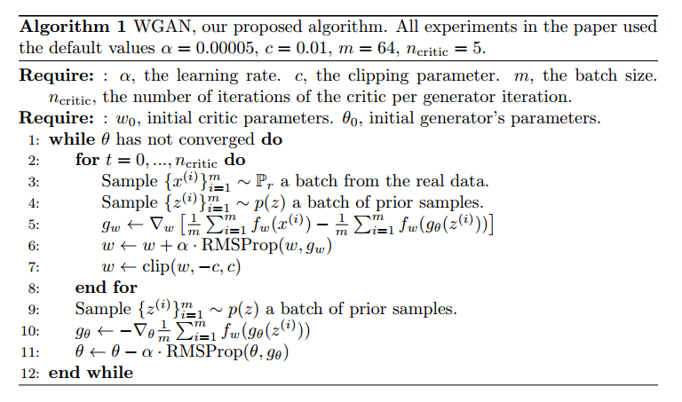

# Wasserstein GAN （WGAN）

---
> ## Contact me
> Blog -> <https://cugtyt.github.io/blog/index>  
> Email -> <cugtyt@qq.com>, <cugtyt@gmail.com>  
> GitHub -> [Cugtyt@GitHub](https://github.com/Cugtyt)

---

> **本系列博客主页及相关见**[**此处**](https://cugtyt.github.io/blog/papers/index)  

---

<head>
    
    
</head>

## Introduction

什么是学习概率分布？经典回答是学习概率密度。通常是通过定义密度参数族`${(P_\theta)}_{\theta \in \mathbb{R}^d}$`，找到在数据上的最大似然，如果真实数据样本是`$\left \{ x^{(i)} \right \}_{i=1}^m$`，那么问题解为：

如果真实数据分布`$\mathbb{P}_r$`是密分布，`$\mathbb{P}_\theta$`是参数化密度分布，那就相当于最小化KL散度。

为了使它有意义，我们需要模型密度`$P_\theta$`存在。这不是通常我们处理的低维流形分布情况。因此可能模型流形和真实分布有可忽略的交叉，这意味着KL散度不存在（或无穷）。

通常的做法使在模型分布中加入噪声。这也是为什么几乎所有的经典机器学习生成模型都加入了噪声部分。最简单的情况，高频带的高斯噪声可以覆盖到所有的样本。但是在图像生成模型中，噪声减低了样本的质量，变得模糊。也就是说，这个问题加噪声是显然不对的，但是这对最大似然方法是必要的。

与其预估也许并不存在的`$\mathbb{P}_r$`，我们可以定义一个固定分布p(z)的随机变量Z，传入参数化函数`$g_\theta$：Z->X`，直接在确定分布`$\mathbb{P}_\theta$`上生成样本。通过设置不同的`$\theta$`我们可以改变分布，使它接近真是数据分布。用处有两个：第一，这个方法可以表示低维流形的分布，第二，容易生成样本的能力比知道密度数值更有用。通常，在给定的高维密度上生成样本很困难。

VAE和GAN是这种方法的例子。因为VAE关注样本似然的近似，它和标准模型有一样的限制，需要加入噪声。GAN提供了更加灵活的目标函数，包括JS，所有的f散度，还有一些其他组合。另外GAN出了名的脆弱和难训练。

本文我们通过不同的方法衡量模型分布和真实分布有多接近，同样，通过不同的方法定义距离或散度。这些距离最基础性的区别是概率分布序列的散度。序列分布`${(P_t)}_{t \in \mathbb{N}}$`收敛当且仅当存在分布`$\mathbb{P}_\infty$`使得ρ(Pt; P1)趋于0。距离ρ有弱的拓扑结构时，可以使分布序列更容易收敛。

为了更容易优化参数`$\theta$`，要定义模型分布`$\mathbb{P}_\theta$`让映射`$\theta \to \mathbb{P}_\theta$`连续。如果ρ是两个距离的分布，损失函数`$\theta \to \rho (\mathbb{P}_\theta, \mathbb{P}_r)$`连续等价于映射`$\theta \to \mathbb{P}_\theta$`连续。

## Different Distances

- Total Variation (TV) 距离：

- Kullback-Leibler (KL) 散度：

- Jensen-Shannon (JS) 散度：

- Earth-Mover (EM) 距离 or Wasserstein-1：

例1告诉我们可以通过EM距离的梯度下降来学习低维流形的概率分布。其他距离和散度做不到因为他们都不连续。

由于Wasserstein距离比JS距离弱，我们可以看`$W(\mathbb{P}_r, \mathbb{P}_r)$`有没有弱假设的连续损失函数，答案是有。

这些都表明了EM是个更好的损失函数。下面的理论描述了这些距离和散度的拓扑相关强度，KL最强，接下来是JS和TV，EM最弱。

这强调了学习低维流形分布KL，JS和TV距离不是个合适的损失函数。EM就比较合适。

## Wasserstein GAN

Kantorovich-Rubinstein对偶告诉我们：

上界是所有 1-Lipschitz函数f: X->R。注意到如果我们替换`$||f||_L \leq 1$`为`$||f||_L \leq L$`，我们得到`$K \cdot W(P_r, R_g)$`。因此如果我们有个参数化的函数族`$\left \{ f_w \right \}_{w \in W}$`，我们考虑求解问题：

现在问题是找到求解最大化问题的函数f。一个粗糙的近似是，训练一个神经网络，参数w落在紧凑的空间W中，然后反向传播。注意到W是紧凑的，说明所有的函数`$f_w$`是K-Lipschitz，只取决于W，权重不独立，因此可以近似到一个不相干的因子，和“评论者”`$f_w$`的容量。为了让参数w落在紧凑的空间，我们可以做的一个简单的事是把权重固定到一个范围中，如`$W=[-0.01,0.001]^l$`。

权重修剪来达到Lipschitz限制是个糟糕的注意。如果修剪参数大，抵达限制需要很长的时间，这让“评论者”收敛更加困难。如果修剪小，层数大时容易导致梯度消失，或者BN没有用。

EM距离的连续性和可微性意味着我们可以训练评论者直到收敛。我们训练评论者越多，获得的梯度更加可靠，而JS判别器越好，梯度越可靠，但是局部饱和真实梯度为0，导致了梯度消失。图2显示了这个证明。判别器可以快速的区分真假，并提供了可靠的梯度信息，但是评论者，不会饱和，收敛到一个线性函数，提供了明显和清晰的梯度。

也许更重要的是我们训练评论者到收敛使得模式坍塌变得不可能。这是因为模式坍塌来自于一个固定判别器的最优生成器是判别器给最高值的点的和。

## Empirical Results

两个优势：

- 与生成器收敛和样本质量的一个有意义的损失度量

- 提升了优化过程的稳定性

### Experimental Procedure

我们做了图像生成。目标分布是LSUM-Bedrooms数据集。我们的比较基线是SCGAN，带卷积结构的GAN，用标准GAN步骤训练，使用logD。生成的样本是3通道64*64图像。

### Meaningful loss metric

WGAN在生成器训练前把评论者训练的足够好，损失函数是EM距离的估计。

第一个实验展示了这个估计和生成样本质量的相关性。除了DCGAN我们也在512隐藏单元4层ReLU-MLP上做了实验。

图3是WGAN的估计。显示出来和生成样本质量的关系。

图4画了JS距离，判别器最大化：

但是，WGAN在实验基于动量的优化器如Adam训练评论者，或使用高的学习率时会不稳定。由于评论者的损失不稳定，基于动量的方法看起来更差，我们认为当损失爆炸，样本变差，Adam和梯度直接的cos为负，这个cos为负就是不稳定的地方。我们因此转换到了RMSProp，可以在非稳定的问题页表现很好。

### Improved stability

WGAN的好处是我们可以训练判别器到最优，然后更新生成器，而不需要小心的平衡二者。

我们观察到改变生成器的结构时WGAN比GAN更鲁棒。我们在3个生成器结构做了实验：（1）卷积DCGAN生成器，（2）卷积DCGAN生成器，不带BN，滤波器数量固定.（3）512隐藏单元4层ReLU-MLP。后面两个都知道在GAN上效果不好。我们保持了DCGAN的结构。

图5-6-7是这些结构的生成样本。

我们没有发现WGAN存在模式坍塌。

## Related Work

## Conclusion

我们展示了我们通过WGAN可以提升学习稳定性，摆脱模式坍塌的问题，提供了一个对调试和参数搜索有帮助的学习曲线。我们还表明了相关的优化问题是很稳定的。