# You Only Look Once: Unified, Real-Time Object Detection

## Contact me

* Blog -> <https://cugtyt.github.io/blog/index>
* Email -> <cugtyt@qq.com>, <cugtyt@gmail.com>
* GitHub -> [Cugtyt@GitHub](https://github.com/Cugtyt)

> **本系列博客主页及相关见**[**此处**](https://cugtyt.github.io/blog/papers/index)

---

<head>
    
    
</head>

## Abstract

我们提出的YOLO是一个的新方法。先前的工作是用分类来做检测，我们使用回归问题来解决边界框和类别概率。使用一个神经网络直接从全图来预测边界框和类别概率，因此可以端到端的优化。

我们的模型很快，可以实时每秒45帧处理，一个更小的版本Fast YOLO可以每秒155帧处理，仍然可以达到其他实时检测的两倍mAP值。YOLO比当前最好的检测系统定位错误更高，但是对背景检测甲阳率更低。

## Introduction

当前的检测系统用分类器来做检测。这些系统用一个目标分类器，在图像不同的位置和尺度检测目标。像DPM使用滑动窗的方法对整个图像的空间位置进行检测。

最近R-CNN使用区域提议先生成潜在的边界框，然后对这些框分类。在分类后，后处理来微调边界框，减小重叠检测，基于情景中的其他目标重新对框评判。这些复杂的步骤很慢很难优化，因为每个部分都必须单独训练。

我们把目标检测作为一个单一的回归问题，直接从像素到边界框坐标和类别概率。

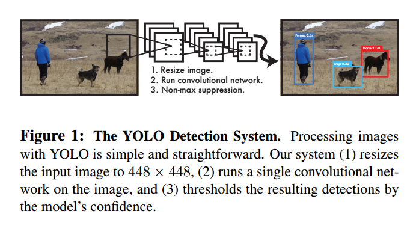

如图1，一个单独的卷积网络同时预测边界框和类别概率。YOLO有以下优点：

首先，YOLO非常快，因为我们把目标检测作为一个回归问题，因此我们不需要复杂的步骤。它比其他实时系统高两倍的平均准确率。

其次，YOLO从图像全局来预测。不同于滑动窗和区域提议，YOLO看图像一次，把类别的内容信息进行了编码。Fast R-CNN在背景检测上犯错误因为它不能看到更大的场景。YOLO比Fast R-CNN背景错误率小一半。

第三，YOLO学习了目标的通用表示。在不同的输入也应该有不错的性能。

YOLO在准确率上还落后于最好的检测系统。它能快速的判别目标，但是对精确的定位还很吃力，尤其是小物体。

## Unified Detection

YOLO把目标检测的不同部分集成到一个神经网络里，可以实现端到端的训练，在保持高准确率的前提下有实时的速度。

我们的系统把图像分为S*S格子，如果目标的中心落入一个格子，这个格子负责检测目标。

每个格子预测B个边界框和框的置信分数。置信分数定义为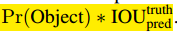，如果没有目标，分数为0。另外我们希望置信分数正比于预测框和真实值的交集。

每个边框包括5个部分：x,y,w,h和置信度。(x,y)是框中心，w,h是宽和高，置信分数表示了预测框和真实值的交集。

每个格子预测C个条件概率，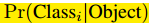，我们只预测每个格子的类别概率，不管格子的数量。

测试时，我们把类别条件概率和单独的置信预测相乘：

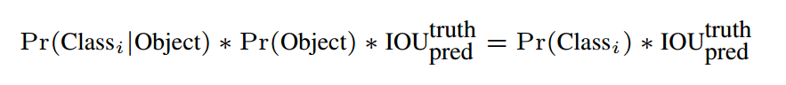

这是每个格子的类别的置信分数，这个分数编码了类别的概率和边框和目标的吻合情况。

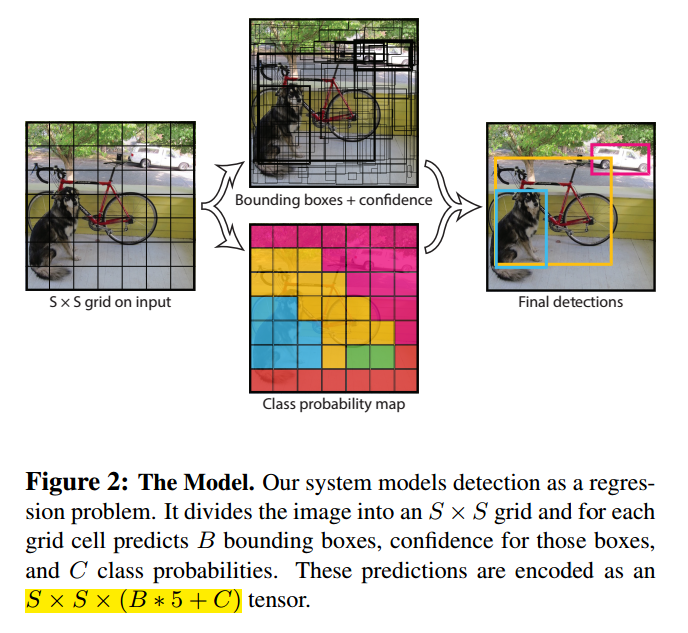

### Network Design

初始的卷积层提取图像特征，全连接层预测输出概率和坐标。

我们受GoogLeNet启发，有24个卷积层和2个全连接层。我们使用了1\*1后3\*3来做降维。整个网络如图3。

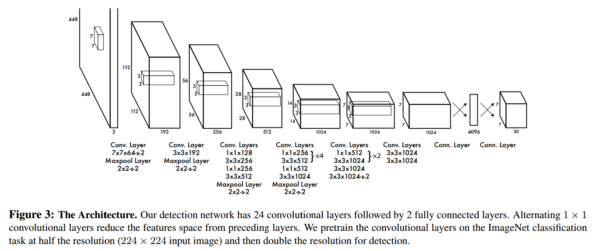

我们也训练了一个YOLO的快速版做更快的目标检测。使用了更少的9层卷积层，其他的训练参数一致。

### Training

我们在ImageNet上进行了训练。预训练我们使用了前20层卷积层，然后是均值池化和全连接。我们训练了一周，达到了top-5准确率88%。

然后我们把模型转为检测。研究显示预训练网络加入卷积和连接层可以提高性能。因此我们加入了4层卷积层和2层全连接层，随机初始化了权重。我们增加了输入分辨率从224\*224到448\*448，以满足检测对可视信息高的要求。

最后一层预测类别概率和边界位置，我们归一化了边界的宽和高，让他们落入0-1。我们也把x和y参数化到0-1。

我们使用了如下激活：

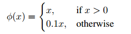

我们使用了平方和错误，原因是它非常容易优化，但是和我们最大化均值准确率的目标不是很吻合。它把定位错误和分类错误同等看代，这不是理想的情况。很多格子事没有目标的，这让置信分数趋于0，提高了包含目标格子的梯度，这导致了模型不稳定，导致训练提前发散。

为了解决，我们增加了边框位置的损失，降低了不含目标置信分数的损失。我们使用了两个参数，$\lambda_{coord}=5$和$\lambda_{noobj}=.5$来完成。

平方错误也把大边框和小边框的错误同等看代，我们用边界框的宽和高的平方根而不是直接使用宽和高。

YOLO对每个格子的多个边界框判断。训练时我们希望一个判别器负责一个目标，我们基于和真实值最高交集来分配负责的判别器。这导致判别器的特殊化，每个判别器在特定大小，方向角，目标类别上越来越好，提升了总体的召回率。

训练使用的损失函数是：

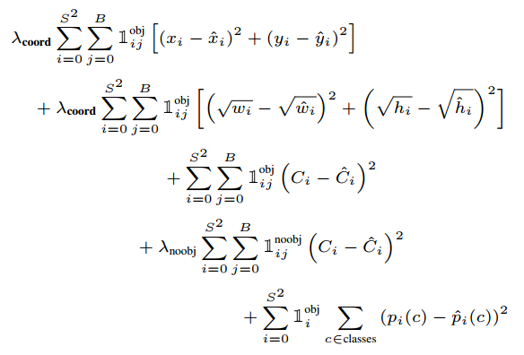

注意到损失函数只在格子目标存在时惩罚，也就是前面说的条件类别概率。只惩罚负责判别器的坐标错误。

学习率：第一个周期缓慢的从1e-3到1e-2，如果刚开始学习率高，模型会因为不稳定发散。然后1e-2训练75周期，1e-3训练30个周期，1e-430个周期。

为了防止过拟合，我们使用dropout和数据增强。

### Inference

网格的设计迫使边界框的空间多样性，通常目标落入那个格子非常清楚。但是一些大的目标或多个格子边界的目标会被多个格子定位，非最大化抑制可以解决这个问题。虽然对于R-CNN和DPM不是个关键的问题，但是非最大化抑制可以提高mAP2-3%。

### Limitations of YOLO

YOLO在空间上有很大的限制，因为每个格子只预测两个边框，只能有一类。这个限制模型可以预测的类别数。

由于模型从数据集学习边界框，泛化到不同的目标会有困难。因为模型使用了下采样，因此使用了粗糙的特征。

最后，我们的损失函数同等对待小边界框和大边界框。

## Comparison to Other Detection Systems

**Deformable parts models**使用滑动窗实现目标检测。我们更快更准确。

**R-CNN**使用区域提议，选择搜索产生潜在的边界框，卷积网络提取特征，SVM打分，线性模型调整边界框，非最大抑制减小重叠检测。每个部分都是独立的，非常慢。

**Other Fast Detectors**虽然速度和准确率比R-CNN提升了，但是离实时还差很远。

【略】

## Experiments

我们在PASCAL VOC 2007上和其他实时系统进行了对比，我们比较了YOLO和Fast R-CNN。我们展示了YOLO可以为Fast R-CNN重打分，减低背景的甲阳率，达到很好的性能。

### Comparison to Other Real-Time Systems

Fast YOLO是在PASCAL上最快的目标检测，比其他多两倍的准确率，有52.7%的mAP。YOLO可以达到63.4%的准确率。

我们用VGG-16训练了YOLO，更加准确，但是慢。

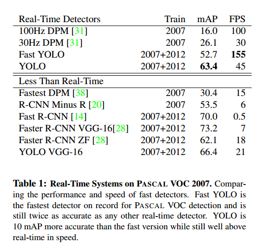

### VOC 2007 Error Analysis

比较了YOLO和目前最好的检测器Fast R-CNN。对于每个类别，我们看最高的N个判别，或者正确或者有以下错误：

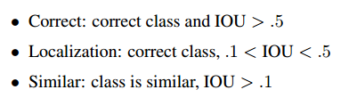
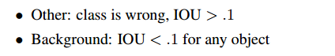

图4显示了20个类的错误类型。

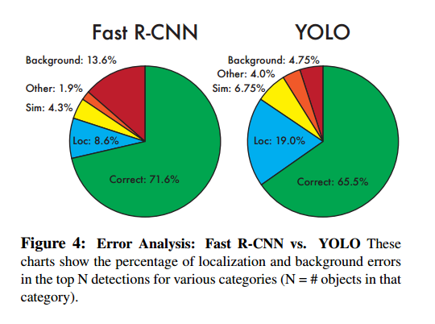

YOLO在定位目标还不是很好。Fast R-CNN定位错误更少，但是背景错误更多。Fast R-CNN比YOLO有3倍的背景检测。

### Combining Fast R-CNN and YOLO

对于每个R-CNN检测边界框，我们检查YOLO是否预测相似，如果是的话，我们基于YOLO的预测概率实行联合推进。

Fast R-CNN最好达到71.8%的mAP，和YOLO结合后，提升3.2%到75.0%。我们还做了其他的尝试，如表2。

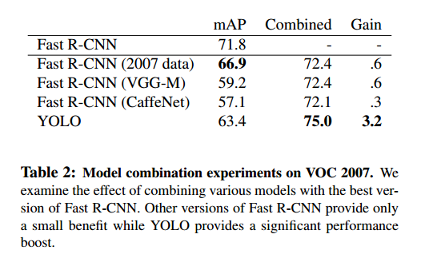

二者的联合不是简单的模型集成，而是精确的，因为YOLO在犯不同的错，可以通过Fast R-CNN提升性能。

但是这个结合不能从YOLO的速度收益，因为我们分别运行了模型。

### VOC 2012 Results

在VOC 2012测试集上，YOLO达到57.9%mAP。低于最好的结果，但是使用VGG-16接近R-CNN。见表3。

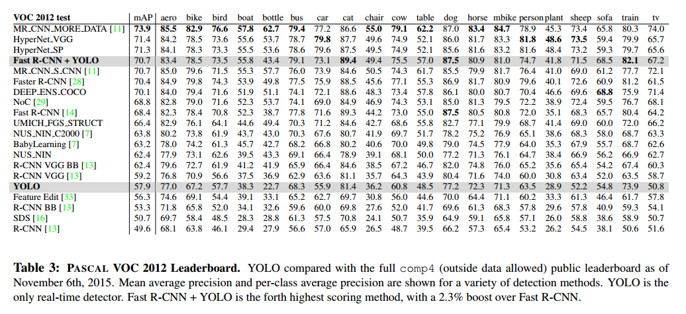

Fast R-CNN和YOLO的结合是最好的检测方法。

### Generalizability: Person Detection in Artwork

图5显示了YOLO和其他检测方法的比较。

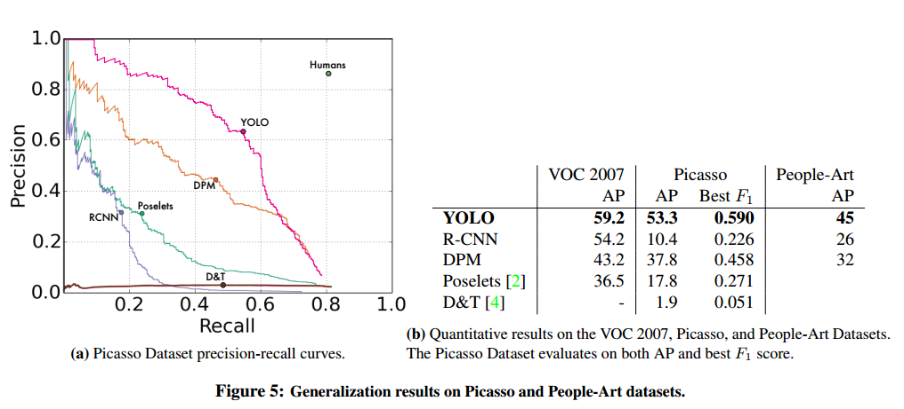

R-CNN在VOC 2007有最高的AP。但是R-CNN在artwork上掉的很多。

YOLO在VOC 2007有很好的性能，在应用到artwork上掉的最少。

## Real-Time Detection In The Wild

YOLO快速准确，应用于计算机视觉时很理想的。【略】

## Conclusion

我们提出了YOLO，一个统一的目标检测模型。可以直接在全图构建和训练。不想基于分类器的方法，YOLO的损失函数于检测性能相关，可以让整个模型统一训练。

Fast YOLO是最快的通用目标检测，YOLO是目标检测最好的，YOLO也可以泛化到新的领域。