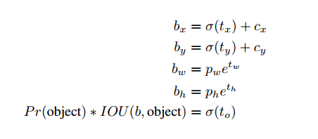

# YOLO9000: Better, Faster, Stronger

## Contact me

* Blog -> <https://cugtyt.github.io/blog/index>
* Email -> <cugtyt@qq.com>, <cugtyt@gmail.com>
* GitHub -> [Cugtyt@GitHub](https://github.com/Cugtyt)

> **本系列博客主页及相关见**[**此处**](https://cugtyt.github.io/blog/papers/index)

---

<head>
    
    
</head>

## Abstract

我们提出了可以检测超过9000目标类别的YOLO9000。首先我们提出了YOLO的一些改进，改进后的YOLOv2是PASCAL VOC和COCO上最好的检测方法。使用新的，多尺度的训练方法可以让YOLOv2在不同的大小上运行，可以轻松的在速度和准确率上权衡。67帧每秒，YOLOv2可以在VOC 2007达到76.8mAP，40帧每秒，可以达到78.6mAP，超过目前最好的方法如带ResNet的Faster R-CNN和SSD，而且速度更快。我们提出了目标检测和分类的联合训练方法。这个方法可以让YOLO9000在COCO和ImageNet上一同训练。我们使用这个方法得到了一些不错的结果。

## Introduction

当前的目标检测数据集相比于分类和标签是很小的。我们希望检测不同尺度的目标类别。但是打标签的代价很大。是不可能见到和分类数据集查不到级别的检测数据集了。

我们提出了一个新的方法把分类数据用于检测。我们也提出了使用检测数据和分类数据的联合训练算法。使用这个方法训练YOLO9000，可以检测9000多不同的目标类别。首先，我们提升了YOLO检测系统到YOLOv2。然后我们使用数据集结合方法在ImageNet和COCO上联合训练了超过9000个类别。

## Better

和Fast R-CNN比较发现YOLO有很大的定位错误。与区域提议方法有较低的召回率，因此我们在保持分类准确率前提下主要提升召回率和定位。

现在网络结构越来越大，我们希望YOLOv2快，因此不扩大网络，我们简化了网络，并且让表示更容易学习。我们使用了一些新老方法，结果在表2中。

**Batch Normalization**使收敛有极大的提升，减少了正则化的需求，我们提升了2%的mAP。

**High Resolution Classifier**现在所有的检测方法都在ImamgeNet进行了预训练，YOLO用224*224训练分类网络，然后增加为448用于检测。YOLOv2我们在ImageNet上使用448训练10个周期，然后在检测上微调，这让我们提升了4%mAP。

**Convolutional With Anchor Boxes**YOLO使用全连接层直接判断边界框坐标，Fast R-CNN使用手动选取的初始值。Fast R-CNN的区域提议网络(RPN)只使用卷积层预测补偿和锚框。由于预测层是卷积，RPN在特征图预测每个位置的补偿。预测补偿而不是位置简化了问题，可以让网络更容易学习。

我们移除了YOLO的全连接层，使用锚框来预测边界框。首先我们移除了池化层得到较高的分辨率，我们缩小网络让他作用在416大小的图像上。这是因为我们希望特征图有奇数个定位。大的目标倾向于出现在图像中心，因此在中心有一个定位比四个附近的更好。YOLO的卷积层对416下采样因子23得到13*13。

转向锚框我们把空间位置的类别判断分解为类别判断和目标判断。和YOLO一样使用真实值和预测值的交集作为目标预测。

使用锚框我们可以得到一点准确率的减低。不使用锚框有69.5%的mAP和81%的召回率，使用锚框有69.2%的mAP和88%的召回率。

**Dimension Clusters**使用锚框我们遇到两个问题，一是框的维度是手工选的，网络可以学习调整数量但是如果我们选择一个好的开始，网络学习更容易。

我们不手工选取，我们使用k-means聚类来选取一个好的初始值。如果我们使用欧几里得距离的标准k-means，大的框会比小的有更多的错误。但是我们希望初始值可以得到好的交集，这和框的大小是无关的，因此我们的距离定义为：

实验结果如图2，我们实验k=5来平衡模型复杂度和高召回率，聚类中心和手工选取很不一样，小宽框少，高瘦框多。

我们比较了距离聚类策略最近的初始值和手工选取框的平均交集，如表1。这说明使用k-means生成边界框有更好的表示，可以让任务更容易学习。

**Direct location prediction**使用锚框遇到的第二个问题是模型不稳定，尤其是早期迭代。大部分的不稳定来自框的位置(x,y)预测。在区域提议网络中网络预测值$t_x$和$t_y$，中心坐标(x,y)计算：

例如，预测$t_x=1$把框右移锚框的宽度，-1向左移。

这个锚框是不受限的，因此锚框可以到图像的任意位置，需要很长时间才能稳定。所以我们不预测补偿，而是像YOLO预测格子位置的相对坐标，这可以让真实值落入0到1。我们使用逻辑激活让预测值落入这个范围。

网络为每个格子预测5个边界框。预测5个坐标$t_x, t_y, t_w, t_h, t_o$。如果格子是左上中心$(c_x, c_y)$的补偿，边界框初始宽和高是$p_w, p_h$，预测为：

我们限制了网络对位置的预测，因此网络可以更稳定。使用维度聚类直接预测边界框中心与锚框相比提升了大概5%。

**Fine-Grained Features**修改预测13\*13特征图的预测。对于大的目标已经足够，但是定位小的目标还需要细调。不像Faster R-CNN和SSD在不同的分辨率的的不同特征图上运行，我们采用的方法是直接加一个26\*26的传输层，传输26\*26分辨率的前面层。

这个传输层把高分辨率和低分辨率结合在一起，与ResNet类似。这样把26\*26\*512的特征图转为13\*13\*2048。这让模型得到1%的性能提升。

**Multi-Scale Training**原先YOLO使用448\*448的输入，采用锚框把分辨率改成了416\*416，但是模型采用卷积和池化，因此可以任意改变大小。为了适应不同大小的输入，我们每几个迭代改变输入大小。

低分辨率YOLOv2是廉价，足够准确的检测器，288\*288下有90FPS，mAP和Fast R-CNN一样好。

高分辨率YOLOv2是最好的检测器，在VOC 2007有78.6的mAP，依然是实时的速度。表3和图4是YOLOv2和其他的比较。

**Further Experiments**我们在VOC 2012进行了训练。表4显示了性能比较，YOLOv2达到了73.4mAP，速度也比其他快。在COCO上进行了训练，表5是和其他方法的比较。VOC度量上YOLOv2达到了44.0mAP，和SSD、Faster R-CNN近似。

## Faster

**Darknet-19**和VGG相似我们使用了3\*3的卷积，每次池化后加倍通道数。和Network in
Network (NIN)相似我们使用了全局均值池化来预测，和1\*1卷积来压缩维度。使用BN稳定训练，加速收敛，正则化模型。

表6是模型，Darknet-19每张图片用5.58百万运算，top1准确率72.9%，top5准确率91.2%。

**Training for classification**在ImageNet的1000类训练了160周期，学习率初始为0.1，多项式衰减，幂为4，权重衰减0.0005，动量0.9。使用了数据增强。我们使用了448的输入，高分辨率让top1准确率达到76.5%，top5准确率达到93.3%。

**Training for detection**移除最好的卷积层，加入3层3\*3\*1024的卷积，最后一层1\*1的卷积。VOC我们预测5个框，每个5个坐标，每个框20个类。加入了从最后一个3\*3\*512卷积层到倒数第二卷积层的传送层，模型可以使用更好的特性。

训练了160周期，初始学习率1e-3，60和90周期除10，权重衰减0.0005，动量0.9，使用了数据增强。

## Stronger

我们提出了训练和检测数据的联合训练方法。训练时我们混合了检测和分类的数据，对于检测数据我们基于损失函数反向传播，对于分类图像我们只反向传播类别的部分。

一个困难是检测数据的类别少，分类数据类别多而深，因此我们需要对标签联合。

大部分分类使用softmax，因为类别间是不重叠的，但是对于联合数据这样不行，例如“诺福克犬”与“狗”就是重叠的。

我们可以使用多标签模型来解决类间重叠。

**Hierarchical classification**ImageNet的标签来自WordNet，它有类别间的关系信息。大部分分类需要标签是扁平的，这也是我们希望的。

WordNet结构是有向图，不是树，我们通过构建一个分层树来简化问题。我们先把只有一条路径的加入到树中，然后我们迭代，让树一点点成长。因此如果一个概念到根有两条路，一条有3条边，一条有1条边，我们选择最短的。最后的结果是WordTree，我们对每个节点预测条件概率，例如：

如果要计算一个特定节点绝对值概率，我们可以顺着树到根节点，把条件概率相乘，例如：

如图5是我们处理ImageNet标签的方法。

分层的结果top1准确率达到71.9%，top5准确率达到90.4%。

【略】

**Dataset combination with WordTree**我们使用WordTree可以联合多个数据集，图6是联合ImageNet和COCO的例子。

**Joint classification and detection**对于检测图像，我们正常使用损失函数反向传播，对于分类图像我们只传播类别损失，我们只是找到最大概率类别的边界框，然后计算损失。

达到了很好的效果。

## Conclusion

我们介绍了YOLOv2和YOLO9000实时检测系统。YOLOv2是最好的和最快的，可以运行在不同图像大小，在速度和准确率间取得平衡。

YOLO9000可以检测超过9000个目标类别，通过一起优化检测和分类完成，我们使用了WordTree来把ImageNet和COCO结合起来训练。

我们的很多方法可以泛化到目标检测以外。我们使用WrodTree表示ImageNet提供了丰富的图像分类空间。数据集使用分层分类对分类和分割领域是很有用的。