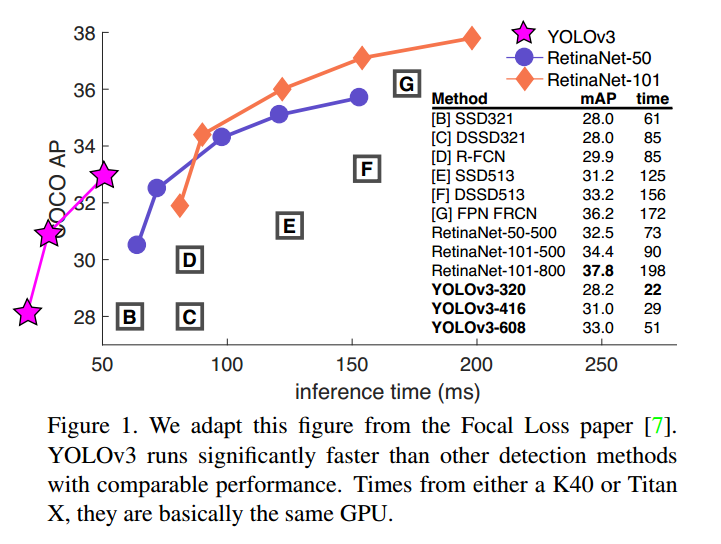
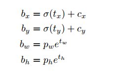
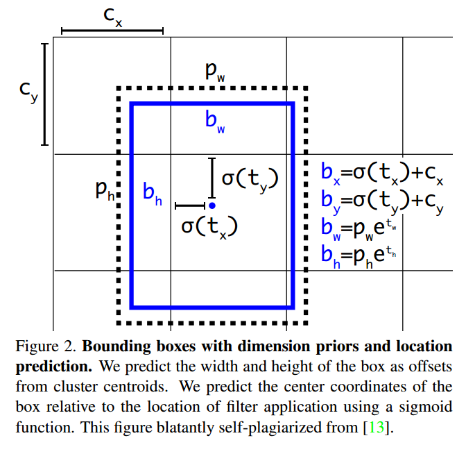
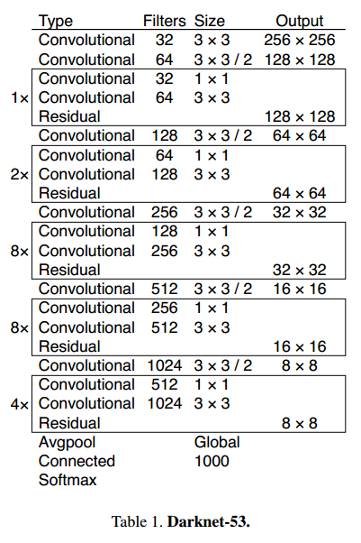
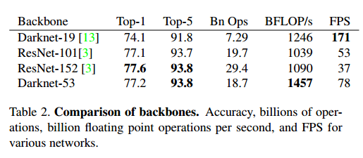
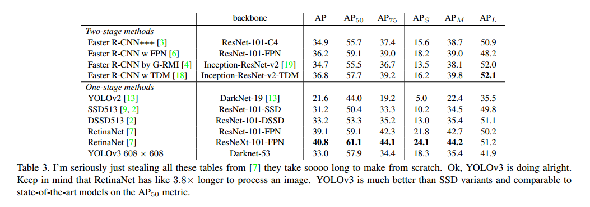

# YOLOv3: An Incremental Improvement

## Contact me

* Blog -> <https://cugtyt.github.io/blog/index>
* Email -> <cugtyt@qq.com>, <cugtyt@gmail.com>
* GitHub -> [Cugtyt@GitHub](https://github.com/Cugtyt)

> **本系列博客主页及相关见**[**此处**](https://cugtyt.github.io/blog/papers/index)

---

<head>
    
    
</head>

## Abstract

我们更新了YOLO，我们做了一些改变让它更好。它比原来的大，但是更准确，依旧很快。320\*320大小YOLOv3运行22ms，达到28.2mAP，和SSD一样准确但是更快。

## Introduction

balabala...

## The Deal

### Bounding Box Prediction

和YOLO9000一样使用维度聚类实现锚框来预测边界框。网络对每个边界框预测4个坐标`$t_x, t_y, t_w, t_h$`，如果格子对左上角补偿`$(c_x, c_y)$`，边框初始宽和高是`$p_w, p_h$`，预测为：

训练时我们使用平方和损失。

YOLOv3对每个边界框使用逻辑回归预测目标分数。如果边框初始和真实值重叠比其他框都大为1，如果不是最大的我们忽略它。如果边界框不是真实值，对坐标和类别判断没有损失，只是目标值。

### Class Prediction

每个框使用多标签分类预测，我们不使用softmax因为我们发现它对高性能不必要，我们简单的使用了独立的逻辑分类。训练时我们使用了二元交叉熵损失。

### Predictions Across Scales

YOLOv3在3个尺度上预测。在基础的特征提取器上我们加了几层卷积层，最后用来3维向量编码边界框，目标和类别分类。

然后我们前面两层的特征图2倍上采样。我们也把网络前面的特征图和上采样的特征相加，这让我们得到有意义的语义信息，我们也加了几层卷积层处理这些结合过的特征图，最后预测一个相似的向量，虽然大小扩大了2倍。

我们在最后的尺度上预测边框也多次使用了相同的设计。第三个尺度的预测也受益于前面的运算和特征微调。

我们依旧使用了k-means聚类决定我们的边界框。我们随机取了9个簇和3个尺度，让后把簇均分给不同的尺度。

### Feature Extractor

我们使用了全新的网络来做特征提取。使用了3\*3和1\*1的卷积，加入了短路连接，有53层。我们叫它Darknet-53。

这个网络比Darknet-19更有威力，比ResNet-101和ResNet-152更高效，一些结果对比：

训练和测试都在256\*256上，和最后的分类器相当，但是浮点运算更少，速度更快。Darknet-53比ResNet-101和ResNet-152更快，性能和ResNet-152相似，速度快2倍。

### Training

我们使用了多尺度训练，数据增强，BN等。

## How We Do

如表3。在COCO上，mAP和SSD变种相近，速度快3倍。但是比RetinaNet差一些。

## Things We Tried That Didn’t Work

**Anchor box x; y offset predictions**这降低了模型的稳定性。

**Linear x; y predictions instead of logistic**降低了mAP值。

**Focal loss**降低了mAP两个点。

**Dual IOU thresholds and truth assignment**Faster R-CNN使用两个IOU阈值，如果重叠高于0.7作为正样本，[0.3, 0.7]忽略，低于0.3负样本。

## What This All Means

balabala...