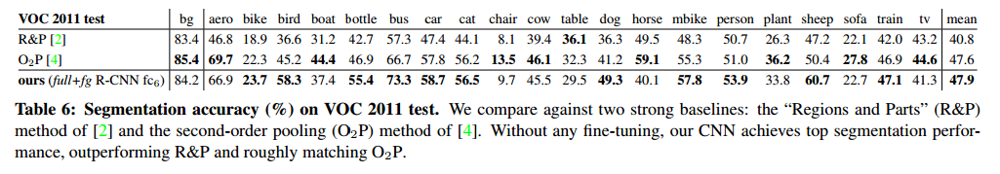

# [R-CNN] Rich feature hierarchies for accurate object detection and semantic segmentation

## Contact me

* Blog -> <https://cugtyt.github.io/blog/index>
* Email -> <cugtyt@qq.com>, <cugtyt@gmail.com>
* GitHub -> [Cugtyt@GitHub](https://github.com/Cugtyt)

> **本系列博客主页及相关见**[**此处**](https://cugtyt.github.io/blog/papers/index)

---

## Abstract

我们提出了一个简单可扩展的检测所发，可以前最好的结果相比提升了30%的mAP。方法主要是两点：（1）运用高容量CNN自底向上进行区域提议，（2）标签数据较少，在辅助任务上监督预训练，接着微调可以极大提升性能。把区域提议和CNN结合起来，因此叫R-CNN。

## Introduction

2012年以后的核心问题可以概括为：CNN分类结果可以在PASCAL VOC上泛化到什么底部？

我们通过结合图像分类和目标检测来回答这个问题，CNN在VOC上相比HOG等方法有很高的性能，我们关注两个问题：深度网络定位目标和用少量的检测数据训练高容量的模型。

一个目标定位的方法是把定位看作回归问题，但是我们觉得实践上不够好。另一个方法是滑动窗口检测器，CNN在这方面至少有20年了，为了保持高分辨率，CNN通常只有两层卷积层和池化层，我们也考虑了这个方法，但是我们的网络有较大的感受野，使得滑动窗不能精确定位。

我们把这个问题转化为区域识别（“recognition using regions” ）。测试时，我们的方法生成2000个独立类别的区域提议，对每个提议使用CNN提取定长特征，然后使用线性SVM分类。我们使用图像的仿射变换来计算固定大小的CNN输入，而不用考虑区域的形状。图1是我们方法的总览。

第二个检测的挑战是标签数据很少，目前的数据不够训练。本文的第二个重点是辅助的数据集上监督预训练，在小数据上微调可以提升性能。我们的实验发现mAP的性能可以提升8个百分点。

我们的系统非常高效，特定类别的计算是很小的矩阵向量乘积，和贪心非最大抑制，这个计算量和特征相关。我们证明了监督的边界框回归方法可以有效的减少误定位，这个当前的主要错误。

## Object detection with R-CNN

系统分三个模块：第一个生成类别独立的区域提议，这些提议决定了检测的有效候选，第二个是一个大的卷积网络，可以提取固定长度的特征，第三个是线性SVM分类。

### Module design

**Region proposals**现在有很多区域提议的方法，我们使用了选择搜索来达到对先前工作可控的比较。

**Feature extraction**我们对每个区域提议提取了4096维特征。区域的形状是不定的，所以需要处理输入，我们在固定大小的边界里扭曲图像，图2是一些样本。

### Test-time detection

测试时，我们对测试图像选择搜索了2000个区域提议，把他们输入CNN获取特征，然后使用SVM训练分类。如果一个区域和更高分数的区域重叠高于一个学到的阈值，我们使用贪心非最大抑制驳回。

**Run-time analysis**两个特性让检测高效，第一，CNN对所有类别共享参数，第二，特征向量是低维的。分析显示，R-CNN可以扩展到几千个类，不用近似技术。

### Training

**Supervised pre-training**我们鉴别性的在大的辅助数据进行了预训练。

**Domain-specific fine-tuning**为了让CNN适应检测的新任务，区域提议的新领域，我们继续使用了SGD训练。

**Object category classifiers**如何检测检测和目标重叠的区域，我们使用了重叠阈值解决这个问题，我们使用网格搜索{0, 0.1, ..., 0.5}。

特征一旦提取，加上标签就可以优化每个类的线性SVM。

### Results on PASCAL VOC 2010-12

表1显示了在VOC 2010上和其他方法比较的结果。我们相比提升了很多，从35.1%到53.7%，而且更快。在VOC 2011/12也有相似的结果。

### Results on ILSVRC2013 detection

图3是和其他方法的比较，R-CNN达到了31.4%的mAP。

## Visualization, ablation, and modes of error

### Visualizing learned features

我们可视化了卷积第5层的最大池化输出，图4是结果。

### Ablation studies

**Performance layer-by-layer, without fine-tuning**为了理解那一层关键，我们在VOC 2007上分析了结果，用CNN的最后3层。

参数只在ILSVRC 2012进行预训练，不在PASCAL上调参数，每层的结果如表2的1-3行。

**Performance layer-by-layer, with fine-tuning**在VOC 2007微调后，见表2的4-6行，mAP提升了8个百分点。

**Comparison to recent feature learning methods**所有的R-CNN变种都强于DPM，见表2的8-10行。

### Network architectures

表3是我们在VOC 2007上使用S和Z提出的16层网络，表3显示了这个网络有更好的效果。

### Detection error analysis

图5和6是分析结果。

### Bounding-box regression

在选择搜索区域提议的池化特征下，我们训练了一个线性回归模型来预测边界框，结果见表1，表2和图5.

### Qualitative results

见图8，9，10，11。

## The ILSVRC2013 detection dataset

### Dataset overview

### Region proposals

我们把每个图片缩放到500像素，召回率比PASCAL低很多。

### Training data

训练有三个步骤，（1）CNN微调，（2）SVM检测训练，（3）边界框回归

### Validation and evaluation

### Ablation study

见表4

### Relationship to OverFeat

OverFeat可以看着是R-CNN的特例。OverFeat相比R-CNN有速度优势：快9倍。

## Semantic segmentation

### CNN features for segmentation

### Results on VOC 2011

表5是在VOC 2011上和O2P的比较。

我们性能最好的方法fc6(full+fg)和两个基准的比较见表6。

## Conclusion

我们提出了一个简单可扩展的目标检测算法，可以比以前最好的结果提升30%。我们主要做了两点：一是使用了高容量的卷积网络，自底向上区域提议来实现定位和目标分割。二是当训练数据有限时训练大型CNN的范式。我们展示了在辅助任务上监督预训练网络然后在目标目标任务微调非常有效。

联合经典计算机视觉工具和深度学习（自底向上区域提议和CNN）对我们的工作时非常重要的。