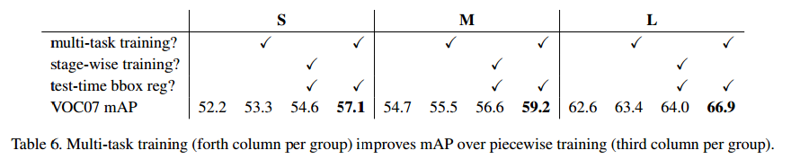

# Fast R-CNN

## Contact me

* Blog -> <https://cugtyt.github.io/blog/index>
* Email -> <cugtyt@qq.com>, <cugtyt@gmail.com>
* GitHub -> [Cugtyt@GitHub](https://github.com/Cugtyt)

> **本系列博客主页及相关见**[**此处**](https://cugtyt.github.io/blog/papers/index)

---

<head>
    
    
</head>

## Abstract

本文提出了基于区域的快速卷积网络做目标检测的算法。比之前的工作提高了训练和测试速度，也提高了检测精度。Fast R-CNN训练了很深的VGG16，比R-CNN快9倍，测试时间快213倍，在PASCAL VOC上达到了更高的mAP值，与SPPnet相比，Fast R-CNN训练VGG16快3倍，测试快10倍，更准确。

## Introduction

检测需要准确的目标位置，这导致两个问题：首先，大量的位置候选需要处理，第二，这些候选还需要后续的微调。我们提出了一步到位的训练算法来做分类和微调定位。

这个方法可以训练非常深的网络(VGG16)，比R-CNN快9倍，比SPPnet快3倍，在PASCAL VOC 2012达到了66%的mAP，是最好的准确率。

### R-CNN and SPPnet

R-CNN通过深度卷积网络达到了很好的效果，但是一些缺陷很明显：

* 训练需要多步，它先在目标提议上用log损失微调，然后把特征用SVM训练，SVM作为目标检测器，替换掉了softmax，第三步学习边界框回归。
* 训练时间和空间都很昂贵。对于SVM和每个边界框回归训练，每个目标候选的特征都要写入硬盘。
* 目标检测很慢。

R-CNN慢在对于每个目标候选都要执行前向传播，而没有共享计算。SPPnet通过共享计算加速，它对整个输入图像计算卷积特征图，然后对于每个目标提议使用共享特征图提取到的特征进行分类。

SPPnet的问题是，和R-CNN一样是多步的过程，包括提取特征，使用log损失微调特征，训练SVM，回归边界框。不像R-CNN的是，微调算法不能更新池化之前的卷积层，这个限制了深度网络的准确率。

### Contributions

我们提出的方法没有他们的缺点，还提升了速度和准确率。有如下优势：

* 更高的检测质量mAP
* 一步到位的训练，使用多任务损失
* 训练时可以更新所有的网络层
* 特征不需要硬盘缓存

## Fast R-CNN architecture and training

图1是Fast R-CNN的结构，输入是整个图像和目标提议的集合。网络首先用卷积和最大池化提取特征图，然后对于每个目标提议ROI(region of interest)池化层从特征图提取固定长度的特征向量。每个特征向量传入全连接层，最好有两个输出：一个是softmax估计类别（包含背景），另一个是对于每个类的4个真值数，这4个数编码了边界框的位置。

### The RoI pooling layer

ROI使用最大池化层特征转换成一个小的固定大小的特征图H\*W，H和W是超参数，与ROI独立。在本文，ROI是一个卷积特征图的矩形框，用4元组(r,c,h,w)定义，表示了左上角(r,c)，高和宽(h,w)。

ROI最大池化通过把h\*w的窗切割为H\*W的格子，池化对于每个特征图通道是独立的。

### Initializing from pre-trained networks

初始化时，要经过三个转换：

首先，最后一个最大池化层替换为ROI池化层，通过H和W设置和第一个全连接层适配。

其次，最后一个全连接层和softmax替换为两个层。

第三，网络修改为两个数据输入：图像和ROIs。

### Fine-tuning for detection

SPPnet不能更新池化层的根本原因是训练样本来自不同的图像使，SPPnet的反向传播非常低效。这来源于每个ROI有很大的感受野，通常是整个输入图像。

我们提出了一个更有效的训练方法，可以训练时特征共享。训练时，SGD批量时分层采样的，先是N个图像，采样R/N个ROI，重要的时，ROI在相同的图像中共享计算和内存。使得批量的计算量小了N。例如对于N=2和R=128，比128个不同图像采样一个ROI快64倍。

一个主要的考量时这可能导致收敛慢，因为相同的图像ROI是相关的。这个担心在实践中发现不是很重要。

除了分层采样，Fast R-CNN微调使用了流线型过程，同时优化softmax分类器和边界框回归，而不是分开的训练一个softmax分类器，SVMs，回归器。

**Multi-task loss**两个输出层中，第一个输出离散概率分布(对于每一个ROI)，$p=(p_0, \dots,p_k)$，一共K+1个类别。第二个是边界回归补偿，$t_x^k, t_y^k, t_w^k, t_h^k$。每个ROI用真实值做标签，类别u和回归v。我们使用多任务损失L表示：

其中。

第二个任务损失$L_{loc}$用回归目标元组定义，对于类u，$v=(v_x,v_y,v_w, v_h)$，$t^u = (t_x^u, t_y^u, t_w^u, t_h^u)$。

其中，L1损失比L2敏感弱。

**Mini-batch sampling**在微调时，每个SGD批量从N=2选出，随机选择。我们使用最小批量R=128，每张图采样64ROI。除了水平翻转没有使用其他数据增强。

**Back-propagation through RoI pooling layers**令$x_i \in \mathbb{R}$为ROI池化层第i个激活输入，池化层计算$y_{rj} = x_{i*(r,j)}$，其中$i^*(r,j)=\arg \max x_{i' \in R(i,j)}x_{i'}$, $R(i,j)$是输入索引集。

计算偏导使用如下argmax转换：

总的来说，对于每个小批量ROI r，和每个池化输出单元$y_{rj}$，偏微分$\partial L / \partial y_{rj}$在i是最大池化选择的$y_{rj}$的argmax。

**SGD hyper-parameters**全连接层使用softmax分类，边界回归使用0均值的高斯分布，标准差是0.01和0.001。

### Scale invariance

我们探究了两种尺度不变的目标检测：（1）通过暴力学习，（2）通过图像金字塔。暴力方法每个图像在预定义的像素大小处理，网络必须直接从训练数据学习尺度不变。

多尺度方法，使用图像金字塔提供了近似尺度不变。在测试时，图像金字塔用于对每个目标提议近似尺度不变，多尺度训练时，我们随机采样金字塔的尺度。

##  Fast R-CNN detection

对于每个测试ROI r，前向传播输出一个类别后验概率p，和一个预测边界框补偿集。我们把检测置信度给r，使用估计概率，然后我们使用非最大抑制。

### Truncated SVD for faster detection

对于整个图像分类来说，在全连接层的计算量相比卷积层小，但是检测ROI的数量时就很大了，基本上有一半的时间。可以通过缩短SVD轻松的加速。

这个方法中，u\*v的权重矩阵W可以近似分解成：

缩短的SVD把参数数量从uv减少到t(u+v)，如果t比min(u,v)小很多的是非常明显的。为了压缩网络，单一的全连接层替换为两个全连接层，中间不使用非线性。第一个使用权重矩阵$\sum_t V^T$（无偏置），第二个使用U。ROI的数量大的时候这个简单的压缩可以有很大的加速

## Main results

3个主要结果：

* 在VOC07, 2010, 2012上最好的mAP
* 比R-CNN和SPPnet更快的训练和测试
* 在VGG16微调可以提升mAP

### Experimental setup

### VOC 2010 and 2012 results

Fast R-CNN在VOC2012达到了最好的结果。比其他方法更快。SegDeepM在VOC10达到最高的mAP。

### VOC 2007 results

即使Fast R-CNN使用了单步训练和测试，微调卷积层获得了很大的进步。

### Training and testing time

对于VGG16，Fast R-CNN不带缩减比R-CNN快146倍，带的话快213倍，训练时间缩短9倍。

**Truncated SVD**缩减SVD可以减少30%的检测时间，有一点mAP损失。

### Which layers to fine-tune?

我们固定了第十三层卷积层，因此只有全连接层学习。这让SPPnet减少了mAP。

这是否意味着所有的卷积层都要调，不是。对于小网络卷积层1比较通用，调不调没太大关系，对于VGG16，我们发现从conv3_1开始才有作用。这对于时间很有用：（1）从conv2_1更新减慢训练1.3倍，与conv3_1相比，（2）从conv1_1训练超GPU内存。所有的Fast R-CNN从conv3_1开始调。

## Design evaluation

### Does multi-task training help?

多任务训练很方便，它避免了一系列流程。但是也可能提升性能，因为任务可能是相关的。我们测试了是否多任务提升了目标检测性能。

### Scale invariance: to brute force or finesse?

我们比较了暴力方法和图像金字塔方法。

### Do we need more training data?

对于VOC10和VOC 2012，mAP提升了。

### Do SVMs outperform softmax?

表8显示了softmax比SVM要好点。

### Are more proposals always better?

有两类目标检测：用稀疏的目标提议和使用密集的目标提议。使用选择搜索，我们发现随着提议数量提升，mAP提升后又降了一点。这说明更多的提议没有帮助。【略】

### Preliminary MS COCO results

## Conclusion

文章提出了Fast R-CNN，是R-CNN和SPPnet的轻快更新版。我们展示了最好的检测结果，和实验细节。特别提示，稀疏目标提议看起来可以提升检测器质量。