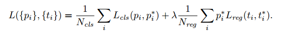
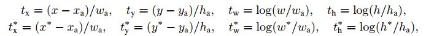

# Faster R-CNN: Towards Real-Time Object Detection with Region Proposal Networks

## Contact me

* Blog -> <https://cugtyt.github.io/blog/index>
* Email -> <cugtyt@qq.com>, <cugtyt@gmail.com>
* GitHub -> [Cugtyt@GitHub](https://github.com/Cugtyt)

> **本系列博客主页及相关见**[**此处**](https://cugtyt.github.io/blog/papers/index)

---

<head>
    
    
</head>

## Abstract

Fast R-CNN和SPPnet暴露出区域提议计算是瓶颈。我们提出了区域提议网络(RPN)，可检测网络共享卷积特征，使得区域提议基本没有计算负担。RPN是全连接网络，可以和判断目标边界一起做，RPN使用端到端的训练生成高质量的区域提议，这被Fast R-CNN用于检测。通过简单的轮换优化，RPN和Fast R-CNN可以共享卷积特征训练。

## Introduction

基于区域的CNN计算量很大，通过共享卷积可以极大减少计算量。但是区域提议是现在的计算瓶颈。

我们使用深度网络实现优雅和高效的解决方案，使得区域提议的计算量在检测网络计算中基本消失。我们提出了区域提议网络(RPN)，共享卷积层，计算量非常小。

我们观察到基于区域的检测器的卷积特征图可以用来生成区域提议。在这些卷积特征上，我们构建了RPN通过加入两个卷积层：一个把每个卷积图位置编码成一个短的特征向量，另一个把每个特征图位置输出一个目标分数，不同尺度的k个区域提议回归边界。

我们的RPN是一种全卷积网络，可以对生成检测提议任务端到端的训练。把RPN和Fast R-CNN结合起来，我们提出了一个简单的训练方案，在固定提议的情况下，在微调区域提议任务和目标检测任务间交替。这个方法收敛很快，可以通过共享卷积特征成为一个统一的网络。

我们在PASCAL VOC进行了实验，Fast R-CNN+RPN的准确率比选择搜索+Fast R-CNN好。同时速度也很快。

## Related Work

【略】

## Region Proposal Networks

RPN输入一张任意大小的图片，输出矩形提议的集合，每个包括一个目标分数。我们实验了ZF模型，它有5个可共享的卷积层，和VGG，它有13个可共享的卷积层。

为了生成区域提议，我们在最后一个共享卷积层输出的卷积特征图上滑动一个小网络。这个网络和输入特征图的一个n\*n的空间窗全连接。每个滑动窗映射到一个低维向量（ZF是256维，VGG是512维），这个向量输入两个全连接层，一个框回归层，一个分类层。我们使用n=3设置感受野，有效感受野是很大的（ZF是171像素，VGG是228像素）。如图1，注意到由于小网络操作在一个滑动窗上，所以全连接层在整个空间域上共享。这个结构用一个n\*n卷积层和两个1\*1卷积层。n\*n卷积层的输出使用了ReLU。

### Translation-Invariant Anchors

每个移动窗，我们同时预测k个区域提议，所以回归层有4k输出，编码了k个坐标框，分类层有2k输出，对每个提议预测有没有目标。k个提议与k个框对应，成为锚。每个锚集中在有问题的滑动窗，与尺度和长宽比有关。我们使用了3种尺度和3种长宽比，这样每个滑动位置有9种锚。对于W\*H的特征图，有WHK个锚。

MultiBox方法使用k-means生成800个锚，但不是尺度不变的。

### A Loss Function for Learning Region Proposals

训练RPN，我们给每个锚赋值了一个二分类标签。两种锚赋值正类：（1）和真实值之间有最高的IOU，（2）可真实值的IOU高于0.7。一个真实值框可以赋值给多个锚正类。如果IOU低于0.3赋值为负类。非正非负不对训练目标贡献。

我们的损失函数定义为：

i是锚的索引，$p_i$是锚i为一个目标的概率。如果锚是正，真实标签$p_i^*$为1，否则为负。$t_i$是预测边界框的坐标，$t_i^*$是真实值。分类损失$L_{cls}$是两个类的log损失，目标和非目标。回归损失我们使用，其中R是鲁棒损失（平滑L1）。`$p_i^*L_{reg}$`表示在锚为正类`$p_i^*$`回归损失激活，否则失效。分类和回归层的输出包括{$p_i$}和{$t_i$}，这两个通过$N_{cls}$和$N_{reg}$标准化，用权重$\lambda$平衡。

对于回归我们采用了参数化的坐标：

每个回归器对一个尺度和长宽比负责，k个回归器不共享权重。因此，可以对不同大小边界框预测，即使特征是固定大小的。

### Optimization

RPN是全卷积网络，可以端到端的使用反向传播训练。虽然可以对所以的锚优化损失函数，但是由于负类很多，所以会偏向负类。我们随机从图像中采样256个锚，来计算损失函数，正负类比例1：1。

### Sharing Convolutional Features for Region Proposal and Object Detection

我们希望在RPN和Fast R-CNN之间共享卷积层,这不是说定义一个网络包括了RPN和Fast R-CNN，然后一同使用反向传播优化。因为Fast R-CNN的训练取决于固定的目标提议，目前还不清楚同时改变提议方法是否会收敛。我们提出了4步训练算法来交替优化：

第一步，训练RPN，使用ImageNet预训练模型初始化，然后微调。第二步，训练一个独立的检测网络，使用第一步的RPN网络生成区域提议来训练。检测网络也使用ImageNet上预训练模型初始化，这样这两个模型不共享卷积层。第三步，我们使用检测网络初始化RPN训练，但是固定共享卷积层，只是微调RPN独有的层，现在这两个网络共享卷积层。最后一步，保持共享卷积层不变，微调检测网络的全连接层。这样，两个网络共享相同的卷积层，组成了一个统一的网络。

### Implementation Details

我们使用单一尺度的图像训练和测试区域提议和目标检测网络。我们把图像重设大小。多尺度的特征提取或许会提升准确率，但是还没有一个很好的权衡。我们注意到ZF和VGG，最后一层卷积层所有的步长是16像素，即使这样的大步长提供了好的结果，小步长也许会有更好的效果。

对于锚，我们使用了3个尺度，$128^2,256^2,512^2$，3个长宽比，1:1,1:2,2:1。

如果跨边界的离群点不被忽略的话，会造成大的难以修正的错误，训练也不会收敛。

一些RPN提议和其他高度重叠，为了减少冗余，我们采用了基于类别分数的非最大抑制（NMS）。我们展示了NMS不会损害检测准确率，但是明显的减少了提议数量，在NMS后，我们使用top-N等级的提议区域。

## Experiments

对于ImageNet上的预训练网络，我们使用了ZF网络的快速版本，有5层卷积层和3层全连接层。VGG16模型有13层卷积层和3层全连接层。我们主要衡量了mAP，因为这是主要的目标检测衡量标准。

表1显示了使用不同区域提议的结果，这里使用的是ZF网络。

### Ablation Experiments

我们进行了剥离实验。首先是RPN和Fast R-CNN共享卷积层的作用，我们停止了四步中的第二步，一点影响，这是因为第三步检测器特征用于微调RPN，提议质量得到提升。

接着我们看RPN对于Fast R-CNN检测的影响。这次RPN没有和检测器共享特征。

把SS换成RPN造成mAP的损失是因为测试和训练的不一致。

后面我们分别实验了分类和回归的RPN。分类层移除时，我们随机采样N个提议，N=1k时mAP基本不变，N=100时掉很严重，这说明分类分数是准确率高的原因。

另外，当回归层移除时，mAP掉了。这说明高质量的提议主要时回归位置的作用。

我们把ZF换成VGG，效果更好。

### Detection Accuracy and Running Time of VGG-16

表2时提议和检测的结果。表3是在VOC2012上的测试，表4是运行时间的总结。

### Analysis of Recall-to-IoU

我们计算在不同IOU下的召回率。图2是使用300，1k，2k提议的结果。

### One-Stage Detection vs. Two-Stage Proposal + Detection

表5是比较结果。

## Conclusion

我们提出了RPN用于高效和准确的区域提议生成，通过和下游检测网络共享卷积特征，区域提议基本没有负担，提升了区域提议的质量和整个目标检测的准确率。