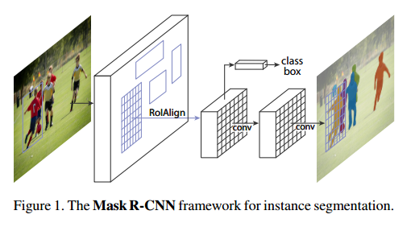
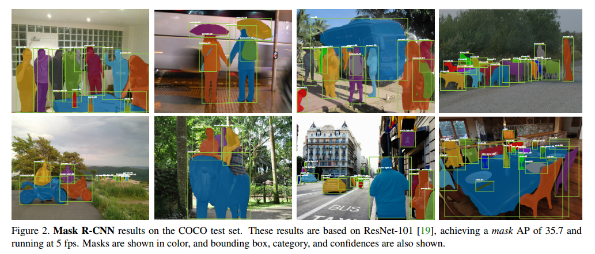
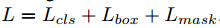
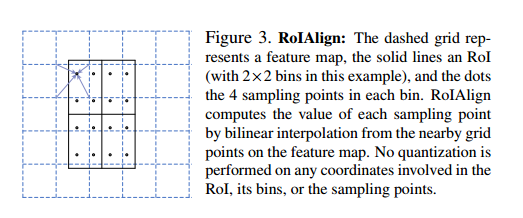
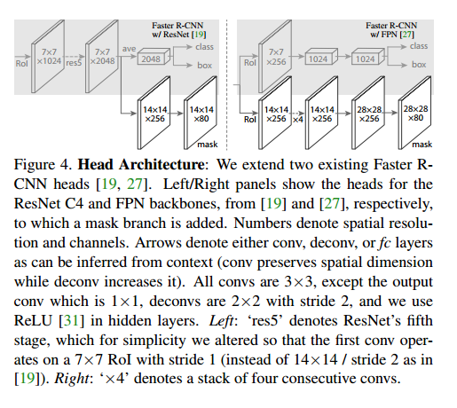
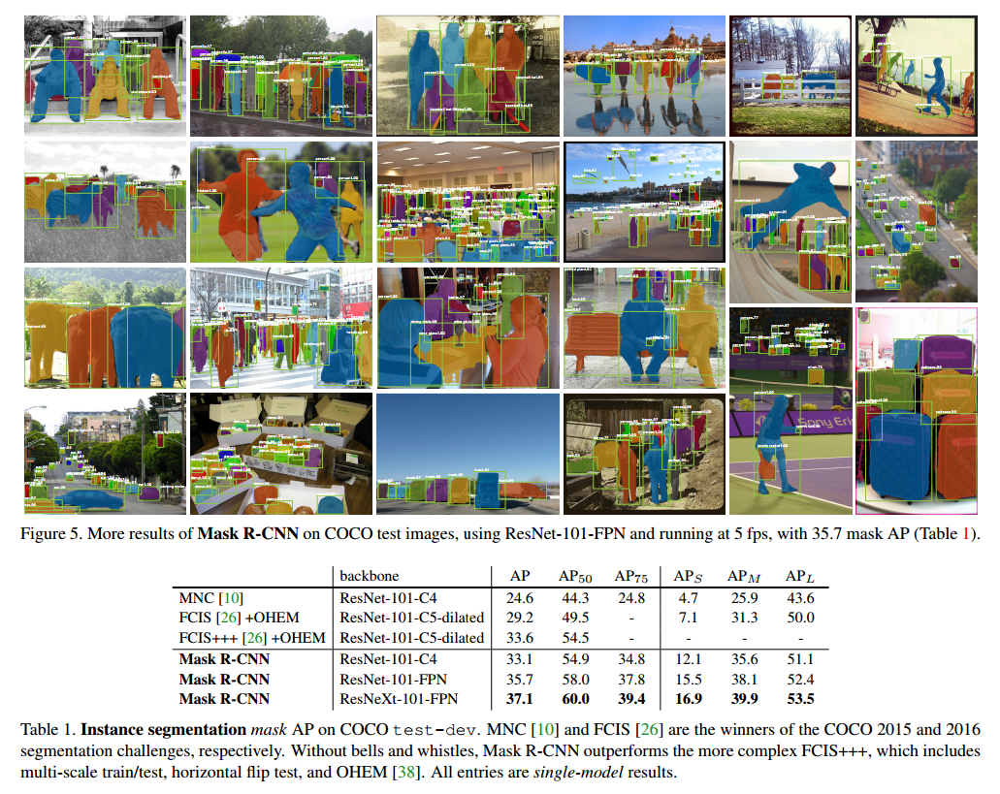
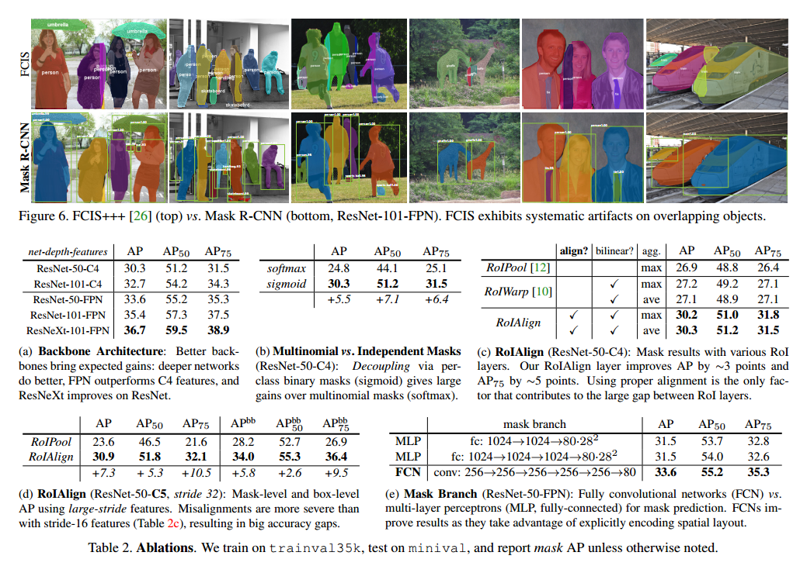
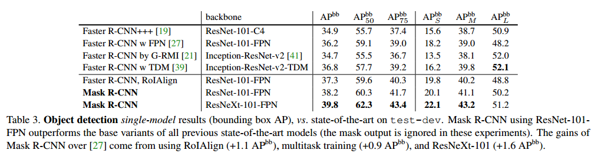
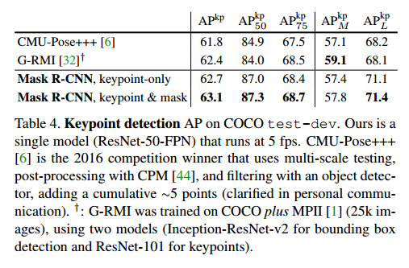
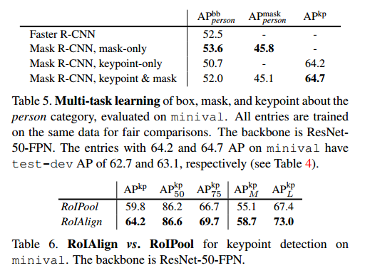

# Mask R-CNN

## Contact me

* Blog -> <https://cugtyt.github.io/blog/index>
* Email -> <cugtyt@qq.com>, <cugtyt@gmail.com>
* GitHub -> [Cugtyt@GitHub](https://github.com/Cugtyt)

> **本系列博客主页及相关见**[**此处**](https://cugtyt.github.io/blog/papers/index)

---

<head>
    
    
</head>

## Abstract

我们提出了一个概念上直观，灵活并且通用的目标实例分割框架。我们的方法可以高效的检测目标，同时对每个目标生成高质量的分割掩模。这个方法我们称作Mask R-CNN，扩展了R-CNN，通过加入一个预测目标掩模的并行分支，剩下的分支由于边界框识别。Mask R-CNN可以轻松的泛化到其他任务上。我们在COCO上展示了最好的性能，包括实例分割，边界框检测，人关键点检测。

## Introduction

实例分割包括目标检测，目标是对每个对象分类和用边框定位，包括语义分割，目标是对每个像素分类。

我们的方法，叫做Mask R-CNN，扩展了Faster R-CNN，通过加入对每个ROI预测分割掩模的分支，同时剩下的分支分类和回归。掩模分支是一个小的全连接网络，用到每个ROI上，预测像素级别的分割掩模。这个淹没分支只是加了一点计算量。我们提出了一个简单的，无量化的层，叫做ROIAlign，可以完好的保存确切的空间位置。虽然看起来是个微小的改变，但是ROIAlign有巨大的作用，他可以一提升掩模准确率从10%到50%，在严格的定位度量上有巨大的提升。其次，我们发现解耦掩模和分类预测很重要：所有我们对每个类别单独的预测一个二分类的掩模（有无），不用在类间竞争，使用网络的ROI分类分支来预测类别。相比而言，全连接网络通常是多类别分类，把分割和分类放在一起，在我们的实例分割上效果很差。

## Related Work

**R-CNN**通过一系列的目标区域候选，对每个ROI独立的用CNN衡量。通过ROIPool得到了扩展，速度和准确率得到了提升，Faster R-CNN通过学习注意力机制，用RPN进一步提升。

**Instance Segmentation**目前的一些方法在识别之前做分割，这样慢而且不怎么准确，我们的方法同时做掩模和分类预测，简洁灵活。与一些方法的分割优先的策略不同，我们的方法基于实例优先策略。

## Mask R-CNN

Mask R-CNN概念上非常简单：Fast R-CNN对于每个目标候选有两个输出，一个类别标签，一个边界框补偿。因此我们加了第三个分支输出目标掩模。但是这个附加的掩模输出与类别和框输出不同，它需要更为细致的目标空间层次。

**Faster R-CNN**Faster R-CNN包括两个阶段，第一个阶段，成为区域提议网络（RPN）用于边框提议。第二个是Fast R-CNN的原型，对每个候选用ROIPool提取特征，执行分类和回归。这两个阶段可以共享特征变得更快。

**Mask R-CNN**采纳了两阶段的步骤，第一个阶段不变。第二个阶段，分类和边框补偿并行处理，Mask R-CNN也同时输出一个二分类的掩模。

在训练时，对每个采样的ROI我们定义了多任务的损失，，$L_{cls}$和$L_{box}$和原文定义的一样，掩模分支有$Km^2$维输出，把m\*m的分辨率编码为K个二元掩模。我们对每个像素执行sigmoid，定义$L_{mask}$为二元交叉熵损失，与类k的ROI，$L_{mask}$只定义在第k个掩模（其他的掩模输出不对损失贡献）。

我们对$L_{mask}$的定义允许网络对每个类别生成掩模，而不产生类间冲突。我们依赖于分类分支来选择输出的掩模。这解耦了掩模和类别的预测。

**Mask Representation**掩模把输入目标的空间排列编码。因此不像类别标签和边框补偿通过全连接不可逆的转为一个短的向量，掩模提取的空间结构可以通过卷积实现像素级别的对应。

具体来说，m\*m掩模对应到m\*m个像素点上，我们的全卷积网络参数更少，实验证明更准确。

**RoIAlign**：是提取细小特征图的标准方法。它首先量化ROI的浮点数到离散，然后细分到空间区间，这些区域本身是量化的，最后聚合每个空间的特征值（通过最大池化）。做法是，例如一个连续的坐标x计算[x/16]，16是步长，[$\cdot$]是取整，然后分入空间例如7\*7，这个量化会导致ROI和提取到的特征不吻合的情况。分类没有太大问题，但是对于像素级别的掩模就有很大影响。

我们提出了RoIAlign层来解决这个问题，把ROIPool的尖锐量化去掉，让特征和输入很好的吻合。我们做的改变非常简单：避免了ROI边界或空间的任何量化，例如我们实验x/16而不是[x/16]，我们使用线性插值法计算4个经常采样位置的准确特征值，然后把他们聚合，如图3。我们注意到只要没有量化，结果对准确的采样位置和多少采样点不敏感。

ROIAlign导致巨大的提升。比ROIWarp还好。

**Network Architecture**为了证明我们方法的通用性，我们在多个网络结构上进行了实验：（1）backbone，基于卷积的网络用于整个图片的特征提取，（2）head，用于边界框识别的网络（分类和回归），掩模预测在每个ROI上独立运行。

backbone表示网络深度特征，head我们加了一个全卷积掩模预测分支。

### Implementation Details

**Training**正如在Fast R-CNN中，ROI被当作正类，如果和真实值的IOU至少为0.5，否则是负类。掩模损失$L_{mask}$只定义在正ROI上。掩模的目标是ROI和真实掩模的交集。

我们采用了图像中心的训练，图像重设大小为800像素，每个批量有2张图片，每个图片有N个采样的ROI，正负比例是1：3。N在C4是64，FPN是512.

**Inference**测试时，C4是300个提议，FPN是1000个提议，跟着是非最大抑制。掩模分支应用在分数最高的100个检测框。虽然这和训练时并行运算不同，但是它加速了推断，提升了准确率。掩模分支对每个ROI预测K个掩模，但是我们只使用第k个掩模，k是分类分支预测的类别。m\*m浮点掩模大小缩放到ROI的大小，通过阈值0.5二分。

## Experiments: Instance Segmentation

### Main Results

我们比较了Mask R-CNN和目前最好的方法，结果在表1中。我们的模型效果最好。

Mask R-CNN的输出在图2和图5中。

在图6我们比较了Mask R-CNN的基准和FCIS+++。

### Ablation Experiments

表2是我们的结果。

**Architecture**表2a是Mask R-CNN和多个backbones。

**Multinomial vs. Independent Masks**在表2b我们比较了不与类别竞争的掩模分支（通过每个像素的sigmoid和二元分类）和每个像素softmax和多项式损失。结果显示，一旦实例已经被分类，这说明已经足够预测二元掩模，而不用关系类别，模型可以更好的训练。

**Class-Specific vs. Class-Agnostic Masks**我们默认是类别明确的掩模，也就是每个类m\*m个掩模。有趣的是，不知道类性能也差不多，。

**RoIAlign**对我们提出了ROIAlign的衡量在表2c中。

**Mask Branch**分割是像素的任务，我们在全卷积网络上进行了探索，在表2e中，我们比较了多次感知机和全卷积网络。

### Bounding Box Detection Results

在表3中我们比较了Mask R-CNN和目前最好的边界框检测。

### Timing

**Inference**【略】

**Training**【略】

## Mask R-CNN for Human Pose Estimation

我们的模型可以轻松的扩展到人类姿势估计。我们把关键点的位置作为one-hot的掩模，借鉴Mask R-CNN预测K个掩模，每个有K个关键点。

**Implementation Details**我们把分割系统做了一小点改变来做关键点检测。对于实例的每个K关键点，训练目标是one-hot的m\*m二元掩模，只有单个像素标记为背景。训练时我们最小化每个关键点的交叉熵。

**Main Results and Ablations**见表4，我们的方法更简单更快。

更重要的是我们的是一个统一的模型，可以同时预测边界框，分割，关键点检测。更多的剥离实验见表5。我们还探索了ROIAlign在关键点检测的作用，见表6。

【附录】略