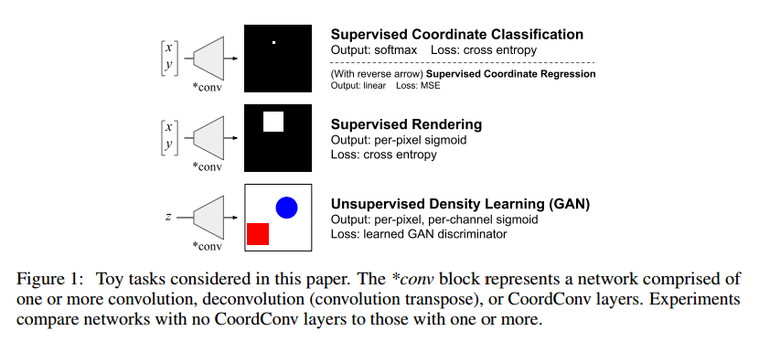
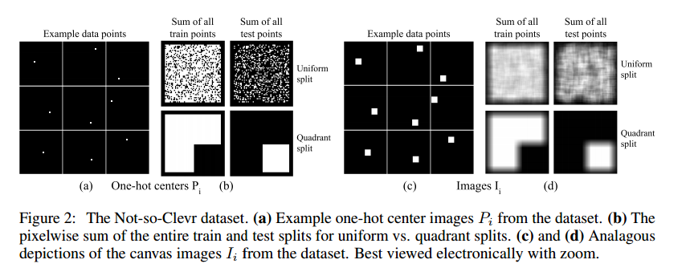
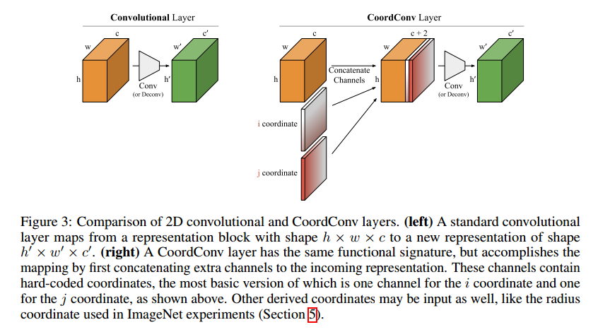
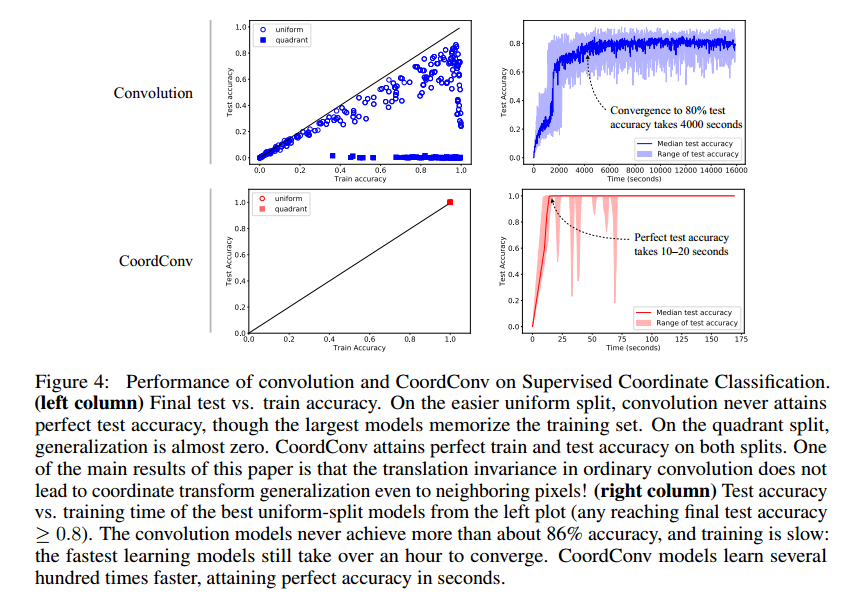
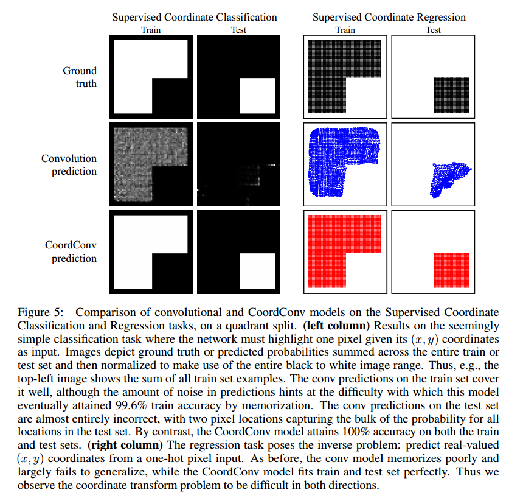
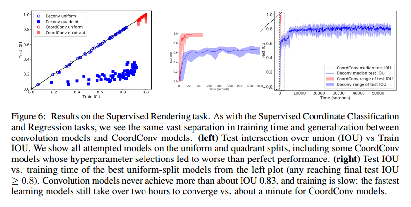
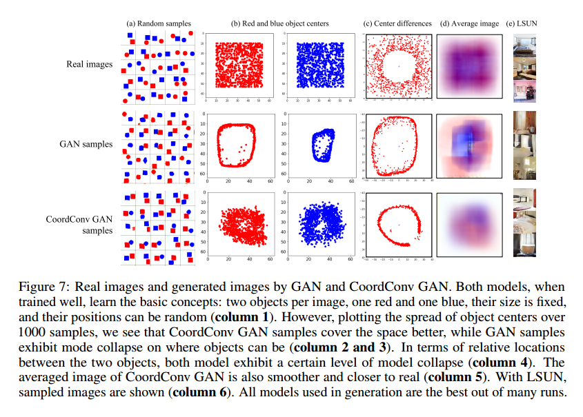
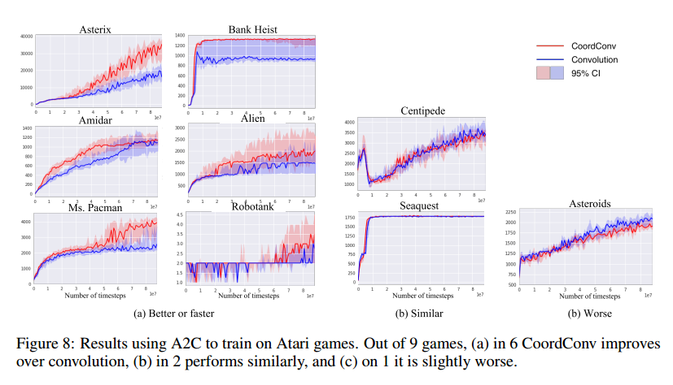

# An intriguing failing of convolutional neural networks and the CoordConv solution

## Contact me

* Blog -> <https://cugtyt.github.io/blog/index>
* Email -> <cugtyt@qq.com>, <cugtyt@gmail.com>
* GitHub -> [Cugtyt@GitHub](https://github.com/Cugtyt)

> **本系列博客主页及相关见**[**此处**](https://cugtyt.github.io/blog/papers/index)

---

<head>
    <script src="https://cdn.mathjax.org/mathjax/latest/MathJax.js?config=TeX-AMS-MML_HTMLorMML" type="text/javascript"></script>
    <script type="text/x-mathjax-config">
        MathJax.Hub.Config({
            tex2jax: {
            skipTags: ['script', 'noscript', 'style', 'textarea', 'pre'],
            inlineMath: [['$','$']]
            }
        });
    </script>
</head>

## Abstract

本文我们展示了一个反例说明不是任何时候用卷积网络都是合适的，这个反例看起来就是一个简单的坐标转换问题。虽然卷积网络看起来对这个任务很合适，但是它彻底失败了。我们首先在一个小问题上证明和小心的分析了这个失败，一个简单的修正解决了这个问题。我们的解决方案叫做CoordConv，通过另外的卷积通道让卷积获取它自己的输入坐标。不损害普通卷积的计算和参数性能，CoordConv允许网络学习平移不变或者任意的转换角度。CoordConv在坐标转换问题上有很好的泛化性，比一般的卷积快150倍，参数数量少10-100倍。现在有初步的证据说明把普通卷积换成CoordConv可以提高模型在一系列任务上的表现。GAN使用CoordConv有更少的模式坍塌，从像素到潜在表示的转换更加容易，Faster R-CNN使用CoordConv在MNIST上的IOU好24%，强化学习也从中受益。

## Introduction

虽然之间的CNN可以在很多任务上有不错的表现，但是在其他一些问题上可以通过特化的层来加速。检测模型如Faster R-CNN使用网络层来计算坐标转换和集中注意力，空间转换网络使用可微摄像头把CNN输出转换的更好处理。生成模型如DRAW使用迭代的接收、集中微调画布，而不是使用简单的CNN来生成图像。这些模型都是设计者觉得标准CNN在一些方面能力不足。

我们探究和分析CNN在两种不同类型空间表示的能力不足：从密集Cartesian表示到稀疏基于像素的表示，或者反过来。虽然看起来对网络简单，但是比预期要难，至少当模型是普通卷积层的堆叠是这样的。即使卷积层的堆叠在像图像分类上占有主要地位，但是对于坐标转换却不是个正确的选择。

本文主要贡献如下：

* 我们定义了一个简单的数据集Not-so-Clevr，包含画布上随机位置的方块。
* 我们定义了CoordConv运算，允许卷积知道他们在Cartesian空间的位置，这是通过加入额外的，硬编码的包含数据坐标的输入通道。
* 剩下的篇幅，我们实验了坐标转换问题，从一个最简单的场景开始，终结于一个最复杂的场景。虽然在这个简单问题上的结果应该吃怀疑观点，但是以小见大，我们可以探索和了解它的细节。后面我们显示了这个简单场景中的问题在实际的任务中也是存在的。我们首先展示了坐标转换是困难的，即使这个问题很小、有监督的。在有监督的坐标分类任务，给定一个输入像素坐标，我们训练一个CNN高亮它的输出。有监督的坐标分类任务还需要反过来：给定一个包含单个白像素的输入图像，输出它的坐标。我们展示了这对于卷积网络是困难的，但是使用CoordConv就容易了。
* 有监督的坐标分类任务通过要求网络画出整个图像,从Not-so-Clevr数据集，给定图像中小方块的坐标。这个任务仍然是完全监督的，对于普通卷积很困难，对于CoordConv很简单。
* 我们显示了把普通卷积层替换为CoordConv可以在一系列任务中提升性能。在双对象Sort-of-Clevr图像中，GAN和VAE使用CoordConv有更少的模式坍塌，也许是因为坐标转换转化为2维Cartesian空间的隐含表示。带CoordConv的更大的GAN可以发现普通GAN没有观察到的几何转换。在Fast R-CNN加入CoordVonv效果更好。打游戏的agent加入CoordConv可以获得更好的分数。



## Not-so-Clevr dataset

我们定义了Not-so-Clevr数据集，这个数据集是单一目标的，灰度版Sort-of-CLEVR。它是64\*64画布上9\*9的方块，位置数有限的，因此中心落在56\*56的区域，因此一共有3136个样本，每个样本i包括三个部分：

* $C_i \in R^2$，是中心坐标
* $P_i \in R^{64 * 64}$是中心像素的one-hot表示
* $I_i \in R^{64 * 64}$是64\*64的画布

我们定义了训练集和测试集，uniform，所有的可能位置随机分割为80/20，quadrant，3/4的训练，1/4测试，如图2。这个图像可以用python代码生成：

``` python
onehots = np.pad(np.eye(3136).reshape((3136, 56, 56, 1)), ((0,0), (4,4), (4,4), (0,0)), "constant")
images = tf.nn.conv2d(onehots, np.ones((9, 9, 1, 1)), [1]*4, "SAME")
```



## The CoordConv layer

CoordConv层是标准卷积层的一个扩充，卷积层大量的运用，因为他们通常工作的很好，也许是三个因素：他们参数很少，可以在GPU上快速计算，学习的函数是平移不变的。

CoordConv保持了前两个属性，参数少和计算高效。但是允许网络学习保持或忽略第三个：平移不变，如果任务需要的话。或许抛弃平移不变会限制网络的性能，但是我们将会看到，分配一部分网络的容量给平移不变对非平移不变问题建模可以极大提升模型，泛化也会更好。

图3显示了CoordConv与标准卷积的对比。具体来讲，对于i坐标通道，他是h\*w的1阶矩阵，第一行0，第二行1，第三行2，依次类推，j通道相似，但是是以列填充的。对于坐标值，我们做了线性缩放到[-1, 1]。两个坐标通道一般已经足够了，如果还需要可以再加。



**Number of parameters**除了偏置参数，在标准卷积层中，k大小的核，c输入通道，c'输出通道包括$cc'k^2$个权重，对应的CoordConv层包括$(c+d)c'k^2$权重。

**Translation invariance and relations to other work**如果CoordConv的权重非0，那么会有一定的平移依赖，准确形式依赖于任务。CoordConv允许学习平移依赖，但是参数更少，$(c+d)c'k^2$ vs. $hwcc'k^2$。因为参数是共享的，因此平移依赖只来自于坐标的特殊性，像普通卷积但是核局部连接层不同，运算可以扩展到原始空间域外。

【略】

## Supervised Coordinate tasks

### Supervised Coordinate Classification

第一个最简单的问题是监督坐标分类，和图1一样，给一个坐标(x, y)作为输入，网络学习画出准确的坐标。在每一个像素是一个类的情况下这是一个简单的多分类问题。我们后面会说到这个简单任务的性能和大问题上的性能是有关系的。

图4是在uniform和quadrant上训练和测试准确率的结果。我们发现，普通卷积模型有一些泛化，但是从来没有达到100%，最好也只在测试中达到86%的准确率。一个初步的结论是从一个光滑函数从(x,y)到one-hot像素对于卷积网络来说是困难的。在quadrant上，卷积网络根本不能泛化。图5是预测的结果。





通过简单的对比，CoordConv模型达到了完美的性能。

### Supervised Coordinate Regression

这个问题惊人的困难，我们也实验了相反的转换。注意到这个转换是可以用VAE和GAN把像素转换到高层次的隐含编码。标准卷积网络虽然在uniform可以有一定的泛化，但是在quadrant上却失败了。一个小的全卷积网络可以微调在quadrant达到有限的泛化，但是在uniform上就失效了。而CoordConv模型，一个单一的CoordConv层紧接着几层标准卷积，在两个任务上都可以快速的训练和泛化。

### Supervised Rendering

我们在Supervised Rendering任务上比较了卷积核CoordConv网络的性能，这个任务要网络根据(x,y)位置的方块产生一个64\*64的图像。如图6，我们观察到了相似的情况。



## Applicability to Image Classification, Object Detection, Generative Modeling, and Reinforcement Learning

在其他任务上的表现如何。

**ImageNet Classification**加入额外的一个1\*1CoordConv层，8个输出通道提升了ResNet-50的Top5准确率0.04%。

**Object Detection**这个天然的坐标转换问题似乎是很适合CoordConv的。我们发现使用CoordConv，Faster R-CNN的IOU提升了24%。

**Generative Modeling**训练的很好的生成模型可以生成令人惊讶的图片，但是细心的检查会发现模式坍塌：获取图片质量很好，但是样本多样性与数据集相比很少。模式坍塌可能出现在很多维度，包括内容，风格，位置。我们假设位置的模式坍塌是由于从高层次的隐含空间到像素空间的坐标信息的转换的难度，CoordConv也许可以帮忙。首先我们试验了一个简单的任务，生成一个带颜色的形状，在所有可能的几何位置，使用GAN和VAE生成。然后我们把问题扩展到大范围场景理解(LSUN)，使用分布式训练GCGAN来做。

使用GAN生成简单的带颜色对象，图7a-d展示了样本图像和模式坍塌分析，我们观察到卷积GAN在二维分布到一维分布的流形会表现出模式坍塌。对应的CoordConv GAN模型生成的对象更好，参数只有7%。

在LSUN，图7e是样本。我们观察两个，每个模型的随机绘画质量相当，在潜在空间插值的集合变换行为。

潜在空间插证明了在生成带颜色对象，潜在空间移动导致生成对象的坐标移动。在LSUN上，普通卷积生成固定对象淡入淡出，加上CoordConv，我们看到平滑的集合转换，包括平移和变形。



**Reinforcement Learning**在A2c中加入CoordConv导致一些游戏的表现极大提升，但不是所有。图8是结果，我们使用OpenAI的基线实现，使用了默认的参数。



## Conclusion and Future Work

我们显示了坐标转换任务中CNN的无能为力，使用CoordConv可以解决这个问题，结果显示CoordConv在一系列的应用中可以提升性能。