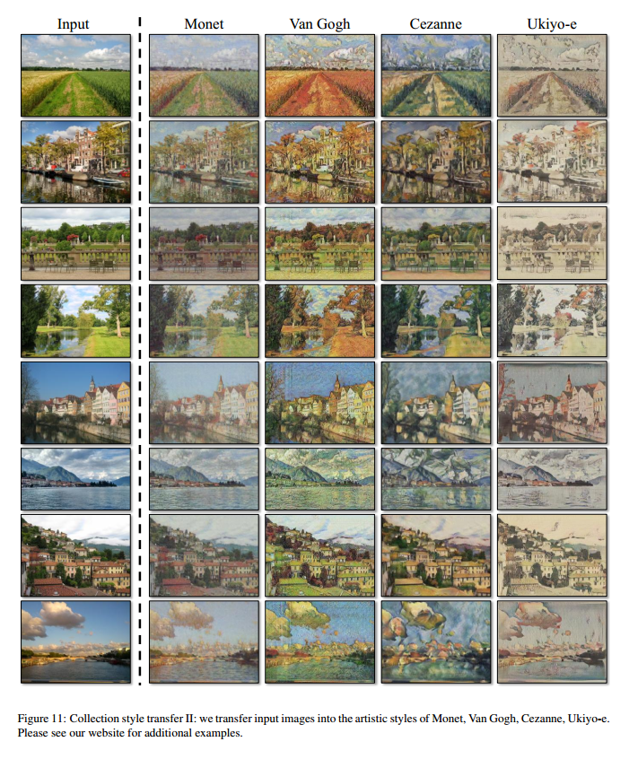

# Unpaired Image-to-Image Translation using Cycle-Consistent Adversarial Networks

## Contact me

* Blog -> <https://cugtyt.github.io/blog/index>
* Email -> <cugtyt@qq.com>, <cugtyt@gmail.com>
* GitHub -> [Cugtyt@GitHub](https://github.com/Cugtyt)

> **本系列博客主页及相关见**[**此处**](https://cugtyt.github.io/blog/papers/index)

---

<head>
    
    
</head>

## Abstract

图像到图像的转换问题目标是学习输入和输出图像的映射，使用的是图像对。但是这样的数据不是什么时候都有的，我们提出了一个方法可以在没有样本对的情况将输入变换到输出。我们的目标是学习一个映射：G: X->Y，使用对抗损失让二者无法区分。因为这个映射是高度无约束的，我们把它和反向映射结合起来F: Y->X，引入环形一致损失强迫$F(G(X)) \approx X$(加上反向)。在没有数据对的情况下，我们展示了几个任务上的定性结果。几个方法的定量比较显示出我们方法的优越性。

## Introduction

本文展示了一个方法可以捕获图像的特征，然后转移到其他图像上去，前提是没有可训练的样本对。

这个问题可以粗略的描述为图像到图像的转换问题，但是问题在于获取成对的数据非常困难和昂贵，我们试图寻找一个算法可以在没有样本对的情况下学习域之间的转换，我们假设域之间有潜在的联系，训练一个映射G:X->Y，输出$\hat{y} = G(x), x \in X$，让对抗分类无法区分二者。实践中我们发现很难独立的训练对抗目标，标准的流程总是会导致模式坍塌，所有的输入图像映射到一个相同的输出，使得优化失效。

这个问题让我们加入了更多的结构。因此我们探索了环形一致的属性，它的涵义是说如果我们把英语翻译为法语，然后再翻译回来，那么我们应该回到原始的句子。我们的做法是同时训练映射G:Y->X和F:X->Y，加入环形一致损失鼓励$F(G(x)) \approx x$和$G(F(y)) \approx y$。对抗损失结合这个损失构成了我们整个图像到图像转换的目标。

我们在一系列任务上实验了我们的方法。

## Related work

**Generative Adversarial Networks (GANs)**在图像生成等问题有惊人的结果，GAN成功的关键是对抗损失强迫生成的图像和原始图像无法区分。我们吸取了这一点。

**Image-to-Image Translation**我们的方法基于像素到像素的框架，使用条件生成对抗网络。我们的不同之处在于没有成对的样本。

**Unpaired Image-to-Image Translation**和以前的研究不同，我们的方法不依赖于任何具体的任务，不需要预先定义相似函数，不需要假设输入和输出在相同的低维空间，这让我们的方法更加通用。

**Cycle Consistency**一些工作

**Neural Style Transfer**是另一种图像到图像的转换，通过一个图像的内容和另一个图像的风格结合生成一个新的图像，我们的主要关注点是学习两个图像集之间的映射，而不是两个特定的图像，因此我们的方法可以用到其他任务上，例如绘画到照片，目标变形等。

## Formulation

我们的目标是学习两个域X和Y之间的映射函数，我们把数据分布记作$x \sim p_{data}(x), y \sim p_{data}(y)$。如图3，我们的模型包括两个映射：G:X->Y和F:Y->X，另外我们引入了两个对抗判别器$D_x$和$D_y$，$D_x$是区分x和F(y)，$D_y$是区分y和G(x)。我们的目标函数包括两个部分，对抗损失用于区分生成域和目标域，环形一致让G和F不会相互冲突。

### Adversarial Loss

我们的对抗损失是

### Cycle Consistency Loss
 
对抗训练在理论上是学习一个映射G和F输出目标域Y和X的同等分布.但是网络容量足够大的时候，我们可以把相同输入集中的图像映射到目标图像域中随机变换。因此对抗损失不足以保证学到期望的输出。为了减少映射函数的空间，我们认为映射函数应该是环形一致的。

环形一致损失是：

我们尝试了把L1替换为对抗损失，F(G(x))和x的，还要G(F(y))和y的，但是没有观察到性能提升。一致性损失见图4。

### Full Objective

我们的完整目标是：

其中$\lambda$控制两个目标的重要性。我们目标是求解：

注意到我们的模型可以看作是两个自动编码器：一个自动编码器$F \circ G: X \to X$和$F \circ G: Y \to Y$，但是这些编码器有特殊的内部结构，他们把图像映射到一个中间表示在再到原始图片。这可以看作是特殊形式的对抗自动编码器。

## Implementation

**Network Architecture**我们的网络包括两个步长为2的卷积，几个残差块，两个步长为1/2的卷积。对于128\*128的图像我们使用了6个块，256\*256的图像使用9个块。我们使用了实例标准化，判别网络我们使用了70\*70的PatchGANs。

**Training details**我们使用了两个方法来稳定我们的模型：首先，对于$L_{GAN}$我们把负对数似然替换为最小平方损失，这个损失训练更稳定，生成的质量更高。具体来说，对于GAN损失$L_{GAN}(G,D,X,Y)$我们训练G最小化，训练D最小化。其次为了减少模型的波动，我们采取Shrivastava的策略，使用历史生成的图像而不是最近生成的图像来更新判别器，我们使用了缓存来存50张历史图片。

我们设置目标函数的$\lambda$为10，使用Adam，批量大小是1，所有的网络完全重新训练，学习率是0.0002，我们保持了100周期，然后下100周期线性衰减到0。

## Results

我们先和最近的方法进行了比较，研究了对抗损失和环形一致损失的重要性，和一些变种进行了比较，最后我们证明了我们的方法在没有数据对的情况下有很好的泛化性。

### Evaluation

#### Metrics

**AMT perceptual studies**前10个实验，每次实验都有participant关于对不对的反馈，其余40个尝试用于评估算法骗过participant的比例，每次只测试一个算法，

**FCN score**虽然感知学习似乎是评估真实情况的黄金标准，但是我们也尝试了自动质量评估，我们使用了FCN分数，这个分数衡量生成图像的可解释效果。

**Semantic segmentation metrics**为了衡量图像到标签的性能，我们使用了Cityscapes基准的标准衡量，包括每个像素的准确率，每个类的准确率，IOU均值。

#### Baselines

**CoGAN**学习一个从X到Y的GAN生成器，前几层固定用于共享本征表示。

**SimGAN**使用对抗损失训练从X到Y的转换，正则项`$||X - G(X)||_1$`表示惩罚。

**Feature loss + GAN**我们测试了SimGAN的变种，L1计算预训练网络的深度特征，而不是像素值。

**BiGAN/ALI**学习G和F，但是他们设计是用于把本征向量z映射到图像x上，我们对于从图像到图像的映射实现了相同的目标函数。

**pix2pix**是在数据对上训练的，我们在没有数据对的情况下可以和这个上界多解决。

为了比较公平，我们在相同的结构和方法上实现了这些基准，除了CoGAN，它从共享的本征表示生成图像，这和我们的图像到图像是不匹配的，我们使用了它的公开实现。

#### Comparison against baselines

图5和图6中，我们都不能达到任何基准，另一方面，我们的方法能够达到的转换和完全监督的pix2pix质量相似。

表1是AMT感知显示任务的性能。表2是标签到图像任务的性能。表3是图像到标签。

#### Analysis of the loss function

在表4和5中，我们做了剥离实验，移除GAN损失极大降低了结果，移除循环一致损失也一样，因此两者都很重要。在单向方法GAN+forward环形一致损失和GAN+backward环形一致损失，发现这回造成模式坍塌，图7是一些样本。

#### Image reconstruction quality

在图4中我们展示了一些随机重构样本F(G(x))，我们观察到这些图像和原始输入很接近。

#### Additional results on paired datasets

图8是一些其他数据对数据集用pix2pix的样本结果，例如CNP Facade Database的标签到图像的结构，UT Zappos50K数据集的边到图像。

### Applications

**Collection style transfer (Figure 10 and Figure 11)**我们可以把图像转换到整个艺术风格上，而不是像其他方法那样单一的风格转换。

**Object transfiguration (Figure 13)**在类类进行转换。

**Season transfer (Figure 13)**

**Photo generation from paintings (Figure 12)**对于绘画到图片，我们发现引入额外的损失可以鼓励输入到输出图像的色彩保留。

没有$L_{identity}$，G和F可以自由的改变色彩。这个隼戳的影响见图9。

**Photo enhancement (Figure 14)**

**Comparison with Gatys et al** 图15

图16是相似的比较。

## Limitations and Discussion

虽然我们的结果不错，但是还不是稳定的好。图17是一些典型的失败情况。在颜色和文里转换中，我们的方法经常成功，我们也探索了需要几何改变的转换，有一点成功，例如把狗换成猫。

一些失败是由于训练集的特征分布造成的。我们也观察了有数据对和无数据对之间的较大间隔。