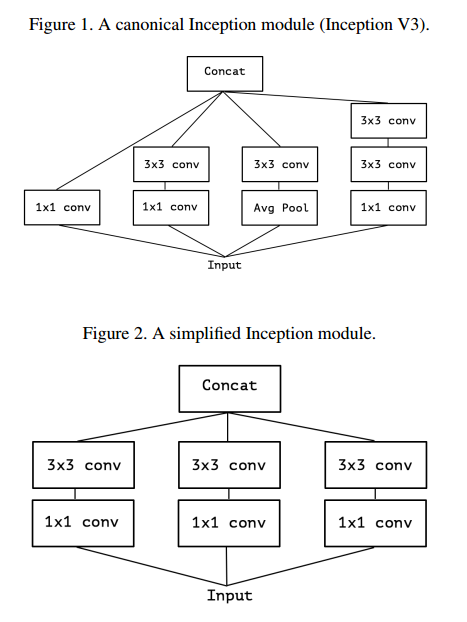
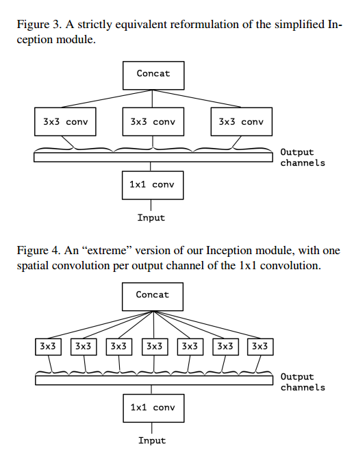
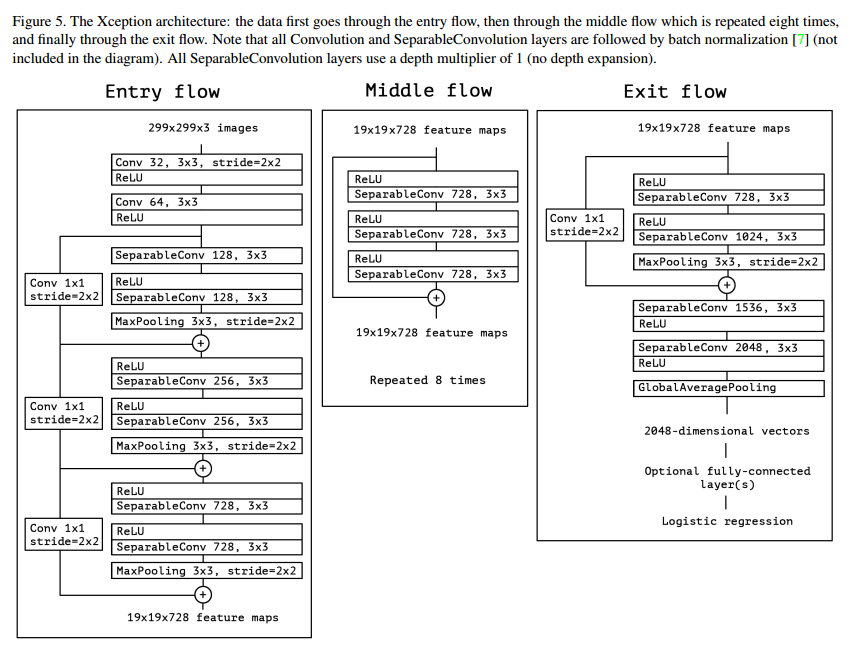
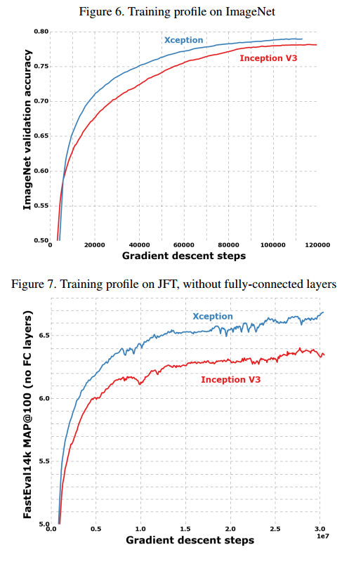
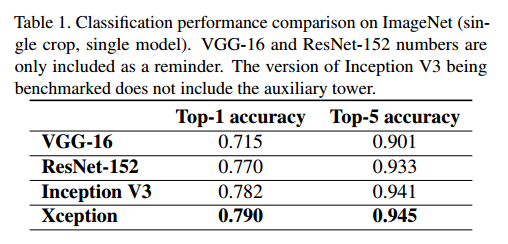
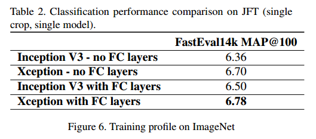
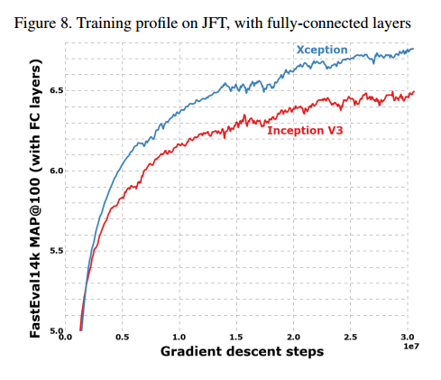
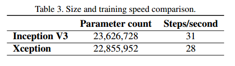
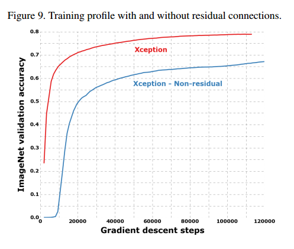
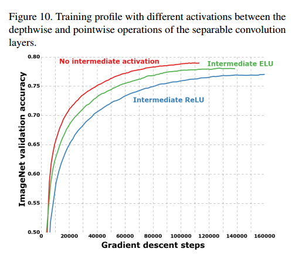

# Xception: Deep Learning with Depthwise Separable Convolutions

## Contact me

* Blog -> <https://cugtyt.github.io/blog/index>
* Email -> <cugtyt@qq.com>, <cugtyt@gmail.com>
* GitHub -> [Cugtyt@GitHub](https://github.com/Cugtyt)

> **本系列博客主页及相关见**[**此处**](https://cugtyt.github.io/blog/papers/index)

---

## Abstract

我们提出了对Inception的解释，它是普通卷积和深度可分卷积的中间步骤（深度可分卷积后跟着点卷积）。这样，深度可分卷积可以理解为一个Inception模块和最大数量的塔。这样一个新的结构就是Inception模块替换为深度可分卷积，这个结构我们叫它Xception，在ImageNet上比Inception V3好一点，在更大的图像分类上好很多。由于Xception和Inception V3参数数量一样，因此性能提升不是由于模型的容量，而是模型参数的高效利用。

## Introduction

卷积网络的历史【略】

### The Inception hypothesis

卷积层试图学习一个3D空间的滤波器，有两个空间维度和一个通道维度，因此一个单一的卷积核同时映射跨通道的相关关系和空间的相关关系。

这样Inception模块后的思想就明了了，我们可以把它分解为一系列操作，这些操作独立的查看跨通道的和空间的相关关系。距离来讲，标准的Inception先通过1\*1卷积看跨通道的关系，把输入映射到3或4个分离的比原来小的空间，然后通过3\*3或5\*5的卷积进行映射。如图1所示。实际上，Inception的基本思想是跨通道和空间的相关关系可以高效的解耦，而不是把它们一起映射。

考虑一个简化的Inception，只使用一种大小的卷积，例如3\*3，而且不饱和均值池化塔，如图2，这个模块可以重写为一个大的1\*1卷积跟着空间卷积，这样可以在输出通道的不重叠部分进行运算，如图3。这就会催生一个问题，这些部分的数量有什么作用？是否有更强的理论，可以假设跨通道和空间相关完全分离进行映射？

### The continuum between convolutions and separable convolutions

在这个更强的假设上，一个极限的版本是先使用1\*1的卷积进行跨通道的映射，然后在映射每个通道的空间相关。如图4。我们认为这个极限版本基本等同于深度可分卷积。

一个深度可分卷积，通常叫做可分卷积，意思是通道输入中间的空间卷积是独立的，跟着一个点卷积，1\*1的卷积，映射到一个新的通道空间。不要和空间可分卷积搞混，这也通常叫做可分卷积。

这个极限版本和深度可分卷积的两个小的不同是：

* 运算的顺序：深度可分卷积通常先是通道级别空间卷积，然后是1\*1的卷积，而Inception是先1\*1的卷积。
* 第一个运算后的非线性。在Inception中，所以的运算后面跟着ReLU，但是深度可分卷积通常没有非线性。

我们认为第一个区别不重要，尤其因为这些运算时堆叠的，第二个不同可能重要，我们会进行实验。

我们注意到Inception和深度可分卷积的中间形式：事实上，普通卷积核深度可分卷积之间有个离散谱，由空间卷积的独立通道-空间部分的数量控制。一个普通的卷积（在1\*1之前），在这个频谱的一个极端，对应于一个单一部分的情况，一个深度可分卷积对应于其他的极端，每个通道一个部分。Inception在中间，把几百个通道划分到3或4个部分。

在这些观察下，我们建议通过把Inception模块替换为深度可分卷积来提升性能，也就是建立一个堆叠深度可分卷积的模型。

## Prior work

* 卷积网络，尤其是VGG16，和我们的模型在一些方面相似。
* Inception结构，首先证明了把卷积分成多个分支（先是通道，然后空间）的优越性。
* 深度可分卷积，是我们模型的基础。空间可分卷积有很早的历史了，可以到2012或更早，深度可分卷积是最近的。一些历史【略】提到了MobileNet
* 残差网络也在我们的网络中有用。

## The Xception architecture

我们提出了一个假说：跨通道和空间相关关系的映射可以完全解耦。完整的网络描述在图5中。Xception有36层卷积，实验中我们着重关注图像分离，这样我们的卷积使用逻辑回归。36层的卷积可以分到14个模块，全部是线性的残差连接，除了第一个和最后一个。

简单来说，Xception就是深度可分卷积的一个线性堆叠加上残差连接。这让我们的结构很好定义和修改。

## Experimental evaluation

我们比较了Xception和Inception V3，因为它们很相似，它们的参数数量差不多，见表3。因此任何性能的不同不能归结于网络容量。我们的数据集是1000类的ImageNet，一个是17000类的多标签JFT数据集。

### The JFT dataset

我们使用了辅助数据集FastEval14K，我们使用了map作为衡量标准。

### Optimization configuration

在ImageNet的优化设置是：
* SGD
* 动量：0.9
* 初始学习率：0.045
* 学习率衰减：每两个周期衰减率0.94

在JFT：
* RMSprop
* 动量：0.9
* 初始学习率：0.001
* 学习率衰减：每3000000样本衰减率0.9

注意，这个设置是对Inception V3调的最好的学习率，我们没有对Xception微调。由于网络有不同的训练配置，见图6，这也许会导致次优解，尤其是在ImageNet上。

### Regularization configuration

* **Weight decay**Inception V3使用了L2正则化，衰减率是4e-5，这是在ImageNet上微调的。我们发现这对Xception是次优的，我们没有探索更优的衰减率，衰减率在ImageNet和JFT是一样的。
* **Dropout**ImageNet都使用了0.5，对于JFT没有使用，因为数据集很大。
* **辅助损失塔**Inception V3使用了辅助损失塔让反向传播更容易，我们没有包括这部分。

### Training infrastructure

### Comparison with Inception V3

#### Classification performance

ImageNet的结果是在验证集上而不是测试集。JFT式子30M的迭代后的结果，而不是完全收敛的结果。结果在表1和表2，还有图6-7-8。在JFT上，我们测试了包括全连接层和不包括的两个版本。

实验显示我们的模型要更好。在JFT上的模型效果比ImageNet好的多，我们认为这是由于Inception V3是专门针对ImageNet优化的。两个模型我们都没有对JFT做微调，因此调整超参数可能效果会更好。

#### Size and speed

在表3中，我们比较了Inception V3和Xception的大小和速度，Xception稍微慢一点。

### Effect of the residual connections

为了量化残差连接的优势，我们比较了加和不加残差连接的版本，如图9。由于我们的残差和无残差实验相同的配置，因此如果优化配置，无残差的可能会更好。

我们也发现即使不加残差连接，Xception也比Inception V3好。

### Effect of an intermediate activation after pointwise convolutions

我们前面也说到，深度可分卷积和Inception模块的类比中，深度可分卷积在深度级别和点级别之间有非线性，在目前的实验中，我们没有加入非线性。但是我们也比较了ReLU和ELU，结果如图10，我们发现没有非线性收敛更快，性能更好。这和Inception的研究是相反的，这也许是中间特征空间的深度的运用导致了非线性的不重要：对于深度的特征空间，非线性是有帮助的，但是对于浅层的，它是有害的，这可能和损失信息有关。

## Conclusions

我们展示了卷积和深度可分卷积在离散频谱的两个极端，Inception在中间点。这指导我们把Inception模块替换为深度可分卷积，基于这个思想我们提出了一个新的结构，参数数量和Inception V3差不多，但是性能更好。