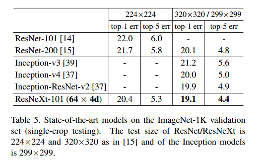

# Aggregated Residual Transformations for Deep Neural Networks

## Contact me

* Blog -> <https://cugtyt.github.io/blog/index>
* Email -> <cugtyt@qq.com>, <cugtyt@gmail.com>
* GitHub -> [Cugtyt@GitHub](https://github.com/Cugtyt)

> **本系列博客主页及相关见**[**此处**](https://cugtyt.github.io/blog/papers/index)

---

<head>
    
    
</head>

## Abstract

我们提出了一个简单高度模块化的图像分类网络结构，我们的网络通过重复构建块搭建而成，每个块是一系列相同拓扑结构的转换集合。我们的设计在同质、多分支结构上只需要少量超参数设置。这个策略催生了一个新的维度，我们叫做“基数（cardinality）”（转换的大小），是除了深度和宽度的一个重要的维度。在ImageNet-1K数据集上，我们展示了即使在受限复杂度下，增加基数可以提升分类准确率。另外，要增大容量可以增大计数，这比增大深度和宽度更高效。我们的模型叫做ResNeXt，在ILSVRC2016中排第二名，ImageNet5K和COCO中，比ResNet效果更好。

## Introduction

现在对视觉识别的研究正在从特征工程到网络工程，这个改变减少了人的作用，可以迁移到其他的识别任务中，但是人的作用都转移到设计网络结构学习表示去了。

参数数量增多导致结构设计变得困难，尤其是有很多层的时候。VGG使用了一个简单高效的方法来构建很深的网络：把相同形状的块进行堆叠。这个策略被ResNet继承了下去，这个简单的规则减少了参数的选择，深度被认为是网络非常关键的维度。另外我们认为这个简单的规则减少了对某个特定数据集的过度适应。在其他的任务上也证明了VGG和ResNet的鲁棒性。

与VGG不同的是，Inception模型家族证明了小心的设计拓扑结构可以达到很高的准确率，同时理论复杂度很低。虽然Inception一直在演化，但是一个共性是**分割-转化-合并**。输入被分割到一个低维嵌入，用一系列的滤波器转化，通过连接实现合并。可以看到的是这个模型的解空间是一个简单层在高维嵌入运算的一个约束子空间。这个特性让Inception有密集层的表示能力，但是计算复杂度又很低。

除了高的准确率，它的实现伴随着一系列的因素-滤波器数量和大小需要对每个转化定制，模块需要每个阶段自定义。虽然可以达到好的效率，但是如何把Inception的结构用于新的数据还不是很清楚，尤其是很多因素需要考虑。

我们提出了一个简单的结构，吸取了重复层的策略，也探索了分割-转化-合并。我们模型的每个模块是一个转化的集合，都是在低维嵌入上，输出通过加来聚合，所有的转化随时相同的结构，如图1右。这个设计可以让我们扩展到任意数量的转化，而不需要专门的设计。

有趣的是，在这个简化的情况下，我们的模型有两个等价形式，图3b的形式和Inception-ResNet模块相似，都连接了多条路径，但是我们模型的不同之处在于我们的路径又相同的拓扑结构，因此路径数量就是个容易实验的因素了。更简洁的表示就是组卷积了。

我们在实践中证明了我们的聚合转化比原来的ResNet要好，即使在计算复杂度和模型复杂度约束情况下。图1左右两个的FLOP和参数数量一致。我们可以简单的增大容量来增加准确率，保持或减少复杂度提升准确率是很少见的。

我们的方法揭示了基数（转化集的大小）是一个具体的可衡量的维度，除了宽度和深度外事极其重要的。实验证明了提升基数来增大容量比增大深度和广度更高效。

我们的模型很高效，101层的ResNeXt比ResNet200准确率更高，但是复杂度只有一半。

## Related Work

**Multi-branch convolutional networks**Inception是成功的所分支模型，每个分支需要小心自定义，ResNet可以看作是两分支的模型。

**Grouped convolutions**很少有关组卷积提升准确率的证据，一个特例是通道级别的卷积，它的组数和通道数一样。

**Compressing convolutional networks**分解时神经网络里使用广泛的方法，用于减少冗余和加速/压缩。

**Ensembling**对于独立的训练网络进行平均是一个高效的提升准确率的方法，大量的用于识别比赛。

## Ensembling

### Template

我们采用了VGG/ResNet的高度模块化的设计。我们的网络包括残差块的堆叠。这些块又相同的拓扑结构，服从两个简单的规则：（1）如果产出相同大小的空间图，块共享相同的超参数（宽度和大小），（2）每次空间图的下采样因子为2，快的宽度乘2。第二条保证了所有块的计算复杂度差不多相同。

### Revisiting Simple Neurons

一个简单的神经元可以看作时加权和，如图2。

这些操作可以看作是分割-转化-聚合的结合。1）分割：X被切片成低维嵌入，上面一维子空间$x_i$，2）转化，低维表示转化，上面是简单的缩放，$w_i x_i$，3）聚合，所有嵌入的转化聚合$\sum_{i=1}^D$。

### Aggregated Transformations

通过上面的分析，我们考虑把转化替换为更通用的函数，也可以是个网络，与Network-in-Network增加深度不同，我们的Network-in-Neuron扩展到新的维度：

其中C是要聚合的转化集大小，我们把C叫做基数，我们认为基数的维度控制了更复杂转化的个数。我们考虑了一个简单的方法设计转化函数，所有的T都是相同的拓扑结构，我们的结构见图1右。

这个聚合的形式在残差函数中是：

**Relation to Inception-ResNet**一些张量的操作显示图1右等价于图3b。图3b和Inception-ResNet块相似，引入了分支和残差拼接。但是不同的是，我们的多条路径都是相同的拓扑结构。

**Relation to Grouped Convolutions**以上的模块可以简单的用组聚集来表示，如图3c，所有的低维嵌入可以替换为一个单一的更宽的层，分割通过组卷积来完成，他把输入通道划分为组。组卷积把他们拼接起来作为输出。图3c中的块像图1左的残差块，但是更宽，稀疏的连接。

只有在块深度大于3的时候会有复杂的拓扑结构。如果块深度为2，就是一个宽的密集的模块，见图4。

**Discussion**我们注意到即使我们的重写导致了拼接或组卷积，但是这个重写不是总成立的，比如转化$T_i$获取随机的形式，且都是互异的。我们使用了同质的形式，因为他们是简单可扩展的。

### Model Capacity

在保持复杂度的情况下，评估不同的基数C时，我们希望最小化其他超参数的改变。我们选择调整瓶颈的宽度，因为这和输入输出独立。这个方法无需改变其他超参数，可以让我们专注于基数的影响。

在图1左，初始的ResNet块有70k的参数，在宽度d的情况下，图1右的参数为，FLOPs对应：

表2时基数C和瓶颈宽度d的关系。

## Implementation details

ImageNet数据集输入图像缩放到224大小。【略】 图3的三种形式在BN和ReLU准确的位置时是严格等价的。

## Experiments

### Experiments on ImageNet-1K

我们做了剥离实验，构建了50层和101层的残差网络，并简单的替换为我们的模块来构建我们的网络。

**Notations**在表1展示了ResNeXt-50，基数=32，瓶颈宽度为4d。这个网络记作ResNeXt-50(32\*4d)。我们注意到输入和输出宽度固定为256-d，每次特征图下采样的时候宽度加倍。

**Cardinality vs. Width**我们首先探索了基数C和瓶颈宽度的折中，复杂度保持一致，见表2。表3显示了结果，图5显示了错误曲线。

表3揭示了在复杂度一致，当瓶颈宽度较小，增加基数牺牲宽度后导致准确率饱和。我们认为不值得做一直减少宽度的折中，所以我们采用了不小于4d的瓶颈宽度。

**Increasing Cardinality vs. Deeper/Wider**我们探究了通过增加基数C或减少深度或宽度来增加复杂度。（1）更深，直到200层，我们使用了ResNet-200的实现，（2）更宽通过增加瓶颈宽度，（3）通过加倍C来增加基数。

表4显示了通过增加两倍复杂度来减少错误与ResNet-101基线的比较，更深或更宽的提升很小。

相反，与更深或更宽相比增加C显示了更好的结果。

**Residual connections**下面的表是残差连接的效果。

移除残差连接增加了错误率，这说明残差连接对于优化来说是很有帮助的。

**Performance**【略】

**Comparisons with state-of-the-art results**表5是更多测试的结果。我们的模型设计比Inception更简洁，需要手动设计的参数更少。

### Experiments on ImageNet-5K

5K数据集是22K的子集，详细解释【略】 图6和表6是复杂度一致的情况下的比较。

我们发现在5K的训练和在1K的训练一样的好，这个结果的实现没有增加训练时间，没有微调，我们认为这个结果具有普遍性，5K的任务更具有挑战性。

### Experiments on CIFAR

我们在10和100数据集上做了更多的比较。我们使用了和对应的残差网络结构。

我们比较了增加网络复杂度的两个情况：（1）增加基数，固定宽度，（2）增加宽度，固定基数=1。图7是错误率和模型大小的结果。我们发现增加基数比增加宽度更高效。表7是模型大小和宽度的比较。

### Experiments on COCO object detection

我们衡量了在COCO上的通用性，我们采用了基本的Faster R-CNN然后加入了ResNet/ResNeXt。模型用1K预训练，在检测任务上微调。表8是比较结果。

在Mask R-CNN上，我们达到了最好的结果。