# Squeeze-and-Excitation Networks

## Contact me

* Blog -> <https://cugtyt.github.io/blog/index>
* Email -> <cugtyt@qq.com>, <cugtyt@gmail.com>
* GitHub -> [Cugtyt@GitHub](https://github.com/Cugtyt)

> **本系列博客主页及相关见**[**此处**](https://cugtyt.github.io/blog/papers/index)

---

<head>
    
    
</head>

## Abstract

卷积网络基于卷积运算，通过局部感受野混合空间和通道信息来提取特征信息。为了加速网络的表示能力，一些方法展示了提升空间编码的益处。我们关注于通道关系并提出了一个新的结构单元，我们叫它“Squeezeand-Excitation” (SE)块，可以自适应的校准通道级别的特征响应，方法是显式地对通道依赖建模。我们证明了通过堆叠这些块，我们可以构建在多个数据上表现不错的结构SENet。关键是我们发现SE块可以极大的提升现在深度模型的性能，只是增加微量的计算。

## Introduction

对于卷积层来说，一个滤波器的集合去学习输入通道的局部空间连接模式，换句话说，卷积滤波器在局部感受野内期望于混合空间和通道信息达到信息联合。通过堆叠卷积层和非线性和下采样，CNN可以捕获分层模式。最近的工作证明了网络的性能可以通过显式地嵌入学习方法帮助捕获空间关系，而不需要额外的监督。这个方法被Inception推广。

本文我们研究了不同的结构设计角度-通道关系，通过引入一个新的结构单元，我们叫它SE块。我们的目标是通过显式地对通道依赖建模提升网络的表示能力。

基本的SE结构见图1。对于转化$F_{tr}: X \to U, X \in R^{H' \times W' \times C'}, U \in R^{H \times W \times C}$，我们可以构建出一个相应的SE块来做如下的校准。特征U先传入**压缩**操作，把跨越空间维度H\*W的特征图聚合产出一个通道描述。这个描述潜入了通道响应的全局分布，可以让全局感受野的信息被更低的层利用。然后是一个激励运算，特定的样本被激活，这被每个通道以基于通道依赖的自门控机制学习，然后管理每个通道的激励。特征图U然后被重新加权生成SE块的输出，直接输入到下面的层。

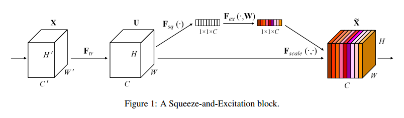

一个SE网络可以通过简单的堆叠SE块来生成。SE块可以替换掉任意深度结构的块。虽然每个块的模板是通用的，但是不同深度扮演的角色取决于网络的需要。在较早的层，以中立的态度学习激励信息特征，增强共享更低层表示的质量。后面的层，SE块变得逐渐特化，对于不同的输入以高度特化的方式相应。SE块的特征校准的优势可以加速整个网络。

## Related Work

**Deep architectures**VGG和Inception模型证明了深度的有效性。BN通过正则化输入提升了梯度传播。ResNet展示了跨越连接的有效性。高速网络用门的方式正则化跨越连接。

组卷积可以用于提升基数，多分支卷积可以看作是这个概念的泛化，可以更灵活的压缩一些操作。最近自动的压缩表现出不错的性能。【等等】大部分的工作是减少计算和模型复杂度，揭示出通道的关系可以作为局部感受野对函数的压缩。

**Attention and gating mechanisms**注意力可以看作是个调账可用处理资源分配的工具，使得输入信号更具有信息性。【略】高容量的单元插入深度残差网络直接连接的部分。

## Squeeze-and-Excitation Blocks

压缩和激励块是一个计算单元，可以用于构建任意的转化：$F_{tr}: X \to U, X \in R^{H' \times W' \times C'}, U \in R^{H \times W \times C}$，为了简化我们把$F_{tr}$作为卷积运算。令$V=[v_1, v_2, \dots, v_c]$表示学到的滤波器的集合，我们可以把输出记作$U=[u_1,u2,\dots,u_c]$，其中:

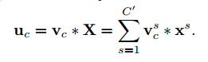

\*表示卷积。$V_c=[V_c^1,V_c^2,\dots,V_c^{C'}],X_c=[X^1,X^2,\dots,X^{C'}]$。由于输出是所有通道的求和，通道依赖隐式地嵌入了$V_c$。我们的目标是网络可以增加对信息特征的敏感性，这样他们就可以被后面的转化利用，压制没什么用的部分。我们通过显式地对通道依赖建模，用两个步骤来校准响应，压缩和激励。

### Squeeze: Global Information Embedding

为了解决通道利用的问题，我们首先考虑了输出特征每个通道的信号。每个学到的滤波器使用局部感受野运算，每个转换的输出单元U不能利用这个区域外的场景信息。这在低层中更严重，因为感受野更小。

为了缓解这个问题，我们提出压缩全局空间信息到一个通道描述。这可以使用全局均值池化生成通道统计值来完成。严格的，通过空间维度H\*W收缩U生成统计值$z \in R^C$，z中第c个元素可以计算为：

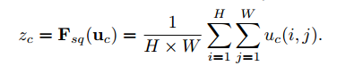

转化的输出U可以解释为局部描述的集合，统计值表示了整个图像。利用这个信息是特征工程的普遍情况，我们选择了最简单的全局均值池化，更复杂的局和策略也可以这样做。

### Excitation: Adaptive Recalibration

为了更好的利用压缩操作聚合的信息，我们使用了第二个操作用于完整捕获通道依赖。为了实现这个目标，函数必须满足两个要点，第一，必须灵活，尤其是它必须能够学习一个通道间的非线性关系，第二，它必须学习不排外的联系，因为我们希望保证多通道可以强烈的抵抗one-hot激活。我们用sigmoid实现了一个简单的门控机制：

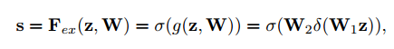

其中$\delta$表示ReLU，$W_1 \in R^{\frac{C}{r} \times C}, W_2 \in R^{C \times \frac{C}{r}}$。为了限制模型的复杂度和更好地泛化，我们在非线性周围用两层全连接层构建了瓶颈结构来参数化门控机制，也就是用参数W1和减少比率r的降维层，一层ReLU，然后参数为W2的维度增加层。最后的输出通过缩放转化输出加激活：

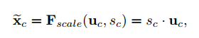

其中，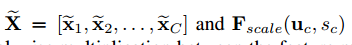表示特征图和标量通道乘。

这个激活作为通道权重，适应到特定输入的描述z。从这个角度看，SE块引入了输入的动态条件，帮助加速特征甄别。

### Exemplars: SE-Inception and SE-ResNet

可以直接把SE块用到AlexNet和VGG上，对于非残差的网络，例如Inception，SE可以通过把整个Inception模块作为转化$F_{tr}$，见图2。为了对结构中的所有块进行改变，我们构建了SE-Inception网络，另外SE块足够灵活可以用到残差网络上，图3描述了SE-ResNet模块。这里SE块的转化$F_{tr}$用于非同一性的分支。压缩和激励在同一性分支生都作用在求和之前。我们在表1描述了SE-ResNet-50和SE-ResNeXt-50。

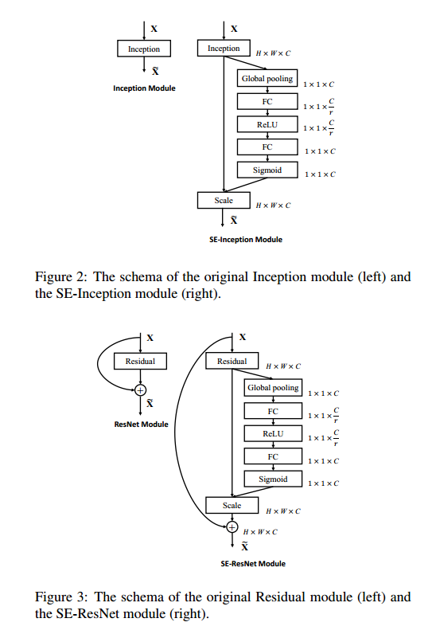
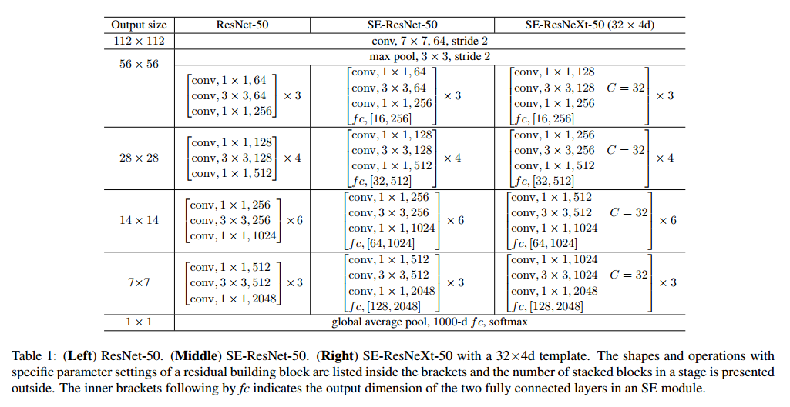

## Model and Computational Complexity

在实践中，必须要在模型复杂度和性能之间做折中，这对扩展是很重要的。我们设置了衰减率为16。为了描述模块的损失，我们比较了ResNet-50和SE-ResNet-200，SE更好，见表2。每个SE块在压缩阶段使用全局均值池化，两个小的全连接层用于激励，接着是一个不昂贵的通道缩放。

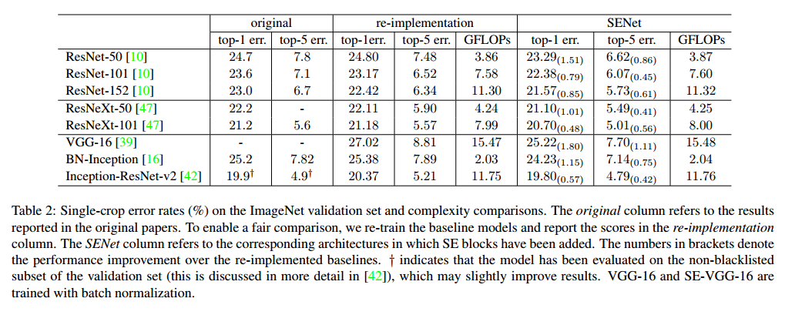

【略】

## Implementation

每个普通网络和对应的SE版都使用相同的方式做优化，在训练中，我们使用了标准的方案，使用数据增强和随机剪切到224，还有随机翻转。【略】

## Experiments

### ImageNet Classification

**Network depth**我们比较了SE-ResNet和ResNet在不同深度下的情况。表2是结果。可以看到SE都提升了性能，复杂度只有一点提升。

图4是SE-ResNet-50和ResNet-50的训练和验证曲线。

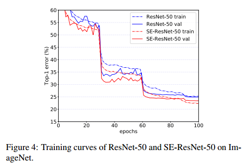

**Integration with modern architectures**我们也比较了Inception-ResNet-v2和ResNeXt，都更好。
【略】

最好我们对比了MobileNet和ShuffleNet，结果见表3。可以看到SE块可以提升准确率,只提升一点计算量。

**Results on ILSVRC 2017 Classification Competition**我们的一个高性能网络，SENet-154，把SE块和修改的ResNeXt结合起来，目的是达到最好的准确率，又不提升太多复杂度。我们和其他的模型作了比较，见表4。后来我们又训练了SENet-154，达到了更低0的错误率.

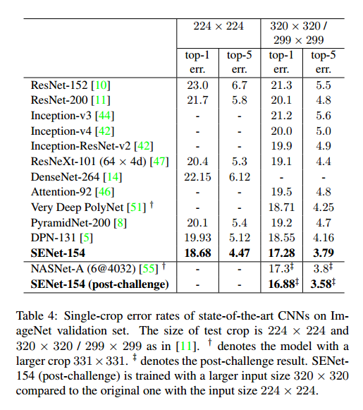

### Scene Classification

我们在Place365-Challenge数据集上做了实验。我们使用ResNet-152作为基线，表5是ResNet-152和SE-ResNet-152的结果。

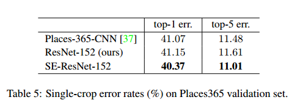

### Object Detection on COCO

我们在COCO上做了实验，使用了Faster R-CNN作为检测方法，使用了基础实现。表6是使用ResNet-50,ResNet-101和对应的SE的结果。

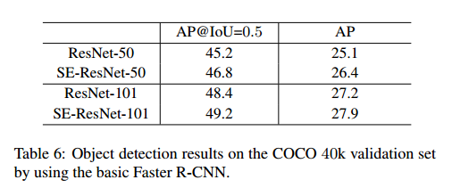

### Analysis and Interpretation

**Reduction ratio**衰减率是个重要的参数，可以让我们控制SE的容量和计算量。我们比较了一个范围的衰减率，结果见表7。我们发现设置为16适合好的准确率和计算复杂度的折中。

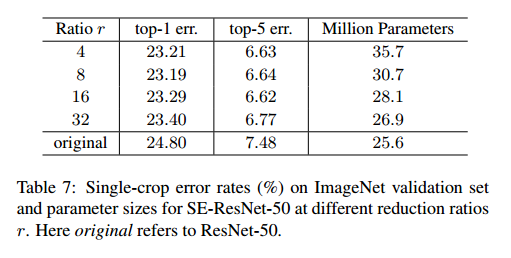

**The role of Excitation**虽然SE块可以提升网络的性能，但是我们希望可以理解自门控的激励机制。为了提供一个清晰的行为描绘，我们研究了SE-ResNet-50的激励和分布。见图5。

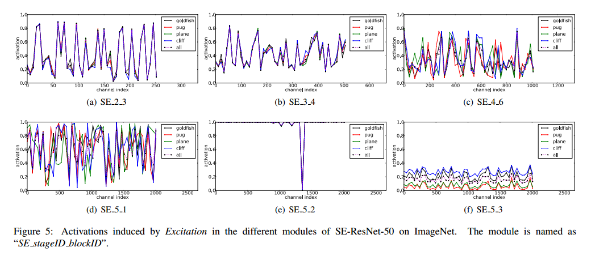

对于激励的角色，我们观察到以下三点，首先低层里不同类之间的分布是差不多的，这说明特征通道的重要性可能被不同的类在较早的阶段共享。有趣的是，第二点，深度越深，每个通道的值变得更加特化，对特征的判别值表现出不同的倾向。因此表示学习受益于SE块引入的校准，自适应的促进了特征提取和所需要内容的特化。最后一点，SE_5_2表现出有趣的饱和倾向，所有的激活接近于1，剩下的接近0，这个块变成了标准的残差块，在SE_5_3结尾，不同的类出现了相似的模式，上升到规模的变化。这意味着SE_5_2和SE_5_3对于网络校准比前面的块更不重要。

## Conclusion

我们提出了SE块，一个新的结构单元可以提升模型的表示容量，通过动态通道特征校准。实验证明了SENet的高效性，在多个数据集上都有好的表现。另外，他们提供了以前对通道特征依赖建模的局限性。