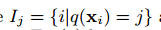
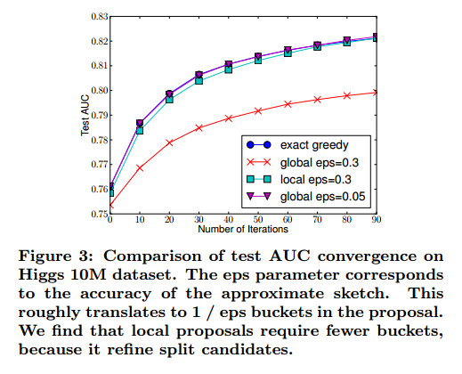

# XGBoost: A Scalable Tree Boosting System

## Contact me

* Blog -> <https://cugtyt.github.io/blog/index>
* Email -> <cugtyt@qq.com>, <cugtyt@gmail.com>
* GitHub -> [Cugtyt@GitHub](https://github.com/Cugtyt)

> **本系列博客主页及相关见**[**此处**](https://cugtyt.github.io/blog/papers/index)

---

<head>
    
    
</head>

## Abstract

Tree boosting是高效和广泛使用的机器学习算法，本文我们描述了一个可扩展的端到端的Tree boosting系统，叫做XGBoost，可以被广泛用于现在的机器学习算法挑战，达到最好的结果。我们提出了一个新的稀疏感知算法可以用于稀疏数据和稀疏树学习的加权分数位概览。更重要的是我们提供了缓存访问模式、数据压缩和共享的见解，可以构建一个可扩展的Tree boosting系统。把这些见解结合起来，XGBoost可以扩展到亿级别的样本，资源使用比现有的系统更少。

## INTRODUCTION

机器学习算法和数据驱动的方法在很多领域变得很重要，有很多应用，这些成功的应用的驱动因素有两点，使用高效的模型捕获复杂的数据依赖，可扩展的模型系统学习大数据集的模型。

在机器学习实践中，梯度tree boosting可以解决很多问题，在很多标准分类基准上达到了最好的结果。

本文我们描述了XGBoost，一个tree boosting的可扩展机器学习系统。它已经在帮助赢得了很多比赛。

这些结果证明了我们的系统在大范围的问题中可以达到最好的效果。虽然领域依赖的数据分析和特征工程非常重要，但是大家对XGBoost的一致选择展示了我们系统和tree boosting的重要性。

XGBoost最重要的因素是所有情境下的可扩展性。系统比很多单机上的解决方案要快10倍以上，可以在分布式或内存受限的情况下扩展到十亿级别的样本。可扩展性是由于几个重要的的系统和算法优化，包括：一种用于解决系数数据的新型学习算法，一个理论上公正加权分位数概览过程可以用树学习解决实例加权。并行和分布式计算可以让学习更快，也可以让模型探索更快。更重要的是，XGBoost探索了核外计算，可以让数据科学家在电脑上处理过亿的样本。最后，把这些技术结合起来做成一个端到端的系统，在最少的资源下扩展到更大的数据，文章主要的贡献是：

* 我们设计和搭建了一个高度可扩展的端到端tree boosting系统
* 我们提出了一个理论上公正加权分位数概览用于高效计算
* 我们引入了一个新的稀疏感知算法用于用于并行树学习
* 我们提出了一个高效的缓存感知块结构用于核外树学习

## TREE BOOSTING IN A NUTSHELL

这个部分我们回顾了tree boosting算法，我们对Friedman的方法做了一点正则目标改进，我们发现实践中是很有帮助的。

### Regularized Learning Objective

对于一个数据集有n个样本，m个特征，，一个树的ensemble模型（图1）使用K个额外的函数预测输出：

其中是回归树空间（也叫做CART）。这里q表示每个树的结构，把样本映射到对应的叶子索引，T是叶子数目。每个$f_k$对应于一个独立的树结构q和叶子权重w，不像决策树，每个回归树的叶子包括一个连续分数，我们使用$w_i$表示dii个叶子的分数。对于给定的样本，我们使用树的决策规则来把它分类到叶子上，通过对所有相关叶子分数求和计算最后的预测值。为了学习模型使用的函数集，我们使用了下面的正则化目标：

其中l是一个可微的凸损失函数，衡量预测值和真实值之间的差别，第二项$\Omega$是模型复杂度的惩罚。正则化项可以平滑最后的权重以防止过拟合。直觉上，正则化目标倾向于选择一个简单有用的模型。一个相似的正则化方法已经被正则贪心森林(RGF)模型使用。我们的目标和对应的学习算法比RGF更简单，更容易并行。当正则化参数设置为0，目标退化到传统的梯度tree boosting。

### Gradient Tree Boosting

树的ensemble模型的公式不能用传统的欧几里得空间的优化方法优化，所以模型用其他的方法训练。严格来讲，令$\hat{y}_i^(t)$为第i次迭代第i个实例预测，我们需要加入$f_t$来最小化目标：

这意味着我们贪心的加入了$f_t$最大的提升了模型。在通常的设定中二阶近似可以快速的优化目标：

其中是损失函数的一阶和二阶梯度统计。我们可以移除常数项达到最简化的形式：

定义作为叶子j的实例集，我们把$\Omega$展开为：

对于一个固定的结构q(x)我们可以计算最优权重为：

相应的最优值为：

可以用来做分数函数衡量树结构q的质量。这个分数像不纯度，除了它是从更广的目标函数导出的。图2是这个分数是如何计算的。

通常不可能遍历所有可能的树结构q。一个贪心的算法可以从一个简单的叶子开始迭代加入分支。假设$I_L$和$I_R$是划分后的左右叶子的实例集，令$I=I_L \cup I_R$，然后划分后的损失减少为：

### Shrinkage and Column Subsampling

除了正则化目标，两个额外的方法也用于进一步减少过拟合。第一个是收缩，收缩在树boosting后把新加入的权重用一个因子$\eta$来缩放。与随机优化的学习率相似，收缩减少了每个树的影响，把空间留给未来的树以提升模型性能。第二个方法是列下采样，这个方法已经用在随机森林上。根据用户反馈，使用列的下采样比传统的行采样更能防止下采样，这个方法也加速了并行计算。

## SPLIT FINDING ALGORITHMS

### Basic Exact Greedy Algorithm

树学习一个关键的问题是找到最好的划分。一个划分寻找算法是穷举所有可能的划分。我们把它叫做精确贪心算法，大部分现有的单机树boosting实现，例如sklearn,R的gbm和单机版本的XGBoost支持精确贪心算法。精确贪心算法见算法1。为了更高效，算法先把数据根据特征值排序，然后计算结构分数的梯度统计。

### Approximate Algorithm

精准贪心算法是很厉害的，因为它穷举了所有的可能划分。但是如果数据无法全部读入内存，他就无法高效实现，在分布式中也一样。为了在这两种情况下高效支持梯度树boosting，我们需要一个近似0的算法。

我们汇总了一个近似的框架，可以把以前的点子集成在一起，算法2。为了汇总，算法先根据特征分布百分数处理分割候选点。然后算法把连续特征映射到候选点分割的存储中，对统计聚合，找到最好的解法。

有两个算法的变种，取决于什么时候提议给定。全局变种在构建树的初始阶段提出所有的候选分割，在所有的分割搜索上使用相同的提议。局部变种在分割后重新提议。全局的方法需要更少的提议步骤。但是使用更多的候选点，因为候选在每次分割后没有微调。局部提议每次分割后微调了候选，对于更深的树可以潜在的更加精确。图3是在不同算法的比较。我们发现局部提议的确需要更少的候选。全局提议在足够多的候选下准确率可以和局部提议接近。

大部分现有的分布式树学习近似算法服从这个框架。值得注意的是，直接构建梯度统计近似直方图是可能的。除了分位数其他binning策略的变种也是可行的。从图3我们也发现分位数策略可以达到相同的准确率，条件是精确贪心给定合理的近似层次。

我们的系统高效的支持单机设置的精确贪心，和所有设定的局部和全局提议方法的近似算法。

### Weighted Quantile Sketch

近似算法中一个重要的步骤是提议候选分割点。通常一个特征的分位数是用来让候选分布均匀。严格的，令表示第k个特征值和每个训练实例的二阶梯度统计，我们可以定义一个秩函数

表示特征值k小于z的实例比例。目标是找一个候选分割点，使得

这里$\epsilon$是一个近似因子。直觉上，这意味着大约$1/\epsilon$的候选点。每个数据点权重为$h_i$，为了说明为什么表示权重，我们可以写作：

这完全是加权平方损失，对于大的数据集，找到一个满足要求的候选分割不简单。当每个实例有一样的权重时，一个现有的算法时分位点草图解决这个问题。但是没有分位草图用于加权数据集。因此，一些现有的近似算法或对一个数据的随机子集排序，但是有可能失败，或者启发式的方法但是缺乏理论保证。

为了解决这个问题，我们引入了一个新的分布式加权分位数草图算法可以解决加权数据，而且有理论保证。通常的主意是提出一个数据结构可以支持合并和修建操作，每个操作保持一个确定的准确度。

### Sparsity-aware Split Finding

在很多真实世界问题中，输入X是稀疏的是很常见的。有很多可能的原因：1）数据中的缺失值，2）统计中频繁的0值，3）人工特征提取，例如one-hot。算法的稀疏感知是很重要的。为了做到这点，我们提出对每个树节点加入一个默认的方向，见图4。当输入矩阵X的值是缺失的，实例分类到默认的方向。最优的方向是从数据中学到的。算法见算法3。关键的改进是只访问非缺失的实体。展示的算法对待没出现的值为缺失值，学习处理缺失值最好的方法。相同的算法可以用于用户指定的值不出现，限制穷举到一致的解法。

就我们所知，大部分