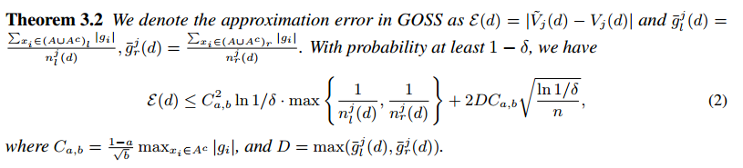
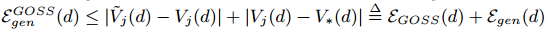

# LightGBM: A Highly Efficient Gradient Boosting Decision Tree

## Contact me

* Blog -> <https://cugtyt.github.io/blog/index>
* Email -> <cugtyt@qq.com>, <cugtyt@gmail.com>
* GitHub -> [Cugtyt@GitHub](https://github.com/Cugtyt)

> **本系列博客主页及相关见**[**此处**](https://cugtyt.github.io/blog/papers/index)

---

<head>
    
    
</head>

## Abstract

梯度推进决策树（Gradient Boosting Decision Tree，GBDT）是个人气很高的机器学习算法，也有不少高效实现，例如XGBoost和pGBRT。虽然这些实现引入了很多工程上的优化，但是特征维度很高，数据很大时效率和扩展性依旧不能令人满意。一个主要的原因是对于每个特征，他们需要扫描所有的数据来估计所有可能划分点的信息增益，这是非常耗时的。为了解决这个问题，我们提出了两个新的方法：Gradient-based One-Side Sampling (GOSS)和Exclusive Feature Bundling (EFB)。使用GOSS，我们排除了大部分梯度很小的数据，只用剩下的来估计信息增益。我们证明了，由于有较大梯度的数据在信息增益计算中有更重要的角色，GOSS可以在数据量较小时获得十分精确的信息增益估计。使用EFB，我们打包了互斥的特征（很少同时取到非0值），来减少特征的数量。我们证明了寻找最优打包互斥特征是NP-hard，但是一个贪心的算法可以达到很好的近似率（这样可以极大地减少特征数量，而不会怎么影响分割确定的准确率）。我们把新的GBDT+GOSS+EFB实现叫做LightGBM。我们在多个公开数据集上的实验展示了，LightGBM加速了传统GBDT训练过程20倍，达到基本相似的准确率。

## Introduction

GBDT被广泛使用，因为它的效率，准确率和可解释性。GBDT在很多机器学习任务上达到了目前最好的性能。近些年，大数据的出现，GBDT面临新的挑战，尤其是效率和准确率的折中。传统的实现需要对每个特征扫描所有的数据，对所有可能的划分点来估计信息增益。因此，计算复杂度与特征数和实例数成正比。这使得处理大数据的时候非常耗时。

为了解决这个问题，一个直接的想法是减少数据数量和特征数量。但是这很困难，例如如何做数据采样就不是很清楚。有一些工作根据权重采样数据来加速训练，但是不能直接套用到GBDT上，因为GBDT没有任何采样权重。我们在本文提出了面向这个目标的两个新方法。

**Gradient-based One-Side Sampling (GOSS)**虽然没有数据权重，但是我们注意到在计算信息增益时，不同梯度的数据扮演着不同的角色。尤其是，根据信息增益的定义，较大梯度的数据贡献更多的信息增益。因此我们应该尽量保留梯度大的数据（大于预定义的阈值，或者在高百分比上），随即丢掉梯度小的数据。在相同的目标采样率，尤其是信息增益值有很大范围情况下，我们证明了这个处理可以比均匀随机采样能得到更好的增益估计。

**Exclusive Feature Bundling (EFB)**通常在实际应用中，有大量的特征，特征空间非常稀疏，这让我们可以设计一个基本没有损失的方法来减少有效特征数量。特别是，在稀疏特征空间，很多特征是（基本）互斥的，也就是说他们很少同时取到非0值。这样的例子包括one-hot特征。我们可以安全的把这些互斥的特征打包。最后，我们通过把最优打包问题转为图填色问题（把特征作为点，在没有互斥的特征两个特征中加入边），设计了一个高效的算法，通过固定近似率的贪心算法来解决它。

我们把它叫做LightGBM，我们在多个公开数据集上展示了它可以加速20倍，依旧能达到基本相同的准确率。

## Preliminaries

### GBDT and Its Complexity Analysis

GBDT是决策树的集成模型，我们可以按顺序训练。每次迭代，GBDT通过拟合负梯度来学习决策树。

GBDT主要的成本是学习决策树，学习决策树最耗时的部分是找到最好的划分点。最流行的算法之一是使用预排序算法来寻找划分点。这个算法很简单，可以找到最优化分点，但是在训练速度和内存占用上低效。另一个算法是基于直方图的算法，如算法1。它不是在排好序的特征值中寻找分割点，而是把连续特征值装入离散的箱子中，训练时用这些箱子来构建特征直方图。由于基于直方图的算法在内存占用和训练速度上更高效，我们将基于它来完成我们的工作。

如算法1展示的，基于直方图的算法基于特征直方图来寻找最好的划分点。它建立直方图用O(#data\*#feature)，分割点寻找用O(#bin\*#feature)。由于#bin通常比#data小得多，直方图的建立就是计算复杂度的主要部分。如果我们减少#data或#feature，我们能够极大的加速GBDT训练。

### Related Work

有很多GBDT的实现，包括XGBoost,pGBRT,scikit-learn,R的gbm等。Scikit-learn和R的gbm实现是预排序的算法，pGBRT使用基于直方图的算法。XGBoost支持两者，比其他的工具更好，所以我们使用XGBoost来作为我们实验的基线。

为了减少训练数据的大小，一个通常的方法是对数据下采样。例如在文献[5]中，权重比设定的阈值小的数据会被过滤掉。SGB使用随机子集每次迭代训练一个弱的学习器。[6]中采样率在训练中动态调整。但是这些工作除了SGB都是基于AdaBoost的，不能够直接用于GBDT，因为GBDT中没有数据的权重。虽然SGB可以用于GBDT，但是准确率会有损失，因此也不是个期望的选择。

相似的，为了减少特征数量，很自然的做法是过滤弱的特征。这通常是主成分分析或投影寻踪来完成。但是，这些方法高度依赖于特征有很大冗余的假设，实践中这个并不总为真（特征通常因为特有的贡献而设计，移除一些也许会影响训练准确率）。

实际应用中大规模的数据集通常很稀疏。GBDT使用预训练算法通过忽略0值特征可以减少训练成本。但是基于直方图的算法没有高效稀疏最优解。因为GBDT使用直方图算法需要对每个数据检索特征箱（bin），无论特征值是否为0。首选使用基于直方图的GBDT可以高效的利用稀疏的特性。

为了解决原来的限制，我们提出了两个新的算法，叫做Gradientbased One-Side Sampling (GOSS)和Exclusive Feature Bundling (EFB)。

## Gradient-based One-Side Sampling

我们提出了一个新的采样方法可以在减少数据量和保持决策树准确率之间活得很好的权衡。

### Algorithm Description

在AdaBoost中，采样权重作为数据重要性的指示器。但是GBDT没有这样的采样权重，因此不能够直接应用。幸运的是，我们注意到每个数据的梯度可以为数据采样提供有用的信息。如果一个数据有小的梯度，这个数据的训练误差很小，意味着它依旧训练的很好了。一个直接的想法是丢弃这些梯度小的数据。但是数据的分布会因此改变，这会影响模型的准确率。为了避免这个问题，我们提出了一个新的方法叫做Gradient-based One-Side Sampling (GOSS)。

GOSS保留了大梯度的数据，对小梯度数据随机采样。为了补偿数据分布的影响，在计算信息增益的时候，GOSS引入了一个小梯度数据的常量乘子，见算法2。具体讲GOSS先根据梯度绝对值对数据排序，选择前a\*100%的数据。然后对剩下的采样b\*100%。接着，GOSS计算增益时对小梯度采样数据放大常数(1-a)/b。这样做，我们可以放更多的精力在未训练过的数据，而不需要改变太多原始数据的分布。

### Theoretical Analysis

GBDT使用决策树来学习输入空间$X^s$到梯度空间G的函数，假设我们有n个独立同分布的数据$\lbrace x_1, \cdots, x_n \rbrace$，其中每个$x_i$是维度为s的向量。每次梯度推进迭代，模型损失函数的负梯度输出记作$\lbrace g_1, \cdots, g_n, \rbrace$。决策树在信息增益最大的梯度上划分节点。对于GBDT，信息增益通常是划分后的方差来衡量的。

**定义3.1**令O为固定决策树节点的训练数据。在点d划分特征j的方差增益定义为：

对于特征j，决策树算法选择，计算最大的增益`$V_j(d_j^*)$`。然后数据在点`$d_{j^*}$`处划分特征$j^*$到左节点和右节点。

GOSS方法中，首先我们根据下降方向梯度绝对值排序，然后保持前a\*100%梯度大的数据，得到子集A，接着对于剩下的(1-a)\*100%梯度数据小的集合$A^c$，我们随机采样一个子集B，大小为$b \times \lvert A^c \rvert$，最后，我们根据子集$A \cup B$上估计的方差增益$\tilde{V}_j(d)$分割数据：

这样在GOSS中，我们在一个小的子集上使用估计的$\tilde{V}_j(d)$而不是全集上精确的$V_j(d)$来决定划分点，计算成本可以大幅度减少。更重要的是，下面的理论揭示了GOSS不会损失太大的训练准确率，同时也胜过随机采样。

**定义3.2**

根据这个理论，我们有如下讨论：(1)GOSS的渐进估计率是。如果分割不是太过于不平衡（也就是说，并且），那么近似误差主要由公式2的第二项决定。$O(\sqrt{n})$在$n \to \infty$时会减少到0。(2)随机采样是GOSS在a=0时的特例。在大多数情况下，GOSS胜过随机采样，条件是，这等价于.

下面我们分析GOSS的泛化性能。我们考虑GOSS的泛化性能为，这是GOSS采样训练数据的方差增益和潜在分布的真实方差增益之间的差距。我们有。因此泛化误差在近似很精确的情况下接近整个数据集的误差。另一方面，采样会增加基学习器的多样性，这可以潜在的帮助提升泛化性能。

## Exclusive Feature Bundling

我们提出了一个新的方法可以显著地减少特征数量。

高维数据通常非常稀疏。特征空间的稀疏性给我们设计一个近似无损失减少参数数量的方法提供了可能。具体来讲，在系数的特征空间，大量的特征是互斥的，也就是说，他们从不同时取到非0值。我们可以安全的把互斥特征打包到一个单一特征（我们把它称作一个互斥特征包）。通过小心地设计特征扫描算法，我们可以从特征包构建一个和独立特征相同的特征直方图。这样，直方图构建的复杂度从O(#data \* #feature)变成了O(#data \* #bundle)，这里#bundle << #feature。然后我们可以极大的加速GBDT的训练，而不影响准确率。

有两个问题要解决，第一个是决定那些特征要打包到一起，第二个是如何构建这个包。

**理论4.1**把特征分割到一个最小数量的互斥包是NP-hard问题。

证明：我们把图填色问题简化为我们的问题。由于图填色问题是NP难问题，我们可以推断出我们的结论。

给定一个图填色问题的数据实例G=(V,E)。我们构建一个问题的实例如下。把矩阵G每行作为特征，取一个我们问题的$\lvert V \rvert$特征实例。容易看到我们问题的一个互斥特征包对应于相同颜色节点的集合，反过来也一样。

对于第一个问题，我们提出了理论4.1，找到最优打包策略是NP难的，这说明在多项式时间内找到精确解是不可能的。为了找到好的近似算法，我们先把最优打包问题简化为图填色问题，做法是把特征作为节点，在每两个不互斥的特征中加入边，然后我们使用贪心算法，它可以为图填色得出一个差不多好的结果（在常数近似率），来产出包。另外，我们注意到有很多特征，虽然不是100%互斥，但是基本上不会同时取到非0值。如果我们的算法可以允许一小部分冲突，我们可以得到一个更小数量的特征包，进一步提升效率。简单计算下，随机污染一个小部分特征值最多影响训练准确率，其中$\gamma$是每个包最大冲突率。所以如果我们选择一个相对小的$\gamma$，我们可以在准确率和效率之间更好的平衡。

基于以上讨论，我们设计了一个做互斥特征打包的算法，见算法3。

首先我们构建一个加权边的图，权重对应于特征间的整体冲突。第二，我们通过图中的度对特征降序排列。最后，我们检查每个排列好的特征，或者在小的冲突（由$\gamma$控制）下赋值给一个已存在的包，或者创建一个新的包。算法3的时间复杂度是`$O(\#feature^2)$`，只需要训练前处理一次。这个复杂度在特征不是太大是可以接受的，但是在百万级别特征下就不行了。为了进一步提升效率，我们提出了一个更高效的不需要图的排序策略：对非0值计数，这和通过度排序非常相似，因为更多的非0值通常导致更高概率的冲突。由于我们只改变排序策略，算法2中新算法的细节就略去了。

对于第二个问题，我们需要一个好的方法对同一个包内的特征合并，用于减少训练复杂度。关键点是保证原始特征值可以在包中区别开来。由于基于直方图的算法存储了离散的箱(bin)而不是连续的特征值，我们可以构建一个特征包让互斥的特征在不同的箱中。这可以通过加入原始特征值的补偿(offsets)来完成。例如，假设我们的包里有两个特征。原始的特征A范围是[0,10)，特征B范围[0,20)，然后我们加入补偿10给特征B，这样B就是[10,30)。然后合并特征就是安全的了，使用范围[0,30]来替代原始的特征A和B。细节见算法4。

EFB算法可以打包很多互斥特征来得到更少的密集特征，这可以高效的避免不必要的0值计算。实际上，我们优化了基于直方图的基础算法，通过使用特征表格记录数据非0值忽略0特征值。通道扫描表中的数据，构建直方图特征的成本从O(#data)变成O(#non_zero_data)。但是，这个方法需要在整个树成长过程用额外的内存和计算成本来维持表。我们把这个优化作为基本的函数。注意，这个优化和EFB不冲突，因为我们在包稀疏的时候还可以使用它。

## Experiments

我们将汇报LightGBM算法的实验结果。我们使用了不同的公开数据集。数据集的细节在表1。【数据细节和实验平台细节略】

### Overall Comparison

XGBoost和不使用GOSS和EFB的LightGBM(lgb_baseline)作为基线。对于XGBoost，我们使用了两个版本，xgb_exa(预排序算法)和xgb_his(基于直方图的算法)。对于xgb_his,lgb_baseline和LightGBM，我们使用叶子级别的树成长策略。对于xgb_exa，由于它只支持层级别的成长策略，我们对它调参数使它能像其他方法一样相似的成长。我们也对所有的数据集调参数以便更好的平衡速度和准确率。我们对Allstate,KDD10和KDD12数据设置a=0.05,b=0.05，对Flight Delay和LETOR设置a=0.1和b=0.1。对于EFB设置$\gamma=0$。所有的算法允许固定数量的迭代次数，我们取最好准确率的结果。

训练时间和测试准确率总结在表2和表3中。从这些结果中可以看到，在和基线保持差不多准确率情况下，LightGBM是最快的。xgb_exa基于预排序的算法，与基于直方图的算法相比非常慢。和lgb_baseline比较，LightGBM在几个数据集上分别加速了21x,6x,1.6x,14x,13x。由于xgb_his非常耗内存，KDD10和KDD12就超出内存了。剩下的数据集中，LightGBM都是很快的。由于所有的算法在差不多一样的迭代次数就收敛了，所以加速是基于每次迭代的训练时间来计算的。为了证明整个训练过程，我们也在图1和图2展示了基于壁钟时间的Flight Delay和LETOR的训练曲线。

在所有的数据集上，LightGBM达到了和基线基本相同的准确率。这说明GOSS和EFB在极大提升速度情况下没有影响准确率。

LightGBM在这些数据集上达到了不同的加速率。整个加速来自于GOSS和EFB的结合，我们会分别讨论它们各自的贡献情况。

### Analysis on GOSS

我们先研究了GOSS的加速能力。LightGBM和EFB_only的比较在表2，我们可以看到使用10%到20%数据提升了2x的加速，GOSS可以只使用采样数据来学习树。但是，在整个数据集上共享了一些计算，例如预测和计算梯度。因此我们可以发现整个加速很采样数据的比例不是线性关系。但是GOSS的加速是非常明显的，方法在不同的数据集上也都是可用的。

其次，我们衡量了GOSS与随机梯度推进（Stochastic Gradient Boosting，SGB）的准确率比较。不失一般性，我们使用LETOR数据集来测试。我们通过选择不同的a和b调整采样率，对SGB也使用相同的样本。我们使用了早停方法，训练直到收敛。结果在表4。我们可以看到GOSS总是比SGB好。所有的实验证明了GOSS比随机采样更高效。

### Analysis on EFB

我们通过lgb_baseline和EFB_only的比较来分析EFB对加速的贡献。结果见表2。这里我们不允许包内查找处理的冲突（$\gamma = 0$），我们发现EFB在大的数据集上可以达到显著的加速。

注意lgb_baseline没有对稀疏特征优化，EFB仍然可以通过更大的因子继续加速。这是因为EFB把很多稀疏特征合并为更少的特征。基本的稀疏特征优化包括在打包过程中。但是EFB不需要在树学习过程中为保持非0数据付出额外的成本。另外，由于很多孤立的特征打包在一起，那么可以极大的增加空间局部性和缓存命中率。因此整个效率提升是非常大的。通过以上分析，EFB是个高效的算法，借助了基于直方图算法的稀疏特征，可以为GBDT训练带来非常大的速度提升。

## Conclusion

本文我们提出了一个新的GBDT算法叫做LightGBM，它包含了两个新方法：Gradient-based One-Side Sampling和Exclusive Feature Bundling来分别处理大量的数据和大量的特征。我们对这两个方法进行了理论分析和实验。实验结果是一致的，在GOSS和EFB帮助下，LightGBM在计算速度和内存占用明显的胜过了XGBoost和SGB。未来的工作中，我们会继续研究a和b的最优选择，在大量特征情况下，不管系数与否，持续提升EFB的性能。