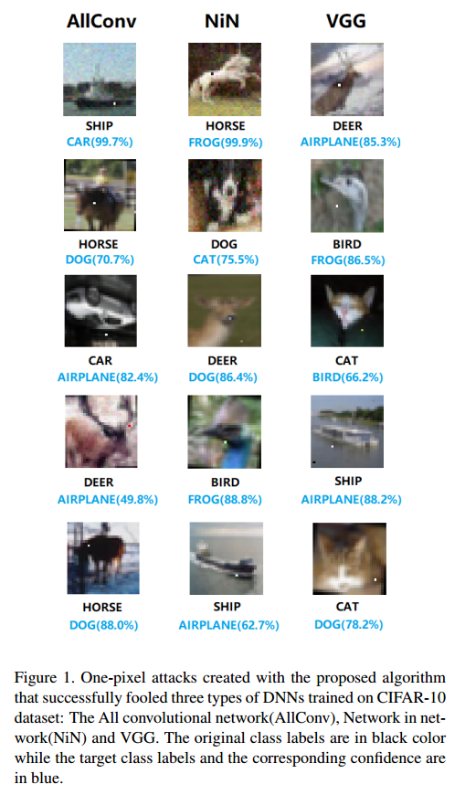

# One pixel attack for fooling deep neural networks

## Contact me

* Blog -> <https://cugtyt.github.io/blog/index>
* Email -> <cugtyt@qq.com>, <cugtyt@gmail.com>
* GitHub -> [Cugtyt@GitHub](https://github.com/Cugtyt)

> **本系列博客主页及相关见**[**此处**](https://cugtyt.github.io/blog/papers/index)

---

<head>
    
    
</head>

## Abstract

深度网络的方法在图像分类上已经打败了很多传统图像处理方法，甚至达到了可匹敌人类的结果。但是一些研究表明对图像的人工扰动（对抗图像）可以轻易的让网络错判。一个生成对抗图像的通常想法是精心设置的扰动，人眼看不见。这个修改可以导致网络分类为完全不同的类别。不幸的是，原先的工作没有考虑到对抗攻击极其受限的情况，也就是说修改可能太多了（修改的像素太多），使得人眼可以查觉，图3是个例子。另外在受限情境下研究对抗图像可以得到关于几何特征和高维空间中整个深度网络行为的新思路。例如，接近决策边界的对抗样本特征可以帮助描述边界形状。

本文中，通过差分演化扰动一个像素，我们提出了一个黑箱网络攻击，情境是概率标签是唯一信息（图2）。我们的方法与之前相比有如下优势：

* Effectiveness 在CIFAR10数据集上，可以通过只修改一个像素发动无目标的攻击，3个常见的深度网络结构有68.71%，72.85%，63.53%的成功率。我们还发现可以扰动到7.9，2.3，1.7的其他类别。在ImageNet上，BVLC模型也是只修改一个像素发动无目标攻击，在验证集上有41.22%的成功率。
* Semi-Black-Box Attack 只要黑箱反馈（概率标签），不需要内部信息，例如梯度和网络结构。我们的方法很简单，它不会把搜索扰动的问题抽象为其他的目标函数，而是直接关注目标类别概率的增量。
* Flexibility 可以对很多深度网络类型攻击（例如网络不可微分，或梯度计算很困难）

除了极其受限的单像素攻击情境，我们还要考虑两个主要原因：

* Analyze the Vicinity of Natural Images 几何上来讲，几个先前的工作通过限制扰动向量的长度分析了自然图像的邻域。例如普遍的扰动是给每个像素点加一个小的值，使得对抗图像在自然图像的附近域内。另一方面，更少像素的扰动可以看作是使用低维切片剪切输入空间，这是一种不同的探索高维输入特征空间的方法。
* A Measure of Perceptiveness 实践中隐藏对抗修改的攻击可能非常高效。就我们所知，还没有工作可以保证改动无法察觉。一个直接的缓解方法是尽可能减少修改的数量。具体而言，不是理论上额外的约束，或是考虑更复杂的损失函数用于指挥扰动，我们提出实践上的一个解法，限制修改的像素数量。换句话说，我们使用像素数量为单位而不是用扰动的长度来衡量扰动强度，最坏的情况是只修改一个像素。

## Related works

深度网络的安全问题已经成为一个重要的话题。C. Szegedy et al.网络对人工精调扰动的敏感性，这可以通过几个基于梯度的算法使用反向传播获取梯度信息。尤其是，Goodfellow提出了快速梯度指示算法来计算有效的扰动，基于的假设是线性和高维输入大量网络对小扰动敏感的主要原因。S.M. MoosaviDezfooli et al.提出了一个贪心扰动搜索算法，假设前提是深度网络决策边界是线性的。另外，N. Papernot et al. 借用Jacobian矩阵构建了一个对抗显著图，指示了每个轴方向上固定长度扰动的有效性。另一种对抗图像是人眼很难识别可以被网络以很高的置信度分类。

【略】

## Methodology

### Problem Description

生成对抗图像可以看作是约束的优化问题。我们假设输入图像可以用一个向量表示，每个标量元素表示一个像素。令f为目标图像分类器，接受一个n维输入，$x=(x_1, \dots, x_n)$是原始自然图像，正确分类为类t。x为t的概率是$f_t(x)$。向量$e(x)=(e_1, \dots,e_n)$是一个x上的扰动，目标类是adv，最大修改限制是L。注意L总是通过向量e(x)的程度衡量的。对抗的目标是目标攻击找到最优解`$e(x)^*$`：

这个问题引入了两个新的值：(a)那个维度需要扰动，(b)每个修改维度的长度。我们的方法中，式子有点差别：

其中d是一个很小的数。在单像素攻击中，d=1。以前的工作通常改变了所有维度的一部分，我们的方法是只有d维修改了，其他的维度e(x)保持0。

单像素修改可以看作是沿着平行于n维轴方向扰动数据点。相似的3(5)个像素修改在3(5)维度的方块上移动数据点。总的来说，少量像素攻击在输入空间低维切片上执行扰动。事实上，单像素扰动允许对图像修改，沿着选中的n个可能的方向，强度任意。见图4，n=3。

因此，通常的对抗样本是在修改强度约束下所有像素的扰动，而本文的少量像素攻击是另一个对立面，关注于一些像素而不是修改的强度。

### Differential Evolution

差分演化(Differential evolution, DE)是一个基于群体的优化算法，用于解决复杂的多模型优化问题。DE属于通常的类进化算法。它有群体选择的阶段，可以保持多样性，在实践中，可以比其他基于梯度或某种EA方法更高效的找到高质量的解。具体讲，每次迭代中另一个候选解集（子）是根据当前群体（父）来生成的。然后每个子与对应的父比较，如果更适合则存活。这样只有比较父子，保持多样性和提升适应值的目标可以同步完成。

DE通常不用梯度信息来优化，因此不需要目标函数可微或预先得知。因此，他可以比基于梯度的算法用于更大范围的优化问题。使用DE生成对抗图像有以下主要优点：

* Higher probability of Finding Global Optima DE是元启发式的，与梯度下降或贪心搜索算法更少受局部最优的影响。另外本文的问题有严格的约束让这个问题更不可能。
* Require Less Information from Target System DE不需要优化问题是可微的。这在生成图像中是很重要的，因为(1)有网络是不可微的。(2)计算梯度需要更多关于目标系统的信息，在很多情况下是很难实现的。
* Simplicity 本方法和分类器是独立的。

### Method and Settings

我们把通过DE优化过的扰动编码为一个数组。一个候选解法包括固定数量的扰动，每个扰动是一个元组有5个x-y坐标元素，和扰动的RGB值。一个扰动修改一个像素。候选解的初始数量（群体）是400，每次迭代，400个候选解（子）通过普通DE产生：

其中$x_i$是候选解的一个元素，r1,r2,r3是随机数，F是尺度参数，设为0.5，g是当前的生成索引。一旦生成，每个候选解和对应的父根据索引的群体竞争，胜者在下一次迭代存活。最大迭代次数设为100，目标类别概率超出50%后启动早停，真实类别概率低于5%。真实类别和非真实类别比较判断攻击是否成功。初始群体对CIFAR-10使用均匀分布U(1,32)，对ImageNet使用U(1,227)，对RGB使用高斯分布$N(\mu=128,\sigma=127)$。适应度函数是目标类别概率和真实类别概率。适应度函数是CIFAR-10目标类别的概率和ImageNet真实类别的概率。

## Evaluation and Results

提出的攻击方法是基于CIFAR-10和ImageNet来评价。我们使用几个方法来衡量攻击有效性：

* Success Rate 对于无目标攻击，定义为对抗图像成功让系统分类为其他类别的概率。在目标攻击中，定义为扰动一个自然图像成目标类别的概率。
* Adversarial Probability Labels(Confidence) 累计每个成功扰动类别概率值，然后除以总的成功数。这个度量值指示了误分类对抗样本的平均置信度。
* Number of Target Classes 统计成功扰动到特定数量的目标类别的自然图像。尤其是，统计不能扰动到其他类别的图像数，无目标攻击的效果就可以衡量了。
* Number of Original-Target Class Pairs 统计每个原始-目标的类别对

### CIFAR-10

我们训练了三类网络：全卷积网络，Network in Network，VGG16 network作为目标分类器。网络结构见表1，2，3。网络尽可能和原始一样，为了得到更好的准确率做了一些修改。目标攻击和无目标攻击都考虑进来。对于这三类的每个攻击，随机从cifar-10选取了500个自然图像样本。另外，500个实验样本修改了3个和5个像素，在三类网络都做了实验。目标是计算单像素和3，5像素。对于每个自然图像，启动9个目标攻击尝试扰动到其他9个类。注意我们实际上只启动了目标攻击，无目标攻击是在目标攻击上评价的。因为，如果一个图像可以扰动到9个类之外的其他类别，那么无目标攻击就成功了。总的来说，有36000个对抗图像。

### ImageNet

无目标攻击的设置和CIFAR10一样。注意我们这次做了无目标攻击，使用适应度函数来降低真实类别的概率。而CIFAR10使用目标攻击结果来计算无目标攻击结果。给定时间限制，我们做了实验。对于ImageNet我们只做了单像素攻击，因为我们希望验证这样一个小的修改是否可以骗过，这样的攻击是否是可计算的。

### Results

表4和5是三种网络的成功概率和单像素扰动概率标签。目标类别对见图5。原始-目标类别对的热度图见图6和图7。图8是每个类别攻击的总次数。

#### Success Rate and Adversarial Probability Labels (Targeted Attack Results)

在CIFAR10，三种网络单像素攻击成功率表明不同网络结构泛化有效性。平均而言，每个网络每张图片可以扰动到大约两个目标类别。另外，增加像素数量可以极大增加目标类别的数量。把对抗类别概率除以成功率，1，3，5像素的置信值是79.39%，79.17%，77.09%。

在ImageNet上，结果显示但像素攻击在大尺寸的图像上泛化的很好。尤其是ImageNet上有41.23%的几率可以把任意图像扰动到目标类别，置信度有5.53%。注意ImageNet的设置和CIFAR10是一样的，但是ImageNet分辨率是227\*227，CIFAR10分辨率是32\*32，大50倍。每个成功的类别攻击是最高的。因此5.53%的置信度是很低的，但是这说明其他的999类更低，基本上是软标签类别分布。因此，单像素攻击可以打破AlexNet置信度到一个近似均匀软标签分布。低置信度的原因是我们使用无目标攻击衡量，只关注于减弱真实类别的概率，其他的适应度函数会有不同的结果。

#### Number of Target Classes (Non-targeted Attack Results)

我们发现大量自然图像单像素修改可以扰动到2，3，4个目标类别。通过增加修改的像素，可以扰动到更多的类别，概率也更高。在无目标点像素攻击中，VGG16网络有更高的鲁棒性。这说明三种网络（全卷积，NiN，VGG16）都容易收到这个攻击。

这些攻击的结果与先前需要更多失真的攻击方法有竞争性（表6）。说明使用一维扰动向量足以找到大部分自然图像的对抗图像。实际上，通过增加像素到5，大量的图片可以同时扰动到8个目标类别。极少数的情况下，单像素可以扰动到其他所有类别。见图9。

#### Original-Target Class Pairs

一些原始-目标类别对比其他更容易受攻击（图6，7）。这说明容易攻击的目标类别（方向）由同一类的不同数据点共享。另外，单像素攻击中，一些类更鲁棒，因为它们的数据点更难扰动到其他类别。这些数据点中，某些无法扰动到其他任何类别。【略】

另外可以看到热度图是近似对称的，说明每个类有相似数量的对抗样本（图8）。【略】

#### Time complexity and average distortion

## Discussion and Future Work

先前的工作显示了很多数据点可能位域决策边界附近。为了分析，输入空间的数据点移动一小步，定量分析类别标签的改变。本文，我们展示了在少量维度移动数据点是可能找到类别改变的数据点的。我们的结果也说明Goodfellow的假设，多维的小的加性扰动会累计，导致巨大的输出改变，这对于解释为何自然图像对于小扰动敏感是不必要的。因为我们可以只改变一个像素来成功地扰动大量地图像。

根据实验结果，对不同的框架，不同的图像大小探索了CNN的脆弱性。另外，结果模拟了使用少数量的DE迭代黑客攻击。通过增加迭代或更大的初始候选分辨率可以进一步提升成功率。另外，提出的算法和脆弱的样本可以用于制作对抗样本，更好的进行数据增强。